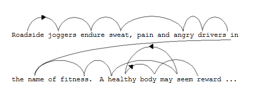
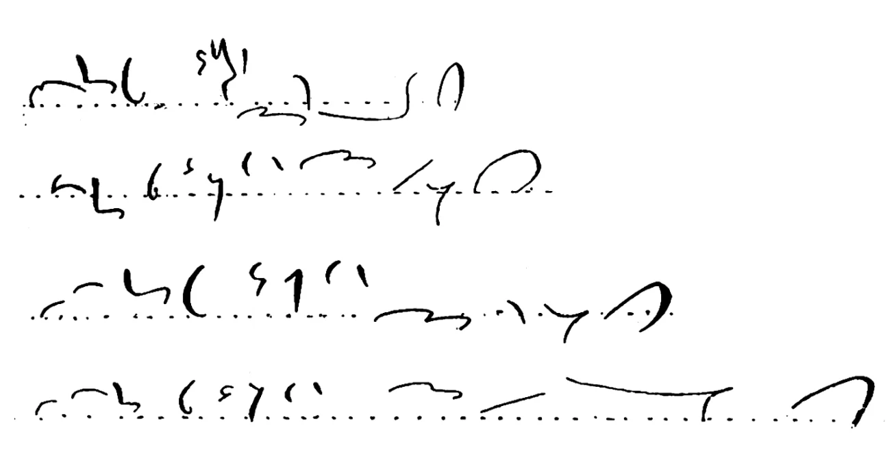

# Cricket’s Shorthand Course

## Recent Revisions

2025-07-17: Lots of changes to Preparation and Endurance.

2025-07-09: Added Rev to hidden codes.

2025-07-07: Linked to more of Beryl's advice on Reddit. 

2025-06-28: added link to Beryl Pratt's advice on Reddit for building endurance.

2025-06-26: removed speed goals for each level; replaced them with accuracy of first dictation;

Canonical copy, contact and license at 
<https://cricketbr.github.io/Crickets-Shorthand-Site>

## Table of Contents (Short)
{: .no_toc}

xxx redo

* [Introduction](#introduction)
* [Typical Hour](#typical-hour)
* [Diary](#diary)
* [How to Read Shorthand](#how-to-read-shorthand)
  * [Column Method to Read Difficult Words](#column-method-to-read-difficult-words)
* [How to Copy Shorthand](#how-to-copy-shorthand).
  * [Four Column Method for Copying](#four-column-method-for-copying)
* [Personal Reference Binder](#personal-reference-binder)
  * [Working with Word Lists -- Spaced Repetition](#working-with-word-lists--spaced-repetition)
* [How to Take Dictation](#how-to-take-dictation)
  * [Text Reader (aka Dictation) Programs](#text-reader-aka-dictation-programs)
* [Additional Advice](#additional-advice)
* [Building Endurance](#building-endurance)
* [Swem's Systematic Speed Course](#starting-swems-systematic-speed-course)
  * [Modified Swem's Course](#modified-swems-systematic-speed-course-for-intermediate-writers)
  * [Unmodified Swem's Course](#unmodified-swems-course)
* [Final Words](#final-words)
* [References](#references)
* [Acknowledgements](#acknowledgements)
* [Full Table of Contents](#full-table-of-contents)
* [Revision History](#revision-history)
{: .toc-list}

## Introduction

Most modern shorthand learners do not have the luxury of a teacher, or even a good self-instruction book (especially those of us who prefer obscure systems).

This page was supposed to be a series of steps for those students, based mostly on the Gregg Functional Method. Then I read more teacher handbooks, and a few studies comparing methods, and entirely rewrote it, not because the Functional Method was wrong overall (studies repeatedly show it works very well) (Bellows Comparison xxxref) but because some of its advice is extreme and may not work for all students, especially if it is taken out of context.

Every author is convinced that their method is best -- even the extreme ones -- but there is very little evidence behind many of them. Methods of Shorthand Instruction: A Research Analysis (Pullis, JM, 1973 xxx) was an eye-opener. Often a method that works well for advanced students who need to build speed wastes time (at best) or frustrates students still struggling with the theory. {.aside}

(References and links under...wait for it...References.){.aside}

In most cases I recommend alternating exercises, since each one works on different skills. Sometime I recommend a middle path, and in others, where the evidence is clear, I recommend one method over the others. I have tried to identify my unsupported opinions, opinions of the majority of authors, and the opinions of just a few, but may not have succeeded.

In all cases, experiment! Look carefully at the results, and continue to experiment. Some exercises work on the skill you need. Some can be varied to work on different skills. Some exercises are more useful immediately after a speed jump. Others are more useful just before. Some exercises that seem like a waste of time are often exactly what you need, or will need later.

### Expectations

How do you eat an elephant? One bite at a time. Shorthand is a whole herd of elephants.

Shorthand is like playing piano. After a bit of study, I knew the notes to play and when, and even what it should sound like, but couldn't read the notes fast enough to tell my fingers what to do. Even when I know what they should do, I can't make them do it.

Also like piano, shorter and more-frequent works better than longer and less-frequent. Of course longer and frequent works even better. Strategies to work on your specific problems will work better than simply playing the same piece over and over. All the advice from good teachers about how to practice can be applied to shorthand.

Reports on how long it takes to learn vary widely, even with the same system. Modern introductory books usually cover the theory in 90 lessons, including tests, asking for equal time at home as in class, and reach 60-80 words per minute (wpm) on practiced material but only 40-60 on new material. Those courses have teachers who can catch bad habits early and keep up the pressure, and don't count students who dropped out but could have passed if they had more time. Some books, especially Teach Yourself style, claim to go faster, but this might be marketing. One self-taught student took 220 hours to reach 100wpm. (Wentworth)xxxref. It's complicated further by quality of book and teacher, and the system. Systems that are designed for high speeds usually take longer to learn and to reach intermediate speeds, but reach speeds that are impossible for simpler systems.

> All popular systems can reach at least 120wpm. Slower systems were rarely purchased by schools, so did not become popular.{.aside}
>
> For comparison, longhand is typically 20-40wpm for longhand, typing 60-100wpm, UK Journalists (until recently) 100wpm, slow formal speech 100-120wpm,  court reporting and closed captioning over 200wpm. {.aside}

Many systems have more than one book. (Bellows compares 10 different methods for teaching Gregg, many approved by the Gregg Publishing Company. xxx ref) Some are better than others. Some have better descriptions of the rules, others have more practice material. Some books agree on the theory; some differ slightly. Others have keys and advice for teachers. Using two books at once can help, but it can also be confusing. Ask other writers of your system for advice. 

## Overview

The course begins by quickly reading all or part of your textbook, to help avoid beginner mistakes (usually caught by teachers), and show you penmanship details are important and which are not. This is reading to see what exists, not to learn the material.

Students whose books are merely a description of the rules with a few examples then follow an repetitive routine of re-reading the theory, reading their own writing, copying well-written shorthand and/or taking dictation at a variety of speeds, and penmanship. The way they prepare for dictation and build speed changes as they master the theory and reach higher pen speeds.

Students who have modern books which have enough exercises in each chapter then follow the book, building a bit of speed and endurance in each chapter. After finishing the book they follow the same routine as the other students.

Most books that have sufficient examples do not explain how to use them. Follow the advice below.

Dictation begins by fully preparing each passage: Copy it from the book or write it from text; correct that copy; copy several times until you are comfortable with it; then take from slow dictation and gradually increase the speed. Then gradually reduce the preparation to only a few copies, and eventually just practicing new words.

Cold (or unprepared) dictation is rarely useful until you have finished half or more of the theory. Some books have passages for that, with just a few new words mixed with old. Your first cold dictation material will be much slower. Don't worry! You will build speed on cold dictation later, after finishing the theory.

If your book does not have enough material in each chapter to practice cold dictation, don't worry. You'll get to it.

Do NOT write your own material at any speed until you finish reading the entire book. Writing outlines which will change when you learn more theory will slow you down in the long run. Practice does not make perfect, but it does make permanent. Only copy and build speed on correct shorthand.

If your book says it is safe to write new material before finishing the theory, take that with a grain of salt. Later chapters might have better ways to write words you use often, and you'll have to unlearn the simpler methods.

Some teachers say to write at "comfortable" or "uncomfortable" speeds. I prefer easy, difficult, and impossible. With a bit of practice, you will become comfortable at impossible speeds!

## Diary

You do not need to count or time all the readings or copies, but do enough that you get a feel for speed vs accuracy vs duration. The numbers will change rapidly at first, then settle down, then change again as you increase your target speeds. It will also remind you which exercises you need to do more of to keep a reasonable balance.

Reading skill is as important as writing skill. Test it every few sessions.

Remember to look back at the first few pages to see how far you've come!

## Quick Read

Most mistakes made by new shorthand writers can be avoided if by reading more of the book before writing.

They make lines longer than necessary or squash circles or write high above the line, not realizing that later chapters give other meanings to long lines, squashed circles and raised outlines. Sometimes they do the opposite, and spend hours practicing shapes exact to a fraction of a millimeter.

Forkner says to leave out vowels, so *can* becomes `CN`, right? Several chapters later, they say that `C` means *can* and `CN` means *cannot*. All your old notes are wrong. For the next year, every time you try to write *can* you will hesitate. Every time you read notes from the transition time, you will wonder if `CN` means *can* incorrectly or *cannot* written correctly.

Orthic and Teeline quickly teach an acceptable way to write all words -- just use the alphabet, letter-by-letter. Your hand then has to break that habit as you learn simple ways to drastically reduce writing.

Modern books are organized to prevent those problems. Even so, you should read about 1/4 to 1/2 first. It's your choice whether to read the shorthand examples. It will be time well-spent, but isn't necessary for this purpose. If your book merely presents the rules in alphabetical order, then consider reading all of it before picking up your pen.

> Some systems have summaries as an appendix or separate document. Some have short books that teach the entire system quickly, without enough practice to reach high speed and other books with more material. Some learners post summaries online to help others. Ask other writers of your system for information.{.aside}

This first read can be overwhelming. Remember, you are not reading to learn the material, but to learn what the outlines should look like.

You will see things that make you doubt the system, like leaving out information and lists of abbreviations to memorize. All systems have those, especially the faster ones.

> Switching systems will not help. \
-- Cricket. Personal experience.

Trust the system. There is enough information in each outline to keep it readable. The abbreviations make sense. (Some exception for unproven systems. Moat xxx ref claimed that anyone who studied hard enough would have great success, but never found a volunteer to test it. It did not become popular.)

https://moat.shorthand.fun/ -- commentary by Jeremy W. Sherman. xxx ref

Many groups have a Quote of the Day, with multiple submissions and critiques. Reading those will help you avoid making the same mistakes, even if you don't yet know all the theory.

Your first few hours writing will be erratic, no matter how much well-written shorthand you read first. That is normal while your hand learns the new shapes -- but your brain will know what those shapes should look like, so your hand will improve rapidly.

**Two Bookmark Method**

Optional.

One bookmark is to preview the theory and maybe trace the example words; it moves quickly. The goal of the first is to learn which details are important, as described above.

The other is for material you're actually studying; it moves slowly.

You can use yet another bookmark to read ahead, reading all the examples carefully but not writing them. It's a good way to fill time on the bus.

## Learning the Theory

Work through the book, one chapter at a time, following the advice below for reading, copying, dictation, and penmanship practice. Trust your book's ratio of theory/practice and the gradual increase in length. Be a bit suspicious of the speed goals. They might be pessimistic or optimistic.

Your goal at this stage is not to build speed, but to learn the rules and building blocks in a variety of settings, which is aided by a bit of speed.

Some teachers speed through the theory, not pushing speed until later. By mid-term their students can write anything slowly. Some spend more time each week building speed and work very slowly through the theory. (We won't discuss the other two types of teachers -- slowly through the theory without building speed, and quickly through the theory and asking students to reach speeds they aren't ready for.)

Split the difference. Take full advantage of the exercises in each chapter. Build each one to your current best speed, or maybe a tiny bit more, then move on. This will help you "automatize" the outlines so you write them without thought. Some books have speed goals for each exercise. If so, attempt to follow them, but remember there is no teacher complaining that you will lower the class average. Likewise, don't hold yourself to slower speeds if you can easily exceed them.

If your book doesn't have enough material in each chapter to reinforce the theory, don't worry. You will reinforce it later.

Some books say not to memorize the rules; just use them in a variety of words. This is an over-correction from teachers insisting students memorize the exact wording. This wastes class time, and makes students worry too much about following them when writing. I find the words of the rules are useful when my hand hesitates and when discussing outlines online, but once I know what the letter group or word should look like (and similar words it should not look like) I just write it without thinking about the rules. There is no time to think!

If your book says to just read *then keep reading*. The Gregg Functional Method takes this to the extreme. The lessons match the regular Gregg manuals, but have much more reading material. Students do not pick up the pen until half-way through the theory, by which time they already know hundreds of outlines.

A typical hour of study on your first time through will be:

* 10 minutes reading your old writing (if you have it), ranging from yesterday to several months ago, even if your book does not say to do this. This will help you catch mistakes before they become habits, and help you learn how your writing differs from the text.

* 45 minutes following the book: Reading theory, copying example words, copying, and taking dictation at various speeds. Details are below, and vary on how much material your book has to copy.

* 5 minutes penmanship practice, starting with any in the book. A variety of methods are described later. Note: Mindlessly writing the same shape over and over will not help.

If your book has an appendix or sequel, continue that pattern, otherwise continue to refxxx After Finishing the Theory.

If your book has enough material but you finished it and still struggle to write new material from text, use your best judgement whether to repeat the book, holding yourself to a higher standard this time, or starting the next phase, which includes a systematic review of all the rules.

By the time you finish a good book, you will know the rules fairly well. If not, don't worry about it. Future steps will review them.

Reading shorthand by a variety of writers, including fellow students, and other students' critiques of them, will help you learn how far you can drift from the textbook shapes, and practice reading non-standard shapes.

## How to Read Shorthand

Do not worry about deciphering difficult words at first. They will all be difficult! For now, seeing the building blocks in a variety of settings is more important than practice deciphering. Leslie recommends you keep one finger on the shorthand and the other on the key, which may be going too far.

 When you can read 9/10 words reasonably well, try reading the entire sentence a second time before using the key. When you can read 19/20 words reasonably well, use the [Column Method](#column-method-to-read-difficult-words).

For each new word, or old word that you forgot:

* Spell it in shorthand and trace the outline, or watch your teacher write it on the board. Tracing it will help you make the shape accurately. Writing it yourself will not.\
  Trace it smoothly. Do not break pause between letters even if hand and voice are a bit out of sync.
* Say the word.
* Repeat these steps once or twice, but don't worry too much. It will get easier.

This process will help lock in the shapes of each letter and combination, and the outline of the entire word. Doing this out loud involves multiple senses, which enhances learning. It also helps prevent skipping steps.

Reading out loud also encourages you to read with a natural rhythm, which gives you a sense of the sentence and makes reading easier, especially if you need to identify homonyms and add punctuation.

Work down word lists in order, then at random, perhaps every 2nd word followed by the words you didn't read before. Some systems have Anki decks, which can help, but IMHO aren't worth the time to make. (See [Working with Word Lists](#a-note-on-word-lists).)

Do not do this for words you already know. Read those as a single unit. When reading or writing longhand, you see or say `h`. You don't see or say `down, up, curve across, down` unless you are still learning your letters. Likewise, you don't write or say `T-H-E`, you just think `the`.

Reread each passage until you can read it without referring to the key. You may end up memorizing it. Point to each word as you say it so your focus doesn't drift. Close your eyes, point to a word at random, and start reading there.

As you gain experience, look for letters that often occur together, and think of them as a single letter. Eg TR and SH instead of T-R and S-H.

At fist, when most words are new, if you don't have a key, print the page and write the words above the outlines to make a key. You may need to bounce around, doing common words first. Be aware that sometimes the a that feels wrong is actually right, and the real problem is a word you confidently got wrong.

> Eye movement studies of fluent readers of typed material show that our eyes do not move left-to-right. They jump around, not just within a word but also across several words. Let your eyes do the same when reading shorthand, then go back and read it one word at a time to be sure you read what was actually there. {.aside}
> 
{.aside}

> {.aside}
>
> The common belief that words are read by shape is incorrect. It was the best theory for the available data, in 1886.{.aside}
>
> The Moving Window experiment in the same article is also interesting. Larger windows allow faster reading, up to about 15 letters. (Larson) {.aside} xxxref

### Column Method to Read Difficult Words

The column method works well if you suspect a penmanship issue, or are not sure which of several sounds or abbreviations are intended. It also works for checking if a proposed abbreviation has other possible interpretations.

Make one column for each letter. The first row is the letter in shorthand. The following rows are your best guess at what each letter might be, roughly ordered by probability, written in plain text. Then work through all the combinations by brute force.

You will have to adapt it a bit if combinations of letters create word parts.

You may want to make a chart of letters by shape, including prefixes and suffixes, so you can look them up quickly.

This method can also be used for entire words, if cannot read several words in a row, or suspect that a word you are confident in is the actual problem. (I've never done this, and reading other parts of the same passage might be more help, but it's an option.)

xxx example image

## How to Copy Shorthand

Reading well-written shorthand is the fastest way to learn how the building blocks go together, but copying it is the fastest way to learn how to write them. Copying can also help with building hand speed and endurance, but those will come later.

Some teachers say copying shorthand is a waste of time. If you simply copy the shapes, without thinking of the words, it will be. First read the entire passage as before. Then read a full sentence sentence, then memorize a few words at a time and write them. Think of the words, not the images. Repeat as needed.

Begin the session by warming up your hand, if you haven't already, by writing for five minutes. Use penmanship exercises from your system, or one similar. [Pratt's Easy Intro to Dictations, without a sound file](https://www.reddit.com/r/shorthand/comments/1m1gsj5/i_thought_i_was_getting_the_hang_of_shorthand/) also works well for warming up. Start slow -- and relaxed! -- and build speed as your hand warms up.

If you do not have a good shorthand to copy, you will have to make your own. Be extra careful checking it.

Then copy four times using the Four Column Method (below) or Pratt's Easy Intro to Dictations.

xxx refs

Be gentle with yourself. It may take several weeks for what Leslie calls the "initial diffuse movements" to settle down. This is a normal part of learning new movements. Repeat each piece no more than a dozen times. A rest, and some sleep, will do more good than excessive repetition.

Earlier books say to write slowly and accurately for a long time. Later books say go faster earlier. Strangely enough, many shorthands are actually easier to write fast. Faster writing also prevents the habit of going too slowly. Going too quickly, however, creates other problems.

Write at a variety of speeds -- from slow enough to make almost perfect notes to so fast you can barely read it, but stay on the middle to low range until your hand gets used to the shapes. Each one will help with a different skill.

You can learn a lot about the best way to write by writing quickly. The way you write will change when you speed up, and again as you get used to longer passages. Shapes will blur a bit. Your hand will change position. You'll even sit differently. Sometimes a position that's better in the long run takes some muscle building and stretching.

Most of your writing should be as fast as you can without sacrificing legibility. See Penmanship, Accuracy, etc for details xxx ref

As you speed up, let the shapes form groups. Think `TR` instead of `T-R`.

Some books recommend tracing from the book using onionskin paper for the first 6 weeks, but this hasn't been proven to make a difference one way or the other.

## Reading Your Own Writing

> Mark the transcript, not the shorthand. (Leslie, Methods)

> Well, it was the most remarkable thing in the world, don't you know, because I got every bloomin', blawsted word of it; the only difficulty is, that I cawnt read it. I will leave it to any man that I got it, and my notes will show that I have it, but I simply cawnt read the bally stuff.
> -- Report on the 1912 National Convention of the National Shorthand Society. (James, 1912)

I don't know if this gentleman's difficulty was in making correct notes (but not noticed because he never read them) or in reading his correctly-made notes.

Reading your own writing after it has rested a bit will help you practice reading your own writing. It will also catch mistakes that are difficult to catch immediately after writing, hopefully before they become habits.

Follow the previous advice on reading, including reading out loud at a natural rhythm.

At first, focus on recent work (to catch bad habits quickly). Then alternate that with older material, up to six months. Your early writing will be so bad that, while it's good to read it to find problems to fix, you may not benefit from reading it later. Use your own judgement. (Keep a sample so in a year you can look back and see how far you've come.)

Read material written at a variety of speeds. Learn how your writing degrades.

Practice a few words or groups that need it, then read the next piece.

## Penmanship, Legibility, Correctness and Perfection

Practice does not make Perfect, but it does make Permanent!

If someone else can read it, then it's *legible*, even if it isn't exactly the same shape as the book. Don't fight your hand on details that don't matter. If it uses the proper rules (brief forms, affixes), then it's also *correct*.

Many books have optional rules. Use the ones that make sense for you. Some of the rules are introduced early. Ignoring the brief form for *railroad* makes sense, unless it's used frequently in your practice material. Look at all the brief forms before deciding. Sometime a short word spelled out is the brief form for an important longer word.

I use *accurate* as a synonym for *correct*. Some books use it for *perfect*.

> In teaching shorthand we have given too little thought to the right posture and to the development of swift, effortless writing from the beginning. Many teachers place such emphasis on *slow*, careful writing that the *habit* of slow movement is fastened on the student. Afterwards, in the advanced work, the student finds it difficult, and sometimes impossible, to overcome the sluggish, painfully precise style thus acquired. -- Gregg, JR. Making Shorthand Teaching Effective, A paper read before the Eastern Commercial Teachers' Association. Gregg Publishing Company,  1921. xxx ref 

However, to little emphasis on accuracy can create other problems.

On a study of immediate and deferred transcription, Pullis (reporting on Iannizzi) found inaccurate notes led to inaccurate transcription. The effect was more significant for less-skilled writers and more significant after a week delay. (p11)

One study was of a 5 minute dictation at 80wpm. The students were partway through an advanced class, and this speed was well within their abilities. For immediate transcription, the total error rate was 1.25%. 4.45% of the outlines were written incorrectly, but those few words accounted for 67% of the transcription mistakes. For deferred transcription of the same writing, that ratio went up to 75%, for a total error rate of 1.95%.

In a related study of second year students at 70wpm, the results were even more drastic. Total transcription mistakes were 4%, and fully half of them were from the 12% of the outlines which were incorrect.

Also see Pullis xxx ref ... his thesis.

The dictation instructions below include a mix of speeds, ranging from slow enough to be practically perfect, to so fast you can barely read it, and even faster. You will learn how and when to sacrifice legibility to keep up.

Always write as neatly as you can at the time.

Here is the same sentence written in Pitman by four different writers in a speed contest at 200wpm. They are all legible, but perhaps not easily so. ("Let me begin, then, with the idea that all mankind are naturally lazy.") [Link to Reddit post.](https://www.reddit.com/r/shorthand/comments/1m46rqg/can_ai_translate_gregg_shorthand_written_about_40/)

Ref: WL James , ["The Speed Contest", The Shorthand Writer, v. 8, n. 1, p. 722 - 751. (Oct. 1912)](https://babel.hathitrust.org/cgi/pt?id=hvd.hn4ap3&seq=530)
1912 National Convention of the National Association of Shorthand Writers -- check previous ref xxx 

xxx resize image, reformat words

Now for the other side of the debate.

https://www.academia.edu/62276876/Methods_of_Shorthand_Instruction_A_Research_Analysis?nav_from=e9ae591c-da29-451b-9430-405ea7e0d271

Faster writers make better outlines. I'm not sure if that's because the ability to make better outlines leads to better speeds, or survivor bias (only students who make transcribe outlines stay in the class), or 

Having said that, remember you will not know how much a shape can vary from the book until you finish the theory. Until then, aim for shapes that match the book in every detail, but don't obsess over it. After that, think about which parts of an outline are important, and which can safely degrade. Many of arbitrary-seeming rules result in outlines that are still legible even if degraded by speed.

You will have more time to write accurately at lower speeds as you increase your barely-readable speed, but practicing barely-readable outlines too often will train your hand to make those. Always make the best notes you can for the speed of the dictation.

Build a toolbox of penmanship exercises. Trace well-written shorthand. Write blindfolded. Copy single words, groups of words, entire lines, and entire passages. Use penmanship exercises from your system or a similar one. Invent more exercises and experiment!

Have an intention each time you choose an exercise. If it doesn't help the intention, choose another.

Sometimes work on problems you know you have. Other times work on other aspects. Often the real problem is something we think we already mastered.

Swem and Leslie both worked for JR Gregg. Leslie recommends against tracing outlines at any stage, but Swem suggests tracing shorthand in the textbook using a dry pen. This will force you to notice subtle details, but isn't always an option and may not give much variety. Some of that difference of opinion is due to different audiences. Leslie's students read entire paragraphs every day, and knew hundreds of outlines by site before picking up their pens. Swem's students have already completed the theory using an older book with fewer examples.

Different exercises work better at different stages. An exercise that stopped being useful last month might be useful again when you add more speed. Experiment!

### A Note on Repetition

Practice does not make Perfect, but it does make Permanent.

> Anything that is dull and uninteresting is of doubtful pedagogic value. Also, excessive repetition generally results in progressive deterioration of the outlines practiced.” -- Leslie, Gregg Shorthand Functional Method Teachers Handbook (1936)

Teachers used to recommend slow careful copying of the exact shapes in the book -- lines and lines of a single letter or word, often before you know which details are actually important, and repetitive copying of shorthand shapes without associating the outlines with words. This rarely does any good.

However, well-designed exercises are often the fastest way to correct penmanship problems.

As you repeat something, your writing will improve, then plateau, then degrade. Stop just before it begins to degrade. If you're happy with most of the repeats, you're done with the word. If not, then breathe, shake out your hand to reset, and continue. When it degrades again, that's as far as you should push that bit for now. Work on a different section or a different exercise and return to it tomorrow. Our brains and bodies need sleep to consolidate new skills. (Some say a 10 minute break is enough. Experiment!)

Always have an intent when you practice, and ask if the exercise is meeting that intent. The overall goal is swift, effortless, legible writing. Your goal for the exercise might be to master a shape or group of shapes, or to see how a shape degrades at speed, or any of a dozen other goals. Mindless slow and careful copying rarely helps with any of them.

Vary the speed. Slow helps precision. Speed helps fluency and reduces hesitation. You need both. Try faster -- uncomfortably fast -- and see how the outline degrades, but only as an experiment. Try writing just one outline several times, then as part of a memorized group. What changed? Which bit can you focus on that make the rest of the outline behave? Sometimes a word that works well at one speed will become a problem again when your overall speed increases. Repeat the procedure.

Medium speed will not help precision, but will help you increase the speed at which you can write precisely.

Try writing an outline over itself multiple times or in a connected row instead of writing it separately. It gives different feedback. Gregg uses ellipses and zigzags.

I'll save you one experiment. A row of a single letter rarely helps. Letters are affected by their neighbours.

Try writing entire words, either a row of the same word or as a group of similar and different problem words or as part of a sentence. Does one way work better or worse?

xxx add pic gregg pra bra bre series, elipse and zigzag

Try printing the book and using a dry pen over the shorthand. This is surprisingly effective, even though you don't see what you wrote. (You may need to change the print size.)

Try the opposite of any penmanship pointers. Gregg clearly states that circles between opposite curves go on the back of the first curve, but my hand relaxed more when I tried putting it inside the second. It's the same shape, but slightly different focus.

Our brains and bodies remember the first and final repeats more than the middle ones. They should be as fast as possible while remaining easy to read.

Remember to relax!

### Find the Size Your Hand Prefers

Writing too small will slow your writing, since you need to be more precise. Too large will be awkward for your hand and lead to loss of control. Aim for a comfortable, flowing size. There are a few Gregg articles about size, with samples from expert writers. One fits 500 words per page, another fits only 100. xxx find ref

To Start: Draw straight lines on paper, a full inch [2.5cm] apart, and write a few sentences in cursive and/or print at whatever size your hand likes. Then measure the height of several letters. Typically lowercase letters are 2-3mm and uppercase letters are twice that. If your longhand is larger than average, then your shorthand will probably also be larger than average, and vice versa. Adjust a bit if needed to keep the lengths distinct.

Use that size when you start writing. The small letters should be as small as you can write comfortably, probably the size of lowercase longhand or smaller (since they're less complex). Large should be as large as you can write comfortable, at least 3-4 times the size of small. Medium should be between that, probably the size of your longhand capitals.

[Image of Gregg Letter Family](https://greggshorthand.github.io/anunit04.html)  xxx host image on my site; also Orthic and Pitman maybe

I only learned about this test a few years ago, and tried it after decades of writing Gregg. I discovered my hand was happier, accuracy better, and speed faster, when my large letters were 8mm instead of 7.

Consistency is more important than exact lengths. All tall letters should be the same height. Using sizes your hand likes will make it easier to be consistent.

Repeat this test with shorthand every few sessions, at a different time in each session. Your hand will change when it's cold or tired, as it learns the shapes better, and as you build speed. Reduce the frequency of the test as your size becomes more consistent 

Experiment with skipping lines. Even if the size doesn’t change, it can give your hand a bit more freedom. Again, the results might change as your shorthand skill improves, possibly in an unexpected direction.

> The actual size of the characters may be varied according to circumstances, such as the goodness of the light and the writing materials. The minuteness of any kind of writing is limited by the size of the smallest characters. In Orthic the small size may be made as small as desired, and the small circle may be reduced to a dot, but it is best to make the small characters about one-twelfth of an inch long (2.1mm), and the large ones at least twice as big." — [Clarey Orthic Cursive Shorthand, Revised Extended and Improved, 1911, page 3.](https://orthic.shorthand.fun/) xxx ref

Graph paper can help you practice consistent sizes, especially for horizontal lines, but it can backfire and make you try to be too perfect. Use it for precision drills when needed, but not as a regular practice. Use an online generator to make paper that fits your size, or something like "small letters are 3/4 of a cell." 

Experiment!

## After Finishing Theory

A typical hour after finishing a less-good book, or after finishing a good book but before mastering the theory will be:

* 10 minutes reading your own writing as before.

* 15 minutes rereading the text and copying the examples. This also warms up your hand. Continue this review until you reach 125wpm for five minute on unseen material.

* 30 minutes copying and/or writing from dictation. Use a combination of Pratt's Easy Intro to Dictation, Leslie's One Minute Speed Forcing Plan, and Swem's Systematic Speed Course for Advanced Writers, depending on your stage. xxx refs

* 5 minutes penmanship practice to end every writing session.

If you use shorter sessions, do one or two types of work each session, for the same ratios each hour. Always end with a bit of precision practice.

On days you cannot follow this program, or need a change, try other exercises. Clearly state your intention for each exercise. (Seeing what it feels like, and making productive use of a bus ride or long meeting, are valid answers.)

## Reviewing The Theory

Review the theory and copy the material that demonstrates each rule. You will work through the book several times.

Material that includes a systematic review of the theory might count towards some of the theory review time. Use your own judgement. Often rereading the original text, with a full explanation of the rules, reminds of details we forgot or never actually learned.

Once you have mastered the basic theory, you can alternate the basic rule book with advanced theory.

Swem recommends this practice until you reach 125wpm for 5 minutes on unseen material. You will work through the book several times.

## Writing From Dictation

You now know how to copy shorthand and build a bit of speed while copying, and your hand is at least somewhat stable. It's time, finally! to start dictation.

> Leslie disagrees. The Functional Method leaves writing until half-way through the theory, but then begins dictation only a week later.

At first, you will only take dictation from well-prepared material. Your brain and pen will be busy enough with that, without adding the stress of new material. Then you will gradually reduce preparation. The one exception to this is a starting dictation from new material, that you correct carefully and practice before building speed.

While doing that, you will increase the speed at which you can write practiced material. There are several methods doing this. I recommend a combination of Pratt's Easy Intro to Dictation, Leslie's One Minute Speed Forcing Plan, and Swem's Systematic Course for Advanced Writers, depending on your stage.

That's a lot of speed numbers to keep track of, and they will keep changing. Keep good notes, but don't worry too much. Just keep alternating challenges.

> The goal toward which you are striving is to reach the point where you can take new matter at your top speed and write it as well as you would after taking it two or three times. Of course, no matter how much skill you may eventually acquire you will occasionally "flunk" an outline or a phrase. In reading it back you will correct it, but the fact that you wrote it incorrectly the first time should be no cause for worry. It is done by everybody. Your aim should be simply to bring these errors down to a minimum. (Swem)

Start with a passage in the text. Even the thinnest books have at least some. Use Pratt's Easy Intro to Dictation, without a sound file. link xxx, then with a sound file at 20wpm. This is painfully slow until you try taking dictation to it!

xxx ref

Speech to Text apps are described later. xxx ref Pratt's website xxx ref has a method for using Audacity to record your voice and change speeds. Her approach to speed choice is less mathematical. Use what's best for you.

Your first few tries from dictation will be terrible, even if you wrote very well without the pressure of dictation. Try this speed a few times, pausing after every few tries to practice the worst bits, but only for a few seconds. When you stop improving (no more than 5 tries), raise the speed to 30wpm and try again. See how high you can go. Remember, your goal is the correct shapes made swiftly, effortlessly and legibly, not textbook-perfect penmanship. Experiment. You may do better than you expect!

Repeat for a few short passages. Stay with slow, comfortable dictation while you get used to the process, and until you are past the worst of what Leslie calls "initial diffuse movements."

If 20wpm feels too slow for a first dictation, try increasing it, but don't worry if it takes a few attempts. You'll get there. Exactly when to increase difficulty is a difficult decisions. Sometimes we need to wait. Other times we need to bash our heads against the next level a few times before achieving it. Treat all increases as experiments, not tests.

If you write the sentence correctly twice, there's no need to repeat it at the same speed.

After a few passages with Pratt's method, you are ready for the first parts of Leslie's One Minute Speed Forcing Plan. xxx ref. p174 . This plan is also recommended by Lamb xxx ref p88

> Leslie described it in 1953. Lamb described it in 1961, in her second edition. Her first edition was in 1950, but I cannot find a copy to see if she described it there.{.aside}

Prepare a passage as before, but only repeat it only for 1 minute.

| Passage Length in Words | Speed in WPM | Number of Repeats in 1 Minute |
|--- |--- |--- |--- |
| 10 | 20 | 2 |
| 10 | 30 | 3 |
| 10 | 40 | 4 |

Take dictation at 20wpm. Try it a few times without a break, then practice the worst bits for no more than 15 seconds and try again. Then take dictation at 30wpm for 1 minute. Again, practice the worst bits for no more than 15 seconds. Continue raising the speed and quickly working on difficult areas until your notes are not quite legible. Then drop to the second or third speed -- one which you struggled but achieved -- for the final take. This time your notes should be very good.

As before, stop repeating the speed if you write it correctly twice in a row. Do not, however, write at the same speed for more than a minute. The goal of the exercise is to attempt faster speeds than you can write.

Your routine for many weeks, for this part of the hour, will be to prepare a passage build speed using Leslie's plan. Each dictation, keep most numbers the same and experiment with increasing one. Rotate through the number you experiment with. When you can meet a challenge most of the time, that is your new number.

Experiments:

* Length. Increase the length of the phrase and reduce repetitions, so that the passage takes 1 minute at the final speed. Try 5-10 word steps.

  Leslie and Lamb recommend that, when the speaker speeds up, they continue dictating to fill the minute. There are many benefits to this practice, but I don't think the extra work is worth it.  xxx ref

* Starting speed. 10-20wpm steps are typical, but advice varies.

* Highest speed. Again, 10wpm steps are typical.

* Final speed. Again, 10wpm steps.

While doing this, alternate the methods used for your first copy.
* 4/8 of the time, copy from shorthand in the book.
* 3/8 of the time, read printed text and write shorthand.
* 1/8 of the time, write from slow dictation. This is new matter dictation, and will be much slower than your starting speed for practiced material.

Check your first copy carefully, so you only build speed using correct outlines. When you can write new material from slow dictation 95% correctly, experiment with increasing the speed.

Older teacher manuals, without enough shorthand for each chapter, and modern books both leave new matter dictation until after finishing the theory. Older books with enough shorthand for each chapter sometimes introduce new matter dictation earlier. Some older books recommend new matter dictation only on theory from 6 or even 20 lessons earlier.

I give the 1/8 ratio, not because it's necessary at this stage, but because it's a fun experiment.

> New matter means material you have not seen before, but which only uses rules you already know. It can be known words in a new order to unknown words.{.aside}

Some teachers use different ratios and spend more time on dictation from new material. This gives practice in writing at least something useful for unknown word and keeping up with the speaker, but can only be done if you have material keyed to the chapter. Some limit new matter dictation to rules learned 6 or even 20 lessons earlier, but that only works if each chapter has enough material.

Modern books usually Some teachers leave all new matter dictation until finishing the theory. 

I think the ratios I gave above are a good average, and will work with all books.

There is a similar difference of opinion as to when to increase length past one minute, but good agreement on how to do it.

xxxx

See the section on Building Endurance xxx Ref for when and how to do that.

When you reach 30wpm for 1 minute on your first dictation of practiced material, you can start building length. Some books do this early. Some

Other Methods Include:

* Read shorthand for the first half of the book, with no writing. (Gregg Functional)

* Copy from shorthand with dictation to set the speed. This risks mindlessly copying shapes instead of writing words. Your hand needs to practice the shapes, time can be saved by associating shapes with words at the same time.

* Have the shorthand in front of you during dictation, but only refer to it as needed. (Same danger as above, but less. The author assures us that students will stop referring to the book as the speed increases. Gregg Functional.)

* Never write from the text.

* Delay new material dictation until after finishing the theory. (Gregg Functional)

* Trace outlines in the book with a dry pen, or a wet pen and onionskin paper.

* Read the shorthand but do not copy it before the first dictation. (Micromolar)

* Always take dictation at 100wpm, starting with easy material for only 10-15 seconds. Read shorthand for homework but do not write it. Never write shorthand 

When you can start from printed text with 95% accuracy, reduce passages using that and start some from slow dictation. This will be much slower than your previous starting speed. If your book doesn't have enough practice in each chapter for you to master the rules, it will take longer to reach this stage. Don't worry. It will happen. Some books use passages limited to rules from several lessons ago to practice starting from 

Continue this way until your first writing from dictation and text are 95% correct, then reduce using printed text and increase slow dictation for the first writing.

If your book has enough practice material in each chapter that you learn the rules well enough to 

, reduce starting from printed text and add starting from very slow dictation. If you 

Some books continue first writing by copying well-written shorthand until you finish the theory. Others drop it quickly. Most modern texts start early, with 4/8 from well-written shorthand; 3/8 from printed text; 1/8 from slow dictation -- but the slow dictation is an experiment, not a test.

You may want to

 One quarter should be from printed text. One quarter should be from extremely slow dictation.

Some teachers speed up quickly, even if the students can't quite keep up, then slow down. Practicing at a higher speed than you can manage will help break patterns that are holding you back at lower speeds.

Then use the first part of Leslie's One Minute Speed Forcing Plan (see below) which balances work on accuracy, and speed. Add the remainder, which work on endurance, gradually as described later.

After mastering the theory, spend half the dictation time on speed building and half on what Leslie calls "mailable transcript" -- dictation slow enough for almost perfect notes (but no slower), one attempt only, and type it the next day (during typing class).

You might master the theory before building enough speed to start work on endurance. Use shorter pieces for the mailable transcript exercises and don't worry about it.

> There can be no question of the order in which to develop speed and accuracy. They must be developed concurrently but not simultaneously. It is an old error of the shorthand classroom to keep the learner trying to give the best combination of speed and accuracy on every writing. Each day the learner should *write most of the writings for speed only*, without regard to legibility. Each day the learner should write *some of the dictations for legibility only*, without regard for speed. The speed of those dictations should be moderate, so that the learner is free to devote all his attention to writing perfect shorthand notes. Thus it is important that the learner should seldom try to combine the two, yet should never go for a full class period without alternating the two.  -- Leslie, Methods of Teaching Shorthand, page 186 (Emphasis mine.)

As your theory improves -- as proven by writing it correctly on your first attempt -- reduce the preparation.

, no matter how short.

At first, copy all material several times before taking dictation. Gradually reduce that to only one or two copies, but no lower until you master the theory.

Once you have mastered the theory, and no longer need to write the shorthand before dictation, alternate between working on speed forcing and slower dictation you take only once and type the next day.
Separate your practice into sections.
- Reading shorthand without copying it. (The Gregg Functional method delays all writing until half-way through the theory.)
- Reading theory and copying words that demonstrate each rule. (There is some evidence copying word lists is an inefficient way to learn theory.)
- Copying well-written shorthand.
- Writing shorthand from 

Practice all material until you're confident you can write it well, gradually lowering the preparation to only one or two copies. Continue to make one or two copies before taking until your first writing of an exercise should be correct and readable, even if the penmanship isn't perfect.

> Sevier compares results of the micromolal method to early new matter, using GreggDJS, which has a modern amount of practice material for each lesson. In the micromolal method, all dictation except for weekly tests are at 100wpm, beginning with practiced easy material, beginning with 10-15s dictations. In this theory, writing at each speed is a different skill, and practicing at slower speeds is a waste of time. I was less than impressed with the study design. They go into great detail about assigning students to each group, and how much is similar between the methods, but then changes several things in addition to dictation rates. {:aside}
> xxx ref

> Wentworth reports on their own experience of learning Teeline without a teacher. They spent 20 hours learning the theory and 200 hours building speed, an hour or more each day in half-hour slots. They used the simple structure of repeating the same passage, pausing each time they needed to catch up, repeating it they reduced the number of times they needed to pause it. Once they mastered the passage at that speed, they repeated the process at a higher speed. The article has other advice, some the same as other sources, and some different.. {:aside}
xxx ref

Your first dictations will be on well-prepared material.

 Then, as you get better at using the theory at speed (or, even better, just writing without thinking about the theory), you will reduce preparation. At the same time, you will increase the speed of your first writing, your barely-legible speed (overshoot), and your final speed for each passage. Your starting speed will drop when you reduce preparation, then rise again with practice. Eventually, when your starting speed reaches 80wpm for five minutes (or before if you get bored), you will add Swem's m

### A Note on Making Your Own Material

other systems. Older books use popular novels or the Bible. Modern books use passages designed to reinforce common words, and to systematically cover different affixes, suffixes, and common phrases. 

Regardless of your book, only use material from it (or other books from the same system) until you finish the basic theory, to avoid conflicts with later rules. Do not add your own rules until you finish at least the intermediate theory, unless the book tells you otherwise. (Some books tell you to make your own abbreviations, but then continue to add official ones that conflict with the ones you made. This is annoying.)

Modern books usually have enough exercises that you do not have to make your own material until you know the basic theory well. Luxury!

Do not make your own material until you finish the core theory.

Using the keys from books from other systems is a good way to systematically practice the rules. It will have a chapter to practice prefixes, another for suffixes, another for common words, and probably another for common phrases.

If you aren’t sure where the core theory stops and optional theory begins, read more of the book, not to learn, but to see which sections are core theory, which are optional but useful, and which should wait. Some books separate those nicely. Some mix them together. Quickly reading the entire book will also give you advance warning of additional sizes, positions, and shapes that you might confuse with the earlier shapes if not aware.

**5 minutes practicing penmanship.**  

End each writing session, no matter how short, with accurate but not-slow writing. Music and driving teachers also recommend this. Your body remembers the final minutes of a lesson strongly.

Divide your penmanship time between tracing, penmanship exercises (usually repeating the same shape, or a family of similar shapes and outlines), and difficult areas of a recent exercise.

More tips on penmanship and repetition are in a later section.

## Personal Reference Binder

Optional, but I found it worthwhile.

Make a small binder of reference material, and add to it as you learn. Make sections for:

* Theory, sorted by lesson  
* Theory, sorted by alphabet (Include cross-reference entries between normal and shorthand spelling, so you can use it for reading or writing.)  
* Vocabulary (Only include abbreviations, words that demonstrate a new rule, and words you expect to struggle with.)

Only write as much of the rule as you need for quick reference. Include page reference. It will save time whenever you doubt your notes.

Update this book at the end of each homework session – after your hand is comfortable with the new shapes. Sort the contents of each page in any order that makes sense to you. The order does not have to be perfect.

When a page is filled, rewrite it spread over two or more pages, to make room for more.  This copying will help you remember the rules. You will need shorter explanations and fewer examples for familiar rules each time. I wouldn't omit rules, though, since a list can help with the column method for reading difficult words.

### A Note on Word Lists

No matter how much practice you get, and how many words reach the stages of familiar and mastered, there will still be many thousands of words that you have to build from scratch. Practice using the building blocks in a variety of words, instead of memorizing vocabulary or building a complete dictionary.

That is not to say word lists are never useful.

* A well-chosen list can be a review of the rules, or help you lock in a rule.  
* A list of abbreviations helps you remember to use them during dictation.  
* A list of names at the beginning of a meeting makes it easy to make temporary abbreviations.  
* A list of words that sound similar but have different meanings helps find ways to distinguish them.  
* A list in the back of your notebook can help you remember uncommon or difficult words, especially if you need them months later.
* A quick way to increase vocabulary, but your hold on these words still needs to be reinforced with use in sentences.

### Working With Word Lists — Spaced Repetition

As stated earlier, a list of all the words you encounter is a waste of time, but lists can be useful for other reasons.

The best way to learn lists is spaced repetition. Each time you successfully remember a word, promote it to a longer review frequency. If you struggle with a word you previously mastered, demote it. 

Some people use a deck of cards, one card per word, longhand on one side and shorthand on the other. Leitner Box is a famous system for managing repetition using cards. Apps such as Anki have virtual cards and keep track of which words should be repeated and how often. There might even be a shared deck for your system. I find the physical cards use too much paper and are hard to carry. It takes too long to scan and enter each word for a computer version, and your hand doesn't get practice with each repetition. (I used a program similar to Anki to study music vocabulary, which was text-only and easy to enter. I got 100% on that section of the exam.)

#### Accordion Fold Method for Word Lists

Write the longhand in one column and shorthand in the column beside it. Fold or cover the paper so you can only see the longhand. Write the shorthand in the next column, uncover the key, note the mistakes and practice as needed on another page. Adjust the paper so you can only see the shorthand column. Write the longhand in the next column and note the mistakes. (You can save time and paper by saying the longhand but not writing it. Say it out loud and point with your finger to avoid shortcuts.) Now repeat the process with only the words you didn’t get first try. Keep repeating, until you have gotten each word correct more often than you got it wrong, or you run out of time.

Copy all words with mistakes in the first column of a page with tomorrow’s date. You will work on them again then. Copy the words you always got correct to another page, marked with the date you want to review them.

Each time a word passes, double the time until the next review. If you get a word wrong, demote it all the way down to every day, and make it earn its way up again. Write the length of the streak beside the word.

### Word Lists in Random Order and Random Sentences

xxx qwertysteno for random

sentences? many recommend

  

## How to Take Dictation

Take dictation for which you have well-written shorthand as long as possible. You can often find well-written shorthand (or poorly-written and then critiqued) as Quote of the Day in shorthand groups. When you run out, use your own material. Write it, check it carefully, and rewrite neatly if necessary. Building speed on incorrect outlines wastes time.

Your first few hours of dictation should be gentle and comfortable. Use Pratt's One Line method, xxx link starting with very short exercises written multiple times, then dictated at 20wpm -- 

Do that, gently increasing speed, until you are comfortable with slow dictation and your hand is somewhat comfortable with the shapes. Then use the first steps of Leslie's One Minute Speed Forcing Plan xxx link to increase speed a bit. This plan writes one exercise multiple times, slowly, then faster, then so fast you can't possibly keep up, then slower to finish. It's a bit nerve-wracking at first. Continue to prepare the material before dictation.

At this stage, review and practice the theory by writing from text or very slow dictation. Practice pen speed from dictation of practiced material.

Continue to use just the first steps of Leslie's Plan, experimenting with increasing one type of difficulty at a time. (Starting speed, overshoot speed, final speed, and amount of preparation.) When you are at a reasonable speed, add remaining steps of Leslie's Plan to start increasing passage length. (There is no sense increasing length if it takes an entire minute to write 30 words.)

Be gentle with yourself. Pushing speed or reducing preparation too fast creates more problems than it solves.

When you have mastered the theory, reduce preparation even more (in steps), and add "mailable transcript" to your dictation practice. Mailable transcript material is dictated only once, slow enough to be read easily (but no slower), then typed the next day for mailing. (Typing it the next day is a surprisingly useful step, more useful than just reading it out loud.)

When you reach 80wpm for 5 minutes on unseen material, readable but only barely, alternate passages  between Leslie's One Minute Speed Forcing Plan and Swem's Systematic Speed Course. xxx link (Swem suggests these numbers. Start sooner if you want the variety.) Leslie's Plan starts slow and builds, then drops, and combines several short sections into one longer one. On most days, Swem's starts with a single long passage at just above readable speed, drops to "practically perfect," and builds back up to the first speed. On some days it uses other methods. Swem's course also has advice for breaking through plateaus.

If, after you get familiar with Swem's system, you prefer one method over the other, then use the one you prefer most of the time and the other when you hit a plateau.

> The goal toward which you are striving is to reach the point where you can take new matter at your top speed and write it as well as you would after taking it two or three times. Of course, no matter how much skill you may eventually acquire you will occasionally "flunk" an outline or a phrase. In reading it back you will correct it, but the fact that you wrote it incorrectly the first time should be no cause for worry. It is done by everybody. Your aim should be simply to bring these errors down to a minimum. — Swem

That's a far distant goal. Start where you are -- with shaky knowledge of the theory, and hand and brain that struggle to make the basic shapes.

There are three main stages to learning, and several methods. Different methods work better at different stages.

xxx add links to this  mini toc ??

Stages
  * Learning Theory. Prepare all passages thoroughly before dictation.
  * Reduce Preparation. Gradually reduce preparation. Your first dictation of each passage will be slower to compensate.
  * Building Skills. Continue to review theory while building speed and endurance.

Methods
  * Pratt's One Line Method. This can be used for an Easy Intro to Dictation and for Endurance Training
  * Leslie's One Minute Speed Forcing Plan.
  * Swem's Systematic Speed Course for Advanced Writers.
  *  Pratt's Advice for Speed Building. https://www.reddit.com/r/shorthand/comments/1lpvjtp/speed_building/

### Text Reader (aka Dictation) Programs

I prefer to use a text reader instead of making my own sound files. Just paste the text, set the speed, and click Start. Yes, it sounds unnatural, especially at slow speeds. It's a bit harder since words are at a constant pace instead of grouped grammatically. That's a small price to pay for the ease of use.

Most text reader programs (aka test to speech) are too fast for early dictation, or are not properly calibrated. These are pretty good:

* [http://qwertysteno.com/Dictation/](http://qwertysteno.com/Dictation/)  
It doesn’t sound as nice as a human speaker, but it’s a lot more patient. This site lets you save text files (nice if you prepare on the computer then take your phone to the kitchen table for dictation). It will dictate at random a list of words you enter.

* [https://www.naturalreaders.com/online/](https://www.naturalreaders.com/online/)  
This one is reported to sound better, and may do other languages. Its slowest is 50wpm, which is a bit fast for new writers.

Pratts page, audacity

Your phone might have a sound app that will do similar.

There many sound files and videos for shorthand practice at different speeds, but it might be difficult to find some at the right speed that only use the theory you know. Your choice will increase once you finish the theory.

+++

if you can't keep up

For certifications and contests, get down a bit for each word, especially important words, and keep going. Do not lose the rest of the sentence for the sake of a difficult word. Small functional words are usually penalized less than large ones, as long as the sense of the sentence is maintained. Technical words will be penalized more. Chlorite is not the same as chlorate. Silicon is not the same as silicone. Court Reporters study technical terms so they can report accurately. One of their unstated jobs is to ask witnesses to repeat difficult words clearly, not just so they can record it accurately, but also to ensure the audience hears it. In the office, it's better to ask your boss to repeat a section than to set yourself up for a difficult transcription.

Some authors say to finish your sentence, then pause until the speaker starts a new sentence. This can help you gain speed and carrying ability -- very important skills.

Decide which method you will use before starting a fast dictation. Alternate and experiment.

+++

1 minute dictation = 1 minute at starting speed

how to handle the extra time when you speed up?
- Leslie says fill it with more words -- keep going.
-- pros: don't get used to stopping there.
-- cons: more work to prep sound files
- easier way is stop early
-- pros/cons opposite of above

### Stage 1: Learning Theory

Only write material from the textbook until you finish the theory, unless the book says otherwise, for reasons given earlier.

***Delay writing*** as long as you can. Your pen will still be wobbly the first few times you write, but your brain will know the building blocks and how they fit together, and you will avoid most mistakes made by new writers. If the book is short, read all of it before writing. Then read it again, this time writing all the examples and exercises. Then go through it a third time, this time taking dictation.

### First Few Dictations.

***Delay dictation*** until your hand is comfortable with your system's shapes and you can copy with 95% accuracy. Then be cautious about adding speed until you can write legibly from dictation at lower speeds.

> Approximately a week of slow copying and slow dictation until the last initial diffuse movements have disappeared or are under control [before working on speed]. -- Leslie, Methods of Teaching Gregg Shorthand, page 363

  That assumes 40 minutes/day in class (some spent on overhead, theory, and listening to classmates read their writing out loud) and equal time at home.

Read Leslie's advice for the first few weeks of dictation. xxx link Graded means leveled, associated with a chapter in the textbook.

He does not recommend speeds, but I suggest starting with 10 words at 20wpm. Use [Pratt's One Line Method -- Easy Intro to Dictations](https://www.reddit.com/r/shorthand/comments/1m1gsj5/i_thought_i_was_getting_the_hang_of_shorthand/), without a sound file, until your hand is comfortable with the passage, then with sound. Start with 20wpm, then increase by 10wpm several times. Keep increasing until you're uncomfortable but still successful, then do a final attempt between starting and top speed.

For your next passage, increase the starting speed by 10wpm. 

The goal for your **first passage** is to become comfortable with the process.

Remember that this is an experiment, not a test.

Choose a passage of approximately 10 words, and break it into one-line (approx 10 word) sections. 

Dictation should be introduced
by the use of practiced matter, without pressure for speed, accuracy,
or legibility. From the beginning all dictation should be repetitive,
but at first it is well to avoid the extreme pressure later associated
with the 1-minute, repetitive dictation plan described in this chapter.
Let the learner take his time. Do not watch his writing. Do not
check his notes. Do not require him to read back. Give the learner
time to get out of the stage of initial diffuse movements before
applying pressure; the final results will be better.
3. How long a dictation? For the first few days the dictation
may profitably be limited to 30-second readings. After a few days
two 30-second readings may be combined into a 60-second reading.
From that time on, in general, 60-second readings seem the optimum length, with an occasional 30-second reading to enable the
learner to write at a higher rate than he can get on the 60-second
readings and with an occasional reading of 2, 3, 4, or 5 minutes.

Now use Pratt's One Line Method to take dictation for several reps at 20, 30, 40, and 50wpm.

The first few reps of your first ever dictation will be horrible. Keep going. If you notice a problem area after the 3rd, stop and work on it. Repeat until it's legible and somewhat comfortable, but not perfect. Don't waste time on unnecessary repeats. The speeds follow the pattern in steps 1-8 of Leslie's One Minute Speed Forcing Plan -- Leslie, Methods of Teaching Gregg Shorthand, page 174.

40wpm will be pretty bad and 50 impossible. Follow the advice Leslie gives in step 7: "Not all the learners may get this fourth dictation, but urge them to keep on and write as much of it as they can get consecutively. They are not to drop a few words and then resume writing." -- Leslie, Methods of Teaching Gregg Shorthand, page 174.

When you drop down to 30 it will feel very slow.

This finishes your first passage. Congratulations!

That's the first 8 steps of Leslie's plan, with a bit of extra repetition as you got used to taking dictation and to compensate for the extremely short sentence.

All these attempts are experiments, not tests that you pass or fail! Ask yourself what changes when you increase speed, or on the third repetition? Think widely. Posture? Pen grip? Nerves? Details of some outlines? Something else? Or ask if you can write legibly at that speed, or if you can at least get something down for each word. Some questions will be more useful than others for different attempts. Experiment!

(Leslie is very much against tests. Tests do not teach. They challenge too many skills at the same time, and can make students worry -- which interferes with their performance. Use other methods to decide what to work on next. Do as few tests as possible to satisfy the school board. Do just enough test-like practice that the students are well-prepared for the test. Build their confidence by starting with easy material and do not set them up for failure. Then spend most of the time actually building shorthand skill.)

2nd passage: Repeat the previous process, but skip the 20wpm attempt. The other speeds remain the same. You will probably find the first attempt difficult but doable, but might need an extra rep.

3rd: Use 30, 40, 50, 60, 30wpm -- increasing the top speed only. If you felt this speed useful (but not necessarily legible) continue to use it. If not, continue to use the old value.

4th: Increase the final speed to 40wpm. Again, if it was reasonably successful, continue to use it, otherwise use the old value it for the next passage.

Continue to rotate through these experiments one at a time: starting speed, top speed, final speed. Repeat one if you feel you are close to a permanent improvement. Try to keep the pattern of starting, +10, +20, +30, (+10 or +20). If one speed improves too fast, try a bit harder to increase the others to stay close to the pattern.

Once you reach 40wpm for the final attempt, and it's legible, combine two passages into a single 20 word passage and write it at 30wpm just once, or maybe twice since this is your first attempt at a 20 word passage. Double the length, lower the speed by 10wpm. If this was reasonably successful, start to use 20 word passages without dividing them. Only repeat it enough to fill a minute at the slowest speed. Otherwise continue to combine every 2 passages into a longer one, and add 20 words 

When you reach 50wpm for the final attempt, increase dictation length to 40 words. Build each half as before, then combine and lower the speed by 10wpm. Alternatively, trust your textbook for lengths. If it's too long, divide it in half, build each half as usual, then combine them. Remember that doubling the length lowers the speed by 10wpm.

When you reach an entire minute for your first attempt, switch to Leslie's One Minute Speed Forcing Plan. xxx link to my typing -- Leslie, Methods of Teaching Gregg Shorthand, page 174

Now drop 30wpm again for 2 reps. It will feel much easier.

The goal for your **second passage** to get experiment with increasing your starting speed. Actual speedbuilding is still a few passages away.

Choose a 10 word text and prepare it as before, but this time do dictation at 30, 40, 50, and 30 spm. Note the top speed is still 50.

The goal for your **third passage** is to experiment with increasing the duration. Choose a 20 word passage, prepare it as before, start at a comfortable speed, build to 

. Copy it a few times. Use Pratt's method if you think it will help. Then take dictation at 20, 30, 40, 50 and 60wpm, working on problem areas between each attempt, and repeating only if you think a repetition will help. Follow the same advice as before when you fall behind. Do a final take at 40wpm.

The goals and procedure for your **third passage** are to continue to reduce preparation and to increase duration.

Now combine the two passages into 60 words and take it at 30wpm. As length goes up, speed goes down.

Repeat this with two more 30-minute passages, combine

If you were comfortable after only a few attempts at 20wpm, start your next passage at 30. Increase by 10wpm, for a total of 5 speeds, then drop to the second speed for the final take.

Continue this way, gently pushing the speed of the first dictation, until your first attempt is at xxx and reasonably legible. Your fourth attempt will be at 

Repeat 

Try increasing the starting speed by 10wpm each new section, until you find a starting speed you are comfortable with. It should be 95-98% accurate. Keep the top speed at 50wpm. 

Combine the two quarters into a half, lower the speed to 30wpm, and take dictation.

Repeat for the next two quarters. Combine into a half as before.

Finally, combine it into a whole. Normally you would drop another 10wpm for this attempt, but that brings it down to 20wpm, which by now will feel glacially slow. What a difference from the start of the session!

The total length should be one minute at your starting speed. Write the entire passage once from the text, correct it, then write it neatly, practice problem areas, and maybe write it a third time. Instead of breaking the entire passage into 10-word sections using Pratt's method, just write problem words with a few words on either side -- unless you think Pratt's method would help. This stage is a balance between enough preparation for a successful first dictation, and wasting time on unnecessary preparation.

Divide it into quarters (15 seconds each). Prepare sound or text tiles of each, repeating each one a few times, but you .

Use Leslie's method as before. The starting and top speeds should be a bit faster than comfortable, but not stressful. (Pushing for speed too early does more harm than good.)

The goals for your **third passage** are to reduce the total number of copies to get the same results and increase length to 2 minutes at the starting speed.

Some books have less practice for each chapter, so you finish the book faster, but at a lower speed. Others have more practice, so by the time you finish the book you also have higher speed. Work with the book you have, then alternate comfortable starting speed with slightly challenging, and occasionally throw in extremely challenging.

If your book increases length (either gradually or in the last few chapters), trust it. If you don't have that guidance, then alternate a comfortable length with a challenging length. Each one practices different skills.

Is length by starting or final speed? At first, use the starting speed to avoid excessively long sessions. As your speed increases, the difference will shrink so the question is less important.

What is your actual speed? For job interviews and contests, use your legible (barely, but still legible) speed for unpracticed material, which is currently zero. Don't worry. You will get there!

That's a lot of alternating!

Now add one more thing: Sometimes double the challenge -- increase the speed by 20 or even 30wpm, or the duration by a full minute, and see what happens. You might surprise yourself! Even if you realize it's not doable, continue the dictation, getting down at least something for each word. if you fall too far behind, finish your current sentence, skip a few sentences, and pick it up again.

Another exercise is to try an extremely fast dictation, and see how much you can write before losing the thread entirely.

Now it's time for the first part of [Leslie's One Minute Speed Forcing Plan](cr-shorthand-course-extras.md#leslies-one-minute-speed-forcing-plan), slightly modified for lower speeds.

I don't understand exactly how his math works. Does step 8 start at word 101, or where the previous 75wpm take take ended? I say keep it simple: Divide the passage into quarters. Adjust a bit to avoid splitting sentences. Build the first quarter up to speed. Ignore the bit about "words previously dictated plus a few more." Adding words to fill the minute works, and is a good variation, but makes the math more complex, especially at lower speeds.

Adding more words into the minute is a useful exercise, but complicates the math. More math -> more ways to procrastinate.

The goal for the **fourth passages** is to increase length to 4 minutes at starting speed.

The goals for your **fifth and subsequent passages** are to finish the theory and build speed to 60wpm for 1 minute. This usually takes about 100 hours. At this speed the cost of an extra few strokes is much less than the cost of hesitation over a rule or slowing down because your hand doesn't know the shape. That changes somewhere above 100wpm.

Rotate through the following experiments, one per passage.

* Increase starting speed by 10 wpm.
* Increase top speed by 10 wpm.
* Increase final speed by 10 wpm.
* Only one attempt, slow enough that you can write legibly, then type it neatly the next day. Leslie calls this a mailable transcript. It will be slower than your normal starting speed. Increase this speed when your normal starting speed increases.

xxx what duration for mailable? Rotate, I guess, or slowest?

Each experiment works on a different skill. The cycle prevents stagnation.

When you are almost comfortable with a new speed, continue that experiment for a few passages until it sticks, without changing the other numbers.

In addition to Leslie's method, begin each session by re-reading the final attempt at each passage in your last session. You will see new problems.

I recommend:

* Use only the first bit (build speed on 1-minute passage, overshoot, then drop) for most dictations until you master the theory.

* Use the full plan until you can write 80wpm for 1 minute on your first attempt on new material. That would be 70wpm for the halves and 60wpm for the whole. That's 80x4 = 320 words, just over 5 minutes.

* Alternate Leslie's Speed Forcing and Swem's Systematic Speed Course (modified) (below) until you reach 80wpm on new material for 5 minutes. Leslie's begins with a comfortable speed, builds up, overshoots, then does a final slow take. Swem's starts with a very fast take, slows to a comfortable speed, then builds back to the initial speed.

* Continue with Swem's Systematic Speed Course (unmodified) until you reach your goal.

I recommend speeds that allow 95% accuracy, maybe 90% for the highest, and 98% for the final mid-speed take. Leslie thinks it should be higher.

If your first attempt is <95% accurate, work on the problem areas and try again. There is no benefit to increasing speed of incorrect outlines.

Leslie builds speed by squeezing more words into one minute. That has the benefit of not anticipating the last word. Using the same number of words and letting the dictation take more or less time has the benefit of less math. Experiment.

Immediately after reducing preparation your starting speed will drop, but your top speed will not. Four writings might not be enough to reach top speed. If this happens, alternate preparation methods. On some passages work on dictation with less preparation. On other passages work on higher speed. Do not work on both at the same time if it reduces the variety of material in a week.

alternate with mailable transcript

Some books have typed passages only using known words, and typed passages with new words using known rules, in each chapter. Sometimes this is keys in the back or in a separate book. If so, you can start writing from this typed material and/or use it for dictation before finishing the theory.

For your first few dictations, practice each short section using Pratt's Easy Intro to Dictation. Write the same line multiple times. Full details below. Reduce this stage over your first few passages.

Use Leslie's One Minute Speed Forcing Plan for dictation. Divide into four sections. Start slow. Build to very fast, then slower and accurate. Combine into halves. Combine into whole. See Practice Methods for complete description and how to adjust for your first few passages. Full details below.

Have the shorthand sample in front of you while taking dictation. This will help reduce hesitation. You will automatically stop looking at it as you get faster.

Both authors agree that repetition is very useful at this stage. It reinforces theory, gets your hand used to the shapes and moving at speed, and your brain used to keeping up. Learning to write new shapes on the fly is a separate skill, learned later.

This stage ends when you can write 95% of new material without hesitation.

### Stage 2: Dictation with no Preview

Practice only words that worry you, then drop the preview altogether.

Your starting speed will drop when you reduce preparation. It will take more repetitions to reach final speed. Alternate methods for a few dictations. 

### Stage 3: Building Speed and Endurance

By now theory should not hold you back. Reread the book and copy the example words or sentences for 15 minutes of each hour of study to reinforce the rules. Most 2nd year books review basic theory. If yours does not, then alternate books. If you do not have a 2nd year book, do your best with what you have.

Leslie doesn't say how long to continue to use his plan. I suggest you continue using it in rotation until you feel it no longer useful.

Swem's Systematic Speed Course for Advanced Writers says to start when you can write legibly at 80wpm for 5 minutes. The first dictation is so fast you can barely keep up, followed by practically perfect, then increasing to the original speed or maybe faster, but "much better than your first attempt." Full details are below.

Dictation of new material slow enough to write neatly is as important as dictation of new material fast enough that you sometimes miss words, so use both!

Once you start reach 80wpm for 1 minute, I suggest 4-minute passages (time at final speed for long dictation) and rotate through:

* Divided into quarters, using Leslie's One Minute Speed Forcing.

* Not divided. Use the same speed building sequence as for shorter passages. Your starting speed will be lower than for short passages. As an intermediate step, divide a long passage into halves instead of quarters.

* Divided into quarters. Use Swem's Systematic Speed Course, then combining as for Leslie's method.

* Not divided. Use Swem's Systematic Speed Course. Again, divide into halves as an intermediate step. (Consider delaying this experiment until you reach the recommended level for Swem's course.)

* Other exercises from Swem's Course, but only after you reach the recommended skill.

* Long passage slow enough to be legible, but only taken once. Read it out loud tomorrow, or, better, type it. Leslie calls this "mailable copy."

Reduce repetitions of some exercises if you feel you have mastered the skill they teach, but don't drop them entirely until you reach 100wpm for 5 minutes. Often a skill you think you have mastered is actually the one holding you back.

Also read Pratt's advice on her website and Reddit. Links under Practice Methods. Sometimes an entirely different method will help break through plateaus. The will definitely make practice time more interesting.

Practice Methods and Other References

Most of this advice comes from books I read over the years without noting the source. I did, however, remember to note a few. They are are available on [stenophile.com](www.stenophile.com), and also at the links given (most of which are on Stenophile's DropBox account).

[Pratt, Beryl; Long Live Pitman's Shorthand](https://www.long-live-pitmans-shorthand.org.uk/index.htm).

Pratt is an accomplished Pitman writer and teacher, and gives sensible advice and dictation recordings for a wide range of abilities. Much applies to all systems, not just Pitman's.

One Line Methods -- Copying and Dictation

* Easy intro to dictations. [Reddit, r/shorthand, June 10, 2025](https://www.reddit.com/r/shorthand/comments/1m1gsj5/i_thought_i_was_getting_the_hang_of_shorthand/)

* Easy intro to duration training / One line endurance training. [Reddit, r/shorthand, June 6, 2025](https://www.reddit.com/r/shorthand/comments/1lmfiqn/approx_40_wpm_after_about_21_days_but_how_to/)

* More of Pratt's advice for speed building. [Reddit,r/shorthand, July 1, 2025](https://www.reddit.com/r/shorthand/comments/1lpvjtp/speed_building//)

Leslie, Methods of Teaching Gregg Shorthand.

Leslie was one of Gregg's senior staff, and the creator of the Functional Method.

Book on Stenophile's site. xxx

One Minute Speed Forcing Plan

This can be used at any stage, from your very first dictation to pushing past a speed plateau.

Changes for your first few passages are described immediately after Leslie's example.

insert xxx

    

Reading well-written shorthand is the best way learn how the rules work together, but only works if you have reading material.

Taking dictation involves several skills: Remembering familiar words, using the rules to build new words, making your pen write it accurately and quickly, and endurance. Sometimes work on each skill separately. Sometimes put a few of them together. Learning the rules so you can reduce preparation level is more important than speed. Dictation fast enough to make you focus and keep your pen moving smoothly forces your brain and hand to work without hesitation and highlights problem areas.

If you have the luxury of written shorthand keyed to the text, use that for dictation. It is much easier to write correctly if you know what it is supposed to look like. Only move to new material when you have mastered the theory.

Leslie recommends that students take dictation with the shorthand image in front of them, especially when they are new to dictation and trying to apply several new skills at the same time. All students – fast, slow or lazy – will reduce their reliance on the text as their confidence and speed increase.

If you do not have written shorthand to copy, you will need to make two copies before starting. Write it once, make corrections and look up the rules, then write it neatly and correctly.

If you can increase the starting speed without sacrificing accuracy, do so. If you can push a passage faster, do so, but do not get stuck trying to improve it. Some passages are difficult just because the outlines are new, and are easy to speed up; others are difficult because the outlines are awkward. Some days are better than others. Try to minimize the times you go too fast, but don't be afraid of pushing, as long as your last attempt is at a fast but accurate speed.

### First Few Dictations

> For an easy intro to dictations, you can use just one easy sentence but repeated say five times in a single sound file, to make a longer "passage", in order to remove outline recall obstacles and just get used to the dictation scenario of having to write without hesitation...You can do the same without a sound file, just write the same sentence down the page, and by the time you get to line 20, you feel you've gone from snail to racehorse, gets the juices going and the cobwebs gone. (Beryl Pratt, [Reddit, July 17, 2025](https://www.reddit.com/r/shorthand/comments/1m1gsj5/comment/n3o4309/?context=3))

Copy a 10-word passage a few times, until your pen is happy with it or you fill the page, whichever comes first

 Take dictation at 20wpm a few times, increase to 30wpm, repeat that speed a few times, then go to 40wpm or even higher if you find it too easy. Your goal at this stage is to get used to taking dictation and find a comfortable speed, not to build speed. 

Read your work carefully, especially the preparation and first dictation of a passage. Make corrections, and practice difficult areas as needed after each dictation.

It is ok to lag behind by a few words. This is called carrying, and is a useful skill. It lets you get a better sense of the words before writing, and helps you stay on track when the speaker speeds up for a short time. Advice varies between 5 words and half a sentence. Some teachers do not let students start writing until a few words in, to train carrying ability. Experiment, but remember that is a separate skill.

When a word slows you down, practice it a few times, then practice it with the words around it. Often the word we think is the problem is only the messenger. The real problem is a few words earlier. Even if you accurately identify the problem, it helps to have be confident in the run-up to it, to avoid tension. Adding a few after reduces the pause to celebrate success.

Repeat with another 10 words, then put them together for a 20-word dictation. Expect to slow down by 10wpm when you increase the length. Your goal at this speed is to get used to slightly longer dictations, not to build speed.

Repeat the process twice more so you have two 20-word passages at speed. Combine them into a 40-word passage and take that a few times. Remember that longer passages are harder, so you will need to slow down.

Now repeat the process but starting with two 20-word passages.

Finally, try a 40-word passage. Your first attempt will need to be very slow!

### Dictation Before Finishing Theory

Now you have confidence you can write for a minute at 40wpm or even faster on practiced material. You know the difference between a word you don't know and a word that's hard to write, how it feels to write smoothly at speed, and what it's like to work on a problem area.

At this stage, there is no benefit to fast dictation without preparation. This stage ends when you can prepare entire passages at 95% accuracy on the first writing.

I used to have a clear progression, of what to increase or decrease when (preparation, starting speed, final speed, duration), but then I read yet another teacher manual from a respected author. There is little consistency.

We'll start with what most modern teachers agree on:

* A short session each day is better than a single long session each week. (Of course a long session each day is even better.)

* As you increase the challenge in one skill (penmanship, preparation, speed of writing, length of passage), the others will suffer. Lower your expectations for a few passages, then bring them up again.

* You need a variety of types of practice: Penmanship. Reading. Writing practiced material. Reading your own writing. Dictation slow enough you can write neatly. Dictation fast enough you struggle to get something for every word. Dictation at intermediate speeds. Simple and complex material. Short and long.

* Also important, but should be left for a bit later:

  * Reducing preparation. Continue to write each exercise until your pen is happy with it, until you know 95% of the words in most exercises. Then read the text and practice new words until you can do that without hesitation. Then dictation with no preview on with words you know, and, finally, dictation with words you don't know.

    Do not worry about practice writing new words. Even when you prepare material, you will forget some of the words. Write a few letters and get the rest of the sentence. Then look it up and practice it.

    If you have the luxury of exercises keyed to the text, follow their instructions. They will have new words using theory you already know.

* Reading and copying shorthand teaches you the correct shapes faster than writing words from scratch. The Functional Method of teaching Gregg Shorthand goes even farther: Students wait several weeks before picking up a pen, by which time they know what hundreds of words should look like. All dictation is from practiced material, except for tests required by the school board and a bit of practice for them, for several more weeks.

* Reading your own writing, both immediately after writing and after you forget the content, is important for many reasons.

* End each session with penmanship practice. Experiment with different speeds. Write fast enough to be fluid.

* Practice problem words at a variety of speeds. See how they change as you speed up. Think about different parts of the word. Sometimes thinking "up" at the right time can make the word come together. Learn how the shapes degrade at speed, and how to keep them legible. Only let them degrade as necessary to keep up.

* If a rule causes repeated problems, practice a list of words that use that and related rules.

* Mark the transcript, not the shorthand. The shorthand has to be readable, but not perfect.
 
* Stick to words that are in the book until you finish the theory, or until the book tells you that you can go off-book.

* It is impossible for you to practice all words you might encounter. When you finish the theory, work on using the building blocks in a variety of words, not on building vocabulary. There is a subtle but important difference.

* Building blocks are more important than rules. You know what TR looks like, and don't need to say "R is counter-clockwise after T." Leslie says if a student asks for clarification, the teacher should tell them to write the word as shown, and wait until the end of the book for the answer. Having said that, when preparing passage I find it easier to recite a rule than to look up similar words.

* Build each passage to top speed. Authors disagree on the definition of top speed. Some teachers push to 40 or 60wpm quickly, finishing the theory without too much more speed building, then work on speed. Leslie recommends the opposite. See A Note on Speed, below.

> It is true, however, that if a learner is permitted to stay at 60 words a minute until he can pass tests with 1-5 errors consistently, his progress is being harmed. He becomes so accustomed to writing at that speed that he finds difficulty in going up to 80 words a minute. If he is started up toward 80 as soon as he can write 60 within 10—20 errors, it is much easier to make the transition to the higher speed. This is true at each speed-step on the ladder. -- Leslie, Methods of Teaching Shorthand, page 187.

10-20 errors in 60 words is only 67-84% accuracy. I worry about penmanship and bad habits at that speed.

* Separate speed and accuracy practice.

> There can be no question of the order in which to develop speed and accuracy. They must be developed concurrently but not simultaneously. It is an old error of the shorthand classroom to keep the learner trying to give the best combination of speed and accuracy on every writing. Each day the learner should *write most of the writings for speed only*, without regard to legibility. Each day the learner should write *some of the dictations for legibility only*, without regard for speed. The speed of those dictations should be moderate, so that the learner is free to devote all his attention to writing perfect shorthand notes. Thus it is important that the learner should seldom try to combine the two, yet should never go for a full class period without alternating the two.  -- Leslie, Methods of Teaching Shorthand, page 186 (Emphasis mine.)

> [Students should have the] opportunity to write about 20 per cent of the dictation under ideal conditions for perfect formation of the outlines. -- Leslie, Methods of Teaching Shorthand, page 363

  If your legible speed for the first dictation is within 40wpm of your top speed, then it's easy. Start Leslie's One Minute Speed Forcing Plan at your legible speed, write it 3 more times working on speed speed, then once more at the final speed (which should also be legible). That's five total dictations, with one legible on the first try and one legible after practice. Eg 60, 75, 90, 100, 75.

  If the gap is much bigger, then either add another step or begin one half to one fifth of the exercises at the slower speed.

* Hesitation loses more speed than a few more strokes. (See section on Klein's Motion Picture Study.)

* Only use the brief forms and phrases in the book. Too many create hesitation. (Slight exception for words you use often, such as your name.)

* Use a pyramid plan to build endurance. See Leslie's One Minute Speed Forcing Plan, below.

* If you have problems at slow speeds, it's because either you don't know the theory well enough, or you are letting a few difficult words throw you. In the first case, do more preparation. There is no benefit to unprepared dictation before you know the theory to support it. In the second, increase your speed even more. Force your pen to keep up with the easy bits, and identify which bits need more work.

What they disagree on:

* Some say to write at a consistent speed. Others say go slower for some words or phrases, faster for others. Try both. There are benefits to both types of practice.

* Some insist on perfect penmanship before each speed increase. Others say that increasing top speed (reducing hesitation) will automatically improve penmanship at lower speeds. I found the latter, plus writing problem words several times, worked best. (See A Note on Repetition.)

* Some say to continue to prepare each passage thoroughly before taking dictation until you finish the theory. Others say to reduce preparation quickly. I say reduce preparation when your first attempt at writing (copying shorthand, writing from typing, or writing from dictation) is 95% accurate -- when you need to think about only 1 word in 20.

 * The stages are: 
    * Copying several times.
    * Copying only once.
    * Looking for new words and writing them a few times.
    * No preparation.

    Correct mistakes and practising problem areas after every copy and dictation attempt.

* Some say stay with 1-minute dictations until students reach 60 or even 80wpm and know all the theory well. Others say to increase the duration earlier.

* Some say increasing speed on short dictations will automatically increase speed for long dictations, without any extra types of exercises. (Leslie) xxx get ref

  Others say duration requires practice in remaining focused, and you can do that by making a recording of the same sentence multiple times at your target speed. (Pratt)

  I say they're both right. Try both methods. The one that works best will depend on your current problem.

* Some say to write each new word a dozen times. Others say write sentences with the new words a dozen times. Others say write each word only a few times. (See A Note on Repetition.)

* Some say to find a dozen example words for each new rule. Some use only a few. I find more is better, within reason.

* Some say you should rarely write so fast it's illegible. Others say that should be most of your dictation. They do, however, agree that you need to practice a range of speeds. Even Leslie, who says 1-minute dictations, higher speed, is the answer to most problems, recommends a mix of practice. See A Note On Speed, below.

* Some say the first dictation of a passage should be slow enough to be accurate. Others say the opposite.

> Never mind your notes (just so they are kept within reasonable bounds) and do not bother about phrasing or anything else. Just get it down some way or another. (Swem's Systematic Speed Course)

  I found the former (slower) works better when I start learning a new system and the latter (faster) works better for systems I already know, unless I'm rusty.

* Some say to write fewer passages per day with more repetitions. I find writing about 5 times works best. (See Leslie's One Minute Speed Forcing Plan, below.)

* Some say writing shorthand from typed material is useful practice. Leslie says it's waste of time. Leslie's students had the luxury of  an entire book of shorthand that adds theory a bit at a time, and a teacher to check their work. If you also have this luxury, copy from the shorthand most of the time, then, when you have learned enough theory to use new material, write from the typed key and check it against the shorthand.

  Some students reformat the passage into a narrow column, print it, and write the shorthand in the other column. Others print it with space between the typing to write the shorthand. Others just keep one finger or a ruler on the typing.

* Some say you should use a variety of material from the start. Leslie says to build speed with easy material, usually business letters, until 100wpm. -- Leslie, Methods of Teaching Gregg Shorthand, page 187

* Some say to dictate evenly, others say vary the speed as in actual dictation. Leslie says stay with even dictation until later. 

> Uneven dictation is more difficult to write than even dictation. Therefore when the learner is still in the practice stage, he should be given even dictation. Just before he is ready to go into the business office he should be given the office-style dictation already described in this chapter. -- Leslie, Methods of Teaching Gregg Shorthand, page 188.

### Experiments

Every 5th passage, experiment with less preparation, a faster starting speed, a faster top speed, or a longer passage. (Your diary will help you remember which you did last.)

Then take a 10-word sentence from the next passage, practice it a few times, and see how many times you can write it in 1 minute. As your hand learns the shapes, basic building blocks, and chains of blocks, it will get faster.

### Other Notes

Move to [modified Swem's](#starting-swems-systematic-speed-course) when your first dictation of new material is 60-80wpm with 95% accuracy, and all the mistakes are due to lack of pen speed, not lack of knowledge.

> At first the subject of shorthand is so interesting and the reading approach is so easy that the learners are delighted with the reading. After the first few weeks of the study of shorthand by any method, the learner’s enthusiasm runs low. When the reading approach has been used, the enthusiasm is revived by the introduction of writing [material prepared at home]. When the enthusiasm begins to run low again, the enthusiasm is revived when the new-matter dictation is introduced with the preview [of new words, about 10% of the dictation]. When the stimulating effect of that novelty begins to wear off, new-matter dictation without a preview is introduced, causing a new revival of interest. -- Leslie, Methods of Teaching Gregg Shorthand, p 86. 

**How to Secure Fluent, well-Written Notes Without Formal Penmanship Drills**\
-- Leslie, Methods of Teaching Shorthand, page 363

xxx check format of above, should show book and page #

1. Long reading approach to stock the mind with shorthand forms.
2. Approximately a week of slow copying and slow dictation until the
last initial diffuse movements have disappeared or are under control.
3. Observation of the teacher’s writing motion at the blackboard
every day for about 10 minutes as the new theory is presented.
4. Pressure of the 1-minute speed-forcing plan.
5. Opportunity to write about 20 per cent of the dictation under ideal
conditions for perfect formation of the outlines. 

### Experiments and Challenges.

Try an experiment every 5th passage, from this list or anything else that strikes your fancy. These are experiments and maybe practice, not tests. Be curious.

- Try the next level of preparation.

- Increase the speed of your first dictation.

- Raise the speed an extra time.

- Use a bigger jump between first and second dictation.

- Try something longer, with the same speed experiments.

- Follow Swem's advice and start with a fast dictation, so fast you cannot quite keep up, followed by a practically perfect one. You may find this approach works better as you master the theory. Switch when appropriate, or use a mix.

## Additional Advice

**Don't Rush, but Don't Stall**

It might take a chapter or two for an earlier chapter to sink in, but if that doesn't work do not hesitate to review older chapters.

**Difficult Words**

Do your best to record at least something for each word, and leave a gap for the correction. This will feel wrong at first, but most of the sentence with a hint for the word is better than missing the entire sentence. After the first dictation (or meeting), play with options for the word and, if you expect to need a reminder, record your favourite in the back of your notebook. (You'll be surprised how often you need a reminder.)

When you record spelling, note clearly whether it's correct or best-guess.

Avoid the temptation to make abbreviations. Shorthand speed comes from using the building blocks well, not creating abbreviations. (See section on Klein’s motion picture studies.)

Some writers leave larger margins and use a mark instead of a gap to mark needed corrections or spelling. Experiment.

**Relax**

Tension and aiming for perfection are the biggest causes of slow writing. Relax! (Yeah, saying Relax doesn’t work for me, either.)

Treat each attempt as an experiment, not a test. There is no pass/fail, just information about what type of practice to do next. It is ok to slow down for a bit if you pushed too hard, too fast, or you are having a bad week.

### Comparing Speeds

For now, the only reason to care about speed is to know what speed to attempt next and possibly bragging rights.

Your school, testing agency, or professional association will clearly define the rules for accuracy, duration, and type of material. They will have sample dictations to practice with. Check with them early enough that you have time to meet their standards. Some even offer proctored practice exams so you can become familiar with the entire testing process.

**Counting Words.** Gregg says 1 word is 1.4 syllables. Pitman says a word is a word. German shorthands count syllables, not words. (You'll know why if you speak German.) I don't know what different text reader programs use. For now, while speed is just a setting on your computer, use that.

**Accuracy.** Most professions care only about the transcript, not the shorthand. The only exception I found was UK Journalists, whose shorthand notes are sometimes used as legal evidence. Even then, the shorthand does not have to be perfect. It just has to support the transcript. Most teachers say a transcript that is 95% accurate passes. This includes formatting and typing accuracy. Professions, however, expect closer to perfection. 

Work on increasing your top speed at 95% or even 90% accuracy. That will increase your speed at 100% accuracy faster than working at slower speeds.

**Amount of Preparation.** Only your speed for unprepared material matters to your employer. Before that? Writing a page filled with notes to "look up rules" is a waste of time.

**Length of passage.** Speed goes down as length increases. Eventually you will write at close to the same speed for 5 minutes as for 1, but not yet.

**Steady vs Burst and Pause.** For now, take steady dictation. Practice with bursts and pauses once you reach 5 minute duration and close to professional speeds.

**Familiarity with the Material.** A parliamentary reporter is unlikely to have a brief form for "If it pleases the court."

**Type of Material.** Even a court reporter will struggle with poetry.

**Unusual Word and Names.** Those are usually provided separately and not included in the speed test. However, you should practice getting down enough that you can make a good guess the spelling.

Typical speeds: [UK journalists](https://www.holdthefrontpage.co.uk/2023/news/fewer-than-one-in-five-journalism-students-pass-100-wpm-shorthand/) needed 100wpm until 2016. [Toastmasters](https://www.toastmasters.org/magazine/magazine-issues/2021/sept/quit-talking-quickly) recommends 120-160 wpm. [California court reporters](https://www.courtreportersboard.ca.gov/applicants/information.shtml) need 200wpm for 13 minutes.

### Practicing Problem Areas

Watch your accuracy as you practice. At first it will get better, then plateau, then degrade. Stop when it plateaus. More practice after this point will do more harm than good unless you can refocus and write well again. Usually that is [five or fewer repetitions](#a-note-on-repetition).

Observe where you begin to fall behind in dictation. The problem outline may be a few words before that. Questionnaire and motion pictures studies by Klein (described later) show even expert writers do not know which outlines they write faster or slower.

Include a few words on either side of the problem. This will prevent hesitation as you approach a word that worries you.

Vary the speed. Slow helps precision. Speed helps fluency and reduces hesitation. You need both. If you made your own outline, consider changing it.

Our brains and bodies remember the first and final repeats more than the middle ones. They should be as fast as possible without losing readability.

“Anything that is dull and uninteresting is of doubtful pedagogic value. Also, excessive repetition generally results in progressive deterioration of the outlines practiced.” —  Gregg Shorthand Functional Method Teachers Handbook (1936). [stenophile.com](www.stenophile.com)

### Ruts and Plateaus

A rut is when the brain or body gets used to going a certain speed. Increasing speed beyond your capability and then slowing down will quickly break a rut. A plateau is when the brain or body simply cannot go faster until several new neural connections form. Trust that those connections are forming even if you see no difference. Keep the pressure on for speed, but also include a variety of speed, accuracy, and duration so those connections form properly. Eventually the last nerve will connect and your speed will increase suddenly.

 (Dr. Kenneth H Cooper, The New Aerobics, 1978, compares building muscle nerves and blood vessels to building new roads. The entire network must be finished before any of it can be used.) 

Be prepared to stall every time you increase the speed. Some increases will be worse than others. 

Push each passage as far as it will go, but do not waste time pushing it farther. Some are harder than others. (If more than one passage in five is hard, you are going too fast.) It is better to practice all the building blocks in a variety of combinations than to perfect a few. In the same vein, some are easier than others. Use these to practice going even faster.

Leslie recommends pushing all passages to 20% error rate. Swem recommends even faster when you need to break a rut. “Push the speed up to twice as fast as you can actually write it, and make an heroic effort to get something down for every word. It will not be good shorthand that you write, but it will serve to jar your hand out of its habit of sluggishness.” He warns not to attempt this before 140wpm, no more than once a month, and to “always end a session of this sort with a goodly amount of precision practice to offset the shattering tendencies of forced speed.”

The total repetitions for easy and hard passages will be about the same. The only difference is your final speed and accuracy. (That may change when you graduate from this course and move to Swem’s.)

## Building Endurance

Pratt endurance

Leslie -- easy material

pratt takes it one step farther.

Your speed will go down for longer passages. This is normal.

Long dictations require longer attention span, which you need to build. They penalize slow spots more (pen and brain); you can't catch up when the voice stops. Lastly, poor posture and tension and pen grip will start to become problems because you can't rest as often.

Those are all separate skills. Try exercises that work on each one separately. Often the skill we think isn't a problem is the one that's holding us back. Work on pen speed by writing the same 10-word sentence repeatedly for a minute (per Beryl Pratt). Work on brain speed by visualizing outlines without writing. Work on focus, posture and grip by writing longhand.

Think of other exercises and experiment!

Working at the edge of your ability means sometimes you'll over-shoot. Try to minimize this, and balance it with work that's a bit easier. When your penmanship starts to drop, try to bring it back, but don't reinforce bad habits for the sake of endurance until much later, when your penmanship is solid at speed.

Swem says to begin his Systematic Speed Course at 80-100wpm for 5 minutes, but until now you've mostly done shorter exercises. 

If your textbook has material keyed to each chapter, trust it. Dictation length will go up at a reasonable speed. Both Cricket's and Swem's methods for dictation practice will automatically adjust speed for easy or difficult passages. If you notice in advance that a passage is short, consider raising your key speeds to reach the top speed with fewer repetitions.

See Leslie's One Minute Speed Forcing Plan.

Blanchard's Pyramid is similar, but he uses only when increasing endurance, not to increase speed. Once you build to the longer dictations, you stay with them. "Mistakes in the last half are not due to lack of skill, but lack of endurance."  -- [Blanchard](https://drive.google.com/file/d/1GeggQWEI2LNYZvffXmNsf7xvwiW73sJ1/view)

Leslie, as usual, has something else to say about endurance:

> It is true that there is no separate faculty of endurance. It is also true that speed is always conditioned by duration.

> [...]

> As the writer’s speed increases on dictations of short duration, he will also automatically increase in his ability to write lower speeds for longer durations. Thus the writer already cited could write 100 words a minute for 5 minutes and 120 words a minute for 2 or 3 minutes. When that writer can write 140 words a minute for 2 or 3 minutes, he will be able to write 120 words a minute for 5 minutes (by the skin of his teeth); but he will be able to write 100 words a minute for 7 or 8 minutes very comfortably. -- Leslie, Methods of Teaching Gregg Shorthand, page 309

Leslie's One Minute Speed Forcing Plan works on both speed for short dictations and endurance, but it slows your progress through the book. I recommend:

* 

passncreasing to every other 5th passage until you reach 8

 I recommend using it every few passages until you no longer need to write the entire passage before starting dictation, then for every other passage until you 

Alternate days of short and long dictations until your starting speed for 5 minutes is 80wpm and you are using the Swem's course with no modifications. Then reduce short dictations, but do not abandon them altogether.

After that, use the modified Swem's method.

If your long-dictation speed lags more than 20wpm below your short-dictation speed, use the pyramid again to prove that you can do the higher speed, then return to Swem's method.

Occasionally experiment with even longer dictations, to build more endurance.

Berryl Pratt, who is an accomplished Pitman writer and teacher, recommends writing the same 10-word sentence for an entire page.

### Professional Advice for Endurance

Leslie and Blanchard agree that speed will decrease as length increases, but not by how much.

| Leslie | Blanchard |
|--- |--- |
|--- |30s at 100wpm |
|2-3m at 120wpm |2m at 90wpm |
|5m at 100wpm |5m at 80wpm |
|10-15m at 60wpm |--- |

Beyond that? Advice varies.

Leslie recommends increasing speed on 1- and 2-minute dictations, which will automatically increase speed on longer dictations. He does not say how much to practice longer dictations, implying that we do not need to practice them at all. He believes lack of endurance is actually lack of speed.

Swem assumes you can already do 80wpm for 5 minutes, and says nothing about shorter passages.

None of them discuss dictation that changes speed, or the need to build mental endurance.

### Blanchard's Pyramid

Blanchard's example assumes students can write at 100wpm for 1 minute, proves to the students they can write for 5 minutes at 60wpm, then increases their speed to 80wpm for 5 minutes. 

The math gets a bit wonky if you start at a different speed. This chart assumes you have already read Blanchard's article, [Building Speed by the Pyramid Plan](https://drive.google.com/file/d/1GeggQWEI2LNYZvffXmNsf7xvwiW73sJ1/view) .

| Step | 100wpm Start | 80wpm Start |
|--- |--- |--- |
|Target Speed| 80wpm | 60wpm |
|1 | Select easy 400 word passage, 5min at final speed |320 words |
|2 | Homework. Limited preparation. | Same. |
|3 | Review homework. | Same.|
|4 | Dictate at 60wpm for 5min = 300 words. | 40wpm, 200 words. |
|5 | Check work. | Same.|
|6 | 4 x 1/2min takes, 100wpm, 200 words | 80wpm, 160 words |
|7 | Same in single take, 90wpm | 70wpm |
|8 | Check work. | Same. |
|9 | Repeat step 6 for 2nd half. | Same.|
|10 | Repeat step 7 for 2nd half. | Same.|
|11 | Rest, then entire 400 word take at 80wpm. | 60wpm, 320 words |
|12 | Check work. | Same. |

The entire in-class procedure, after the homework, should take only 30 minutes.

You have now written a 5-minute passage at 20wpm less than your 1-minute speed. (It was 4 minutes at the faster speed, 5 at slower.)

It appears that Blanchard is ok with a high rate of errors for this passage.

Blanchard is very clear that the pyramid plan is only to be used when the gap between speeds for short and long dictations is too high. Go directly to a 5-minute take the rest of the time.

### Other Methods

* Beryl Pratt is an accomplished Pitman writer and teacher, and gives sensible advice: [Reddit/r/shorthand, June 6, 2025](https://www.reddit.com/r/shorthand/comments/1lmfiqn/approx_40_wpm_after_about_21_days_but_how_to/)

* More of Beryl's advice: [Reddit/r/shorthand, July 2, 2025](https://www.reddit.com/r/shorthand/comments/1lpvjtp/comment/n13ia20/?context=3)

* Take a 5-minute passage, lower your starting and practically perfect speeds by 20-40wpm each, and go for it. You'll soon learn what those speeds should be, the same way you learned when you started Swem's method for 1-minute passages. Build the speed for this length as usual.

* Use a 2-minute passage, lower your key speeds, and build as usual. Repeat with a 3-minute passage, then 4, then 5.

* As above, but use the same passage each time, just adding more to the end.

* As above, but add to the beginning, not the end, so you finish with your strongest material.

* As above, but repeat the same 1-minute material multiple times without pausing for a total of five minutes.

### Other Advice, Sometimes Contrary

Blanchard, Factors of Shorthand Speed.

- Vary daily plans, 5-day plan of theory, transcription, phrasing, sustained speed (concentration), and forcing speed.

- When you teach, teach instead of test.

- Increase the Student's power of concentration. Mistakes made during the 4th and 5th minutes are due to concentration, not shorthand knowledge. "Give the maximum number possible of 5-minute takes."

- Liberally preview material until 140wpm is reached. Use new matter for testing only. When you dictate new matter to students who cannot write more than 140 words a minute, you are testing, not teaching. (Compare to Swem who suggests 80wpm for no preview and fast initial attempt.)

- Only 3 dictations of previewed material, so the final is 20wpm above the initial. More will be necessary if material is not previewed.

## Starting Swem's Systematic Speed Course

[Full text of Swem's course.](swem-systematic-speed-course.md)

### Comparison of Cricket's Course for Beginners to Swem's Course for Advanced Writers

Cricket's course is for building theory with a bit of speed. The first dictation is slow and full of mistakes because your brain is learning the theory and your hand is learning the shapes. The next dictation is usually more accurate even though it is faster, because your brain and hand now know the passage better. One of the dictations (overshoot) is faster than you expect to be accurate, to find problem areas and keep up the pressure.

Swem's course is for building speed once you know the theory. The first dictation is messy but readable. Your brain and hand know what to do, but can't do it at the requested speed. 

<table>
  <thead>
    <th>Cricket, Beginner and Intermediate</th>
    <th>Swem, Advanced</th>
  </thead>
<tbody>
    <tr>
      <td>Mistakes are due to both lack of speed and lack of knowledge.      </td>
      <td>Very few mistakes are due to lack of knowledge.</td>
    </tr>
    <tr>
      <td>Squeeze in what you can. Several shorter sessions works better than infrequent long sessions. 
        Experiment every 5th passage.       </td>
      <td>7 x 1-hour sessions per week. 5 of one type of practice, 2 of a different type. Double up some days to create a rest day each week. Never more than 2 days without practice.</td>
    </tr>
    <tr>
      <td>10 minutes per hour read your old writing.</td>
      <td>Not done.</td>
    </tr>
    <tr>
      <td>15 minutes per hour (re)read theory.</td>
      <td>15 minutes per hour (re)read theory. Even though you know the theory, a review helps, especially for the optional rules.</td>
    </tr>
    <tr>
      <td>1 minute passage, as many as will fit in the session. Increase duration when reach 80wpm.</td>
      <td>5 minute passage, 1 in each each hour-long session.</td>
    </tr>
    <tr>
      <td>Preview depending on theory knowledge and available materials.</td>
      <td>"A speed at which you must exert yourself...Just get it down some way or another." Swem does not specify an accuracy until you reach 125wpm and 95% for a first attempt.</td>
    </tr>
    <tr>
      <td>First dictation slow enough for 95% accuracy, then correct it.</td>
      <td>Next dictation slow enough for "practically perfect" (but no slower).</td>
    </tr>
    <tr>
      <td>Read, correct, and practice problem areas for all attempts.</td>
      <td>Read and correct first attempts only. Practice problem areas after all attempts.</td>
    </tr>
    <tr>
      <td>Increase until above target speed.</td>
      <td>Increase until reach starting speed, which will be much better than the first attempt.</td>
    </tr>
    <tr>
      <td>Decrease to target speed for final attempt.</td>
      <td>You will probably be able to take it even above the speed of the first attempt, and by now the hour will probably be up.</td>
    </tr>
      <td>Usually five repetitions, plus preparation.</td>
      <td>At least four repetitions, including the first attempt.</td>
    <tr>
      <td>Finish every writing session, no matter how short, with penmanship practice. Alternate methods between sessions.</td>
      <td>Finish every session (sessions are an hour) with 5 minutes penmanship practice tracing textbook with dry pen.</td>
    </tr>
    <tr>
      <td>1 session in 5, experiment with other speeds and methods.</td>
      <td>For 2x30-minute sessions/week, start dictation at highest readable speed. Correct but do not write again.</td>
    </tr>
  </tbody>
</table>

### Modified Swem’s Systematic Speed Course for Intermediate Writers

When you are **confident with the theory**, move from Cricket's Beginner Sequence to Modified Swem's.

Read the [full article](swem-systematic-speed-course.md) for details.

Swem wrote his course for advanced writers, who could write new material at 80-100wpm for 5 minutes on their first attempt. Make the following adjustments until you reach that stage.

Keep a diary as before. Watch for changes, ruts and plateaus.

Swem uses speed descriptions, but does not give accuracies. I would say:
* highest speed at which you can write, for first attempt, "just get it down some way or another," = 90-95% accuracy
* practically perfect = 98% accuracy
* much better notes than you made on the first attempt = 95-98% accuracy
* highest speed at which you can make readable notes = 98% accuracy

Again, accuracy is measured by the transcript, not by the shorthand.

You should be able to make 100% accurate notes if you slow down just a bit more. That is your exam speed.

#### Weekly Plan

For reading, Swem recommends:
* 5x15=75 minutes on the manual, until you can apply the theory without hesitation at 125wpm.
* 2x30=60 minutes "practice new phrases and expedients" from advanced books -- clearly doesn't apply until you've mastered the first book.

I'd simplify that to alternating days.

For writing, Swem recommends using long passages only (remember he thinks you already built endurance):
* 5x40=200 minutes of fast/slow/build.
* 2x30=60 minutes on dictation as fast as you can make readable notes, with no repeats.

I'd simplify that to 3 days of fast/slow/build and 1 of readable notes with no repeats.

Continue with 1-minute dictations until you reach 80-100wpm for 1-minute, then build endurance as described elsewhere.

Alternate days (or dictations) of short/fast and long/slow dictations until your long speed reaches 80wpm for 5 minutes. At that point you are ready for Swem's course with no modifications.

### Unmodified Swem's Course

Even though Swem does not say to, you should continue to experiment on short fast and longer slow passages, in addition to the recommended 5-minute passages.

Increasing your 1-minute speed will help if the speaker's speed is erratic. Two dictations with the same average speed can have very different top speeds.

Increasing your endurance will prevent you from running out of steam after 5 minutes, especially if you are running behind. The (Gregg) Expert Shorthand Speed Course recommends 10 minutes dictations to prepare for a 5-minute competition.

## Motion Picture Study by Klein

Leslie reports on a motion picture study by Klein. Experts took dictation at 220wpm for five minutes. “Good school learners” took dictation at 140wpm. They also answered a questionnaire. (Methods of Teaching Gregg Shorthand)

“Of the three experts, Dupraw and Rifkin were better able than Swem to tell with what relative speeds they wrote the combinations. When the total number of instances and occurrences of all the combinations is used, it is seen that Dupraw was right in approximately half the instances; Rifkin, in seven-tenths of the instances; and Swem in but one-fifth of the instances.”

All writers’ pens moved at approximately the same speed while writing. The difference in overall speed was in the time spent not writing. The learners’ pen speed was 333-440wpm, with as little as 31-42% of the time spent actually writing. The experts’ pen speed was 417-447, with 47-53% of the time spent writing.

“The students paused about five times as frequently as the experts in writing the combinations of this study.”

There was no consistency between number vs length of individual pauses between experts, only in the total time paused.

> In one 10-second section of the film, Swem, who as stated before, is constantly analyzing his writing processes, paused 11 times, whereas Dupraw, who seldom attempts to analyze his writing habits, paused but 3 times.
>
> Thus the one expert, taking dictation at 220 words a minute, 80 words a minute faster than the dictation of the learner, wrote with a pen speed of only 415 words a minute, compared with the pen speed of 451 words a minute of Learner No. 3, taking dictation at 140 words a minute."

## Final Words

I hope this advice will help. Let me know how it goes and if you would recommend any changes.

### Shorthand Groups

Often a study buddy, penpal, or mentor a few levels above you can make a big difference. Many groups have a quote of the day or week, where you can see and discuss how different writers handle the same passage. Comparing methods and abbreviations from other systems, in moderation, can help you understand yours better.

* Discord, International Shorthand Society
* reddit.com/r/shorthand
* Many other reddit groups. Ask r/shorthand about your system.

### Dictation Recordings

* [Beryl Pratt on YouTube](https://www.youtube.com/@berylpratt). Berryl teaches Pitman, but the recordings can be used for any system. Beryl is an excellent teacher.
 * Let's Love Teeline Together.

### Text for Computer Reading

* gutenberg.org
* standardebooks.org

### References

Pullis, Joe. *Methods of Shorthand Instruction: A Research Analysis*. \
South-Western Publishing Co., Cincinnati, Ohio, Nov. 1973.\
https://www.academia.edu/62276876/Methods_of_Shorthand_Instruction_A_Research_Analysis?nav_from=e9ae591c-da29-451b-9430-405ea7e0d271

Leslie, Louis. *Methods of Teaching Gregg Shorthand*.\
Gregg Publishing Company, Chicago, 1953.\
https://www.stenophile.com/gregg\
https://drive.google.com/file/d/1f0DptfHpnRXnp2CU6L5969wnIF05PAxK/view?usp=sharing
https://books.google.ca/books/about/Methods_of_teaching_Gregg_shorthand.html?id=VhcXAAAAIAAJ\

the other smaller functional teacher book

lamb first year

swem

blanchard pyramid

xxx do I want to put copies here, or just ref to stenophile, or to stenophile and one other?

xxx is it worth standard biblio?

llpitman

stenophile

leslie methods

swem

blanchard pyramid?

Gregg, John Robert; Making Shorthand Teaching Effective (A paper read before the Eastern Commercial Teachers' Association),  Gregg Publishing Company, 1921.

## Acknowledgements

Thanks to:
Shorthand Discord V2, especially @vevrik, @stenophile, @richard, for ideas and review.
Reddit Shorthand, especially u/BerylPratt whose site has excellent advice.

## Full Table of Contents
{: .no_toc}
* toc
{:toc}

## Revision History

Still very fluid and hard to track.

hand position

Advice on when to start creating your own shorthand from text or dictation varies. If your book is modern and has instructions, follow them. If your book does not have much material, the choice is made for you! Some older books say to only write from well-written shorthand until you have finished the theory. Most modern books divide it evenly: Half the exercises in each chapter begin by reading well-written shorthand, and half begin by writing shorthand from the text. Even books that come with a CD for dictation say to write the material a few times, and build a minimum speed, before attempting dictation, except perhaps for a few exercises with familiar words in new sentence at very slow speeds.

### Summary of the Functional Method

leslie funtional -- did very well on all comparisons -- famous for long stage of reading. Also delays dictation fo unseen matrial until finishing the theory, has clear insructions for teaching new words and how to best use every second of time in class, and a book with much more reading material in each chapter than was typical of the time.