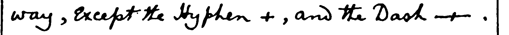
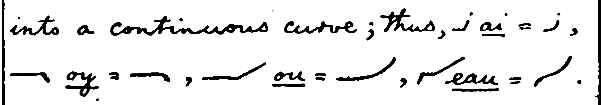
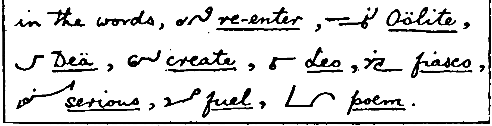
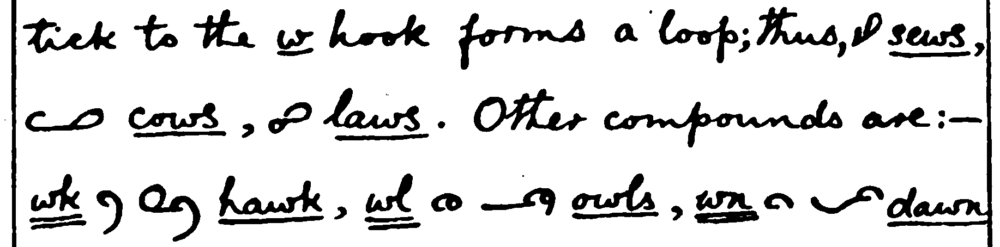
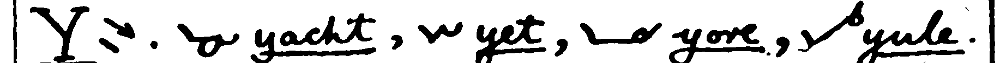
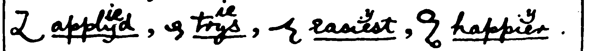
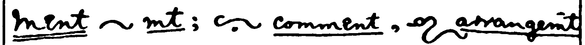
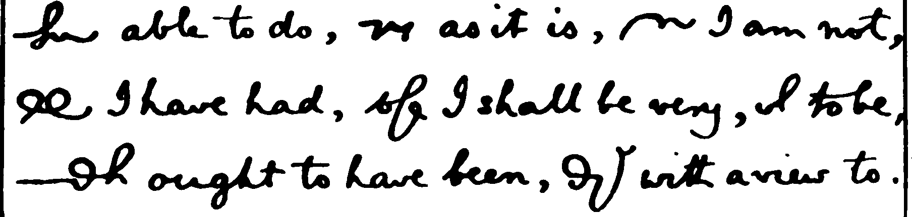

# Orthic Consolidated – Reference DRAFT

## Being Part of an Improved and Expanded Consolidation of Various Books with Clarifications, Additions, Warnings, and Opinions of the Author 


# Notes to Self

- The first part, how to write and join, will be sorted by longhand, with a few cross-references when several letters should be combined to clarify the differences.
- If it's not obvious where the full description should be, choose the earlier one.
- Assume readers have read the Manual. This is a review. Readers can see the arrows on the images.
- Abbreviation and Vocab sections assume reader knows Joins. Jeremy's notation is enough for them to make the image on their own. (Will need to add to the notation.)

-- using my own? combined letters/slurs/joins are in brackets, not codes
- Abbreviation and Vocab can sort either way (Orthic or English).
- The two ways of spelling are Orthic and orthographic. If I find a better word for the 2nd I can search/replace easily enough.
- xxx is note to self. Searching for them will be one of the final steps before publicataion.
- xxx add notation to the alphabet?
- xxx ??? Do I need to list the source along with the word in the text, for joins? Probably not. It's in the image.
- images -- file name is topic, book, page


canonical copy, revs


explain codes for source : M, S, R, T, T2, E

# remember they have already read the Manual !!!


testing - dashes -- how they show --- funny stuff

By CricketB, Reddit u/CrBr

Original document maintained at 

```
* Xxx Maybe https://github.com/CricketBr/shorthand/blob/main/orthic%20consolidated
```

```
copyright, GNU???

add in

Revison date .....
```

# Introduction to Orthic Consolidated – Reference Alphabet

[Introduction to Orthic Consolidated Series](orth-cnsl-intro.md)

Sometimes (more often than I'd like), I want to look up a rule. Searching four separate books, which often disagree about which style level a rule applies to and sometimes have an entirely different rule, is annoying and frustrating. (One could argue, correctly, that if I'd spent enough time learning at the start, I would not need this reference.)

This book intends to solve that problem. It combines all the rules (except those that only exist in the reporting style) from the Manual, Supplement, Teaching Parts 1 and 2, and Revised. It includes references to the sources for easy confirmation of the rules. (I lied. I included some rules that I like that are only in the reporting style.)

It is *not* intended as a first introduction to Orthic. The Manual or Revised is best for that. (I recommend the Manual, and anything Revised does differently just feels wrong to anyone who started with the Manual.)

It is organized into the following parts: 

* Alphabet. Not really necessary by the time you're here.
* Non-Alphabet Rules. Rules that don't apply to a specific letter.
* Joining Characters
  * Vowel-Vowel
  * Consonants and Vowels. 

  
*If not stated, the rule comes from The Manual.* The wording of each rule is a combination of the original sources and my own understanding. I have made very little effort to clarify who said what, except where. Note that I often write in Victorian English. It's hard to avoid "catching" it in a project like this.

# The Alphabet

Manual: ab, act, bad, cabby, adder, fed, left, get, hit, city, jug, luck, like, melt, know, proof, plate, query, roller, sort, trust, upper, wavy, wow, exit, eyes, size


# General Rules

### Position on the Line
The rules for this are a mess.

In the Manual, Calendar claims the first letter sits on the line, then on the same page (Two Sizes of Character) starts *epitaph* above the line, with P sitting on the line. In St John II, *it* and *in* start on the line and go upwards. T is a downstroke, so the rule isn't first downstroke. Stevens has his own version. On the first page of the Preface to the New Testament <https://orthic.shorthand.fun/reading> *it* starts below the line and T sits on the line. Revised says, "The first letter of a word generally begins or ends on the line, but A, E and O may be raised when preceeding downstrokes." (Revised, General Rules, p3)

Just do what looks right to you. If you read something that doesn't make sense, remember some writers will write higher or lower than you do.

### Modes or Positions

Each letter that can be replaced by a mode is listed under Joining Consonants. Their use for shortening words beyond simple letter replacement is under Word Parts. 

* First Position, Raised: B, P, V
* Second Position, Normal (gap): all others
* Third Position: Lowered: G, J, K, L, QU

```B, G, J, K, L, P, QU and V can be omitted using modes. ```
### Doubling a Letter


Manual: odd, too, ee, sleep, sup


```teaching
revised
```

### Two Sizes of Letters
Most books say use 1:3, but then use less in the Two Sizes image, and somewhere between 1:2 and 1:3 in actual writing. It's rarely a problem except for debates between students.


Manual: st, ste, en, ens, inst, nt, er, ers, abs, against, epitaph

> The actual **size** of the characters may be varied according to circumstances, such as the goodness of the light and the writing materials. The minuteness of any kind of writing is limited by the size of the smallest characters. In Orthic the small size may be made as small as desired, and the small circle may be reduced to a dot. But it is best to make the small characters about one-twelfth of an inch \[2.1mm\] long, and the large ones twice as big." (Revised, p3, General Rules)


### Connecting Stroke

A short connecting tick maybe used after ER, TH, etc, and when they are followed by G, P and S. (Revised, p3, General Rules) Note: This rule is only in Revised. Clarey may need this more than the other writers due to his different style of writing.

 
> dirge, faiths, serpents : Revised

### Dividing Words


Manual: lawsuit, Woolwich, virgin

```> bagpipes : Revised```

### Punctuation

Manual: hyphen, dash

### Initial Capitals 

Indicated in a few ways.

Manual: Jack, Clay, S.E., L.S.W.R. (London and South West Rail Company)

See S to distinguish intial S from initial P.

### Omit A and O before M and N

Manual: band, bond


Manual: can, con, alone, woman;  
CN, ALNE, WMN

An omission of this kind can always be corrected by writing the omitted character above.

# Joining Vowels with Vowels, Diphthongs

Some concepts are under the prominent letter, instead of the first in the group.

Orthic uses an older definition of the word *diphthong*.


Manual: ai, oy, ou, eau

## Vowels Sounded Individually

Check both orders of vowels to see all example words.


Manual: re-enter, Oölite, Deä, create, Leo, fiasco, serious, fuel, poem

## A

Manual: ai, au, ay, days, quay, says, hay


xxx Teaching1 suggests only using AI-under for AI, thus spelling it according to the common orthography. This rule is not in the Manual. The Dictionary (Manual and Supplement only) does not have any examples to the contrary. Optician uses the AI form. Social uses the IA form.. 


## E


Manual: ee, ei, ie, steep, stupid, eu, ew, new


Manual: seen, sun


Manual: ea, seat, seas, reat, real, pearl, years

## I


Manual: social, optician, chief

## O

Manual: oar, or, oak, oi, toil, ou, out, oy, boys

## U

Manual: ua, guard, suit

## Y

No examples.

# Joining Consonants

Some concepts are under the prominent letter, instead of the first letter.

## A

Omit A and O before M and N. See General Rules.

A on the line is *a*. A raised is *and*.


## B

Manual: bd, rob'd, bj, object, bl, able, br, bray, bs, absurd, bt, subtract, bv, subvent


Be: This prefix is peculiar to a special class of English words, and may also be expressed by writing above the line. Note that been and being are chosen to not conflict with than and thing. (Supplement, and Teaching1 Lesson 6\)

* Supplement: be, been, being, than, thing ; Teaching1: behold, been better, best, by

BL can be shown by reversing the direction of the B loop, and optionally writing the L inside the B. (Revised, pg 4, Compound Characters)

* Revised: BL, BL, black, sensible, bleak, trebly

## C
Manual: ck, suckle, cl, close, cr, crutch, ct


CH is a circle the same size as H. H, CH and WH are described under H.

## D

D and  T have similar characters, but D is much flatter and longer.

DD, DT and TD can be written as a double-wide D. (Supplement.

DEN series. The proportions below are not listed as a rule, but they are used consistently. In DN the letters form a wave. The end of one letter and the beginning of the next share a line. In DEN, the combination begins and ends on the same line. In DEEN, there is actually a line This is what most beginning writers think DEN should look like.

DV is slurred into one large compound character, deep and double-width. (Manual Reporting, Slurring; Supplement; Revised p4 Compound Characters)

Manual: dge, judge, dj, dle, fiddle, dr, dread, dv, dw, dwell


Manual: student


* Supplement: no examples  
* Revised: advert, avert

## E

E is a short upstroke; it must not be confused with  s, which is written downwards.

See also Joining Vowels

See V for EV

## F

F is joined without an angle after vowels; thus, with i rounded out to flow straight into f if (not stiff i, awkward corner, f). It is joined to the following characters like the longhand letter s.

Manual: if, ft, soft, fd, puff'd, fl, fr, rifle, afraid, fs, skiffs


S joined to the finish of F or K is better turned up rather than down. (Teaching1)


* ks-correct, ks-not-recommended (Teaching1)

## G

Manual: gh, high, gl, glory, gr, agree, gn, sign


## H, CH, and WH

H, CH, and WH are all large circles, and described here. All books agree that H begins at the bottom and is written ccw -- most of the time.

It looks similar to CH and WH. The shape is changed in PH, SH and TH.

Manual (H): cha, hat, chat, what, which


Manual: ch, chair, Christ, ache, ahead


Manual (W): who, ha (have)


* Hat, chat, who, what, which (Revised)  
* Hat, chat, who, what, which – fully and without H (Cricket / Consolidated)

**Manual**

H is a large circle or backward loop beginning at the bottom. 

CH is written and joined exactly like the longhand letter o \[lowercase\]

* H with arrow, O-longhand, chair, Christ, ache, ahead (Manual)

H is distinguished from CH by the way it is joined

* Hat, chat, what, which (arrows on all but which)

WH is made by enlarging the W hook so as to look like the H circle.

* Who, ha  
* 

**Supplement**

No notes on H, CH or WH. From the Specimen of the Ordinary Style, Abbreviated:

* Each, much, changes, which, change, such, characters, detached, teachers, school-masters  
* Why, who, when, which, somewhat, whatever, what, wholesale, 

NCH and SCH can be written without an angle or break – ie in the other direction, still below the line. (Supplement) 

* inch, such, school, much (Supplement)

TCH. The T may be omitted. (Supplement and Revised) (No examples.)

**Teaching**

H has its diminutive analogue in R, both lie at the top of a following line; CH and L are similar, and lie at the bottom of a line. WH is made like CH but not joined at the top. It may also be remembered thus, enlarge the W to look like H

* H, R, CH, L, who

**Revised**

CH is written three ways to facilitate joining. The first is used in compounds CHR and RCH. Some of these are above the line. (Revised, p4, Compound Characters)

(Astute readers will see significant differences in some words between Revised and the other sources.) 

* CH-1, CH-2, CH-3, Christ, arch, filch, chat, such, scholar, scheme, when (Revised)

CHL may be written in two ways. (Revised, p4, Compound Characters)

* CHL-1, CHL-2, chloric, richly, speechless (Revised)

In adding inflections to CH they may be joined either above or below. (Revised, p7, How to Write and Join the Characters)

* Aches, pitch'd, filches, pilchard (Revised)

WH

* Whose, when, chose, chin (Revised, p5, Compound Characters

**Cricket**

Most of the time, it is safe, and faster, to omit the H in WH. There are, however, times when you need to record the exact spelling. I prefer to start WH at the bottom, to make an enlarged W, or to start it at the right, instead of at the top.

* More examples

## H, Other Joins

See P for PH, PHTH and PTH. Sometimes the H turns in the opposite direction.

See SH and TH for those joins. Sometimes H is smaller or not completed.

## I

I  is a short upstroke, like e, but dotted. See Joining Vowels for more details.

I is often started below the line in short words such as IN. This is not in any rules, but is demonstrated on the first page of the Preface to The New Testament (Stevens)

* Social, optician, chief (Manual)

## J

J  is like the letter j, but is not dotted.

The omission of G K J or QU is shown by writing the termination below, called (14) mode II. (Manual)

Tip: All these sounds are in the back of the mouth. (Cricket)

* Words? No books have any in the eg lists

## K

K  is like g, but is turned the other way. It is joined in the same way as F.

Manual: The omission of G K J or QU is shown by writing the termination below, called (14) mode II (Hint: Back of mouth are lowered. Cricket)

KS: S joined to the finish of F or K is better turned up rather than down. (Teaching1)

* Taken (Manual)  
* Looks, works, walks, like, beak, duke (Revised)

## L


L and R are tiny circles, less than half the size of H. L always goes clockwise. R always goes counter-clockwise – above horizontal lines. When writing L or R without neighbouring strokes to show direction, add a tiny entry stroke.

The circle is so small that it can fit nicely inside T, for RT and TR.

Other shorthand systems (notably Gregg) base direction on the surrounding strokes. This can get confusing when switching systems. Each Orthic book has a mnemonic or two to help.

When standing by itself as an initial, L or R is prefixed by a short stroke showing its direction. In other cases the distinction is obvious.

* Manual: black, bread, clay, crow, addle, dry, flow, fro, glad, grade, play, pray, little, litre, slay, Israel, held, herd, world, already.  
* Revised: lair, rail, male, mare, link, rink, fail, fair, flay, fray, whirl, walrus

Other L

Manual: half, walk, help, wilt, slave

Teaching1: bl, br, pl, pr, fl, fr, ml, mr

```
When to go around L, R, and when to bounce

* manual alphabet proof bounce  
* Clarey alphabet help around, waltz bounce, zebra bounce

```
## M


Omit A and O before M and N. See General Rules.


MB can be written as a tall M. (Supplement, Revised p7 Other Slurs)

MBS, when preceded by E, I or U, the S turns up (as after F and K). (Revised, p7, Slurs

MM, MN can be written as one double-wide M. (Teaching)  
Note that omitting A and O before M and N means that MN can mean man or mon.

* Manual: imply, limb, ms  
* Supplement: member, number, many, woman, human, money  
* Revised: MB, timber, lumber, lamb, temper, lumper, lamp – fix the order  
  Kembs, climbs, numbs

## N


Omit A and O before M and N. See General Rules.


Omit A and O before M and N. See A.

NCH and SCH may be written without an angle or break. (Supplement)  
(They are written in the opposite direction.)

No angle need be made in the compounds NG and NSP. (N followed by downstroke).

NK has no angle (Revised)

NSP has the S omitted. (Revised) (no example)

* Manual: singer, inspect, since, inches, India, infer, injury, unless, sense, sent, sink, inquest, invent  
* Supplement: inch, such, school  
* Revised: inspirit, inspect, ensphere, conspire, wink, rank, sink, tinker, ginger, hang, sting, singer  
  (Note that Revised uses a large H in SH.) inherit, inhale, enrich, enroll, inward, enwrap  
* Fix the order to match the list above

## O

Omit A and O before M and N. See General Rules.

See Joining Vowels for more details.

Omit A and O before M and N. See A.

OYS: Turn the S up, as for FS and KS (Revised)

* Manual: oar, or, oak, toil, out, boys  
* Revised: cloys, employs, coat, cot


## P


PH: H might be turned in the other direction, depending on the following letters. (Manual, Revised p8 How to Write and Join)

PHL, PHR: L or R go inside the H. (Revised)

SP, PS: In joining S before and after P, the S-tick is sloped backwards.

SP and PS are often rounded, much like vowel joins. (Supplement, Revised p6 Other Slurs)

PW uses angle-W (Revised)

* Manual: PH-1, PH-2, phrase, phlegm, spear, cusps, place, present, depth, PHTH  
* Revised: PHL, PHR, PHTH, PW, speak, trips, cusps

Manual: The omission of B P or V is indicated by (12) mode I, that is by writing the termination above.

* sp   spear ps   cusps 

Other compounds are:

* ph   phrase  phlegm pl   place pr   present pt   depth phth 

PH sometimes turns H in the other direction, depending on the following letter. (Manual, Joining)

The first (ccw, H to the right) is used in the compound PHR, before E U, and final. The second (cw, H to the left) is used in other cases. (Revised)

* phrase, phlegm (Manual)  
* Phar, phy (Teaching)  
* PH-1, Phrase, philter, sulphur, epitaph, PH-2, phase, phlegm, physic (Revised)

PHTH

T: **S before and after P**

*S* before and after *P* should be rounded. ![][image1] *sp*, ![][image2] *ps*, ![][image3] *sps*.

**P** ![][image4] is a long downstroke, like the upper half of the stroke of the letter ![lowercase p in cursive longhand][image5]. It is made about three times as long as ![][image6] **s**.

* In joining ![][image7] **s** before and after ![][image8] **p**, the *s*\-tick is sloped backwards; thus  
  * ![][image10] spear  
  * ps ![][image11] ![][image12] cusps  
* Other compounds are:  
  * ph ![][image13] ![][image14] phrase ![][image15] phlegm  
  * pl ![][image16] ![][image17] place  
  * pr ![][image18] ![][image19] present  
  * pt ![][image20] ![][image21] depth  
  * phth ![][image22]

  


## Q


Manual: The omission of G K J or QU is shown by writing the termination below, called (14) mode II (Hint: Back of mouth are lowered. Cricket)

Qu  is like the lower loop of the letter lowercase f in cursive longhand; it is turned the opposite way to  j.  esquire.

I recommend leaving the U out for common English words, and switching to longhand for at least the first occurrence of other words. Suggestion: Q is assumed to include U. Add a dash across the bottom loop to remove the Q.

* **Qu** ![][image23] is like the lower loop of the letter ![lowercase f in cursive longhand][image24]; it is turned the opposite way to ![][image25] **j**. ![][image26] **esquire**.

## R


 is a small circle like  L, but is always turned the opposite way, like the loop of the longhand letter lowercase e in cursive longhand. See L for examples and comments on size.

The compound  rce is written like the initial lowercase e in cursive longhand form of the longhand letter e; thus,  fierce. \[Jeremy: I've never seen this style of cursive e used outside Callendar's own writing. It is like the uppercase cursive E made like a mirrored, round 3, only it is written the height of a lowercase letter, and has an added leading hairstroke crossing above the midline to make the top circle of the e. The result is basically the counter-clockwise Orthic r sitting atop a half-height Orthic c with a rise at the end for the e.\]

Other compounds are:

rd rt rf rk   work rn   learn rp  rs rv 

![][image27] is a small circle like ![][image28] **L**, but is always turned the opposite way, like the loop of the longhand letter ![lowercase e in cursive longhand][image29]. [For examples, see L.](https://orthic.shorthand.fun/manual#joining-L-examples)

* The compound ![][image30] **rce** is written like the ![initial lowercase e in cursive longhand][image31] form of the longhand letter *e*; thus, ![][image32] **fierce**. \[Jeremy: I've never seen this style of cursive *e* used outside Callendar's own writing. It is like the uppercase cursive *E* made like a mirrored, round 3, only it is written the height of a lowercase letter, and has an added leading hairstroke crossing above the midline to make the top circle of the *e.* The result is basically the counter-clockwise Orthic *r* sitting atop a half-height Orthic *c* with a rise at the end for the *e.*\]  
* Other compounds are:  
  * rd ![][image33]  
  * rt ![][image34]  
  * rf ![][image35]  
  * rk ![][image36] ![][image37] work  
  * rn ![][image38] ![][image39] learn  
  * rp ![][image40]  
  * rs ![][image41]  
  * rv ![][image42]

## S


 is a short downstroke like the tick at the beginning or end of a capital S.

When standing alone, as an initial, it is written straight down, thus a short, vertical stroke, to distinguish it clearly from the short, forward-slanted stroke e; cp.  S.E.

In the compound Sh  the h circle is made smaller for neatness; sh as in sha, where she a leaves from the middle of the s \- "touch and reverse" \-  is distinguished from sr as in sra, where the a leaves from the bottom of the s \- "spin around and continue" \- by the way it is joined; thus; cp.

 shed-  Tisri-  shred-  school

SH

Other compounds are:

sc   scent sk sl   slew sm sn sp   sphere squ   square st   still sw   answer

Supplement H and its connections

Check all of them

![][image43] is a short downstroke like the tick at the beginning or end of a capital ![S][image44].

* When standing alone, as an initial, it is written straight down, thus ![a short, vertical stroke][image45], to distinguish it clearly from ![the short, forward-slanted stroke][image46] **e**; cp. ![][image47] **S.E.**  
* In the compound **Sh** ![][image48] the *h* circle is made smaller for neatness; **sh** ![as in sha, where she a leaves from the middle of the s - "touch and reverse" -][image49] is distinguished from **sr** ![as in sra, where the a leaves from the bottom of the s - "spin around and continue" -][image50] by the way it is joined; thus; cp.  
* ![][image51] **shed**\- ![][image52] **Tisri**\- ![][image53] **shred**\- ![][image54] **school**  
* Other compounds are:  
  * sc ![][image55] ![][image56] scent  
  * sk ![][image57]  
  * sl ![][image58] ![][image59] slew  
  * sm ![][image60]  
  * sn ![][image61]  
  * sp ![][image62] ![][image63] sphere  
  * squ ![][image64] ![][image65] square  
  * st ![][image66] ![][image67] still  
  * sw ![][image68] ![][image69] answer  
* 

S: Nch, sch

These combinations may be written without an angle or break. (See *inch* ![][image70], *such* ![][image71], *school* ![][image72], in the list.)

See H for extra details

R: in AYS and OYS (in that order, not YAS or YOA) S goes up to the left.

T: **S after F or K**

*S* joined to the finish of *F* or *K* is better, (as the hand is traveling in a curve), turned *up* rather than down; thus ![][image73] *ks* is better than ![][image74].

R : S after AY, OY

T: **S before and after P**

*S* before and after *P* should be rounded. ![][image1] *sp*, ![][image2] *ps*, ![][image3] *sps*.

The angular form is used after *S*, thus ![][image75] *sw*, formed of ![][image76] *s* and ![][image77] *w*.

..

The only other cases of sub-linear writing up to this point are the words ‘take' and ‘sake' and their inflections, which are written ![\`t\_\*\`, \`t\_Y\`, \`s\_\*\`][image78], etc. The *k* throwing *below* the line, but in no other case is the *k* so treated.

## T


  is like the hook at the end of the letter t.

Th  is written like the letter d. \[Jeremy: That's a looped-through version of the d Callendar often writes at the end of a word, as seen for example in "end" . That word also shows the funky e Callendar uses to explain how to write the compound rce.\]

At the end of a word, the circle of the h need not be completed; thus,

 With  both

Other compounds are:

tch   sketch tle   turtle tr   truth tw   two

TH

* **T** ![][image79] is like the hook at the end of the letter ![t][image80].  
  * **Th** ![][image81] is written like the letter ![d][image82]. \[Jeremy: That's a looped-through version of the *d* Callendar often writes at the end of a word, as seen for example in "end" ![][image83]. That word also shows the funky *e* Callendar uses to explain how to write the compound *rce.*\]  
  * At the end of a word, the circle of the *h* need not be completed; thus,  
    * ![][image84] **with**  
    * **![][image85]** **both**  
  * Other compounds are:  
    * tch ![][image86] ![][image87] sketch  
    * tle ![][image88] ![][image89] turtle  
    * tr ![][image90] ![][image91] truth  
    * tw ![][image92] ![][image93] two

Initial **Th** is omitted in all common words. The omission is shown by writing the rest of the word above the line; thus, ![][image94] **the**, ![][image95] **they**, ![][image96] **this**, ![][image97] **them**, ![][image98] **tho'**, ![][image99] **that**.

* **Exception:** The character **a** ![][image100] written above the line stands for the word **and.**  
* [**Ther**](https://orthic.shorthand.fun/manual#ther-ending) ![][image101] **hr**  
  * **![][image102]** **others**  
* 

S: 

T 

T: **\-ther**

slur the *t* ![][image103] into the *h* ![][image104] circle and put the *r* inside, thus ![][image105], ![][image106] *other*.

Th

Use mode 1 *only when initial*, except in the case of the word *although* ![][image107]

..

The only other cases of sub-linear writing up to this point are the words ‘take' and ‘sake' and their inflections, which are written ![\`t\_\*\`, \`t\_Y\`, \`s\_\*\`][image108], etc. The *k* throwing *below* the line, but in no other case is the *k* so treated.

Slurs mm/mn, dd, dt, and td

Again, *mm* or *mn* often come together when by the rule the vowel is left out, as in the word *man*, ![][image109], now one large curve will embrace both ![][image110].

Similarly *dd*, *dt*, or *td* may be represented by a large ![][image111].

T slur rule for count, country, duty

We have seen that as ![][image112] \= *count*, therefore ![][image113] \= *county*, we therefore extract a rule *t* may be slurred in such words as *duty*, *bounty*, etc.

## U


see E, vowel joinings, for E vs U

  is a long up-stroke on a flat slope, making an angle of about  30° with the line.

U  is distinguished from ee  by being written much less steeply; cp.  seen,  sun.

* **U** ![][image114] is a long up-stroke on a flat slope, making an angle of about ![][image115] 30° with the line.  
  * **U** ![][image116] is distinguished from **ee** ![][image117] by being written much less steeply; cp. ![][image118] **seen**, ![][image119] **sun**.  
  * **Dipththongs**  
    * ua ![][image120] ![][image121] guard  
    * ui ![][image122] ![][image123] suit

## V

  is distinguished from  ste by its size; cp.

 Minster  Minver  stew  view

Manual: The omission of B P or V is indicated by (12) mode I, that is by writing the termination above.

* whichr \= whichever,  
* gn \= given.  
* 

![][image124] is distinguished from ![][image125] **ste** by its size; cp.

* ![][image126] **minster**  
* **![][image127]** **Minver**  
* **![][image128]** **stew**  
* **![][image129]** **view**

**\++++**

\++++

## W 





is an upward hook, which may be turned either way.

The first \[clockwise\] form is always used at the beginning of a word, except before r. Thus

 Way  woe  wet Write

At the start of the word, it can start at the right edge, to form ¾ of a circle, – doesn't this add H?

wr  is distinguished from  th  by its size.

wh  is made in a few different ways, depending on the writer.

- enlarge the w hook it looks like the h- circle; cp.  who,  ha.  
- Clarey's method  
- Start it at 3:00

ws ; at the end of a word the addition of the s tick to the w hook forms a loop; thus

 Sews   cows  laws 

Other compounds are:

wk   hawk wl   owls wn   dawn![][image130] is an upward hook, which may be turned either way.

* The first \[clockwise\] form is always used at the beginning of a word, except before **r**. Thus  
  * ![][image131] **way**  
    * **![][image132]** **woe**  
    * **![][image133]** **wet**  
    * cp. ![][image134] **write**  
  * **wr** ![][image135] is distinguished from ![][image136] **th** by its size.  
  * **wh** ![][image137] is made by enlarging the *w* hook so as to look like the *h*\- circle; cp. ![][image138] **who**, ![][image139] **ha**.  
  * **ws** ![][image140]; at the end of a word the addition of the *s* tick to the *w* hook forms a loop; thus  
    * ![][image141] **sews**  
    * **![][image142]** **cows**  
    * **![][image143]** **laws**  
  * Other compounds are:  
    * wk ![][image144] ![][image145] hawk  
    * wl ![][image146] ![][image147] owls  
    * wn ![][image148] ![][image149] dawn

T:The letter *W* has a two-fold symbol ![][image150], the first initial, the second final. Observe the longhand character in Lesson 1, students will then never forget which is which, or the direction they turn. Initial *W* ![][image151] is always used at the beginning of a word, *except before R*. (*Wh* we have already explained) Before *R* *final W ![][image152] is used*, thus ![][image153], the reasoning that written the other way ![][image154], the combination really becomes *wer*, not *wr* only. Note that *W* ![][image155] begins *on* the line, not above it as ![][image156] \= *t*.

Another way to remember *W* is to point out that whether initial or final, *it is an upward tick*, as ![][image157] *wo*, ![][image158] *ow*. The letter may be written either circularly or angularly as ![][image159] or ![][image160] *owing*, ![][image161] or ![][image162].

The angular form is used after *S*, thus ![][image163] *sw*, formed of ![][image164] *s* and ![][image165] *w*. To add *S* to final *W*, elongate the loop, thus ![][image166] *cow*, ![][image167] *cows*.

## X


No angle need be made in:

xh   exhort xp   expense xt   extent![][image168]

* No angle need be made in:  
  * xh ![][image169] ![][image170] exhort  
  * xp ![][image171] ![][image172] expense  
  * xt ![][image173] ![][image174] extent

T: 

* 

## Y





 Yacht  yet  yore  yule ![][image175]

* ![][image176] **yacht**  
* **![][image177]** **yet**  
* **![][image178]** **yore**  
* **![][image179]** **yule**

Let \-Y stand unaltered

In adding inflections to words ending in **y,** the **y** is not changed to **i** or **ie**; thus, ![][image180] **applyd**, ![][image181] **trys**, ![][image182] **easyst**, ![][image183] **happyr**.

## Z

* ![][image185] **daze**  
* **![][image186]** **Fitz**  
* **![][image187]** **puzzle**

Daze  Fitz  puzzle

# Word Parts {#word-parts}


* [**Ed.**](https://orthic.shorthand.fun/manual#ed-ending) The *e* may generally be omitted; thus,  manual  
  * ![][image188] **us'd**  
  * **![][image189]** **kiss'd**  
  * **![][image190]** **stirr'd**

**Adj , and probably dj, dg – it's almost silent** 

**![][image191]**

## A {#a-2}

S: **Acqu**

Written *aqu* ![][image192].

Adj

Written *aj* ![][image193].

Adv

Slurred into one large character compounded of *d* and *v* [as explained in the *Manual,* ‘Hints for Reporting,' ‘Slurring.'](https://orthic.shorthand.fun/manual#slurring) \[E.g., ![][image194] *advantage.*\]

S: Ge, ‑dge, ‑age

These and derived terminations are similarly expressed by a dot below and to the right to indicate the *g.* ([Mode (3), *Manual,* ‘Hints.'](https://orthic.shorthand.fun/manual#modes) See also *knowledge* ![][image195], *agent* ![][image196], etc. in the list.)

T: **\-ation**

is a common ending, and it is wise to shorten it as much as possible, therefore use detached *n* ![][image197] to represent this termination, as ![][image198].

T: Sub linear writing is writing *below* the line. We have already had an example of this, with the reason, in ![][image199] \= *ight*. From this we can easily draw another rule \- in the combination *dge*, *age*, *gn*, or *gram* it is clear that equally as in the case of "ight", the *g*, as part of the termination or syllable, throws the rest of the word *below* the line, e.g. ![][image200] \= *for gn* \= *foreign*, ![][image201] *age*, ![][image202] *magnify*, etc.

## B {#b-1}

S: (16) The use of modes (1) and (3) (except in the special cases (17) already given) should be almost entirely restricted to the expression of *V* and *G* respectively. (18) Many students appear to have misunderstood the principles of their application and some have even (19) gone so far as to write all words beginning with *p, b* or *v* above the line omitting (page 2, line 1\) the initial letter. This is manifestly absurd. The initial letter of a word is (2) usually the most important for its identification and should therefore be retained — except in (3) one special case namely that of a com(mo)n prefix. Such-a prefix being common to a large class (4) of words is a less use for purpose of identification and may therefore be (5) suitably expressed by the method of supra-linear writing.

S:

Be

This prefix is peculiar to a special class of English words, and may also be expressed by writing above the line.

The word *be* is expressed by a dot above the line ![][image203]; *been* and *being* by *n* ![][image204] and straight *‑ing* ![][image205]; the former will not be found to clash with *than.*

T: **Be**

As there is a very close relation between *V* and *B*, and as words with the prefix "be" belong to a special English class, we may without fear use *Mode 1* to indicate the *prefix* "Be". This abbreviation is only to be used when "be" is a distinct prefix, as ![][image206] \= *behold*; it would be incorrect to write ![][image207] for *bead*, this would be *Be-ad*, not *bead*. By the same reasoning as the *dot* indicating *vowel-v-vowel* so the verb "be" may be shown by a dot; thus ![][image208]; the only liberty taken in using this prefix "be" is in the common words *been*, *better*, *best*, and *by* which are written ![][image209], respectively.

![][image210] \= *bring*, compare crooked *ing* ![][image211] for *thing*.

## C {#c-1}

S: **Com, con**

Expressed by a dot on the line written close in front of the word, as explained in the *Manual,* ‘Hints for Reporting.' \[Jeremy: As far as I can tell, this is not actually explained there. You could infer it, but it's not explained.\] \[E.g. ![][image212] *common,* ![][image213] *conc(ern)ing.*\] In taking notes, the dot may generally be omitted or expressed by Mode (2). In correspondence it should be retained.

In compound prefixes, such as *incom-, discom-,* etc., the *com-* or *con-* is expressed by Mode (2).

Circum

Written *cir* ![][image214] followed by a short break to represent *cum.* *Circe* ![][image215] is the the regular longhand abbreviation for the word *circumstance.*

T: 

The common primitive *con* or *com* may be expressed by a *dot* *on* the line, or by leaving it out altogether, and writing the rest of the word quite close to the preceeding word, as ![][image216], ![][image217], or ![][image218] \= *I commend*.

## D {#d-1}

S: Ge, ‑dge, ‑age

These and derived terminations are similarly expressed by a dot below and to the right to indicate the *g.* ([Mode (3), *Manual,* ‘Hints.'](https://orthic.shorthand.fun/manual#modes) See also *knowledge* ![][image195], *agent* ![][image196], etc. in the list.)

T: Sub linear writing is writing *below* the line. We have already had an example of this, with the reason, in ![][image199] \= *ight*. From this we can easily draw another rule \- in the combination *dge*, *age*, *gn*, or *gram* it is clear that equally as in the case of "ight", the *g*, as part of the termination or syllable, throws the rest of the word *below* the line, e.g. ![][image200] \= *for gn* \= *foreign*, ![][image201] *age*, ![][image202] *magnify*, etc.

T ![][image219] for *dv*.

Slurs mm/mn, dd, dt, and td

Again, *mm* or *mn* often come together when by the rule the vowel is left out, as in the word *man*, ![][image220], now one large curve will embrace both ![][image221].

Similarly *dd*, *dt*, or *td* may be represented by a large ![][image222].

## E {#e-2}

* [**Ed.**](https://orthic.shorthand.fun/manual#ed-ending) The *e* may generally be omitted; thus,  
  * ![][image223] **us'd**  
  * **![][image224]** **kiss'd**  
  * **![][image225]** **stirr'd**

s:

* *every* ![][image226]  
* *evening* ![][image227]  
* *event* ![][image228]  
* *evident* ![][image229]  
* *evil* ![][image230]

and their derivatives are abbreviated by the *V*\-Mode, in the same way as *ever,* by omitting the *eve* and writing the rest of the word above the line.

**Exception:** *Even* is written *e'en* ![][image231], to distinguish it from *than* or *then.*

\++++

S: 

\-ent	.t

\-ence	.ce

\-ency	.cy

T: 

* *X* is made up, as in longhand, of *C* and *S*, ![][image232], and there is no English word beginning with *X* that is not preceded by *E*, this character may be used to represent *Ex*. There is no need to make an angle in the combinations *Exh*, *Exch*, as ![][image233].  
* Ever  
* Draw attention to ![][image234] \= *ever* : this appears an arbitrary; it is not; students will see the logic at the next lesson.

## F {#f-1}

* [**Ful**](https://orthic.shorthand.fun/manual#ful-ending) ![][image235] **fl**  
  * **![][image236]** **useful**  
    * **![][image237]** **beautyfully**

## G {#g-1}

Manual: The omission of G K J or QU is shown by writing the termination below, called (14) mode II (Hint: Back of mouth are lowered. Cricket)

* sn \= sign,  
* st \= sight,  
* wa. \= wage,  
* was \= wages

S: \-graph \-\> .ph

S: Ge, ‑dge, ‑age

These and derived terminations are similarly expressed by a dot below and to the right to indicate the *g.* ([Mode (3), *Manual,* ‘Hints.'](https://orthic.shorthand.fun/manual#modes) See also *knowledge* ![][image195], *agent* ![][image196], etc. in the list.)

Gn, gram

Indicated by *n* ![][image238] and *m* ![][image239] respectively written below (Mode (3)) to indicate the *g,* as in the termination *‑ight.* (See *foreign* ![][image240], *sign* ![][image241], in the list.)

T: Sub linear writing is writing *below* the line. We have already had an example of this, with the reason, in ![][image199] \= *ight*. From this we can easily draw another rule \- in the combination *dge*, *age*, *gn*, or *gram* it is clear that equally as in the case of "ight", the *g*, as part of the termination or syllable, throws the rest of the word *below* the line, e.g. ![][image200] \= *for gn* \= *foreign*, ![][image201] *age*, ![][image202] *magnify*, etc.

## H {#h}

* [**Hood**](https://orthic.shorthand.fun/manual#hood-ending) **![][image242] hd**  
  * **![][image243] manhood**

**??:** \-hood / –head

*hd* only; ![][image244].


## I {#i-2}


Xxx

* [**Ing**](https://orthic.shorthand.fun/manual#ing-ending) ![][image245] **ing**  
  * **![][image246]** **using**  
  * **![][image247]** **saying**  
  * **![][image248]** **seeming**  
  * This form is used only for the inflection *\-ing* and not in such words as ![][image249] **king**; cp. ![][image250] **sing**, ![][image251] **singing.**  
  * It is better to curve the stroke, thus ![][image252], after *d,* *m,* *n,* *t,* *v,* and vowels \[here including *y* as in "scrying"\].  
* [**Ight**](https://orthic.shorthand.fun/manual#ight-ending) ![][image253] **t**, below  
  * ![][image254] **night**  
  * **![][image255]** **light**  
* [**Ion**](https://orthic.shorthand.fun/manual#ion-ending) **![][image256] un, dotted if necessary**  
  * **![][image257] action**  
*   
* [**Ity**](https://orthic.shorthand.fun/manual#ity-ending) ![][image258] **y**, above  
  * ![][image259] **ab(il)ities**  
  * **![][image260]** **pec(uliar)ity**

\-ation

is a common ending, and it is wise to shorten it as much as possible, therefore use detached *n* ![][image261] to represent this termination, as ![][image262].

\-ity / \-ly

***\-ity*** **\= *y* *above* the last letter**

S: \-ism  .m

## J {#j-1}

## K {#k}

## L {#l-1}


T; **L slurred with T in wealth, health**

*L* may be slurred with the *t* in such words as *wealth*, *health*, etc., and the softly sounding vowel in terminations such as "al", *final* ![][image263], "er" in *upper* ![][image264], etc.

Source?

[**Less**](https://orthic.shorthand.fun/manual#less-ending) ![][image265] **ls**

* **![][image266]** **thankless**  
  * **![][image267]** **fearlessness**  
* [**Ly**](https://orthic.shorthand.fun/manual#ly-ending) ![][image268] **y** below  
  * ![][image269] **nearly**  
  * **![][image270]** **easily**  
  * **![][image271]** **dailies**

xxx

supplement: bl , br

pl, pr, fl, fr, ml, mr

## M {#m-1}

* [**Ment**](https://orthic.shorthand.fun/manual#ment-ending) ![][image272] **mt**  
  * **![][image273]** **comment**  
  * **![][image274]** **arrangement**  
* 




S: Ness

This termination should be written *‑ess* detached, by the general rule, and not *ns* as given in the *Manual.* \[E.g. ![][image275] *goodness.*\] Detached *n* and *ns* can then be used, as in longhand, for the expression of the common terminations *‑ation* and *‑ations.*

T: **\-ness**

*es*, ![][image276].

## O {#o-2}


* [**Ough**](https://orthic.shorthand.fun/manual#ough-ending) ![][image277] **o'**  
  * **![][image278]** **ought**  
  * **![][image279]** **brought**

**T: ou for ound or ount**

**Show the importance of ![][image280] *ou* standing for *ound* or *ount*. Emphasize this by such words as**

ou for ound or ount

**Show the importance of ![][image281] *ou* standing for *ound* or *ount*. Emphasize this by such words as**

* **![][image282] *pound*,**  
* **![][image283] *sound*,**  
* **![][image284] *count*; hence**  
  * **![][image285] *counter*,**  
  * **![][image286] *county*,**  
  * **![][image287] *country*.**

## P {#p-1}

S: \-ship .p

T: **Per pre pri pro and peri para**

As stated, supra linear writing is very useful for rapidity, and if other prefixes can be found that cannot possibly clash with the rules laid down, they may with advantage be safely indicated by this mode. Such are found in words derived from the Latin and Greek languages. We thus get the prefixes *per*, *pre*, *pri*, and *pro* from the Latin, and *peri* and *para* from the Greek; all of which may be expressed by *Mode 1*.

\+++

S:

Per-, pro-, pre-

These prefixes, being Latin, will not clash with any of the above English prefixes, and may be expressed in the same way with great saving of time and space. \[E.g. ![][image288] *person,* ![][image289] *present*, ![][image290] *promise.*\]

*Pre-* and *pro-* are distinguished from *per,* if necessary, by retaining the vowels *e* and *o.* The cases, however, in which it is necessary to make the distinction are very rare.

When any of these prefixes occur in the middle of a word after another prefix, as in the words *unbelief, compromise,* etc., they are expressed by Mode (1), that is to say by writing the terminal portion of the word close above and to the right of the initial prefix. \[E.g. ![][image291] *comprehend.*\] In the prefixes *super, supra, hyper,* the *per* is similarly expressed.

The allied prefix *pri* may be expressed in the same way as *pre* in some common words. \[E.g., ![][image292] *private*.\]

Para, peri

These Greek prefixes may also be expressed by supra-linear writing for the same reason. *Peri* is distinguished by retaining the *i*; it may be regarded as a special case of *per.*

*Examples* of these prefixes will be found in the list of [‘Examples of Abbreviations.'](https://orthic.shorthand.fun/supplement#examples-of-abbreviations)

\+++

## Q {#q-1}

## R {#r-1}

## S {#s-1}

## T {#t-1}

Tch

The *t* may always be omitted in this combination. \[Jeremy: As far as I can tell, not a single example of this rule appears in this book\!\]

Trans

Written *trs,* as in longhand. \[E.g. ![][image293] *transact.*\]

## U {#u-2}

## V {#v-1}

**s:**

* ***every*** **![][image294]**  
* ***evening*** **![][image295]**  
* ***event*** **![][image296]**  
* ***evident*** **![][image297]**  
* ***evil*** **![][image298]**

**and their derivatives are abbreviated by the *V*\-Mode, in the same way as *ever,* by omitting the *eve* and writing the rest of the word above the line.**

**Exception: *Even* is written *e'en* ![][image299], to distinguish it from *than* or *then.***

Ness

**This termination should be written *‑ess* detached, by the general rule, and not *ns* as given in the *Manual.* \[E.g. ![][image300] *goodness.*\] Detached *n* and *ns* can then be used, as in longhand, for the expression of the common terminations *‑ation* and *‑ations.***

Ve, ‑ive

**This common termination is expressed by a dot above and to the right of the word to indicate the *v.* ([Mode (1), *Manual,* ‘Hints.'](https://orthic.shorthand.fun/manual#modes)) \[E.g. ![][image301] *arrive.*\] When the word is inflected the last letter of the inflection is substituted for the dot. (See *gives* ![][image302], *given* ![][image303], *selves* ![][image304], etc. in the list.)**

T:

Eve (vowel V vowel)

It is clear that the shorthand characters *eve* ![][image305] must throw everything following the final *e* above the line, and it is also evident that such words cannot clash with that peculiarity of the English language *Th*, except in the words *even* and *then*, which has been provided for above.

Therefore apply the rule *Mode 1*, and *wherever* *vowel v vowel* come, *in any part of a word*, leave them out, and write the rest of the word *above* the line, just where it would have come had the whole word been written. E.g. ![][image306] \= ![][image307] *given*, ![][image308] *loved*. N.B. It is better to write the vowel after *l* and *r* for reasons similar to those given in Lesson 4, to show the direction in which the consonants are turned. ![][image309] \= *evident*, ![][image310] \= *conceived*, ![][image311] \= *ever*. See paragraph 2, Lesson 4\.

But how about a word ending in *ave*, *ove*, etc. only? What is Euclid's definition of the end of straight lines? A point, is it not? Shorthand *e* ![][image312] is a straight line; the end of that straight line ![][image313] is a point; therefore write the point. Thus ![][image314] *give*, ![][image315] *love*, ![][image316] *rove*.

## W {#w-1}

* [**Ward**](https://orthic.shorthand.fun/manual#ward-ending) ![][image317] **ard**  
  * **![][image318]** **towards**  
  * 

S: \-wise  .se

## X {#x-1}

* *X* is made up, as in longhand, of *C* and *S*, ![][image232], and there is no English word beginning with *X* that is not preceded by *E*, this character may be used to represent *Ex*. There is no need to make an angle in the combinations *Exh*, *Exch*, as ![][image233].

## Y {#y-2}

## Z {#z-1}


# Common Abbreviations

NOTATION:
ING1 = STRAIGHT LINE
ING2 = CURVED

Manual: about, always, am, amount, an, any, are, were, be, been, because, between, but, can, can be, child, could, do, does, down, ever, for, from, friend, good, great, have, hold, made, might, more, most, not, can't (cannot), nothing, of, of the, on, only, one, once, perhaps, right, round, self, selves, shall, she, should, themselves, therefore, thing, throughougt, thro'out, to, into, under, week, would, which, with, you, yours

Orthic Spelling: ABT, ALS, M, IM, AMT, AY, AR, WER, B, BN, BC, BETW, BT, CA, CAB, CHD, CD, D, DS, DN, ^R, F, FM, FD, GD, GRT, HA, HD, MDE, MT, MO, MST, NT, CNT, N(ING2), O, OE, N, N(LY), NE, NCE, PH (?? PRH), RT, ROU, SEF, SVS, SHA, SH, SHD, ^EMSVES, ^ERF, ^(ING2), ^ROUT, T, INT, U, WK, WD, WH, TH, Y, YRS 


# General Method of Abbreviation and  Abbreviations for Common Words {#general-method-of-abbreviation-and-abbreviations-for-common-words}

The general method of abbreviating long words is to write only the first syllable, and, if necessary, to indicate the termination by writing the last letter or two, separated by a small interval from the first part; thus,


