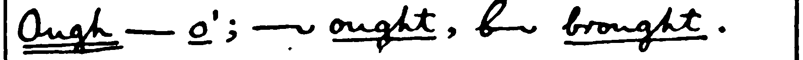

# Orthic Consolidated – Reference DRAFT

## Being an Improved and Expanded Consolidation of Various Books with Clarifications, Additions, Warnings and Opinions of the Author and Others who Might Comment


By CricketB, Reddit u/CrBr

xxx copyright, license
xxx canonical copy, revs
xxx

# remember they have already read the Manual !!!

# Introduction to Orthic Consolidated 

Orthic shorthand is a good first shorthand for most students. It is quick to learn at the Fully Written Level, and multiple levels can be used in a single sentence without confusion. Based on stroke counts, its speed potential is comparable to other office and personal use shorthands. The Abbreviated and Reporting levels are even faster.

In keeping with tradition, I'll begin with deficiencies of previous books: 
* The rules are spread out over too many publications.
* The rules in the different books are sometimes inconsistent.

Callendar wrote the Manual in 1891, then, instead of updating it, he published the Supplement in 1982. This booklet moved some rules from advanced to intermediate, and even changed a few. Stevens wrote The Teaching of Orthic Shorthand in 1896, and, again, instead of writing a complete book, he told the readers to refer to the previous two publications. He also moved rules between levels, added some, and, I suspect, changed a few. Finally, in 1911, Clarey wrote Orthic Shorthand: Revised, Extended and Improved. That book brought together all the rules, changed a few, and removed the distinct levels.

This book combines all the rules from all the earlier books, except some that are only in the Reporting Style. It is *not* intended as an introduction to Orthic. The Manual or Revised is best for that. (I recommend the Manual, and anything Revised does differently just feels wrong to anyone who started with the Manual.)

Hopefully it creates more clarity than confusion.

It is organized into the following parts: 

* Sources.
* Alphabet. Not really necessary by the time you're here.
* Notation.
* General Rules and Abbreviating Principles.
* Non-Alphabet Rules. Rules that don't apply to a specific letter.
* Joining Characters
  * Vowels Sounded Individually and Diphthongs
  * Consonants and Vowels
* Word Parts
* Lists of Abbreviated Words


xxx means note to self

xxx "no examples" means in the dictionary, which is just the Manual and Supplement.

xxx did not do supplement: slurring and onward -- looks like Teaching does it better, with examples. Fingers crossed.


## Sources

**Phonetic Cursive**\
A Manual of Phonetic Cursive Shorthand\
Hugh L Callendar, 1889.\
<https://archive.org/details/manualofcursives00calliala/manualofcursives00calliala>\
This is the precursor to Orthographic Cursive, and is included for historical reasons only. The introduction discusses "other, inferior systems" and is a fun read.

**The Manual**\
A Manual of Orthographic Shorthand: The Cambridge System,\
Hugh L Callendar, 1891\. 
<https://orthic.shorthand.fun/manual>\
Rendered into Markdown and annotated by Jeremy W Sherman.

**The Supplement**\
Supplement to the Manual of Orthic Shorthand (Orthographic Cursive)\
Hugh L Callendar, 1892.\
<https://orthic.shorthand.fun/supplement>\
Rendered into Markdown and annotated by Jeremy W Sherman.

**Teaching (Parts 1 and 2)**\
The Teaching of Orthic Shorthand: A series of lessons for the use of teachers and students of Orthographic shorthand (Callendar's system)\
W Stevens, 1896\
<https://orthic.shorthand.fun/teaching-pt1> , <https://orthic.shorthand.fun/teaching-pt2>

**Revised, Extended and Improved**\
Orthographic Cursive Shorthand (Orthic) ; The Cambridge System ; Revised, Extended and Improved\
Hugh L Callendar ; E Clarey, 1911\
<https://orthic.shorthand.fun/> under Resources\
Some of Clarey's explanations and examples are good. Some of his additions and changes are not. His penmanship style is very different, and worth experimenting with.

**Dictionary**\
<https://orthic.shorthand.fun/dictionary>\
Clipped, assembled and programmed by Jeremy W. Sherman\
Includes a notation that will encode Orthic text into ASCII. Contains all the example words from the Manual and the Supplement, and several examples from writing specimens in the Manual. 

*If not stated, the rule comes from The Manual.* The wording of each rule is a combination of the original sources and my own understanding. I have made very little effort to clarify who said what, but much effort to show where the concept was introduced. Note that, since it's difficult not to pick up the original accent, you cannot rely on that to separate my words from any other author's.

**Jeremy W Sherman**\
Orthic expert, creator of <www.orthic.shorthand.fun>, transcriber of the Manual and Supplement, programmer and clipper of the dictionary. Jeremy found many examples and counter-examples for Consolidated, and provided valuable comments on the text.


## Styles or Levels

The order is:
- Fully Written
- Ordinary, Abbreviated aka Correspondence aka Supplement
- Reporting

The books all agree what is in Fully Written, but don't agree on the rest. In general, newer books move rules down, as they are proven safe, useful, and easy to learn.

My intent was to show clearly when a rule applies to a style other than Fully Written. Then I forgot to keep notes. I tried to get them all, but no promises.

## Discrepancies

Often a writer will explain a rule, then break it on the next page. I think that happens for a few reasons:'
- They first learned Pitman, so spelling phonetically is automatic, even when they try to write FW.

- They are so used to writing advanced levels that they forget the less obvious differences between that and FW.

- It's often difficult to explain a rule, so they over-simplify without realizing it (or they intend to follow the rule as written but forget).

- They are used to writing for expert readers who can fill in the blanks easily, and don't need perfect penmanship.

Don't worry about it. The only true test of shorthand quality is whether the intended reader can read it at the intended time, for the intended purpose. (I strongly suggest you define that each time you pick up the pen.)

## Notation

Use the joining rules for Fully Written unless otherwise specified.

Letters in brackets are compound letters or slurs.

* ^ indicates the following letters are raised.
* . indicates a small gap to indicate omitted letters, as in Mode 2.
* _ indicates the following letters are lowered.
* \* indicates a dot on the line (or a tiny bit above). Always preceded and followed by a gap.
* : indicates a sharp join between vowels. Otherwise all vowels have rounded joins.
* I indicates dotted i. E is used if the dot is optional.
* Dot for doubled letters is not included.
* () indicates a compound letter.
* vowels are listed in order written.

Where there is more than one way to write a letter or compound, I added numbers. Often the number chosen reflects the shape of the compound, as a mnemonic, but this was not always possible. Eg **ing** : (ing1) = straight, (ing2) = curved, chosen because 1 is straight and 2 is curved. (Cricket)

# The Alphabet

Manual: ab, act, bad, cabby, adder, fed, left, get, hit, city, jug, luck, like, melt, know, proof, plate, query, roller, sort, trust, upper, wavy, wow, exit, eyes, size

# General Rules for Fully Written Style

### Doubling a Letter


Manual: odd, too, ee, sleep, sup

### Two Sizes of Letters
Most books say use 1:3, but then use less in the Two Sizes image, and somewhere between 1:2 and 1:3 in actual writing. It's rarely a problem except for debates between students.


Manual: st, ste, en, ens, inst, nt, er, ers, abs, against, epitaph

> The actual **size** of the characters may be varied according to circumstances, such as the goodness of the light and the writing materials. The minuteness of any kind of writing is limited by the size of the smallest characters. In Orthic the small size may be made as small as desired, and the small circle may be reduced to a dot. But it is best to make the small characters about one-twelfth of an inch \[2.1mm\] long, and the large ones twice as big." (Revised, p3, General Rules)

### Position on the Line
The rules for this are a mess.

Just do what looks right to you. If you read something that doesn't make sense, remember some writers will write higher or lower than you do.

**Details:** In the Manual, Callendar claims the first letter sits on the line, then on the same page (Two Sizes of Character) starts *epitaph* above the line, with P sitting on the line. In St John II, *it* and *in* start on the line and go upwards. T is a downstroke, so the rule isn't first downstroke. Stevens has his own version. On the first page of the Preface to the New Testament <https://orthic.shorthand.fun/reading> *it* starts below the line and T sits on the line. Revised says, "The first letter of a word generally begins or ends on the line, but A, E and O may be raised when preceeding downstrokes." (Revised, General Rules, p3)

Omitted letters are often indicated by relative position (mode), in levels above Fully Written.


### Connecting Stroke

xxx A short connecting tick maybe used after ER, TH, etc, and when they are followed by G, P and S. (Revised, p3, General Rules) Note: This rule is only in Revised. Clarey may need this more than the other writers due to his different style of writing.

 
> dirge, faiths, serpents : Revised

### Dividing Words


Manual: lawsuit, Woolwich, virgin

You can divide a word to keep it on the line. Beware that this might be confused with writing by mode.

### Punctuation

Manual: hyphen, dash

So they are not confused with raised A (and) and raised O (though).


Does this also apply to brackets, so they aren't confused with G and K?

### Initial Capitals 

Indicated in a few ways.

Manual: Jack, Clay, S.E., L.S.W.R. (London and South West Rail Company)

See S to distinguish intial S from initial P.


# Vowels Sounded Individually and Diphthongs

Some concepts are under the prominent letter, instead of the first in the group.


## Vowels Sounded Individually

Check both orders of vowels to see all example words.


Manual: re-enter, Oölite, Deä, create, Leo, fiasco, serious, fuel, poem

Note: Callendar breaks this rule a few pages later, in the Manual, Specimen of Fully Written Style, "abbreviation."

Manual: abbreviation

He changes the order of AI and rounds the corner even though the vowels are sounded separately.

## Vowels Sounded Together, Diphthongs

Orthic uses an older definition of the word *diphthong*.


Manual: ai, oy, ou, eau


## A


Manual: ai, au, ay, days, quay, says, hay

The pattern seems to be use the downward form after an upstroke. (Cricket)

xxx Teaching1 suggests only using AI-under for AI, thus spelling it according to the common orthography. This rule is not in the Manual. The Dictionary (Manual and Supplement only) does not have any examples to the contrary. Optician uses the AI form. Social uses the IA form.. -- 

Jeremy confirms rule is followed true -- if plaintext is ai, then orthic is ai, even if dot not needed.
ia can be written either way

saith, said, remains -- manual: fw and macaulay

I think it's an unnecessary rule, but, since I might be wrong, I'll think carefully each time I ignore it. (Cricket)


## E


Manual: ee, ei, ie, steep, stupid, eu, ew, new


Manual: seen, sun


Manual: ea, seat, seas, reat, real, pearl, years

## I


Manual: social, optician, chief

## O

Manual: oar, or, oak, oi, toil, ou, out, oy, boys

## U

Manual: ua, guard, suit

## Y

No examples.

# Joining Consonants

Some concepts are under a letter other than the first, if the other letter is sounded more strongly, or it makes for a more sensible explanation.

## A

All examples from the Manual are under Joining Vowels with Vowels.

A on the line is *a*. A raised is *and*.


## B


Manual: bd, rob'd, bj, object, bl, able, br, bray, bs, absurd, bt, subtract, bv, subvent

BE-: See Word Parts.

xxx BL can be shown by reversing the direction of the B loop, and optionally writing the L inside the B. (Revised, pg 4, Compound Characters)

xxx Revised: BL, BL, black, sensible, bleak, trebly

## C


Manual: ck, suckle, cl, close, cr, crutch, ct

CH is a circle the same size as H. H, CH and WH are described under H. Also see Word Parts for NCH and SCH.


xxx sup, transact - ct blend


## D


Manual: dge, judge, dj, dle, fiddle, dr, dread, dv, dw, dwell

DEN series. In DN the letters form a wave. The end of one letter and the beginning of the next share a line. In DEN, the combination begins and ends on the same line. In DEEN, there is actually a line This is what most beginning writers think DEN should look like. I cannot find anywhere this is stated clearly, but it is consistent across all 4 books. (Cricket)


Manual: student


xxx

DD, DT and TD can be written as a double-wide D. Supplement.


* Revised: advert, avert

## E

All examples from the Manual are under Joining Vowels with Vowels.

## F


Manual: if, ft, soft, fd, puff'd, fl, fr, rifle, afraid, fs, skiffs

F is joined without an angle after vowels.

xxx S joined to the finish of F or K is better turned up rather than down. (Teaching1)


xxx ks-correct, ks-not-recommended (Teaching1)

## G


Manual: gh, high, gl, glory, gr, agree, gn, sign

## H, CH, and WH

Manual (H): cha, hat, chat, what, which


H, CH, and WH are all large circles, and described here for easy comparison. All books agree that H is above the line and is written ccw, unless following S or P. Most agree that CH is cw and below the line.

Most of the time, it is safe, and faster, to omit the H in WH. There are, however, times when you need to record the exact spelling. I prefer to start WH at the bottom, to make an enlarged W, or to start it at the right, instead of at the top.

Manual (CH): ch, chair, Christ, ache, ahead


Manual (W): who, ha (have)


xxx

get images from all writers -- some interesting variations

xx manual, sup, rev : school


## H, Other Joins

HR

ther, others, ard, toward\
R goes inside H.

THR, THER: T can be omitted.

See P for PH, PHTH and PTH. Sometimes the H turns in the opposite direction.

See SH and TH for those joins. Sometimes H is smaller or not completed.

**Supplement**

No notes on H, CH or WH. From the Specimen of the Ordinary Style, Abbreviated:

* Each, much, changes, which, change, such, characters, detached, teachers, school-masters\
* Why, who, when, which, somewhat, whatever, what, wholesale, 

NCH and SCH can be written without an angle or break – ie in the other direction, still below the line. (Supplement) 

* inch, such, school, much (Supplement)

TCH. The T may be omitted. (Supplement and Revised) (No examples.)

**Teaching**

H has its diminutive analogue in R, both lie at the top of a following line; CH and L are similar, and lie at the bottom of a line. WH is made like CH but not joined at the top. It may also be remembered thus, enlarge the W to look like H

* H, R, CH, L, who

**Revised**

CH is written three ways to facilitate joining. The first is used in compounds CHR and RCH. Some of these are above the line. (Revised, p4, Compound Characters)

(Astute readers will see significant differences in some words between Revised and the other sources.) 

* CH-1, CH-2, CH-3, Christ, arch, filch, chat, such, scholar, scheme, when (Revised)

CHL may be written in two ways. (Revised, p4, Compound Characters)

* CHL-1, CHL-2, chloric, richly, speechless (Revised)

In adding inflections to CH they may be joined either above or below. (Revised, p7, How to Write and Join the Characters)

* Aches, pitch'd, filches, pilchard (Revised)

WH

* Whose, when, chose, chin (Revised, p5, Compound Characters)

## I

All examples from the Manual are under Joining Vowels with Vowels.

xxx I is often started below the line in short words such as IN. This is not in any rules, but is demonstrated on the first page of the Preface to The New Testament (Stevens)

IC vs INC: This is often tricky, but fortunately the word is usually clear from context. If you need to make it clear, then do the following: (Cricket)

IC: Make sure you do not go down as I changes to C. The first part of the C retraces part of the I.

INC: Make sure that you do a full N. The first part of the C does not retrace any part of the N.

ING: See Word Parts.


## J

Manual has no images.

## K

Manual has no images.


xxx

KS: S joined to the finish of F or K is better turned up rather than down. (Teaching1)

* Taken (Manual)\
* Looks, works, walks, like, beak, duke (Revised)


## L


Manual: black, bread, clay, crow, addle, dry, flow, fro, glad, grade, play, pray, little, litre, slay, Israel, held, herd, world, already,\
lf, half, lk, walk, lp, help, lt, wilt, lv, salve

When standing by itself as an initial, L or R is prefixed by a short stroke showing its direction. In other cases the distinction is obvious.

The circle is so small that it can fit nicely inside T, for RT and TR. (Cricket)

Other shorthand systems (notably Gregg) base direction on the surrounding strokes. This can get confusing when switching systems. Each Orthic book has a mnemonic or two to help.

Sometimes the pen continues around the circle, retracing part of it, to reach the next letter. Sometimes it changes direction before the circle finishes. I have found no rules about this, other than SH/SHR, but several examples. (Cricket)

Examples:\
Manual: proof (Alphabet), present (P)
xxx Revised: waltz, zebra (Alphabet)

## M


Manual: mp, imply, mb, limb, ms


See DEN for D, T, N, M blends.
xxx


MB can be written as a tall M. (Supplement, Revised p7 Other Slurs)

MBS, when preceded by E, I or U, the S turns up (as after F and K). (Revised, p7, Slurs

MM, MN can be written as one double-wide M. (Teaching)\
Note that omitting A and O before M and N means that MN can mean man or mon.
 
* Supplement: member, number, many, woman, human, money\
* Revised: MB, timber, lumber, lamb, temper, lumper, lamp – fix the order\
  Kembs, climbs, numbs

## N


ng, singer, nsp, inspect, nc, since, nch, inches, nd, India, nf, infer, nj, injury, nl, unless, ns, sense, nt, sent, nk, sink, nqu, inquest, nv, invent

NG, NSP: No angle need be made in the compounds NG and NSP. (N followed by downstroke).

See DEN for D, T, N, M blends.


xxx
NCH and SCH may be written without an angle or break. (Supplement)\
(They are written in the opposite direction.)


NK has no angle (Revised)


* Revised: inspirit, inspect, ensphere, conspire, wink, rank, sink, tinker, ginger, hang, sting, singer\
  (Note that Revised uses a large H in SH.) inherit, inhale, enrich, enroll, inward, enwrap  


## O

All examples from the Manual are under Joining Vowels with Vowels.


xxx

OYS: Turn the S up, as for FS and KS (Revised)

Revised: cloys, employs, coat, cot


## P


Manual: sp, sphere, ps, cusps, ph, phrase, phlegm, pl, place, pr, present, pd, depth, phth

PS, SP, SPS: S is more shallow and the angle is rounded.

PH: H might be on either side depending on following letter.

PHL, PHR: small circle goes inside the H.

PR: Exit off the top.


xxx
PW uses angle-W (Revised)

* Manual: PH-1, PH-2, phrase, phlegm, spear, cusps, place, present, depth, PHTH
* Revised: PHL, PHR, PHTH, PW, speak, trips, cusps


The first (ccw, H to the right) is used in the compound PHR, before E U, and final. The second (cw, H to the left) is used in other cases. (Revised)
 
* Phar, phy (Teaching)
* PH-1, Phrase, philter, sulphur, epitaph, PH-2, phase, phlegm, physic (Revised)


## Q


Manual: esquire

All four books state that Q is always followed by U, and thus U can be omitted. This is outdated.

I suggest using the Q shape for QU, as originally instructed. In the rare case where U should not be included, indicate this by a dash across the loop. This does not need to be done for initials, where only one letter is written. In the even rarer case where both letters are written in an initial, I recommend you revert to longhand for the first occurence. (Cricket)

## R


Manual: fierce, rd, rt, rf, rk, work, rn, learn, rp, rs, rv

See L for details and contrasting examples.

RCE is written like lower-case E, according to the Manual. As near as I can tell, Callendar makes a slight angle at just before the R, so your pen goes to the right and the R is closer to being a circle. If you're happy making R a loop instead of a circle, this complexity can be avoided. (Cricket)


## S


Manual: shed, Tisri, shred, school, sc, scent, sk, sl, slew, sm, sn, sp, sphere, squ, square, st, still, sw, answer


Manual: S.E.

S is vertical when written alone, to differentiate from E.

SCH: Contrast Manual vs Revised.
xxx

SH: H is smaller. Exit off the top to distinguish from SP.

SHR: R is inside H.

SP: Exit off the bottom to distinguish from SH.

SW: See W.


xxx someone, who?? described it as touch and reverse, spin around and continue


xxx


S: Nch, sch

These combinations may be written without an angle or break. (See *inch* ![][image70], *such* ![][image71], *school* ![][image72], in the list.)


R: in AYS and OYS (in that order, not YAS or YOA) S goes up to the left.

T: **S after F or K**

*S* joined to the finish of *F* or *K* is better, (as the hand is traveling in a curve), turned *up* rather than down; thus ![][image73] *ks* is better than ![][image74].

R : S after AY, OY

T: **S before and after P**

*S* before and after *P* should be rounded. ![][image1] *sp*, ![][image2] *ps*, ![][image3] *sps*.

The angular form is used after *S*, thus ![][image75] *sw*, formed of ![][image76] *s* and ![][image77] *w*.

..
```
The only other cases of sub-linear writing up to this point are the words ‘take' and ‘sake' and their inflections, which are written ![\`t\_\*\`, \`t\_Y\`, \`s\_\*\`][image78], etc. The *k* throwing *below* the line, but in no other case is the *k* so treated.

```


## T


with, both, tch, sketch, tle, turtle, tr, truth, tw, two

TH-final: Don't close the H.

In the Supplement Examples of Abbreviations (below), "month" the H is almost completely closed, but not very circular.

xxx

R goes inside H.

TH-, THER: See Word Parts.

THER: H with R inside. Omit the T. (Same as HR.)

Initial TH is omitted in all common words. The omission is shown by writing the rest of the word above the line, Mode 1. 

xxx


xxxxx


Slurs mm/mn, dd, dt, and td

Again, *mm* or *mn* often come together when by the rule the vowel is left out, as in the word *man*, ![][image109], now one large curve will embrace both ![][image110].

Similarly *dd*, *dt*, or *td* may be represented by a large ![][image111].

T slur rule for count, country, duty

We have seen that as ![][image112] \= *count*, therefore ![][image113] \= *county*, we therefore extract a rule *t* may be slurred in such words as *duty*, *bounty*, etc.

## U

All examples from the Manual are under Joining Vowels with Vowels.

see E, Joining Vowels, for E vs U

## V


Manual: minster (not minister), Minver, stew, view

V is distinguished from ste by its size.

## W 


Manual: way, woe, wet, write


Manual: sews, cows, laws, wk, hawk, wl, owls, wn, dawn

W goes upwards. C and F go downwards.

Use left-W at the beginning of a word, except before R. It can start at the 3:00 position, to form 3/4 of a circle, for ease of writing.

Use right-W at the end of most words. (Again, there is an exception.)

Change the exit angle of W to blend with the following letter.

WR: Distinguished from TH by its size.
WH: See H.
WS final: The addition of S forms a loop.
WK, WL, WN: Notice how the letters blend.


xxx


Another way to remember *W* is to point out that whether initial or final, *it is an upward tick*, as ![][image157] *wo*, ![][image158] *ow*. The letter may be written either circularly or angularly as ![][image159] or ![][image160] *owing*, ![][image161] or ![][image162].

The angular form is used after *S*, thus ![][image163] *sw*, formed of ![][image164] *s* and ![][image165] *w*. To add *S* to final *W*, elongate the loop, thus ![][image166] *cow*, ![][image167] *cows*.

## X


Manual: xh, xp, xt, extent, exhort, expense

There is no need to make an angle in the combinations *Exh*, *Exch*. (Manual)


*X* is made up, as in longhand, of *C* and *S*. You can often omit the S, or merge the S with the following letter. (Cricket)

## Y

Manual: yacht, yet, yore yule


Manual: applied, tries, easiest, happiest, ```aplyd, trys, easyst, hapyr```

Let Y stand unaltered. In adding inflections to words ending in y, the y is not changed to i or ie.

## Z

Manual: daze, Fitz, puzzle


# General Methods of Abbreviation, including Ordinary Style

## Omit A and O before M and N

Manual: can, con, alone, woman, ```cn, alne, wmn```


Manual: band, bond

An omission of this kind can always be corrected by writing the omitted character above.

## General Method of Abbreviation

The general method of abbreviating long words is to write only the first syllable, and, if necessary, to indicate the termination by writing the last letter or two, separated by a small interval from the first part.


Manual: different, difference, acknowledge, especially, circumstance, extraordinary, representative


## Modes or Positions

xxx is it clear whether the mode is relative to the previous letter, or to lifting the pen from it? Some egs in supplement imply the latter. (Grumble. Absolute positioning would be easier to describe.)

xxx judge, forgive - the g is above the line, need to analyze previous letters to see if they make it clear.

Each letter that can be replaced by a mode is listed under Joining Consonants. Their use for shortening words beyond simple letter replacement is under Word Parts. 

Note that modes are relative to the preceding character. See "thoughtfulness" in Word Parts.

* First Position, Raised: B, P, TH, V (Supplement calls this Supra-Linear Writing)
  * B is only raised for the syllable B at the start of words.
  * TH is only raised at the start of words.
* Second Position, Normal (gap): all others
* Third Position: Lowered: G, J, K, L, QU

The books claim this can be easily remembered by imagining where the rest of the word would be if the letter was not omitted. This is not actually true. (Cricket)

Note that the raised letters are in the front of the mouth. The lowered ones are in the back, except for L. (Cricket)

Why did they choose L and not R for this rule? (Cricket)

If the last part of the word is normally indicated by mode, use a dot.


Supplement: advantage, arrange, arrive, conserve, judge, knowledge, language, large, mortgage, super

xxx fix "alt text" everywhere -- but does this audience really need it?


## Word Parts (Prefixes, Suffixes, Slurs, Blends, Compound Characters, etc.)

Prefixes, suffixes, and common letter groups. Description is under the strongest sounding letter.

See Notation above.

### ACQU ```aq```
\
Supplement: acqu


### ADJ ```aj```
\
Supplement: aj

### ADV, ```(dv)```
Slurred into one large character compounded of d and v.
xxx get from Manual if not in Teaching
\
Supplement: advantage


### -AGE
See -GE.

### BE-, ```^```

Be: This prefix is peculiar to a special class of English words, and may also be expressed by writing above the line. Note that been and being are chosen to not conflict with than and thing. (Supplement, Teaching1)


\
Supplement: be, being, been.


xxx
xxx 

xxx warning about using too often, teaching?

xxx Teaching1: behold, been better, best, by

### CH compounds: NCH, SCH**
These combinations may be written without an angle or break.


\
Supplement: inch, such, suchas, school, much

Manual: school

Compare *school* in the Supplement and FW in the Manual.

xxx and in revised

I don't see why it has to turn ccw in the first place. It doesn't change the look in most cases. Perhaps it's a mnemonic (C), or a way to keep it a circle instead of a loop, or to ensure the preceeding letter doesn't curve. (Cricket)

The Supplement says *much* is an abbreviation. I say it's evidence you can turn CH in either direction. (Cricket)

xxx revised uses big h for sh ; how does that affect school ?


### CIRCUM ```cir.```
Written ```cir``` followed by a short break to represent *cum*. ```circe``` is the the regular longhand abbreviation for the word *circumstance*. (Supplement)

\
Supplement: cir, circumstance

### COM-, CON- ```*```


COM, CON: Expressed by a dot on the line written close in front of the word. In taking notes, the dot may generally be omitted or expressed by Mode (2). In correspondence it should be retained. (Supplement)

In compound prefixes, such as incom-, discom-, etc., the com- or con- is expressed by Mode (2). (Supplement)


Supplement: com-, con-, come, came, command, comment, common, compound, comprehend, concerning, conserve, consider

xxx maybe get a full-width image, they'll be all together.


### -D
See ED.

### -DGE
See GE

### DV ```(dv)```
DV is slurred into one large compound character, deep and double-width. (Supplement)\

Supplement: advantage


### -ED ```d```

Manual: used, kissed, stirred, ```usd, kissd, stirrd```\

### -ENCE ```.ce```
Supplement. No examples.

### -ENCY ```.cy```
Supplement. No examples.


### -ENT ```.t```


\
Supplement: agent, apparent, comment\

### EV-, EVE- ```^```


\
Supplement: every, evening, event, evident, evil


Supplement: even, written e'en to distinguisn from than or then.

### EX-
See X.


### -FUL ```fl```

Manual: useful, beautifully, ```usefl, beautifly```

### -GE, -DGE, -AGE
These and derived terminations are similarly expressed by a dot below and to the right to indicate the g.
\
\
Supplement: knowledge, agent

### -GN
Indicated by n written below to indicate the g\

\
Supplement: foreign, sign

### -GRAM
Indicated by M written below to indicate the g, similar to -gn. (Supplement)


### -GRAPH ```ph```
Supplement. No examples.


### -HOOD ```hd```

Manual: manhood, ```man.hd```

xxx is it detactched here because of rule, or ease of writing?

### -IGHT ```_t```

Manual: night, light, ```n_t, le_t```


### -ING ```(ing1), (ing2)```


Manual: using, saying, seeming, king, sing, singing.\
```us(ing1), say(ing2), seem(ing2), king, sing, sing(ing2)```

This form is used only for the inflection "ing" and not in other words. It is better to curve the stroke after D,M,N,T,V and vowels. (Manual)

I vote we use it in sing and king. It's already used in thing and bring. (Cricket)

### -ION ```un``` 

Manual: action, ```actn``` \
Dotted if necessary.

### -ISM ```.m```
Supplement. No examples.

### -ITY ```^y```

Manual: abilities, peculiarity, ```ab^ys, pec^y``` \
Note "abilities" -- y stands unaltered.

### -IVE
See -ve.

### -LESS ```ls```

Manual: thankless, fearlessness, ```^ankls, fear.lsns```

### -LY ```_y```

Manual: nearly, easily, dailies, ```near_y, easy_y, day_ys```
Note vowels in order for smoothest writing, y stands unaltered twice in dailies.
Note: The y seems to be under the word, not just below it.

xxx do we need even more notation for Y under a word?

### MANGA, MAGNI ```m_```

Written m, the rest of the word being placed below to indicate the g. (Supplement)\
\
Supplement: magnify

### MB ```(mb)```
May be written with a single character somewhat like mp , but beginning and ending on the line. (Supplement)

\
Supplement: mb, mp

### MIS- ```ms```
Written ms, omitting the i. 
\
Supplement: mis, mistake


### NCH
See CH, Word Parts


### -NESS ```.es```

Manual: happiness, thoughtfulness, ```hapyns, ^otfl.ns``` -- ***Deprecated***

This termination should be written ‑ess detached, by the general rule, and not ns as given in the Manual. [E.g.  goodness.] Detached n and ns can then be used, as in longhand, for the expression of the common terminations ‑ation and ‑ations.


Supplement: goodness


Deprecated in 
xxx suplement ?? used for ??nations??

Note in thoughtfulness that ns is not marked as raised. It is in position 2, and positions are relative.

### -NG  
See ING.

### -OUGH ```o```
\
Manual: ought, brought

### PER-, PRO-, PRE- ```^```


Supplement: person, present, promise, comprehend, super, supra, private

Pre- and pro- are distinguished from per, if necessary, by retaining the vowels e and o. The cases, however, in which it is necessary to make the distinction are very rare. (Supplement)

If working in a field you are not familiar with, it's probably best to keep the vowel. The cases are not rare! (Cricket)

When any of these prefixes occur in the middle of a word after another prefix, as in the words unbelief, compromise, etc., they are expressed by Mode (1) (raised), that is to say by writing the terminal portion of the word close above and to the right of the initial prefix. [E.g. comprehend.] In the prefixes super, supra, hyper, the per is similarly expressed. (Supplement) (unbelief, compromise, hyper do not have written examples.)

The allied prefix pri may be expressed in the same way as pre in some common words. [E.g., private.] (Supplement)

### PARI-, PERI ```^```


Supplement: perceives, person

These Greek prefixes may also be expressed by supra-linear writing for the same reason. Peri is distinguished by retaining the i; it may be regarded as a special case of per. (Supplement)

### SCH
See CH, Word Parts

### -SHIP ```.p```

Supplement: worship\
Not detatched? Worship might be special, given the typical practice material of the era. (Cricket)

### TCH ```ch```
The t may always be omitted in this combination. (Supplement)\
No examples found.


### TH- ```^```

the, they, this, them, tho', that

Use this *only when initial*, except in the case of the word *although*

### -THER ```(ther)```

\
ther, others, ard, toward
xxx


### -TION
See ION.


### TRANS-

Written trs, as in longhand. [E.g. transact.]\
\
Supplement: transact

### -VE, -IVE ```^*```

A dot above and to the right of the word to indicate the V. When the word is inflected the last letter of the inflection is substituted for the dot.


Supplement: arrive, gives, given, selves


### X

EX: As there is no English word beginning with *X* that is not preceded by *E*, this character may be used to represent *Ex*. (Manual)

\
Manual: xh, xp, xt, extent, exhort, expense

### -wise ```.se```
\
Supplement: otherwise


# Phrases
\
Manual: able to do; as it is; I am not; I have had; I shall be very; to be; ought to have been; with a view to.

Note: Time is saved by writing without hesitation, not writing fewer lines at the expense of more thought. Do not go over board with phrasing. "With a view to" is not worth phrasing for modern material. (Cricket)


# Word Lists

In order of appearance. Use your browser's Find in Page function as needed. Words that abbreviated according to the above rules are not included, mostly.

Using the same notation as above.

## Manual


Manual: and, ```a```


Manual: the, they, this, them, tho', that\
```^e, ^ey, ^is, ^em, ^o, at```


ther, others, ard, towards


Manual: about, always, am, amount, an, any, are, were, be, been, because, between, but, can, can be, child, could, do, does, down, ever, for, from, friend, good, great, have, hold, made, might, more, most, not, can't (cannot), nothing, of, of the, on, only, one, once, perhaps, right, round, self, selves, shall, she, should, themselves, therefore, thing, throughougt, thro'out, to, into, under, week, would, which, with, you, yours
```
ABT, ALS, M, IM, AMT, AY, AR, WER, B, BN, BC, BETW, BT, CA, CAB, CHD, CD, 
D, DS, DN, ^R, F, FM, FD, GD, GRT, HA, HD, MDE, MT, MO, MST, 
NT, CNT, N(ING2), O, OE, N, N(LY), NE, NCE, PH (?? PRH), RT, ROU, 
SEF, SVS, SHA, SH, SHD, ^EMSVES, ^ERF, ^(ING2), ^ROUT, T, INT, U, 
WK, WD, WH, TH, Y, YRS 
```

Lots of other words burried in the various specimens. Most of the specimens are typed out on https://orthic.shorthand.fun/ . A few link to other sources for the text.

## Supplement

### General Methods of Abbreviation, text-only:

The following words were in the middle of a paragraph, in General Methods of Abbreviation. All the shorthand in the Supplement is on three pages, included just a bit below here. 

read, round, count, right, most, must, part, point, could, had, head, hood, would, world, most, must, might, ment
```
red, rou, cou, rt, mst, mst, pt, pnt, cd, hd, hd, hd, wd, wd, mst, mst, mt, mt
```

### Examples of Abbreviations

Supplement:\
able, ably, above, according, acqu, adj, advantage, after, afternoon, afraid, ages, agent, also, already, announce, appropriate, apparent, arrange, arrive, -ation, -ational, baptist, be, being\
```
not proof
ab, aby, abv, ac(ing1), aq, aj, a(dv), af, afnn, afd, a_s, a_t, aso, alry, a.pte, ap.t, ar_*, ar^*, n, nr, bpt, ^b, ^(ing1)
```

been, before, believed, better, best, bishop, body, both, by, thy, caught, changes, church, circum, circumstance, com-, con-, come, came, command, comment, common, compound\
```
^n, ^f, ^lee.d, ^ter, ^st, bp, bdy, bth, ^y, ^y, caut, ch_s, chr???, cer., cerce?? certe??, *, *, cm, cme, *nd, *n, cpou
```
xxx Callendar explains churc as ```ch-ch```

xxx circumstance, not sure.

comprehend, concerning, conserve, consideration, counter, country, course, court, Dear, different, difference, difficult, each, editor, else, endeavour, even (e'en), evening, event, every
```
*^hend, *c(ing1), *s^*, *sed, *sed.n, cour, coury, crs, crt, dr, def, def, deft, ea, edor, ls, _end^r, een, ^n(ing2), ^nt, ^ry
```


Supplement:\
evident, evil, executor, except, exercise, extraordinary, favour, -fection, -fication, foreign, forgive, forth, forward, found, from, -ge, -gn, -gram,\
half, hand, head, help, him, his, important, inch, individual, interest, -ism, -ive, judge, just, justice, king, kingdom, know, known, knowledge, lady, language, large, largest, letter,\
little, lord, make, makes, magnify, mb, mp, member, mis-, mistake, much, much more, month, must, morning, mortgage, nation, nearest, necessary, neighbour, -ness, goodness, nevertheless, next


xxx examples of nch, mch,

xxx month has fuller H


Supplement:\
notwithstanding, number, obedient, opportunity, over, page, pages, paper, part, party, particular, peculiar, people, perceives, person, philo-, philosophy, plaintif, print, practice, preconceived, present,\
private, promise, property, public, publish, quite, religion, report, respectively, satisfy, satisfactory, Saviour, scarecely, school, scribe, selves, serves, servant, several, sir, sirs, -ship, worship, short, shorthand, sign, signify,\
solicitor, some, sometimes, source, special, spirit, state, strong, strength, such, suchas, super, supra, superior, take, taken, transact, trustee, very, verify, -wise, otherwise, wisdom, word, work, world, young


# PREVIOUS METHOD


T: **\-ation**

is a common ending, and it is wise to shorten it as much as possible, therefore use detached *n* ![][image197] to represent this termination, as ![][image198].

T: Sub linear writing is writing *below* the line. We have already had an example of this, with the reason, in ![][image199] \= *ight*. From this we can easily draw another rule \- in the combination *dge*, *age*, *gn*, or *gram* it is clear that equally as in the case of "ight", the *g*, as part of the termination or syllable, throws the rest of the word *below* the line, e.g. ![][image200] \= *for gn* \= *foreign*, ![][image201] *age*, ![][image202] *magnify*, etc.


T: **Be**

As there is a very close relation between *V* and *B*, and as words with the prefix "be" belong to a special English class, we may without fear use *Mode 1* to indicate the *prefix* "Be". This abbreviation is only to be used when "be" is a distinct prefix, as ![][image206] \= *behold*; it would be incorrect to write ![][image207] for *bead*, this would be *Be-ad*, not *bead*. By the same reasoning as the *dot* indicating *vowel-v-vowel* so the verb "be" may be shown by a dot; thus ![][image208]; the only liberty taken in using this prefix "be" is in the common words *been*, *better*, *best*, and *by* which are written ![][image209], respectively.

![][image210] \= *bring*, compare crooked *ing* ![][image211] for *thing*.

## C {#c-1}


T: 

The common primitive *con* or *com* may be expressed by a *dot* *on* the line, or by leaving it out altogether, and writing the rest of the word quite close to the preceeding word, as ![][image216], ![][image217], or ![][image218] \= *I commend*.

## D {#d-1}


T: Sub linear writing is writing *below* the line. We have already had an example of this, with the reason, in ![][image199] \= *ight*. From this we can easily draw another rule \- in the combination *dge*, *age*, *gn*, or *gram* it is clear that equally as in the case of "ight", the *g*, as part of the termination or syllable, throws the rest of the word *below* the line, e.g. ![][image200] \= *for gn* \= *foreign*, ![][image201] *age*, ![][image202] *magnify*, etc.

T ![][image219] for *dv*.

Slurs mm/mn, dd, dt, and td

Again, *mm* or *mn* often come together when by the rule the vowel is left out, as in the word *man*, ![][image220], now one large curve will embrace both ![][image221].

Similarly *dd*, *dt*, or *td* may be represented by a large ![][image222].

## E {#e-2}


T: 

* *X* is made up, as in longhand, of *C* and *S*, ![][image232], and there is no English word beginning with *X* that is not preceded by *E*, this character may be used to represent *Ex*. There is no need to make an angle in the combinations *Exh*, *Exch*, as ![][image233].\
* Ever\
* Draw attention to ![][image234] \= *ever* : this appears an arbitrary; it is not; students will see the logic at the next lesson.


## G {#g-1}


T: Sub linear writing is writing *below* the line. We have already had an example of this, with the reason, in ![][image199] \= *ight*. From this we can easily draw another rule \- in the combination *dge*, *age*, *gn*, or *gram* it is clear that equally as in the case of "ight", the *g*, as part of the termination or syllable, throws the rest of the word *below* the line, e.g. ![][image200] \= *for gn* \= *foreign*, ![][image201] *age*, ![][image202] *magnify*, etc.


## I {#i-2}


T:  \-ation is a common ending, and it is wise to shorten it as much as possible, therefore use detached *n* ![][image261] to represent this termination, as ![][image262]. 


## L {#l-1}


T; **L slurred with T in wealth, health**

*L* may be slurred with the *t* in such words as *wealth*, *health*, etc., and the softly sounding vowel in terminations such as "al", *final* ![][image263], "er" in *upper* ![][image264], etc.

Source?


## NESS


T: **\-ness**

*es*, ![][image276].

## O {#o-2}


T: ou for ound or ount

Show the importance of ![][image280] *ou* standing for *ound* or *ount*. Emphasize this by such words as

ou for ound or ount

**Show the importance of ![][image281] *ou* standing for *ound* or *ount*. Emphasize this by such words as**

* **![][image282] *pound*,**\
* **![][image283] *sound*,**\
* **![][image284] *count*; hence**\
\* **![][image285] *counter*,**\
\* **![][image286] *county*,**\
\* **![][image287] *country*.**

## P {#p-1}


T: **Per pre pri pro and peri para**

As stated, supra linear writing is very useful for rapidity, and if other prefixes can be found that cannot possibly clash with the rules laid down, they may with advantage be safely indicated by this mode. Such are found in words derived from the Latin and Greek languages. We thus get the prefixes *per*, *pre*, *pri*, and *pro* from the Latin, and *peri* and *para* from the Greek; all of which may be expressed by *Mode 1*.

\+++


## V {#v-1}


T:

Eve (vowel V vowel)

It is clear that the shorthand characters *eve* ![][image305] must throw everything following the final *e* above the line, and it is also evident that such words cannot clash with that peculiarity of the English language *Th*, except in the words *even* and *then*, which has been provided for above.

Therefore apply the rule *Mode 1*, and *wherever* *vowel v vowel* come, *in any part of a word*, leave them out, and write the rest of the word *above* the line, just where it would have come had the whole word been written. E.g. ![][image306] \= ![][image307] *given*, ![][image308] *loved*. N.B. It is better to write the vowel after *l* and *r* for reasons similar to those given in Lesson 4, to show the direction in which the consonants are turned. ![][image309] \= *evident*, ![][image310] \= *conceived*, ![][image311] \= *ever*. See paragraph 2, Lesson 4\.

But how about a word ending in *ave*, *ove*, etc. only? What is Euclid's definition of the end of straight lines? A point, is it not? Shorthand *e* ![][image312] is a straight line; the end of that straight line ![][image313] is a point; therefore write the point. Thus ![][image314] *give*, ![][image315] *love*, ![][image316] *rove*.


# CONSIDER DOING

xxx

Supplement slurs and onwards not done -- hoping Teaching will have easier, better descriptions than "there's an example in Manual Reporting, all you have to do is find and clip it."

Find examples of the modes from manual
MODES. If the larger signs are omitted in abbreviating, their omission should (10) be indicated by mode, that is by bringing the outline and writing the termination close (11) to the first part of-the word.

The omission of B P or V is indicated by (12) mode I, that is by writing the termination above; thus

whichr = whichever,
gn = given.
(13) The omission of G K J or QU is shown by writing the termination below, called (14) mode III; thus

sn = sign,
st = sight,
tn = taken,
wa. = wage,
was = wages
(15) The omission of other characters and syllables may be shown by mode II, that is by (16) writing the termination on the same level; thus

dif-ce = difference,
a-plish = accomplish.
(17) Some common words and prefixes, especially b and con or com, may (18) also be expressed by modes, but this method must be applied with caution; –

(19) un-n = uncommon,
i-c. = i-c(o)nceive,
isha. = ishabe (i shall be),
chasn = (whi)ch has b(ee)n,
(20) yd = bey(on)d,
f = before,
ter = better,
nlnt = benevolent,
fry = for every.


# Notes to Self

- The first part, how to write and join, will be sorted by longhand, with a few cross-references when several letters should be combined to clarify the differences.
- If it's not obvious where the full description should be, choose the earlier one.
- Assume readers have read the Manual. This is a review. Readers can see the arrows on the images.
- Abbreviation and Vocab sections assume reader knows Joins. Jeremy's notation is enough for them to make the image on their own. (Will need to add to the notation.)

-- using my own? combined letters/slurs/joins are in brackets, not codes
- Abbreviation and Vocab can sort either way (Orthic or English).
- The two ways of spelling are Orthic and orthographic. If I find a better word for the 2nd I can search/replace easily enough.
- xxx is note to self. Searching for them will be one of the final steps before publicataion.
- xxx add notation to the alphabet?
- xxx ??? Do I need to list the source along with the word in the text, for joins? Probably not. It's in the image.
- images -- file name is topic, book, page

- where a rule is not contradicted by later books, only the oldest is quoted, unless later books have better explanations or examples.