# Orthic Consolidated – Reference DRAFT

Being an Improved and Expanded Consolidation of Various Books with Clarifications, Additions, Warnings and Opinions of the Author and Others who Might Comment
{: .subtitle}

Still very fluid.

Contact information and canonical copy of this document is at [Cricket's Shorthand Site](https://cricketbr.github.io/Crickets-Shorthand-Site/) . Comments and corrections welcome!

This document is licensed under a Creative Commons Attribution-ShareAlike 4.0 International license, <https://creativecommons.org/licenses/by-sa/4.0/> .

Based on works listed below under [Sources](#sources--references) .

For learners who have already read the Manual or Revised, up to but not necessarily including Reporting.
{: .box}

## Table of Contents (Short)
{: .no_toc}

* [Introduction to Orthic Consolidated](#introduction-to-orthic-consolidated)
* [A Note About Styles, Levels and Mixing Sources](#a-note-about-styles-levels-and-mixing-sources-styles-levels)
* [Acknowledgements](#acknowledgements)
* [Sources / References](#sources--references)
* [The Alphabet](#the-alphabet)
* [General Rules for Fully Written Style](#general-rules-for-fully-written-style)
* [Joining Vowels](#joining-vowels-sounded-individually-and-diphthongs)
* [Joining Consonants](#joining-consonants)
* [General Methods of Abbreviation, Including Ordinary Style](#general-methods-of-abbreviation-including-ordinary-style)
* [Abbreviating Principles](#abbreviating-principles)
* [Phrases](#phrases)
* [Word Lists](#word-lists)
* [Full Table of Contents](#full-table-of-contents)
* [Contact](#contact)
* [Revision History](#revision-history)

## Introduction to Orthic Consolidated 

Orthic shorthand is a good first shorthand for most students. It is quick to learn at the Fully Written Level, and multiple levels can be used in a single sentence without confusion. Based on stroke counts, its speed potential is comparable to other office and personal use shorthands. The Abbreviated and Reporting levels are even faster.

In keeping with tradition, I'll begin with deficiencies of previous books: 
* The rules are spread out over too many publications.
* The rules in the different books are sometimes inconsistent.

Callendar wrote the Manual in 1891, then, instead of updating it, he published the Supplement in 1982. This booklet moved some rules from advanced to intermediate, and even changed a few. Stevens wrote The Teaching of Orthic Shorthand in 1896, and, again, instead of writing a complete book, he told the readers to refer to the previous two publications. He also moved rules between levels, added some, and, I suspect, changed a few. Finally, in 1911, Clarey wrote Orthic Shorthand: Revised, Extended and Improved. That book brought together all the rules, changed a few, and added many rules for prefixes and terminations.

This book addresses the first deficiency, hopefully without creating too much more confusion. It does so by consolidating all the rules from all the earlier books, except some that are only in the Reporting Style. It is *not* intended as an introduction to Orthic. The Manual or Revised is best for that. (I recommend the Manual, and anything Revised does differently just feels wrong to anyone who started with the Manual.) It assumes you have read the Manual or Revised. 

[Cricket's Shorthand Course](cr-shorthand-course.md) will help with the second deficiency.

Hopefully it creates more clarity than confusion.

It is organized into the following parts: 

### A Note About Styles, Levels, and Mixing Sources {#styles-levels}

All books agree that Fully Written comes first and Reporting comes last. The middle levels are a bit fuzzy. Ordinary seems to come first. Abbreviated, Supplement and Correspondence seem to be the same. Reporting is an experimental level which varies between sources. As rules were proven safe and useful, later books moved them to the intermediate levels. This page includs only a few Reporting rules, and they are clearly marked.

*A smaller rule set, with building blocks that you use without hesitation, is faster than a larger one with rules you have to think about.*

The Manual, Supplement, and Teaching use the same rules until Reporting Style, although they disagree about which level some rules apply to. In general, newer books move rules to earlier levels, as they are proven safe, useful, and easy to learn. I've highlighted the rare cases where the rules conflict.

Where the same rule is in multiple books, sometimes I only included the oldest, except where a later book is better stated or easier to clip.

Revised mostly uses the same rules in Fully Written, but not entirely. The differences are more significant at the higher levels, conflicting with the other books often enough that I recommend caution. Many rules that Revised says are intermediate are used so rarely that I'd consider them advanced.

###  Acknowledgements

#### Jeremy W Sherman

Creator of [www.orthic.shorthand.fun](www.orthic.shorthand.fun), who found, transcribed, clipped, and re-assembled the Manual and Supplement. He also programmed and made the database for the online dictionary, including diving into several large blocks of shorthand. He also helped with Consolidated by finding examples of rules burried in the shorthand samples.

#### Jacob Moena

Transcriber, clipper, and assembler of Teaching Part 1 and 2.

### Examples and Images, File Names

Image file names are in a few formats.

`cat-t105.jpg` : The word "cat", Teaching 1, page 5.
- File name starting with `1` means concept, not letter or word.
- Only the key words or abbreviation are in the file name.
- m,s,t,r : Manual, Supplement, Teaching, Revised.
- Page number not shown for Supplement because it only has 3 pages of shorthand.

`t202-ws.jpg` : Teaching 2, page 2, "ws".
- Same as above, but different order. 

`006.jpg` : The page number. See full link for which book.

### Sources / References

**Phonetic Cursive**\
A Manual of Phonetic Cursive Shorthand\
Hugh L Callendar, 1889.\
[Scanned at archive.org](https://archive.org/details/manualofcursives00calliala/manualofcursives00calliala)\
This is the precursor to Orthographic Cursive, and is included for historical reasons only. The introduction discusses "other, inferior systems" and is a fun read.

**The Manual**\
A Manual of Orthographic Shorthand: The Cambridge System,\
Hugh L Callendar, 1891.\
[Typed at orthic.shorthand.fun](https://orthic.shorthand.fun/manual)\
[Scanned at google books](https://books.google.com/books/about/A_Manual_of_Orthographic_Cursive_Shortha.html?id=kQ5SAAAAYAAJ)\
Rendered into Markdown and annotated by Jeremy W Sherman.

**The Supplement**\
Supplement to the Manual of Orthic Shorthand (Orthographic Cursive)\
Hugh L Callendar, 1892.\
[Typed at orthic.shorthand.fun](https://orthic.shorthand.fun/supplement)\
[Scanned at orthic.shorthand.fun](https://orthic.shorthand.fun/assets/supplement/Orthic%20Supplement%201892%20Callendar.pdf)\
Rendered into Markdown and annotated by Jeremy W Sherman.

**Teaching (Parts 1 and 2)**\
The Teaching of Orthic Shorthand: A series of lessons for the use of teachers and students of Orthographic shorthand (Callendar's system)\
W Stevens, 1896\
[Teaching 1, Typed at orthic.shorthand.fun](https://orthic.shorthand.fun/teaching-pt1)\
[Teaching 2, Typed at orthic.shorthand.fun](https://orthic.shorthand.fun/teaching-pt2)\
[Teaching 1, Scanned at orthic.shorthand.fun](https://orthic.shorthand.fun/assets/teaching/pt1/Teaching%20of%20Orthic%20Pt%201%201896%20Stevens.pdf)\
[Teaching 2, Scanned at orthic.shorthand.fun](https://orthic.shorthand.fun/assets/teaching/pt2/Teaching%20of%20Orthic%20Pt%202%201896%20Stevens.pdf)\
Teaching Part One is Fully Written, Ordinary and Abreviated. Part Two is Reporting. It has many examples of what happens if you don't follow the rules.

**Revised, Extended and Improved**\
Orthographic Cursive Shorthand (Orthic); The Cambridge System; Revised, Extended and Improved\
Hugh L Callendar; E Clarey, 1911\
[Scanned at orthic.shorthand.fun under Resources](https://orthic.shorthand.fun/assets/teaching/pt2/Teaching%20of%20Orthic%20Pt%202%201896%20Stevens.pdf)\
Some of Clarey's explanations and examples are good. Some of his additions and changes are not. His penmanship style is very different, and worth experimenting with.

**Dictionary**\
[orthic.shorthand.fun](https://orthic.shorthand.fun/dictionary)\
Clipped, assembled and programmed by Jeremy W. Sherman\
Includes a notation that will encode Orthic text into ASCII. Contains all the example words from the Manual and the Supplement, and several examples from writing specimens in the Manual. 

*If not stated, the rule comes from The Manual.* I have been careful to show where each rule is introduced, but less careful to show who said what. Note that, since it's difficult not to pick up the original accent, you cannot rely on that to separate my words from any other author's.

### Discrepancies

Often a writer will explain a rule, then break it on the next page. I think that happens for a few reasons:
- They first learned Pitman, so spelling phonetically is automatic, even when they try to write orthographically (aka using standard English spelling).

- They are so used to writing advanced levels that they forget the less obvious differences between that and FW.

- It's often difficult to explain a rule, so they over-simplify without realizing it (then intend to follow the rule as written but forget).

- They are used to writing for experienced readers who can fill in the blanks easily, and don't need perfect penmanship.

Don't worry about it. The only true test of shorthand quality is whether the intended reader can read it at the intended time, for the intended purpose. (I strongly suggest you define those each time you pick up the pen.)

### Notation

Use the joining rules for Fully Written unless otherwise specified.

Letters in brackets are compound letters or slurs.

* ^ indicates the following letters are raised.
* . indicates a small gap to indicate omitted letters, as in Mode 2.
* _ indicates the following letters are lowered.
* \* indicates a dot on the line (or a tiny bit above). Always preceded and followed by a gap.
* : indicates a sharp join between vowels. Otherwise all vowels have rounded joins.
* I indicates dotted i. E is used if the dot is optional.
* Dot for doubled letters is not included.
* () indicates a compound letter.
* vowels are listed in order written.

Where there is more than one way to write a letter or compound, I added extra characeters. Often the number chosen reflects the shape of the compound, as a mnemonic, but this was not always possible. Eg **ing** : `(ing1)` = straight, `(ing2)` = curved, chosen because 1 is straight and 2 is curved. `(ph-b)` is the PH that looks like the letter b. (Cricket)

## The Alphabet
{: .man}\
Manual: ab, act, bad, cabby, adder, fed, left, get, hit, city, jug, luck, like, melt, know, proof, plate, query, roller, sort, trust, upper, wavy, wow, exit, eyes, size

{: .rev}\
Revised: absent, opera, back, bib, centre, mimic, dirty, wind, enter, line, fasten, calf, gentle, cog, help, oh, insert, ani, jest, reject, kept, kick, lender, until, melt, stem, nine, hasten, often, canto, point, step, query, equity, render, fir, simply, tends, time, comet, under, gnu, vine, wave, wow, award, exist, sex, yes, haply, zebra, waltz

## General Rules for Fully Written Style

#### Two Sizes of Letters
Most books say use 1:3, but then use less in the Two Sizes image, and somewhere between 1:2 and 1:3 in actual writing. It's rarely a problem except for debates between students.

{: .man}\
Manual: alphabet, letters grouped by size, st, ste, en, ens, inst, nt, er, ers, abs, against, epitaph

{: .teach1}\
Teaching 1: Alphabet, CH, ing1, ing2

Note the U is at a different angle between Teaching and the Manual. It's not critical.

{: .teach1-1row}\
Teaching 1: Letters grouped in another way.

> "The actual *size* of the characters may be varied according to circumstances, such as the goodness of the light and the writing materials. The minuteness of any kind of writing is limited by the size of the smallest characters. In Orthic the small size may be made as small as desired, and the small circle may be reduced to a dot. But it is best to make the small characters about one-twelfth of an inch \[2.1mm\] long, and the large ones twice as big." (Revised, p3, General Rules)

#### Position on the Line, aka Mode
The rules for this are a mess.

Just do what looks right to you. If you read something that doesn't make sense, remember some writers will write higher or lower than you do.

**Details:** 

In the Manual, Callendar claims the first letter sits on the line, then on the same page (Two Sizes of Character) starts *epitaph* above the line, with P sitting on the line. In St John II, *it* and *in* start on the line and go upwards. T is a downstroke, so the rule isn't first downstroke. 

In Teaching 1, Stevens says nothing, but on the first page of the Preface to the New Testament <https://orthic.shorthand.fun/reading> *it* starts below the line and T sits on the line. In Teaching 2 he has more fun and uses starting position to indicate an entire omitted word.

In Revised, Clarey says, "The first letter of a word generally begins or ends on the line, but A, E and O may be raised when preceeding downstrokes." (Revised, General Rules, p3)

It looks like Stevens is the outlier, but since they wrote the majority of the reading material, we cannot just ignore them.

It all gets even more confusing when we add modes to indicate omitted letters. See [General Methods of Abbreviation](#general-methods-of-abbreviation-including-ordinary-style).

#### Doubling a Letter

Most letters are doubled by putting a dot underneath. EE, II, EI and IE are exceptions. The dot is omitted unless absolutely necessary to avoid confusion with a similar word in all but the Fully Written Style.

{: .man}\
Manual: odd, too, ee, sleep, sup

{: .teach1}\
Teaching 1: aa, Baal, foot

{: .teach1}\
Teaching 1: ee, ei, reed, reid

{: .teach1}\
Revised: odd, coo, ee, peep, pup

See also EE.

Where there are double a's or oo's, leave out one. (Teaching 1)

{: .teach1}\
Teaching 1: command, son, soon

#### Connecting Tick

A short connecting tick maybe used after ER, TH, etc, and when they are followed by G, P and S. (Revised, p3, General Rules)

This rule is only in Revised. Clarey may need this more than the other writers due to his different style of writing. Sometimes it's because there isn't space between loops. Sometimes it's because he wants an R to remain round, not looped as in Gregg. (Cricket)

{: .rev}\
Revised: er, th, G, P, S, dirg, faiths, serpent

#### Dividing Words

You can divide a word to keep it on the line. Beware that this might be confused with writing by mode. (Cricket)

{: .man}\
Manual: lawsuit, Woolwich, virgin

{: .rev}\
Revised: lawsuit, bagpipes

#### Punctuation

So they are not confused with raised A (and) and raised O (though).

Does this also apply to brackets, so they aren't confused with G and K? (Cricket)

Full stop may be indicated by a space (Revised) (Full stop is UK for period.)

{: .man}\
Manual: hyphen, dash

{: .rev}\
Revised: hyphen, dash

#### Initial Capitals 

Indicated in a few ways. See S to distinguish intial S from initial P. (S is vertical.)

{: .man}\
Manual: Jack, Clay, S.E., L.S.W.R. (London and South West Rail Company)

{: .teach1-1row}\
Teaching 1: Ealing

{: .rev}\
Revised: Jew, Wales, England, S.E., L.S.W.R.\
Note that Revised often intersects the word.

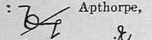{: .rev1row}
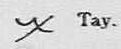{: .rev1row}\ 
Revised: Apthorpe, Tay

## Joining Vowels Sounded Individually and Diphthongs

Some concepts are under the prominent letter, instead of the first in the group.

### Vowels Sounded Individually

Leave the angle between the vowels. For ao/oa, leave a gap.

Check both orders of vowels to see all example words.

{: .man}\
Manual: re-enter, Oölite, Deä, create, Leo, fiasco, serious, fuel, poem

{: .teach1}\
Teaching 1: oar, Laon

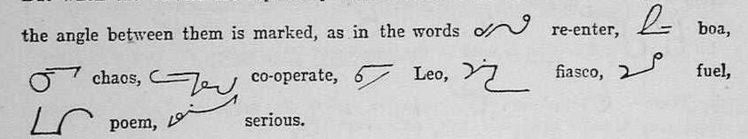{: .rev}\
Revised: re-enter, boa, chaos, co-operate, Leo, fiasco, fuel, poem, serious

Counter-example: In *abbreviation*, Callendar writes AI instead of IA, and rounds the corner even though the vowels are sounded separately.

{: .man}\
Manual, Specimen of Fully Written: \
abbreviation, which are illustrated in the sections that follow,

### Vowels Sounded Together, Diphthongs

Orthic uses an older definition of the word *diphthong*.

{: .man}\
Manual: ai, oy, ou, eau

{: .rev}\
Revised: ai, oy, ou, eau

An upstroke vowel following or preceeding Y is written with an angle. (Teaching 1)

{: .teach1-1row}\
Teaching 1: ye, obey

### A

#### A with E,I,Y

See S for AYS.

{: .man}\
Manual: ai, au, ay, days, quay, says, hay

{: .teach1-1row}
{: .teach1-1row}
{: .teach1-1row}\
Teaching 1: dear, dear(wrong), demr

{: .teach1-1row}
{: .teach1-1row}\
Teaching 1: meal, mail

{: .teach1-1row}
{: .teach1-1row}
{: .teach1-1row}
{: .teach1-1row}\
Teaching 1: day, dm(wrong), dm or dny, may

{: .rev}\
Revised: afar, ai, au, ay, ays

{: .rev}\
Revised: ai, ai, aim, nail

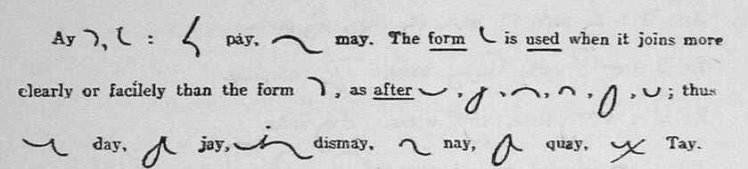{: .rev}\
Revised: ay, ay, pay, may, d, j, m, n, q, t\
day, jay, dismay, nay, quay, Tay

The pattern seems to be use the downward form after an upstroke. (Cricket)

Teaching 1 gives several examples of what might happen if you use the wrong order.

Teaching 1 recommends that AI always be written in AI order, regardless of surrounding letters, but does not say why. IA is written IA. It also recommends dotting the I. The Manual and Supplement do not have any counter-examples. Revised does not mention the rule, and even has a counter-example.

#### AO, OA, AU

{: .teach1}\
Teaching 1: oar, Laon

{: .teach1}\
Revised: au, audit, landau

Write A above O, possibly towards the correct end of the O.

### E

See also AE.

{: .man}\
Manual: ee, ei, ie, steep, stupid, eu, ew, new

{: .man}\
Manual: seen, sun

{: .man}\
Manual: ea, seat, seas, reat, real, pearl, years

{: .rev}\
Revised: \
ea, eat, seal, b, m, n, p, s, y\
bear, meal, near, pea, sea\
yea, d, t, v, idea\
deaf, team, team, veal, veal\
d, g, s, t, bead\
sneak, seas, peat, eau, beauty

{: .rev}\
Revised: ee, ei, ie, u, peel, pull, rein, run, grief, gruff.

{: .rev}\
Revised: ia, briar, denial

{: .rev}\
Revised: ea, ee, ei, eu, ew, few

### I

See also AI, EI.

{: .man}\
Manual: social, optician, chief

{: .rev}\
Revised: i, e, ia, ie

### O
{: .man}\
Manual: oar, or, oak, oi, toil, ou, out, oy, boys

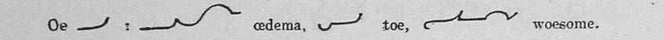{: .rev}\
Revised: oe, oedema, toe, woesome

{: .rev}\
Revised: oi, oil, ointment, foil, coin

{: .rev}\
Revised: ou, out, count, aloud, stout

{: .rev}\
Revised: oy, toy, annoy, decoy

See S for OYS.

### U

See also EE.

{: .man}\
Manual: ua, guard, suit

{: .rev}\
Revised: ua, guard, dual, usual

### Y

See also AY.

An upstroke vowel following or preceding Y is written with an angle. - Teaching

{: .teach1-1row}\
Teaching 1: ye, obey

## Joining Consonants

Some concepts are under a letter other than the first, if the other letter is sounded more strongly, or it makes for a more sensible explanation.

### A -- With Consonants

All examples from the Manual are under Joining Vowels with Vowels.

A on the line is *a*. A raised is *and*.

{: .man}\
Manual: and

### B

{: .man}\
Manual: bd, rob'd, bj, object, bl, able, br, bray, bs, absurd, bt, subtract, bv, subvent

{: .rev}\
Revised: black, sensible, bleak, trebly\
Reversed B is only in Revised.

{: .rev}\
Revised: bd, bf, bg, bh, abhor, bj, bk, bl, bl, bl, bm, bn, bp, bq, br, brain, bs, bt, bv, by, bz

BE-: See Abbreviating Principles.

BL can be shown by reversing the direction of the B loop, and optionally writing the L inside the B. (Only in Revised)(Revised, pg 4, Compound Characters)

### C

CH is included here because it's presented with C. Further details are under H.

{: .man}\
Manual: ck, suckle, cl, close, cr, crutch, ct

{: .teach1}\
Teaching 1: chlo, chro

{: .rev}\
Revised: cd, ch, chl, chr, aches, pitch'd, filches, pilchard, ck, cl, cm, cn, cqu, cr, cs, ct, cy

{: .sup}\
Supplement: transact

CH is a circle the same size as H. H, CH and WH are described under H. Note MCH, NCH, SCH have different rules, described with H.

CHL, CHR: Put the L or R inside the larger circle. Observe the L or R lies above/below the vowel line.

I think CHL and CHR turn in different directions, so the small circle just continues the motion. (Cricket)

CT: Supplement merges them (*transact*), as for GD. Manual Ordinary does not. Manual Hints for Reporting does not. (*characters*) 

CD: blends so it looks like a C with a long, very long, bottom. This rule isn't stated, but there are many examples in the Dictionary. Search for CED. No sign of CT doing the same. (Cricket)

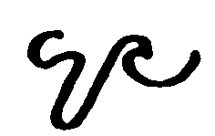{: .man1row}\
Manual Ordinary Style: convinced

TCH. See Abbreviating Principles

### D

{: .man}\
Manual: dge, judge, dj, dle, fiddle, dr, dread, dv, dw, dwell

{: .man}\
Manual: student

{: .rev}\
Revised: d, t, df, dge, dh, dj, dk, dle, dm, dn, dre, ds, dt, dv, dw, dy, dz

DEN series. In DN the letters form a wave. The end of one letter and the beginning of the next share a line. In DEN, the combination begins and ends on the same line. In DEEN, there is actually a line This is what most beginning writers think DEN should look like. I cannot find anywhere this is stated clearly, but it is consistent across all 4 books. (Cricket)

DD, DT and TD can be written as a double-wide D. See Abbreviating Principles.

DV can be written as a double-wide V. See Abbreviating Principles.

### E -- With Consonants

{: .rev}\
Revised: ea, ee, ei, eu, ew, few

All examples from the Manual are under Joining Vowels with Vowels.

EC, ENC, IC, INC: This is often tricky, but fortunately the word is usually clear from context. There are no rules, but many examples in the dictionary. (Cricket)

EC: Make sure you do not go down as I changes to C. The first part of the C retraces part of the I. There are many examples in the dictionary, but they're all burried in a large plate.

ENC: Make sure that you do a full N. The first part of the C does not retrace any part of the N. 

### F

{: .man}\
Manual: if, ft, soft, fd, puff'd, fl, fr, rifle, afraid, fs, skiffs

{: .rev}\
Revised: fs, waifs, hoofs, offspring

{: .rev}\
Revised: f, c, if, if(wrong), refer, fc, fd, fg, fl, fm, fn, fr, fs, fs, ft, fy

F is joined without an angle after vowels.

FR: Vowel comes off the top to save time and going around the circle twice. See R for rule. Examples: afraid (above) and fray (Manual, L)

FS: S curves upwards to the left. (Revised)

### G

{: .man}\
Manual: gh, high, gl, glory, gr, agree, gn, sign

{: .teach1}\
Teaching 1: gn, foreign, age, magnify

{: .sup1row}\
Supplement: goodness

{: .rev}\
Revised: G, gb, gd, gh, gl, gm, gn, gr, gs, gy

GD: Note the merge.

GT: No examples.

Rest of the word below the line signifies G (or termination with G). (Teaching 1)

### H: CH and WH

Most letters combine with H in "interesting" ways. CH, WH, and combinations starting with H, are here. Other combinations are under the starting letter. Of special note: SH, SCH, SR, P, PH, PTH, and TH.

<table tabindex="0">
  <thead>
    <caption>
      Compare H, CH, WH by Different Writers
    </caption>
  </thead>
  <tbody>
    <tr>
      <th></th>
      <th>Callendar Manual, Supplement</th>
      <th>Stevens Teaching, Psalms, Aesop's Fables</th>
      <th>Clarey Revised</th>
    </tr>
    <tr>
      <td>H</td>
      <td>hat, ahead 
        
        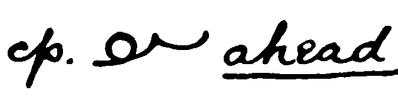
      </td>
      <td>ha 
        
      </td>
      <td>hat 
        
      </td>
    </tr> 
    <tr>
      <td>CH</td>
      <td>ache, chair, chat, chief, Christ, which 
        
        
        
        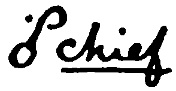
        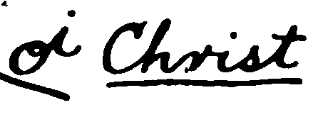
        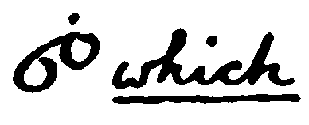
      </td>
      <td>cho, chlo, chro 
        
        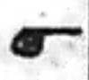
        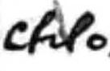
        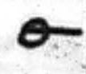
                
      </td>
      <td>ch, aches, arch, chat, chin, chl, chl, chloric, chose, chr, Christ, filch, filches, pilchard, pitch'd, richly, speecless, scheme, scholar, such 
        
        
        
        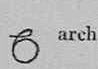
        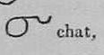
         
        
        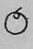
         
         
        
         
        
        
        
        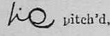 
        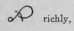
         
        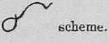
        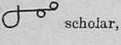
        
      </td>
    </tr> 
    <tr>
      <td>WH</td>
      <td>what, which, who 
        
        
        
      </td>
      <td>who 
        
      </td>
      <td>wh, whose, when 
        
        
        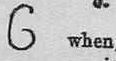 
        See below for the full image, comparing whose/chose to when/chin. (under H: WH, not all the way down to WH).
      </td>
    </tr>
  </tbody>
</table>

{: .man}\
Manual (H): ha, cha, hat, chat, what, which

See below for Revised.

H, CH, and WH are all large circles, and described here for easy comparison. All books agree that H is above the line and is written ccw, unless following S or P. Most agree that CH is cw and below the line.

Most of the time, it is safe, and faster, to omit the H in WH. There are, however, times when you need to record the exact spelling. I prefer to start WH at the bottom, to make an enlarged W, or to start it at the right, instead of at the top.

#### H: CH

Note the different ways of writing *school* or *scholar*.

{: .man}\
Manual: ch

{: .man}\
Manual (CH): chair, Christ, ache, ahead

{: .man1row}\
Manual: school

{: .sup1row}
{: .sup1row}
{: .sup1row}
{: .sup1row}\
Supplement: inch, such, much, school

{: .rev}\
Revised: ch, Christ, arch, filch, chat, such, scholar, scheme, chl, chloric, richly, speechless

{: .rev}\
Revised: cd, ch, chl, chr, aches, pitch'd, filches, pilchard, ck, cl, cm, cn, cqu, cr, cs, ct, cy

MCH: Teaching Part 1 Common Words (below)

NCH and SCH can be written without an angle or break – ie in the other direction, still below the line. (Supplement) 

NCH and SCH without angle might mean changing direction. The Supplement also shows MCH doing the same. (Cricket)

I don't see why it has to turn ccw in the first place. It doesn't change the look in most cases. Perhaps it's a mnemonic (C), or a way to keep it a circle instead of a loop, or to ensure the preceeding letter doesn't curve. (Cricket)

Revised gives even more options, including writing above the line.

#### H: WH

Each writer has a slightly different way to write WH. I leave out the H. It's easy to read without. (Cricket)

{: .man}\
Manual (W) (Callendar): who, ha (have)

WH: Enlarge the W to look like H. (Teaching 1)

{: .teach1}\
Teaching 1 (Stevens): th, who

{: .rev}\
Revised (Clarey): wh, whose, when, chose, chin

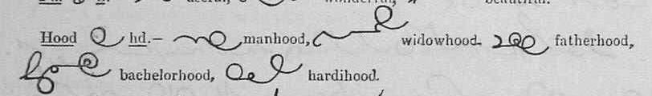{: .rev}\
Revised: hd, manhood, widowhood, fatherhood, bachelorhood, hardihood

### H, Not CH or WH

{: .man}\
ther, others, ard, toward\

{: .rev}\
Revised: H, ch, hat, chat, hd, hg, hs, hy

HR, HL: Small circle inside big circle.

THR, THER: T can be omitted.

See P for PH, PHTH and PTH. Sometimes the H turns in the opposite direction.

See SH and TH for those joins. Sometimes H is smaller or not completed.

CHL:   `cl`\
(Supplement, Notes on Reporting, no examples)\

### I -- With Consonants

All examples from the Manual are under Joining Vowels with Vowels.

{: .teach1}\
Teaching 1: it

Stevens (Teaching, Psalms) I below the line in short words such as IN. This is not in any rules.

IC vs INC: This is often tricky, but fortunately the word is usually clear from context. If you need to make it clear, see advice under EC. (Cricket)

ING: See Abbreviating Principles.

### J

Manual has no images.

{: .rev}\
Revised: j

### K

Manual has no images.

{: .teach1}\
Teaching 1: ks-correct, ks-not-recommended\

{: .teach1}\
Teaching 1: take, taking, sake

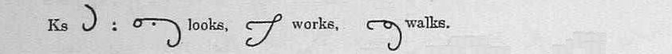{: .rev}\
Revised: ks, looks, works, walks

{: .rev}\
Revised: k, e, ea, u, like, beak, duke, kd, kg, kh, kl, kn, kr, ks, ky

{: .rev}\
income, close

KS: S joined to the finish of F or K is better turned up rather than down. (Teaching 1)

K replaced with mode 3. Only for take, sake, and their inflections. (Teaching 1)

I don't like this. Take / tag can be used as noun and verb. Too much chance of confusion. Sake is probably safe. An entire rule for two root words. One isn't safe and the other isn't a common word. I'd ignore this rule. (Cricket)

KR: Vowel comes off the top to save time and going around the circle twice. See R for rule. Examples: None, but it makes sense that the rule applies to KR since it applies to FR.

### L

{: .man}\
Manual: black, bread, clay, crow, addle, dry, flow, fro, glad, grade, play, pray, little, litre, slay, Israel, held, herd, world, already,\
lf, half, lk, walk, lp, help, lt, wilt, lv, salve

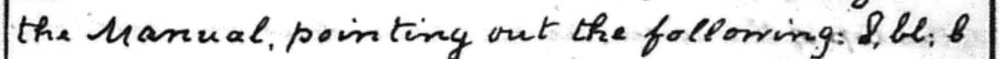{: .teach1}\
Teaching 1: bl, br

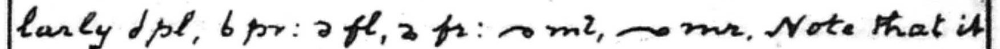{: .teach1}\
Teaching 1: pl, br, fl, fr, ml, mr

{: .rev}\
Revised: \
lair, rail, male, mare, \
link, rink, fail, fair, \
flay, fray, whirl, walrus,\
lb, lc, lch, lchr, ld, lf, lg, lh, lk, lm, ln, lp, lr, ls, lt, lv, ly

When standing by itself as an initial, L or R is prefixed by a short stroke showing its direction. In other cases the distinction is obvious.

BL and BR are a bit tricky.

RT, TR: The circle is so small that it can fit nicely inside T, for RT and TR. (Cricket)

Note how downstrokes come off the bottom: lc, ld, lf, lg, lt. (Cricket)

Other shorthand systems (notably Gregg) base direction on the surrounding strokes. This can get confusing when switching systems. Each Orthic book has a mnemonic or two to help. (Cricket)

### M

{: .man}\
Manual: mp, imply, mb, limb, ms

{: .rev}\
Revised: mb, mbs, md, ml, mn, mp, ms, mt, my

See DEN for D, T, N, M blends.

### N

See DEN for D, T, N, M blends.

NCH, SCH: See H.

NG, NSP: No angle need be made in the compounds NG and NSP. (N followed by downstroke).

NK: No angle. (Revised)

{: .man}\
ng, singer, nsp, inspect, nc, since, nch, inches, nd, India, nf, infer, nj, injury, nl, unless, ns, sense, nt, sent, nk, sink, nqu, inquest, nv, invent

{: .rev}\
Revised: inspirit, inspect, ensphere, conspire

{: .rev}\
Revised: ng, ginger, hang, sting, singer, wink, rank, sink, tinker

{: .rev}\
Revised: n, nb, nc\
nch, nd, nf, ng, nh, inherit,\
inhale, nj, nk, nl, nm, nqu, nr, enrich, enroll, ns, nsp, nt, nv, nw, inward, enwrap, nx, ny

### O -- With Consonants

{: .rev}\
Revised: oa, coat, cot, oe, oi, ou, oy

All examples from the Manual are under Joining Vowels with Vowels.

### P

{: .man}\
Manual: sp, sphere, ps, cusps, ph, ph `(ph-b, ph-d)`, phrase, phlegm, pl, place, pr, present, pd, depth, phth

{: .teach1}\
Teaching 1: ph, ph `(ph-b), (ph-d)`, phar, phy

{: .teach1}\
Teaching 1: sp, ps, sps

{: .rev}\
Revised: ph, ph `(ph-b, ph-d)`, e, u,\
phrase, philter, sulphur, epitaph,\
phase, phlegm, physic, \
phth, phthisis, opthalmic, \
pth, Apthorpe, depth\
Note the different method for capital for Apthorpe.

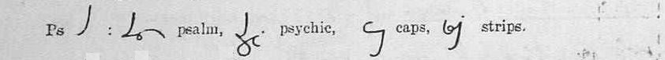{: .rev}\
Revised: ps, psalm, psychic, caps, strips, sp, spire, spear, lisps, wasps

{: .rev}\
Revised: p, ph, ph, phl, phr, phth, pl, pr, pt, pth, pw

{: .rev}\
Revised: p, s, speck, trips, cusps

PH: H might be on either side depending on following letter.

PHL, PHR: small circle goes inside the H.

PR: Vowel comes off the top to save time and going around the circle twice. See R for rule. Examples: present, proof (Manual, Alphabet), present (Manual, P)

PS, SP, SPS: S is more shallow and the angle is rounded.

PHTH, PTH: Careful penmanship.

Note that this rule does not apply to SH! (Cricket)

PW uses angle-W but has no examples. (Revised)

### Q

{: .man}\
Manual: esquire

{: .teach1}\
Teaching 1: q

{: .rev}\
Revised: q

The position of Q on the line varies with writer. (The Alphabet has an example from the Manual.)

All four books state that Q is always followed by U, and thus U can be omitted. This is outdated.

My suggestion (Cricket):

- If you are confident you will remember how to spell the word, use just the loop, as Callendar recommends.

To clearly state the spelling, two ideas come to mind:

- If written normally, it's QU. To remove the U draw an X across the bottom loop, or close to it. To confirm that yes, you checked the spelling and the U belongs, draw a checkmark in the same place.

 - Otherwise, do what some phonetic writers do: Write the shorthand outline during dictation and mark it to confirm spelling later. Then write the standard spelling in a gap left after the shorthand outline,  in the margin, or the back of your notebook. I recommend margin (fast and visible) and back of book (findable).

### R

{: .man}\
Manual: fierce, rd, rt, rf, rk, work, rn, learn, rp, rs, rv

{: .teach1}\
Teaching 1: rha, rha ?? \
I think the 2nd one is HR, also used for THR. (Cricket)

{: .teach1}\
Teaching 1: pra

{: .rev}\
Revised: rd, force, tierce, mercy, farcical

{: .rev}\
Revised: rb, rce, rch, rd, rf, rg, barge, serge, rh, rhyme, Rhine, catarrh, rk, rl, rd, rm, rn, rp, rqu, rs, rt, rv, ry, rz

Manual: proof (alphabet), present (P) -- to show PR.

See L for details and contrasting examples.

RCE: Written like lower-case E, according to the Manual. As near as I can tell, Callendar makes a slight angle at just before the R, so your pen goes to the right and the R is closer to being a circle. If you're happy making R a loop instead of a circle, this complexity can be avoided. (Cricket)

RH: The R can lie just outside, or curl within, the H circle. (Teaching 1)

PR: It is usual to write a vowel following R attached to an upright letter from the top, as in PRA, to save time, and to avoid going round the circle twice. (Teaching 1, Lesson 3, L and R)

Teaching gives the example PRA, doesn't say here that it doesn't apply to S (see SH), and doesn't say which the other upright letters are. My best guess follows. (Cricket)

{: .man1row}
{: .man1row}
{: .man1row}
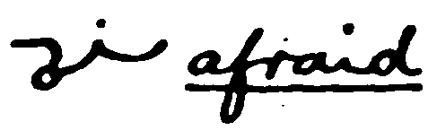{: .man1row}
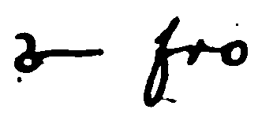{: .man1row}\
Manual: bray, bread, brought, afraid, fro

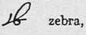{: .rev1row}
{: .rev1row}
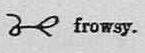{: .rev1row}\
Revised: zebra, briar, frowsy

No examples found for KR.

### S

### SH, SHR, SR, SCR

Much disagreement among the authors. (Cricket)

<table tabindex="0">
  <thead>
    <caption>
      Compare SH Family by Different Writers
    </caption>
  </thead>
  <tbody>
    <tr>
      <th></th>
      <th>Callendar Manual, Supplement</th>
      <th>Stevens Teaching, Psalms, Aesop's Fables</th>
      <th>Clarey Revised</th>
    </tr>
    <tr>
      <td>SC-</td>
      <td>scent, scarcely (abbr) 
        
        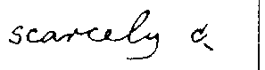
      </td>
      <td></td>
      <td>sc 
        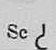
      </td>
    </tr> 
    <tr>
      <td>SCH-      </td>
      <td>school (Manual), school (Supplement) 
        Same author, different shape. 
        
        
      </td>
      <td></td>
      <td>sch, scholar 
        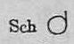
        
      </td>
    </tr>
    <tr>
      <td>SCR-</td>
      <td>Only egs are abbrevs</td>
      <td></td>
      <td>scrap, scream 
        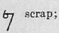
        
      </td>
    </tr> 
    <tr>
      <td>SH-</td>
      <td>
        sha, shed 
          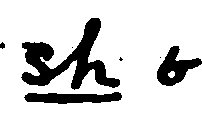
          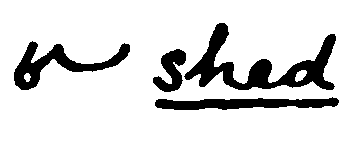
      </td>
      <td>sho  
        
      </td>
      <td>shop 
                
      </td>
    </tr> 
    <tr>
      <td>SHR-</td>
      <td>shred (yes, tiny R inside small H)  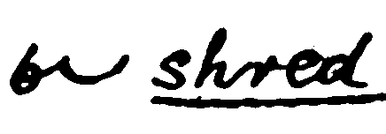
      </td>
      <td>shro  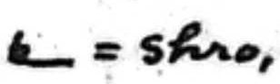
      </td>
      <td>shrink 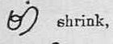
      </td>
    </tr>
    <tr>
      <td>SR-</td>       
      <td>sra, Tisri  
        
        
      </td>
      <td>No examples. ? Same shape for SH and SHR ? </td>
      <td>disrank, misread 
        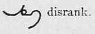
        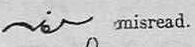
      </td>
    </tr> 
  </tbody>
</table>

.

Following the tradition, I will make a mnemonic: *Shoot off the top.* (Cricket)

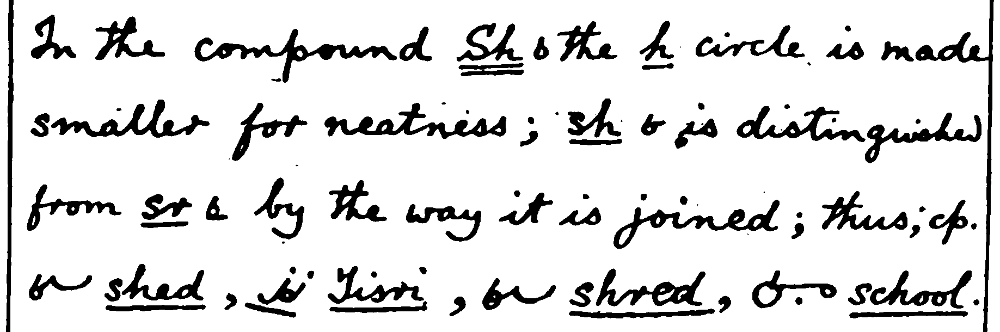{: .man}\
Manual: sh, sha, sr, shed, Tisri, shred, school

In the compound Sh the h circle is made smaller for neatness; sh is distinguished from sr by the way it is joined. Thus compare shed, Tisri, shred, school.

{: .teach1}\
Teaching 1: pra

It is usual to write a vowel following R attached to an upright letter from the top, as `pra`. This is to save time, and to avoid going round the circle twice.

{: .teach1}\
Teaching 1: shro, sho

If the combination SHR is desired, it is shown by continuing the next letter from the bottom, instead of the top of the circle, as shro, but sho.

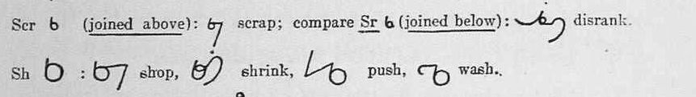{: .rev}\
Revised: p4: scr, scrap, sr, disrank, sh, shop, shrink, push, wash

{: .rev}\
Revised: p9: sb, sc, sch, sh, shr, sk, sl, sm, sn, sp, sph, squ, st, sw, sy, scream, misread

Stevens doesn't show SR. He usually follows Callendar, so maybe it's ok for SR and SHR to share.

SHR: Very tiny R inside the small H. (It doesn't have to be a circle, just enough to look like you tried. Cricket).

I'm not sure whether to recommend following Callendar or Stevens. Callendar's is complete. Stevens wrote a lot more material, but there are only a few examples (except maybe in the Bible passages) so his way won't be reinforced. (Cricket)

### Other S Joins

{: .man}\
Manual: S.E.

{: .rev}\
Revised: ays, pays, ways, says, prays

{: .rev}\
Revised: afar, ai, au, ay, ays

{: .rev}\
Revised: oys, cloys, employs

{: .rev}\
Revised: sb, sc, sch, sh, shr, sk, sl, sm, sn, sp, sph, squ, st, sw, sy, scream, misread

S is vertical when written alone, to differentiate from E.

AYS/OYS: works better with Clarey's writing, whose Y goes down more steeply, than for Callendar. (See Vowels, AY, says)

FS, KS: S curves up to the left. This may work better with Clarey's writing style than the others. See F and K.

MBS, MPS: See M.

NCH, SCH: See H.

SP, SPS: See P.

SW: See W for alternate form of W.

### T

{: .teach1}\
Teaching 1: TH

{: .man}\
with, both, tch, sketch, tle, turtle, tr, truth, tw, two

{: .rev}\
Revised: th, this, threw, th-final, worth, faith

{: .rev}\
t, tb, tc, tch, th, with, tl, tr, tw, ty

Write TH in order.

TH-final: Don't close the H.

Callendar writes "month" with the final H almost completely closed, and not very circular. (Supplement, Examples of Abbreviations, below.)

TH-initial: See Abbreviating Principles for raised mode. Optional.

THER: H with R inside. Omit the T. (Same as HR.)

See Abbreviating Principles, TH- for TH at the beginning of a word.

### U -- With Consonants

All examples from the Manual are under Joining Vowels with Vowels.

see E, Joining Vowels, for E vs U

{: .rev}\
Revised: u, ee, sum, see, ua, ue, ui

### V

{: .man}\
Manual: minster (not minister), Minver, stew, view

{: .rev}\
Revised: v, ste, view, stew

V is distinguished from ste by its size.

See Abbreviating Principles: EV for all vowel-V-vowel combinations.

### W

{: .man}\
Manual: way, woe, wet, write

{: .man}\
Manual: sews, cows, laws, wk, hawk, wl, owls, wn, dawn

{: .teach1}\
Teaching 1: wo, ow, owing, owing, wd, wd, sw.

{: .rev}\
Revised: sw, swam, swear, answer

{: .rev}\
Revised:\
wh, whose, when, chose, chin\
wr, wring, thing\
ws, pews, rows, frowsy

{: .rev}\
Revised: w, wd, wh, wk, wl, wn, wr, th, ws, saws, news, wy, snowy, sinewy, dewy

{: .rev}\
Revised: hood, would, world, might, ment

W goes upwards. C and F go downwards.

Use left-W at the beginning of a word, except before R. It can start at the 3:00 position, to form 3/4 of a circle, for ease of writing. Again, there is an exception: WR goes ccw. (Cricket)

Another way to remember *W* is to point out that whether initial or final, *it is an upward tick*. The letter may be written either circularly or angularly. (Teaching 1)

Note Calendar (Revised) differs, for *would* and *world*.

SW: The angular form of W is used after S. (Teaching 1; demonstrated but not explained in Manual)

Change the exit angle of W to blend with the following letter.

WR: Distinguished from TH by its size.

WH: See H.

WS final: The addition of S forms a loop.

WK, WL, WN: Notice how the letters blend. (Cricket)

### X

{: .man}\
Manual: xh, xp, xt, extent, exhort, expense

{: .rev}\
Revised:\
xc, excel, exclaim\
xh, exhale, xch\
xp, expel, export\
st, extent, text

{: .rev}\
Revised: x, xc, xch, xh, xp, xqu, xt

*X* is made up, as in longhand, of *C* and *S*. (Teaching 1)

You can often omit the S, or merge the S with the following letter. (Cricket)

There is no need to make an angle in the combinations *Exh*, *Exch*. (Manual)

### Y -- With Consonants
{: .man}\
Manual: yacht, yet, yore yule

{: .man}\
Manual: applied, tries, easiest, happiest, `aplyd, trys, easyst, hapyr`

{: .rev}\
Revised: y

{: .rev}\
Revised: flies, tries, said, drier, `flys, trys, sayd, dryr`

Let Y stand unaltered. In adding inflections to words ending in y, the y is not changed to i or ie.

Teaching 1: list but no shorthand\
tries -> `trys`,  applies -> `applyd`

### Z
{: .man}\
Manual: daze, Fitz, puzzle

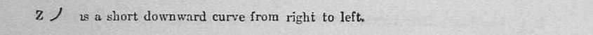{: .rev}\
Revised: z

## General Methods of Abbreviation, Including Ordinary Style

The most important rule of all in reporting practice is never to use a mode or an abbreviation that causes hesitation or waste of time, not to worry about trifles; and to practise writing from dictation and transcribing till your notes become perfectly fluent and cursive and legible. A study of-the examples which follow will probably be more useful than many pages of hints. (Supplement, Notes on Reporting)

### Omit A and O before M and N
{: .man}\
Manual: can, con, alone, woman, `cn, alne, wmn`

{: .man}\
Manual: band, bond

{: .rev}\
Revised: bank, common, alone, woman\
band, bond, dame, dome, gang, gong, tame, tome, wander, wonder

An omission of this kind can always be corrected by writing the omitted character above.

### General Method of Abbreviation Details

{: .man}\
Manual: different, difference, acknowledge, especially, circumstance, extraordinary, representative

{: .rev}\
Revised:\
acknowledge, especially, reference, regulation, extraordinary, ordinary, representative\
delete, erode, indeed, meet, read\
most, must, part, point, right\
head, hood, would, world, might, -ment

The general method of abbreviating long words is to write only the first syllable, and, if necessary, to indicate the termination by writing the last letter or two, separated by a small interval from the first part. (Manual)

The general method of abbreviating is the same as that ordinarily employed in longhand, namely, to write the first syllable of a word, and if necessary, to indicate the termination by writing the last lettrer or two separatated by a small interval from the first part. In many cases the termination may be joined, as in the examples. In the case of short words containing a characteristic long vowel or diphthong, it is generally better to keep the vowel. But in the case of very common words for which abbreviations are already current in longhand it is often better to follow the longhand usage. As in longhand, the same abbreviation may in some places be used for two, or even three, different words provided that they are different parts of speech such as would necessarily be distinguished by the context. The principle in itself is good and reasonable, but we would caution writers of Orthic against the abuse of it. (Revised)

### Modes or Positions

Each letter that can be replaced by a mode is listed under Joining Consonants. Their use for shortening words beyond simple letter replacement is under Abbreviating Principles. 

* First Position, Raised: B, P, TH, V (Supplement calls this Supra-Linear Writing)
  * B is only raised for the syllable B at the start of words.
  * TH is only raised at the start of words.
* Second Position, Normal (gap): all others
* Third Position: Lowered: G, J, K, L, QU

If the last part of the word is normally indicated by mode, use a dot.

The Manual clearly says and shows mode is relative to the previous letter. So does Revised. Teaching is the outlier, saying clearly "below the line," but the only examples work for both interpretations.

See below, especially:\
Manual: benevolent (Manual)\
Supplement: judge\
Revised: reign, intelligence, religion

[Jeremy: ‘Benevolent’ demonstrates how indication by mode differs from the fixed positions used in Pitman’s shorthand. While Pitman’s positions are relative to the line, Orthic’s modes are relative to the preceding character. Thus a raised N implies the prefix BE-, and then an LNT raised relative to that N implies the V.]

Mnemonic: The raised letters are in the front of the mouth. The lowered ones are in the back, except for L. (Cricket)

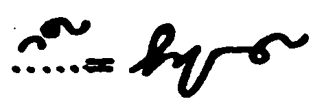{: .man1row}\
Manual: benevolent

{: .sup1row}
{: .sup1row}
{: .sup1row}
{: .sup1row}
{: .sup1row}
{: .sup1row}
{: .sup1row}
{: .sup1row}
{: .sup1row}
{: .sup1row}
{: .sup1row}

Supplement: advantage, arrange, arrive, conserve, judge, knowledge, language, large, mortgage, super

{: .rev}\
Revised: severe, reign, design, benevolent, benevolent (not recommended), prerogative, regular, reverend, several, alleiviate, elevate, intelligence, religion

In the middle of a short word, G or V may be conveniently expressed by the modes. In the case of longer words, it is generally better to keep the G or V if it forms part of the first syllable or the root of the word and to only express it by mode if it occurs in a subsequent syllable. (Revised)

### Drop the Dots

{: .rev}\
Revised: is, if, in, it, apply, assist, cotton, fiddle

Dots are generally omitted in common words. This applies to I dot and doubling dot. (Manual)

Examples: Probably many including the words: in, it, if, him, his, will.

Drop them all, unless absoultely necessary. Be brave! (Cricket)

## Abbreviating Principles (Abbreviations, Prefixes, Suffixes, Slurs, Blends, Compound Characters, etc.)

Prefixes, suffixes, and common letter groups. Description is under the strongest sounding letter.

Look for patterns! Usually it's the key sounds.

See Notation above.

#### Revised

Revised often teaches simple abbreviating principles with the letter. If it's a duplicate of a rule already here, the image is only in the Joins section.

#### Short Vowels

Short vowels may often be slurred, especially in terminations. (Supplement, Notes on Reporting)

manner: `(mn)r`
upper: `upr`
national: `nnl`

#### -ABLE, -BLE `b`

{: .rev}\
Revised: liable, payable, bibles, table, tab

Tricky! `ab` = able, `ab` = ab

This is only in Revised, and I don't like it. (Cricket)

#### -ACITY `ct``
{: .rev}\
Revised: capacity, pertinacity, veracity

#### ACQU `aq`
{: .sup1row}\
Supplement: acqu

{: .rev}\
Revised: aqu, acquire, acquaint

#### -ACY, -ASY `ay, ya`
{: .rev}\
Revised: curacy, diplomacy, embassy, easy

#### -ADE `de`, -ATE `te`, only in some words
{: .rev}\
Revised: made, date\
decade, deprecate, fade, fate, brigade, gate, hate, obviate, cockade, Kate, glade, late, spade, trade, rate, crusade, wade\
collate, calculate, stimulate\
Words which may clash: immolate/emulate, insolate/insulate

{: .rev}\
Revised: deprecated, depreciated, fated, faded, forded, hated, headed, hooded, elated, waded

Way too many ambiguous words for my taste! (Cricket)

#### ADJ `aj`
{: .sup1row}\
Supplement: aj

{: .sup1row}\
Revised: aj, adjure, adjourn

#### ADV, `(dv)`

{: .sup1row}\
Supplement: advantage

Slurred into one large character compounded of d and v.

#### -AGE, -AKE -- See -GE.

#### -AL `l`
{: .teach1}\
Teaching 1: final, upper

The softly sounding vowel can be slurred in terminations such as "al". (Teaching 1)

#### -ARY, -ORY `y`
{: .rev}\
Revised: elementary, contrary, conservatory

#### -ASY, -ASSY -- See -ACY.

#### -ATE See -ADE

#### -ATION `.n`

{: .teach1}\
Teaching 1: termination

{: .rev}\
Revised: abrasion, relation

Note Stevens' cleverness using the word *termination*. It's hard to see here, but the previous line in the book is, "-ion: This termination is shown by..."

#### BE-, `^`

{: .sup1row}
{: .sup1row}\
Supplement: be, being, been.

{: .teach1}\
Teaching 1: behold, be-ad (not bead)

{: .teach1}\
Teaching 1: been, better, best, bring, thing

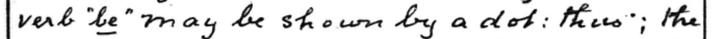{: .teach1}\
Teaching 1: be

{: .rev}\
before, because, befall, beset, be, been, being, better, best, by.

This prefix is peculiar to a special class of English words, and may also be expressed by writing above the line. Note that been and being are chosen to not conflict with than and thing. (Supplement, Teaching 1)

This abbreviation is **only** to be used when "be" is a distinc prefix. (Teaching 1)

#### -BILITY `bl`

{: .rev}\
Revised: ability, affability, insensibility

#### -BLE -- See -ABLE

#### CH compounds: MCH, NCH, SCH
These combinations may be written without an angle or break. See H.

#### CIRCUM- `cir.`
Also see COM-.

{: .sup1row}
{: .sup1row}\
Supplement: cir, circumstance

Written `cir` followed by a short break to represent *cum*. `circe` is the the regular longhand abbreviation for the word *circumstance*. (Supplement)

#### -CITY, Doesn't exist. See -ACITY.

#### COM-, CON-, CUM-, CAM-, CAN- `*`

{: .sup1row}
{: .sup1row}
{: .sup1row}
{: .sup1row}
{: .sup1row}
{: .sup1row}
{: .sup1row}
{: .sup1row}
{: .sup1row}
{: .sup1row}\
Supplement: com-, con-, come, came, command, comment, common, compound, comprehend, concerning, conserve, consideration

{: .teach1}\
Teaching 1: "I commend" (with dot), "I commend" (written close to the preceeding word)

{: .rev}\
Revised: compose, comparative, comprehend, proeconceived\
in combination, I conceive\
incompetent, reconsider, circumvent, camphor, candid, campaign, cancel

Expressed by a dot on the line written close in front of the word. In taking notes, the dot may generally be omitted or expressed by Mode (2). In correspondence it should be retained. (Supplement)

In compound prefixes, such as incom-, discom-, etc., the com- or con- is expressed by Mode (2). (Supplement) (Revised)

...or by leaving it out altogether and writing the rest of the word quit close to the preceeding word. (Teaching 1)

The prefixes in the front of the mouth are raised. C is in the back. Why isn't it lowered like G? (Cricket)

#### CT

No angle between C and T, so bottom of C is wider. (Supplement, Reporting)

I thought I 

#### -D -- See ED.

#### -DGE -- `ge`

Also see -GE

{: .rev}\
Revised: ge, edge, lodge, budge

#### DD, DT `dd, dt`

{: .teach1}\
Teaching 1: DD

Slurred to a double-wide D. (Teaching 1)

#### DISCOM- -- See COM-

#### DJ `j`
In words having the combination DJ, leave out the D. (Teaching 1)

#### DV `(dv)`

{: .sup1row}\
Supplement: advantage

{: .teach1}\
Teaching 1: dv

{: .rev}\
Revised: advert, avert

DV is slurred into one large compound character, a double-wide V. (Supplement)

#### EACH `ea`, EAT `ae`
Revised, Examples of Abbreviations, page 23.

#### -ED `d`
{: .man}\
Manual: used, kissed, stirred, `usd, kissd, stirrd`\

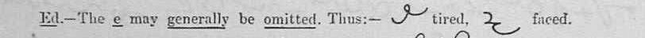{: .rev}\
Revised: tired, faced

#### -EDE, ETE `e`

{: .rev}\
Revised: concede, impede, effete, obsolete

{: .rev}\
Revised: impeded, sided, eroded, concluded, secreted, indited, voted

#### -ENCE `.ce`
{: .rev}\
Revised: influence, residence, confidence

Supplement. No examples.

#### -ENCY `.cy`
{: .rev}\
clemency, competency, emergency

Supplement. No examples.

#### -ENT `.t`
{: .sup1row}
{: .sup1row}
{: .sup1row}\
Supplement: agent, apparent, comment\

{: .rev}\
opponent, provident, agent

#### -ER `r`

{: .teach1}\
Teaching 1: final, upper

The softly sounding vowel can be slurred in terminations such as "al". (Teaching 1)

Probably also in ER, since there's an example.

#### -ETE See -EDE

#### EV-, EVE-, EVI- `^` -- See also -VE.

{: .sup1row}
{: .sup1row}
{: .sup1row}
{: .sup1row}
{: .sup1row}\
Supplement: every, evening, event, evident, evil

{: .sup1row}\
Supplement: even, written e'en to distinguisn from than or then.

{: .teach1}\
Teaching 1: given, loved

{: .teach1}\
Teaching 1: evident, conceived, ever

{: .teach1}\
Teaching 1: give, love, rove

{: .rev}\
Revised: evening, event, ever, every, evident, evil, even

It is clear that the shorthand chracters EVE must throw everything following the final E above the line., and it is also evident that such words cannot clash with that peculiarity of the English language TH, except in the words even and then. (Teaching 1)

Raised V can be used in any part of the word. Raised TH is only for the beginning (Teaching 1)

It is better to write the vowel after L and R, to show the direction. (Teaching 1)

Use a raised dot if eve was the last part of the word. (Teaching 1)

Note that *even* is written `een` instead of being raised, to distinguish it from *than* and *then*.

#### EX- `x`

As there is no English word beginning with *X* that is not preceded by *E*, this character may be used to represent *Ex*. (Manual)

As there is no English word beginning with X that is not preceded by E, this character may be used to represent EX. (Teaching 1)

Out of date! I recommend a similar procedure as for Q: Checkmark or X below the letter to show standard Orthic rules apply. If you want to be sure you spell it correctly, write the outline and the correct spelling in longhand in a standard place. (Cricket)

#### -FECTION `fun`
{: .rev}\
Revised: affection, defection, perfection

See -ION for explanation.

#### -FICATION `f.n`
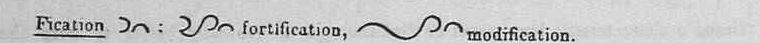{: .rev}\
Revised: fortification, modification

#### -FUL `fl`
{: .man}\
Manual: useful, beautifully, `usefl, beautifly`

{: .teach1}\
Teaching 1: useful, beautiful / beautyfull

{: .rev}\
Revised: fl, useful, wonderful, beautiful

Beautiful shows one reason for retaining the Y in the inflected word. (Teaching 1)

#### -GE, -DGE, -AGE, -GE, -KE, -AKE `_*`

{: .sup1row}
{: .sup1row}\
Supplement: knowledge, agent

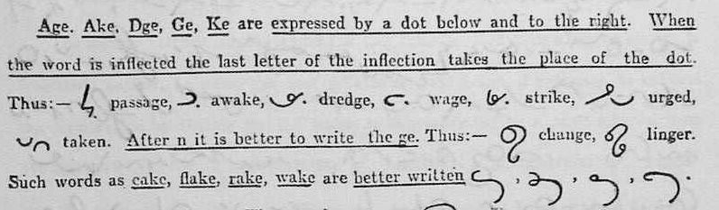{: .rev}\
Revised: passage, awake, dredge, wage, strike, urged, taken, change, linger, cake, flake, rake, wake

These and derived terminations are similarly expressed by a dot below and to the right to indicate the G. (Manual)

When the word is inflected, the last letter of the inflection takes the place of the dot. (Revised)

Some words are better written with the K and omitting the E. (Revised)\
...mostly 1-syllable words. (Cricket)

#### -GN `_n`

{: .sup1row}
{: .sup1row}\
Supplement: foreign, sign

{: .teach1}\
Teaching 1: gn, foreign, age, magnify

{: .rev}\
Revised: sign, impugn

Indicated by N written below to indicate the G.

#### -GRAM `_m`
{: .rev}\
Revised: diagram

Indicated by M written below to indicate the g, similar to -gn. (Supplement)

Diagram is a good example of relative vs absolute positioning. (Cricket)

#### -GRAPH `ph`

{: .rev}\
Revised: lithograph, paragraph, geography

Supplement. No examples.

#### -GUE (One Syllable) `g`

{: .rev}\
Revised: league, prologue, rogue, tongue

#### -HEAD `hd`
{: .teach1}\
Teaching 1: head

#### -HOOD `hd`
{: .man}\
Manual: manhood, `man.hd`

{: .rev}\
Revised: hd, manhood, widowhood, fatherhood, bachelorhood, hardihood

Manhood has detatched HD in Manual, connected in Revised.

#### HYPER- -- See PR- Family.

#### -IGHT `_t`

{: .man}\
Manual: night, light, `n_t, le_t`

{: .teach1}\
Teaching 1: Demonstrating how raising is just writing the word in full, then erasing the IGH.\
lite, right

{: .rev}\
Revised: sight, alight

It is better to show the vowel after I and R, so as to show which consonant it is by the way it is turned. (Teaching 1)

#### -IGNANT, -IGNITY `eg`

{: .rev}\
Revised: indignant or indignity, dignity

#### INCOM- -- See COM-

#### -ING `(ing1), (ing2)`

{: .man}\
Manual: using, saying, seeming, king, sing, singing.\
`us(ing1), say(ing2), seem(ing2), king, sing, sing(ing2)`

{: .rev}\
Revised: \
ing (`ing1, ing2`), leasing, placing, praying, coming, \
king, bring, bringing, sing, singin, \
reading, blaming, sinning, setting, seeing, going, saying

This form is used only for the inflection "ing" and not in other words. It is better to curve the stroke after D,M,N,T,V and vowels. (Manual)

I vote we use it in sing and king. It's already used in thing and bring. (Cricket)

#### -ION `un` 

{: .man}\
Manual: action, `actn` \

{: .teach1}\
Teaching 1: ion, action

{: .rev}\
ion, position, passion, deception, action, section

Dotted if necessary. (Manual)

#### -IDE, -ITE `e`
{: .rev}\
Revised: confide, reside, smite, write

See -EDE for note.

#### -ISM `em` or `.m`
{: .rev}\
idealism, conservatism, socialism

Supplement uses `.m`, no examples.

#### -ITE See -IDE.

#### -ITY, -ETY, -IETY -- `^y`
{: .man}\
Manual: abilities, peculiarity, `ab^ys, pec^y` \
Note "abilities" -- y stands unaltered.

{: .teach1}\
Teaching 1: pitty, city, truly, nearly\
Words are FW and Abbreviated.

{: .rev}\
Revised: entirety, society, insanity, piety, pity

Teaching 1 specifically says "above/below the last letter," and explains that's where the Y would be if the whole word was written in Orthic. Looking at the examples, he means 3rd position (lower).

Note piety vs pity. (Revised)

#### -IVE -- See -VE.

#### -JECT `j`
{: .rev}\
Revised: inject, project, reject

#### -KE -- See -GE

#### -LESS `ls`
{: .man}\
Manual: thankless, fearlessness, `^ankls, fear.lsns`

{: .rev}\
Revised: ls, useless, unless, fearless

#### -LTH `th`

L maybe slurred with the T in such words as wealth, health, etc. (Teaching 1)

From other examples, I think this means L can be omitted. (Cricket)

#### -LY `_y`
{: .man}\
Manual: nearly, easily, dailies, `near_y, easy_y, day_ys`

{: .teach1}\
Teaching 1: pitty, city, truly, nearly\

{: .rev}\
Revised: lowly, finely, fearfully, nearly, only

Note *dailies* in Manual: Vowels in order for smoothest writing; y stands unaltered twice in dailies.

In practice, the Y may generally be joined. (Revised)

After a mode, the LY would be written in full. (Revised)

#### MAGNGA-, MAGUE-, MAGNI- `m_`

{: .rev}\
Revised: magnanimity, magnetic, magnify

#### MANGA-, MAGNI- `m_`

{: .sup1row}\
Supplement: magnify

Written m, the rest of the word being placed below to indicate the g. (Supplement)

#### -MB-, -MBS- `(mb)`

{: .sup1row}\
Supplement: mb, mp

{: .teach1}\
Teaching 1: mb, member, dv

{: .rev}\
Revised: timber, lumper, lamb, temper, lumper, lamp

{: .rev}\
Revised: mbs, kembs, climbs, numbs\

May be written with a single character somewhat like mp , but beginning and ending on the line. (Supplement)

Note: Only when preceded by E, I and U upstroke vowels. (Revised) It looks like the vowel is combined with the start of M. (Cricket)

#### -MENT   `mt `

{: .teach1}\
Teaching 1: `mt` 

{: .rev}\
Revised: mt, payment, raiment, moment

#### MIS- `ms`

{: .sup1row}\
Supplement: mis, mistake

{: .rev}\
Revised: mis, ms, misuse, mislay, misnomer

Written ms, omitting the i. 

#### MM, MN `mm, mn`

{: .teach1}\
Teaching 1: mm, mn

Double-wide M. Vowel is left out. (Teaching 1)

#### NCH -- See H.

#### -NESS `.es`
{: .man}\
Manual: happiness, thoughtfulness, `hapyns, ^otfl.ns` -- ***Deprecated***

{: .sup1row}\
Supplement: goodness

{: .rev}\
Revised: ns, slyness, faithfulness, senselessness

Note in thoughtfulness that ns is not marked as raised. It is in position 2, and positions are relative.

This termination should be written ‑ess detached, by the general rule, and not ns as given in the Manual. [E.g. goodness.] Detached n and ns can then be used, as in longhand, for the expression of the common terminations ‑ation and ‑ations. (Suplement)

#### -NG -- See ING.

#### -ODE, -OTE `o`
{: .rev}\
Revised: explode, strode, promote, wrote.

#### -OLOGY `ogy`
Supplement, Notes on Reporting.

#### -OLUTE, -UDE, -UTE `u`
{: .rev}\
Revised: absolute, denude, mute\
Words which might clash: incide/incite, rede/ride/rite, side/site, mode/mote, rode/rote, delude/dilute, illude/elude

Again, too many clashes for my taste! (Cricket)

#### -OLVE -- See -VE

#### -ORY -- See -ARY

#### -OSION, -OTION `oun`

{: .rev}\
Revised: explosion, lotion

#### -OTE See -ODE

#### -OUD, -OUT, -OUND, -OUNT -- See -OUND, -OUNT

#### -OUGH `o`
{: .man}\
Manual: ought, brought

{: .teach1}\
Teaching 1: ought, thought

{: .rev}\
Revised: o, brought, plough

#### -OUND, -OUNT `ou`

{: .teach1}\
Teaching 1: round, sound, count, counter, county, country

{: .rev}\
Revised: cloud, clout, aloud, route, astound, hound, account, recount\
Words which may clash: mound / mount, round / rout\
Clarey wrote `klou` for cloud. I suspect he did it because it's easier to write, and, if he comes from a phonetic system it makes no difference, but he forgot to mention it as a rule.

Revised warns about the clash, but doesn't say how to deal with it. Keeping the extra letters will probably work. (Cricket)

Note the final E in route.

There are examples of this in the Supplement, but it isn't listed as a rule. It is listed as a rule in Teaching 1.

#### OVE, OLVE -- See VE.

#### PR- Family

Someone needs to dive into this a bit more, but on first glance it appears all PRv and PvR at start of word are treated the same. Super/supra differently. So why do all the books separate them? (Cricket)

#### PER-, PRO-, PRE-, PARA-, PARI-, PRI-, PUR-, maybe PRA- `^`
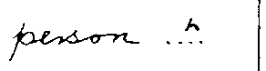{: .sup1row}
{: .sup1row}
{: .sup1row}
{: .sup1row}
{: .sup1row}
{: .sup1row}\
Supplement: person, present, promise, comprehend, super, supra, private

{: .sup1row}
{: .sup1row}\
Supplement: perceives, person

{: .rev}\
Revised: person, present, proclaim, persecute, promise, premise, profane, profess, superfine, supralinear.

{: .rev}\
Revised: primary, private, purchase, purvey\
parallel, period, perimeter

Pre- and pro- are distinguished from per, if necessary, by retaining the vowels e and o. The cases, however, in which it is necessary to make the distinction are very rare. (Supplement) (Revised)

If working in a field you are not familiar with, it's probably best to keep the vowel. The cases are not rare! (Cricket)

When any of these prefixes occur in the middle of a word after another prefix, as in the words unbelief, compromise, etc., they are expressed by Mode (1) (raised), that is to say by writing the terminal portion of the word close above and to the right of the initial prefix. [E.g. comprehend.] In the prefixes super, supra, hyper, the per is similarly expressed. (Supplement) (unbelief, compromise, hyper do not have written examples.)

The allied prefix pri may be expressed in the same way as pre in some common words. [E.g., private.] (Supplement)

Only for prefixes, or quazi prefixes (Teaching 1)

Always write O before F. (Why?) (Revised)

In the prefixes super, supra, hyper, the per is expressed by writing the terminal portion of the word close above and to the right of the initial prefix. Thus superfine, supralinear. (Revised)

#### SCH -- See CH, Abbreviating Principles and SH

#### -SHIP `.p` or `p`
{: .sup1row}\
Supplement: worship

{: .rev}\
Revised: fellowship, friendshp, worship

In accordance with the general method terminations are indicated by writing the last letter or two detached from the rest of the word. (Supplement, exact quote)

But...the only example in the Supplement is not detatched.

Revised, looks like it's connected, and separated in the first example for ease of writing, not to detatch it for the termination.

#### -STRUCT `str`
{: .rev}\
Revised: instruct, obstructing, destructive

#### SUPER-, SUPRA -- See PER.

#### -T

T may generally be slurred in the terminations ty (20) and th, thus duy = duty, wih = with, ohr = other. (Supplement, Notes on Reporting)

T may be slurred (omitted) in such words as duty, bounty, etc. (Teaching 1)\
Supplement said it better. (Cricket)

#### TCH `ch`

No examples in Supplement and Teaching 1.

{: .rev}\
Revised: ch, fetch, match, crutch

The t may always be omitted in this combination. (Supplement, Teaching 1)

#### TD -- See DD.

#### TH- `^`

{: .man}\
Manual: the, they, this, them, tho', that

{: .teach1}\
Teaching 1: Demonstrating how raising is just writing the word in full, then erasing the TH.\
although

{: .rev}\
Revised: than, that, the, them, there, this, those, though, thus, thy, thing\
I think they knew him then.

Use raised-mode only when TH begins the word, except in the case of the word *although*. (Teaching 1)

T may generally be slurred in the termination -th. (Manual, Notes on Reporting)

Other egs: *with, other*.

The only case of a word written above the line and not presupposing initial Th is the word “and” signified by a, written above the line. (Teaching 1)\ 
...What about words starting Be? (Cricket)

#### -THER `(ther)`

{: .man}\
Manual: ther, others, ard, toward

{: .rev}\
Revised: ther, hr, other, mother, rather, either

{: .teach1}\
Teaching 1: HR, other

Slur the T into the H circle and put the R inside. (Teaching 1)

#### -TION -- See ION.

#### TRANS- `trs`

{: .sup1row}\
Supplement: transact

{: .rev}\
Revised: trans, transfer, transmit, transcript

#### -TY `y ??`

T may generally be slurred in the termination -ty. (Supplement, Notes on Reporting)

duty: `duy`

See also ITY, which includes ETY and IETY.

#### -UDE, -UTE See -OLUTE.

#### -VE, -IVE, -OVE, -OLVE, -V- `^*`

{: .sup1row}
{: .sup1row}
{: .sup1row}\
Supplement: arrive, gives, given, selves

{: .rev}\
Revised: leave, cove, give, saves, lived, given, loving, grove, novel, movement, prove, solve, shoving, involved

A dot above and to the right of the word to indicate the V. When the word is inflected the last letter of the inflection is substituted for the dot.

When the word is inflected, the last letter of the inflection is substituted for the dot. (Revised)\
...Only the last letter? (Cricket)

In words ending in *ove* or *olve*, it is generally better to omit the *o* or *ol* and to write the v. (Revised)

See Modes for Revised's warnings about over-use.

#### WARD `ard`
{: .rev}\
Manual: hr, others, ward, towards

{: .teach1}\
Teaching 1: forward

{: .rev}\
Revised: ard, inward, outward, forward

#### -WISE `.se` or `se`
{: .sup1row}\
Supplement: otherwise

{: .rev}\
Revised: likewise, otherwise, unwise

Why not keep the W? (Cricket)

#### X- -- See EX- and X (Joining Consonants)

#### -YING `ing1`
{: .rev}\
Revised: conveying, crying, dying, flying

Flying looks like fling. (Cricket)

## Phrases

Note: Time is saved by writing without hesitation, not writing fewer lines at the expense of more thought. Do not go overboard with phrasing. (Many books on Gregg.)

The last rule is an important one and should be thoughtfuly remembered. "Never try to contract if it is easier to write in full or if it porduces hesitation." (Teaching 1)

Apparently there's a "list of recognized contractions as issued by the Society (Teaching 1, Lesson 9) but I haven't seen it. (Cricket)

### Phrases in Manual

{: .man}\
Manual: able to do; as it is; I am not; I have had; I shall be very; to be; ought to have been; with a view to.

"With a view to" is not worth phrasing for modern material. (Cricket)

### Phrases in Teaching

{: .teach1}\
Teaching 1: I should have been; with a view to; able to do so; as soon as

### Phrases in Revised
{: .rev}\
Revised: in combination, I conceive

{: .rev}\
Revised: camphor, candid, the campaign, to cancel

{: .rev}\
Revised: I say, I am not, we have had, as is, there is, to do, to be so, he does not, it should be, as it was, in the, much more, of the, should not do, I shall be very, this is, out of, it is not, as if, with a, by the, that the, to the, we are, as long as, as much as, it is not so, there is no more.

Time is frequently saved and legibility increased by joining words togethre in phrases without lifting the pen. This applies especially to commmon words, auxiliaries and particles.

This is a powerful method of abbreviation in the hands of experienced writers, and is specially appliable in the case of Orthic owing to its lineality and facility of joining. A reckless use of phraseography, however, is strongly to be condemned. Experience ahs shown that beginners are apt to run riot with all sorts of impossible and useless phrases, to the greeat detriment of the speed and legiblity of their writing. The student shoudl therefore exercise the greatest caution at the outset i his use of phraseolgraphy.

He must remember that:
- abbreviated words canot be freely joined wihtout danger of clashing;
- time is not saved by joinig words which join awkwardly or indistinctly; and
- phrases which are so long that they cannot be written easily without shifting the hand can be written more clearly and quickly if divided.

## Word Lists

In order of appearance. Use your browser's Find in Page function as needed. Words that abbreviated according to the above rules are not included, mostly.

Using the same notation as above.

### Manual Word Lists

{: .man}\
Manual: and, `a`

{: .man}\
Manual: the, they, this, them, tho', that\
`^e, ^ey, ^is, ^em, ^o, at`

{: .man}\
ther, others, ard, towards

{: .man}\
Manual: about, always, am, amount, an, any, are, were, be, been, because, between, but, can, can be, child, could, do, does, down, ever, for, from, friend, good, great, have, hold, made, might, more, most, not, can't (cannot), nothing, of, of the, on, only, one, once, perhaps, right, round, self, selves, shall, she, should, themselves, therefore, thing, throughougt, thro'out, to, into, under, week, would, which, with, you, yours

ABT, ALS, M, IM, AMT, AY, AR, WER, B, BN, BC, BETW, BT, CA, CAB, CHD, CD, 
D, DS, DN, ^R, F, FM, FD, GD, GRT, HA, HD, MDE, MT, MO, MST, 
NT, CNT, N(ING2), O, OE, N, N(LY), NE, NCE, PH (?? PRH), RT, ROU, 
SEF, SVS, SHA, SH, SHD, ^EMSVES, ^ERF, ^(ING2), ^ROUT, T, INT, U, 
WK, WD, WH, TH, Y, YRS 
{: .code1}

Lots of other words burried in the various specimens. Most of the specimens are typed out on https://orthic.shorthand.fun/ . A few link to other sources for the text.

### Supplement Word Lists

#### General Methods of Abbreviation -- Supplement

The following words were in the middle of a paragraph, in General Methods of Abbreviation. All the shorthand in the Supplement is on three pages, included just a bit below here. There was no shorthand, only text.

read, round, count, right, most, must, part, point, could, had, head, hood, would, world, most, must, might, ment

red, rou, cou, rt, mst, mst, pt, pnt, cd, hd, hd, hd, wd, wd, mst, mst, mt, mt
{: .code}

#### Examples of Abbreviations -- Supplement
{: .sup}\
Supplement:\
able, ably, above, according, acqu, adj, advantage, after, afternoon, afraid, ages, agent, also, already, announce, appropriate, apparent, arrange, arrive, -ation, -ational, baptist, be, being\

ab, aby, abv, ac(ing1), aq, aj, a(dv), af, afnn, afd, a_s, a_t, aso, alry, a.pte, ap.t, ar_*, ar^*, n, nr, bpt, ^b, ^(ing1)
{: .code}

been, before, believed, better, best, bishop, body, both, by, thy, caught, changes, church, circum, circumstance, com-, con-, come, came, command, comment, common, compound\

^n, ^f, ^lee.d, ^ter, ^st, bp, bdy, bth, ^y, ^y, caut, ch_s, chch, cer., cerce, *, *, cm, cme, *nd, *n, cpou
{: .code}

comprehend, concerning, conserve, consideration, counter, country, course, court, Dear, different, difference, difficult, each, editor, else, endeavour, even (e'en), evening, event, every

*^hend, *c(ing1), *s^*, *sed, *sed.n, cour, coury, crs, crt, dr, def, def, deft, ea, edor, ls, _end^r, een, ^n(ing2), ^nt, ^ry
{: .code}

{: .sup}\
Supplement:\
evident, evil, executor, except, exercise, extraordinary, favour, -fection, -fication, foreign, forgive, forth, forward, found, from, -ge, -gn, -gram,\
half, hand, head, help, him, his, important, inch, individual, interest, -ism, -ive, judge, just, justice, king, kingdom, know, known, knowledge, lady, language, large, largest, letter,\
little, lord, make, makes, magnify, mb, mp, member, mis-, mistake, much, much more, month, must, morning, mortgage, nation, nearest, necessary, neighbour, -ness, goodness, nevertheless, next

#### Notes on Reporting, Supplement, Word Lists

Images for these are burried in the Supplement, Notes on Reporting. These ones don't seem to follow any specific rule.

tomorrow: `tmow`\
until: `ul`\
instead: `ins(td)`\
next: `nst`\
\
estate: `este`\
ultimate: `ulte`\
circumstance: `circe`\
institute: `instute`

{: .sup}\
Supplement:\
notwithstanding, number, obedient, opportunity, over, page, pages, paper, part, party, particular, peculiar, people, perceives, person, philo-, philosophy, plaintif, print, practice, preconceived, present,\
private, promise, property, public, publish, quite, religion, report, respectively, satisfy, satisfactory, Saviour, scarecely, school, scribe, selves, serves, servant, several, sir, sirs, -ship, worship, short, shorthand, sign, signify,\
solicitor, some, sometimes, source, special, spirit, state, strong, strength, such, suchas, super, supra, superior, take, taken, transact, trustee, very, verify, -wise, otherwise, wisdom, word, work, world, young

### Teaching Part 1 Word Lists

Teaching 1 includes useful comments in the list. See [Jacob Moena's transcript of Teaching 1.](https://orthic.shorthand.fun/teaching-pt1)

#### Common Words

{: .teach1}\
Teaching 1: Also, each, any, because, cause, child, children, from, form, great, much, that, already, according, after, both, else, even, except, help, know, little, letter, part, sir, work, word, would / world, party

#### Other Abbreviations, Mode 2
{: .teach1}\
Teaching 1: different, difference, ultimo, interest

### Revised Word Lists

#### Abbreviations for Common Words, Revised page 13

{: .rev}\
Revised: a, an, able, about, above, after, already, also, always, am, amount, anger, answer, any, anyone, are, are not, be, beg, big, body, but, both, came, come, can, can't, child, could, course, court, dear, do, does, down, even, for, form, forthwithy, found, friend, from, further, general, gentleman, gentlemen, good, great, had, half, have, having, into, like, made, might, more, most, much, must, never, not, note, nothing, of, on, once, one, out, over, perhaps, right, rightful, round, same, some, self, shall, she, sould, something, state, to, under, very, verify, weak, week, were, what, which, whom, with, without, would, young, youngster, you, yours, youth

#### General Methods of Abbreviation, Revised page 19

{: .rev}\
Revised, page 19:\
acknowledge, especially, reference, regulation, extraordinary, ordinary, representative\
delete, erode, indeed, meet, read\
most, must, part, point, right\
head, hood, would, world, might, -ment

#### Examples of Abbreviations, Revised page 22,23

Derivatives of words are abbreviated in the same way as the word except:
- adjust in the same way as just
- remember in the same way as member
- party and particular are abbreviated like part
- county and country like count

(Runon sentence reorganized by Cricket.)

The two forms of ea are used repsectively for each and eat. They may be generally applied. For instance, in such words as beach and teach, the former abbreviation would be used, while in the case of words like beat and heat the latter abbreviation would be used. Peach should be written in full to distinguish it from pea. Note also the word preach.

(Why aren't these with the others?)

{: .rev}\
Revised page 22: accord, according, advantage, afraid, afternoon, announce, apparent, appropriate, arrange, back, background, baptise, baptist, beautiful, believe, bishop, boy, breech, breach, bread, caught, command, commence, comment, common, commonwealth, concerning, consideration, consult, consultation, counter, country, county, dark, darkness, difference, different, difficult, each, eat, else, where, endeaor, except, exception, executor, exercise, expect, favor, female, foreign, forgive, glorify, grade, hand, happy, help, high, him, his, horrify, importance, important, individual, insult, interest, joy, just, justice, king, kingdom, know, known, knowledge, lady, ladyship, language, large, largest, laughter, lead, least, letter, little, lord, mad, male, make, meek, member, morning, mortgage, nearest, necessary

{: .rev}\
Revised, page 23: neighbor, nevertheless, next, nor, notwithstanding, number, obedient, object, owner, opportunity, paper, parade particular, party, partly, peculiar, people, puip, philo-, philosophy, plaintif, practice, practical, practise, preach, preacher, property, public, publish, quiet, quietness, report, result, satisfy, satisfactory, saviour, scarcely, selves, serves, serve, servant, short, shorthand, signify, signification, sir, sirs, solicitor, sometimes, source, speak, special, spirit, spect, stage, stake, strong, strength, subject, such, suchas, superior, toy, treacherous, trust, trustee, voyage, wisdom, word, work, yeoman

## Full Table of Contents
* Table of Contents
{:toc}

## Contact

* cricket@onebit.ca
* Discord International Shorthand Society @cricket
* Reddit u/CrBr
* GitHub @CricketBr
* [GitHub Issues](https://github.com/CricketBr/Crickets-Shorthand-Site/issues)

## Revision History

Still very fluid.