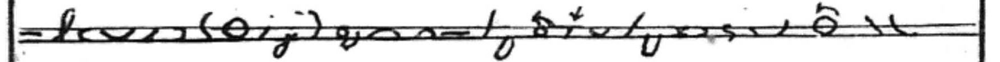
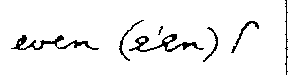

# Orthic Consolidated – Reference DRAFT

## Being an Improved and Expanded Consolidation of Various Books with Clarifications, Additions, Warnings and Opinions of the Author and Others who Might Comment


By CricketB, Reddit u/CrBr

xxx copyright, license
xxx canonical copy, revs
xxx

# remember they have already read the Manual !!!

# Introduction to Orthic Consolidated 

Orthic shorthand is a good first shorthand for most students. It is quick to learn at the Fully Written Level, and multiple levels can be used in a single sentence without confusion. Based on stroke counts, its speed potential is comparable to other office and personal use shorthands. The Abbreviated and Reporting levels are even faster.

In keeping with tradition, I'll begin with deficiencies of previous books: 
* The rules are spread out over too many publications.
* The rules in the different books are sometimes inconsistent.

Callendar wrote the Manual in 1891, then, instead of updating it, he published the Supplement in 1982. This booklet moved some rules from advanced to intermediate, and even changed a few. Stevens wrote The Teaching of Orthic Shorthand in 1896, and, again, instead of writing a complete book, he told the readers to refer to the previous two publications. He also moved rules between levels, added some, and, I suspect, changed a few. Finally, in 1911, Clarey wrote Orthic Shorthand: Revised, Extended and Improved. That book brought together all the rules, changed a few, and removed the distinct levels.

This book combines all the rules from all the earlier books, except some that are only in the Reporting Style. It is *not* intended as an introduction to Orthic. The Manual or Revised is best for that. (I recommend the Manual, and anything Revised does differently just feels wrong to anyone who started with the Manual.)


This book addresses the first deficiency, hopefully without creating too much more confusion. It assumes you have read the Manual or Revised. [Cricket's Shorthand Course](cr-shorthand-course.md) will help with the second.

When cropping images, I usually chose just the rows showing the Orthic outline. There are usually enough longhand words in the image that you can use your browser's Search feature to find the rule in the text. Image file names are of the format concept-book-page.ftype, where page is the page of the original scanned document.

Many rules in the Supplement do not have images, and instead refer the large plate in the Manual for the Reporting level. Teaching sometimes improves on that. In these cases, I have only used images from Teaching. Teaching also has good examples of the ambguity some of the more complicated rules are intended to prevent. Revised is a mixed bag. It's clearly written, but some of the changes to allow more speed conflict with the earlier books and result in rules that are harder to explain. Some of its rules are only needed to accomodate Clarey's loopier style of writing. Sometimes, though, its explanations are better.

The Supplement does not always put the longhand and shorthand for a word on the same line, so some images will not have the longhand.

"No examples" or lack of examples with no note, means no example in the the dictionary or any of the books. If you find examples in other material, please let me know.

Hopefully it creates more clarity than confusion.

It is organized into the following parts: 

* Sources.
* Alphabet. Not really necessary by the time you're here.
* Notation.
* General Rules and Abbreviating Principles.
* Non-Alphabet Rules. Rules that don't apply to a specific letter.
* Joining Characters
  * Vowels Sounded Individually and Diphthongs
  * Consonants and Vowels
* Word Parts (Prefixes, suffixes, slurs, etc)
* Lists of Abbreviated Words

xxx means a section needs to be fixed

##  Acknowledgements

Many thanks to Jeremy W Sherman and Jacob Moena, who deciphered ancient handwriting, clipped hundreds of images, and assembled them into something readable. Also many thanks to Jeremy for his work on www.orthic.shorthand.fun, where you can find all the instruction books and additional reading material.


## Sources

**Phonetic Cursive**\
A Manual of Phonetic Cursive Shorthand\
Hugh L Callendar, 1889.\
<https://archive.org/details/manualofcursives00calliala/manualofcursives00calliala>\
This is the precursor to Orthographic Cursive, and is included for historical reasons only. The introduction discusses "other, inferior systems" and is a fun read.

**The Manual**\
A Manual of Orthographic Shorthand: The Cambridge System,\
Hugh L Callendar, 1891\. 
<https://orthic.shorthand.fun/manual>\
Rendered into Markdown and annotated by Jeremy W Sherman.

**The Supplement**\
Supplement to the Manual of Orthic Shorthand (Orthographic Cursive)\
Hugh L Callendar, 1892.\
<https://orthic.shorthand.fun/supplement>\
Rendered into Markdown and annotated by Jeremy W Sherman.

**Teaching (Parts 1 and 2)**\
The Teaching of Orthic Shorthand: A series of lessons for the use of teachers and students of Orthographic shorthand (Callendar's system)\
W Stevens, 1896\
<https://orthic.shorthand.fun/teaching-pt1> , <https://orthic.shorthand.fun/teaching-pt2>\
Teaching Part One is Fully Written, through Ordinary and Abreviated. Part Two is Reporting.

**Revised, Extended and Improved**\
Orthographic Cursive Shorthand (Orthic) ; The Cambridge System ; Revised, Extended and Improved\
Hugh L Callendar ; E Clarey, 1911\
<https://orthic.shorthand.fun/> under Resources\
Some of Clarey's explanations and examples are good. Some of his additions and changes are not. His penmanship style is very different, and worth experimenting with.

**Dictionary**\
<https://orthic.shorthand.fun/dictionary>\
Clipped, assembled and programmed by Jeremy W. Sherman\
Includes a notation that will encode Orthic text into ASCII. Contains all the example words from the Manual and the Supplement, and several examples from writing specimens in the Manual. 

*If not stated, the rule comes from The Manual.* The wording of each rule is a combination of the original sources and my own understanding. I have made very little effort to clarify who said what, but much effort to show where the concept was introduced. Note that, since it's difficult not to pick up the original accent, you cannot rely on that to separate my words from any other author's.

**Jeremy W Sherman**\
Orthic expert, creator of <www.orthic.shorthand.fun>, transcriber of the Manual and Supplement, programmer and clipper of the dictionary. Jeremy found many examples and counter-examples for Consolidated, and provided valuable comments on the text.


## Styles or Levels

The order is:
- Fully Written
- Ordinary, Abbreviated aka Correspondence aka Supplement
- Reporting

The books all agree what is in Fully Written, but don't agree on the rest. In general, newer books move rules down, as they are proven safe, useful, and easy to learn.

My intent was to show clearly when a rule applies to a style other than Fully Written. Then I forgot to keep notes. I tried to get them all, but no promises.

## Discrepancies

Often a writer will explain a rule, then break it on the next page. I think that happens for a few reasons:'
- They first learned Pitman, so spelling phonetically is automatic, even when they try to write FW.

- They are so used to writing advanced levels that they forget the less obvious differences between that and FW.

- It's often difficult to explain a rule, so they over-simplify without realizing it (or they intend to follow the rule as written but forget).

- They are used to writing for expert readers who can fill in the blanks easily, and don't need perfect penmanship.

Don't worry about it. The only true test of shorthand quality is whether the intended reader can read it at the intended time, for the intended purpose. (I strongly suggest you define that each time you pick up the pen.)

## Notation

Use the joining rules for Fully Written unless otherwise specified.

Letters in brackets are compound letters or slurs.

* ^ indicates the following letters are raised.
* . indicates a small gap to indicate omitted letters, as in Mode 2.
* _ indicates the following letters are lowered.
* \* indicates a dot on the line (or a tiny bit above). Always preceded and followed by a gap.
* : indicates a sharp join between vowels. Otherwise all vowels have rounded joins.
* I indicates dotted i. E is used if the dot is optional.
* Dot for doubled letters is not included.
* () indicates a compound letter.
* vowels are listed in order written.

Where there is more than one way to write a letter or compound, I added numbers. Often the number chosen reflects the shape of the compound, as a mnemonic, but this was not always possible. Eg **ing** : (ing1) = straight, (ing2) = curved, chosen because 1 is straight and 2 is curved. (Cricket)

# The Alphabet

Manual: ab, act, bad, cabby, adder, fed, left, get, hit, city, jug, luck, like, melt, know, proof, plate, query, roller, sort, trust, upper, wavy, wow, exit, eyes, size

# General Rules for Fully Written Style


### Two Sizes of Letters
Most books say use 1:3, but then use less in the Two Sizes image, and somewhere between 1:2 and 1:3 in actual writing. It's rarely a problem except for debates between students.


Manual: alphabet, letters grouped by size, st, ste, en, ens, inst, nt, er, ers, abs, against, epitaph


Teaching 1: Alphabet, CH, ing1, ing2

\
Teaching 1: Letters grouped in another way.


"The actual **size** of the characters may be varied according to circumstances, such as the goodness of the light and the writing materials. The minuteness of any kind of writing is limited by the size of the smallest characters. In Orthic the small size may be made as small as desired, and the small circle may be reduced to a dot. But it is best to make the small characters about one-twelfth of an inch \[2.1mm\] long, and the large ones twice as big." (Revised, p3, General Rules)

### Position on the Line
The rules for this are a mess.

Just do what looks right to you. If you read something that doesn't make sense, remember some writers will write higher or lower than you do.

**Details:** In the Manual, Callendar claims the first letter sits on the line, then on the same page (Two Sizes of Character) starts *epitaph* above the line, with P sitting on the line. In St John II, *it* and *in* start on the line and go upwards. T is a downstroke, so the rule isn't first downstroke. Stevens has his own version. On the first page of the Preface to the New Testament <https://orthic.shorthand.fun/reading> *it* starts below the line and T sits on the line. Revised says, "The first letter of a word generally begins or ends on the line, but A, E and O may be raised when preceeding downstrokes." (Revised, General Rules, p3)

Omitted letters are often indicated by relative position (mode), in levels above Fully Written.

### Doubling a Letter

Most letters are doubled by putting a dot underneath. EE, II, EI and IE are exceptions. The dot is omitted unless absolutely necessary to avoid confusion with a similar word in all but the Fully Written Style.

\
Manual: odd, too, ee, sleep, sup

\
Teaching 1: aa, Baal, foot

\
Teaching 1: ee, ei, reed, reid

Where there are double a's or oo's, leave out one. (Teaching 1)

\
Teaching 1: command, son, soon


### Connecting Stroke

xxx A short connecting tick maybe used after ER, TH, etc, and when they are followed by G, P and S. (Revised, p3, General Rules) Note: This rule is only in Revised. Clarey may need this more than the other writers due to his different style of writing.

 
> dirge, faiths, serpents : Revised

### Dividing Words


Manual: lawsuit, Woolwich, virgin

You can divide a word to keep it on the line. Beware that this might be confused with writing by mode.

### Punctuation

Manual: hyphen, dash

So they are not confused with raised A (and) and raised O (though).


Does this also apply to brackets, so they aren't confused with G and K?

### Initial Capitals 

Indicated in a few ways.

Manual: Jack, Clay, S.E., L.S.W.R. (London and South West Rail Company)

\
Teaching 1: Ealing

See S to distinguish intial S from initial P. (S is vertical.)


# Vowels Sounded Individually and Diphthongs

Some concepts are under the prominent letter, instead of the first in the group.


## Vowels Sounded Individually

Check both orders of vowels to see all example words.


Manual: re-enter, Oölite, Deä, create, Leo, fiasco, serious, fuel, poem

Note: Callendar breaks this rule a few pages later, in the Manual, Specimen of Fully Written Style, "abbreviation."

Manual: abbreviation

He changes the order of AI and rounds the corner even though the vowels are sounded separately.

\
Teaching 1: oar, Laon

## Vowels Sounded Together, Diphthongs

Orthic uses an older definition of the word *diphthong*.

\
Manual: ai, oy, ou, eau

An upstroke vowel following or preceeding Y is written with an angle. (Teaching)

\
Teaching 1: ye, obey


## A

### A with E,I,Y
\
Manual: ai, au, ay, days, quay, says, hay

The pattern seems to be use the downward form after an upstroke. (Cricket)

xxx note to self: search dictionary and text of samples for ae, ea, ai, ia, ay, ya; make list to practice

Teaching 1 gives several examples of what might happen if you use the wrong order.


\
Teaching 1: dear, dear(wrong), demr


\
Teaching 1: day, dm(wrong), dm or dny, may


Teaching 1 recommends that AI always be written in AI order, regardless of surrounding letters, but does not say why. IA is written IA. It also recommends dotting the I. The Manual and Supplement do not have any counter-examples. Cricket thinks this rule is unnecessary, but will think carefully each time they ignore it.


\
Teaching: meal, mail

Other Examples: saith, said, remains -- Manual, FW and MaCaulay


### AO, OA
Write A above O, possibly towards the correct end of the O.

\
Teaching 1: oar, Laon

## E


Manual: ee, ei, ie, steep, stupid, eu, ew, new


Manual: seen, sun


Manual: ea, seat, seas, reat, real, pearl, years
## I


Manual: social, optician, chief

## O

Manual: oar, or, oak, oi, toil, ou, out, oy, boys

## U

Manual: ua, guard, suit

## Y

An upstroke vowel following or preceding Y is written with an angle. - Teaching

Teaching 1: ye, obey

# Joining Consonants

Some concepts are under a letter other than the first, if the other letter is sounded more strongly, or it makes for a more sensible explanation.

## A

All examples from the Manual are under Joining Vowels with Vowels.

A on the line is *a*. A raised is *and*.


## B


Manual: bd, rob'd, bj, object, bl, able, br, bray, bs, absurd, bt, subtract, bv, subvent

BE-: See Word Parts.

xxx BL can be shown by reversing the direction of the B loop, and optionally writing the L inside the B. (Revised, pg 4, Compound Characters)

xxx Revised: BL, BL, black, sensible, bleak, trebly

## C


Manual: ck, suckle, cl, close, cr, crutch, ct

CH is a circle the same size as H. H, CH and WH are described under H. Note MCH, NCH, SCH have different rules, described with H.

CHL, CHR: Put the L or R inside the larger circle. Observe the L or R lies above/below the vowel line.

\
Teaching 1: chlo, chro

CD, CT: Blend, so it looks like a C with a long, very long, bottom. This rule isn't stated, but there are many examples in the Dictionary. Search for CED. (Cricket)

TCH. The T may be omitted. (Supplement and Revised)

## D


Manual: dge, judge, dj, dle, fiddle, dr, dread, dv, dw, dwell

DEN series. In DN the letters form a wave. The end of one letter and the beginning of the next share a line. In DEN, the combination begins and ends on the same line. In DEEN, there is actually a line This is what most beginning writers think DEN should look like. I cannot find anywhere this is stated clearly, but it is consistent across all 4 books. (Cricket)


Manual: student

DD, DT and TD can be written as a double-wide D. See Word Parts.

DV can be written as a double-wide V. See Word Parts.


xxx Revised: advert, avert

## E

All examples from the Manual are under Joining Vowels with Vowels.

EC, ENC, IC, INC: This is often tricky, but fortunately the word is usually clear from context. There are no rules, but many examples in the dictionary. (Cricket)

EC: Make sure you do not go down as I changes to C. The first part of the C retraces part of the I. There are many examples in the dictionary, but they're all burried in a large plate.

ENC: Make sure that you do a full N. The first part of the C does not retrace any part of the N. 

## F


Manual: if, ft, soft, fd, puff'd, fl, fr, rifle, afraid, fs, skiffs

F is joined without an angle after vowels.

FS: See KS

FR: Vowel comes off the top to save time and going around the circle twice. See R for rule. Examples: afraid (above) and fray (Manual, L)

## G

\
Manual: gh, high, gl, glory, gr, agree, gn, sign

Rest of the word below the line signifies G (or termination with G). (Teaching 1)

\
Teaching 1: gn, foreign, age, magnify

## H, CH, and WH

Manual (H): cha, hat, chat, what, which


H, CH, and WH are all large circles, and described here for easy comparison. All books agree that H is above the line and is written ccw, unless following S or P. Most agree that CH is cw and below the line.

Most of the time, it is safe, and faster, to omit the H in WH. There are, however, times when you need to record the exact spelling. I prefer to start WH at the bottom, to make an enlarged W, or to start it at the right, instead of at the top.

Each writer has a slightly different way to write WH.


\
Manual (CH): ch, chair, Christ, ache, ahead


\
Manual (W): who, ha (have)

WH: Enlarge the W to look like H. (Teaching 1)

\
Teaching 1: th, who


MCH: Teaching Part 1 Common Words (below)

NCH and SCH can be written without an angle or break – ie in the other direction, still below the line. (Supplement) 

The Supplement also shows MCH doing the same. (Cricket)


\
Supplement: inch, such, much, school


xxx

get images from all writers -- some interesting variations

xxx manual, sup, rev : school


## H, Other Joins

HR

ther, others, ard, toward\
R goes inside H.

THR, THER: T can be omitted.

See P for PH, PHTH and PTH. Sometimes the H turns in the opposite direction.

See SH and TH for those joins. Sometimes H is smaller or not completed.

```
xxx

**Revised**

CH is written three ways to facilitate joining. The first is used in compounds CHR and RCH. Some of these are above the line. (Revised, p4, Compound Characters)

(Astute readers will see significant differences in some words between Revised and the other sources.) 

* CH-1, CH-2, CH-3, Christ, arch, filch, chat, such, scholar, scheme, when (Revised)

CHL may be written in two ways. (Revised, p4, Compound Characters)

* CHL-1, CHL-2, chloric, richly, speechless (Revised)

In adding inflections to CH they may be joined either above or below. (Revised, p7, How to Write and Join the Characters)

* Aches, pitch'd, filches, pilchard (Revised)

WH

* Whose, when, chose, chin (Revised, p5, Compound Characters)

xxx ends
```

## I

All examples from the Manual are under Joining Vowels with Vowels.

Stevens (Teaching, Psalms) I below the line in short words such as IN. This is not in any rules.

\
Teaching 1: it


IC vs INC: This is often tricky, but fortunately the word is usually clear from context. If you need to make it clear, see advice under EC. (Cricket)

ING: See Word Parts.

## J

Manual has no images.

## K

Manual has no images.

KS, FS: S joined to the finish of F or K is better turned up rather than down. (Teaching 1)

\
Teaching 1: ks-correct, ks-not-recommended\
(No examples for FS.)

K replaced with mode 3. Only for take, sake, and their inflections. (Teaching 1)

\
Teaching 1: take, taking, sake

I don't like this. Take / tag can be used as noun and verb. Too much chance of confusion. Sake is probably safe. An entire rule for two root words. One isn't safe and the other isn't a common word. I'd ignore this rule. (Cricket)

KR: Vowel comes off the top to save time and going around the circle twice. See R for rule. Examples: None, but it makes sense that the rule applies to KR since it applies to FR.


xxx Looks, works, walks, like, beak, duke (Revised)


## L


Manual: black, bread, clay, crow, addle, dry, flow, fro, glad, grade, play, pray, little, litre, slay, Israel, held, herd, world, already,\
lf, half, lk, walk, lp, help, lt, wilt, lv, salve

When standing by itself as an initial, L or R is prefixed by a short stroke showing its direction. In other cases the distinction is obvious.

BL and BR are a bit tricky.

\
Teaching 1: bl, br

The circle is so small that it can fit nicely inside T, for RT and TR. (Cricket)

\
Teaching 1: pl, br, fl, fr, ml, mr

Other shorthand systems (notably Gregg) base direction on the surrounding strokes. This can get confusing when switching systems. Each Orthic book has a mnemonic or two to help. (Cricket)


xxx Revised: waltz, zebra (Alphabet)


## M


Manual: mp, imply, mb, limb, ms


See DEN for D, T, N, M blends.


## N


ng, singer, nsp, inspect, nc, since, nch, inches, nd, India, nf, infer, nj, injury, nl, unless, ns, sense, nt, sent, nk, sink, nqu, inquest, nv, invent

NG, NSP: No angle need be made in the compounds NG and NSP. (N followed by downstroke).

See DEN for D, T, N, M blends.

NCH, SCH: See H.


xxx NK has no angle (Revised)


xxx Revised: inspirit, inspect, ensphere, conspire, wink, rank, sink, tinker, ginger, hang, sting, singer\
  (Note that Revised uses a large H in SH.) inherit, inhale, enrich, enroll, inward, enwrap  


## O

All examples from the Manual are under Joining Vowels with Vowels.


xxx

OYS: Turn the S up, as for FS and KS (Revised)

Revised: cloys, employs, coat, cot


## P

PS, SP, SPS: S is more shallow and the angle is rounded.

PH: H might be on either side depending on following letter.

PHL, PHR: small circle goes inside the H.

PR: Vowel comes off the top to save time and going around the circle twice. See R for rule. Examples: present, proof (Manual, Alphabet), present (Manual, P)

Note that this rule does not apply to SH! (Cricket)

\
Manual: sp, sphere, ps, cusps, ph, phrase, phlegm, pl, place, pr, present, pd, depth, phth

\
Teaching 1: sp, ps, sps

\
Teaching 1: ph, ph ```(ph-b), (ph-d)```, phar, phy


xxx
PW uses angle-W (Revised)


xxx Revised: PHL, PHR, PHTH, PW, speak, trips, cusps


xxx The first (ccw, H to the right) is used in the compound PHR, before E U, and final. The second (cw, H to the left) is used in other cases. (Revised)
 

xxx PH-1, Phrase, philter, sulphur, epitaph, PH-2, phase, phlegm, physic (Revised)

## Q


Manual: esquire

All four books state that Q is always followed by U, and thus U can be omitted. This is outdated.

If you are confident you will remember how to spell the word, use just the loop, as Callendar recommends. Otherwise, do what some phonetic writers do: Write the correct spelling and the outline inline, in the margin, or the back of your notebook. I recommend margin (visible) and back of book (findable).

The position of Q on the line varies with writer.

Manual: See alphabet.

\
Teaching 1: Q

## R


Manual: fierce, rd, rt, rf, rk, work, rn, learn, rp, rs, rv

See L for details and contrasting examples.

RCE: Written like lower-case E, according to the Manual. As near as I can tell, Callendar makes a slight angle at just before the R, so your pen goes to the right and the R is closer to being a circle. If you're happy making R a loop instead of a circle, this complexity can be avoided. (Cricket)


RH: The R can lie just outside, or curl within, the H circle. (Teaching 1)


OHR is short for *other*. This is not the same as R inside H = THR as I first thought. (Cricket)

PR, SR, FR, KR: It is usual to write a vowel following R attached to an upright letter from the top, as in PRA, to save time, and to avoid going round the circle twice. (Teaching 1, Lesson 3, L and R)

This conflicts with the rules for SH. SH exits from the top and SR exits from the bottom. See S for details. (Cricket)

\
Teaching 1: pra

Manual: proof (alphabet), present (P)


## S

SHR: R is inside H.

SH: H is smaller. Exit off the top to distinguish from SR. (Manual and Teaching 1)

xxx need a mnemonic for this! Shoot off the top?

Note: This is an exception to "comes off the top" described under R. (Cricket)

SH is 3 times as small as PH (```ph-b```)  (Teaching 1)

SHR: Very tiny R inside the small H. (It doesn't have to be a circle, just enough to look like you tried. Cricket)

SW: See W for alternate form of W.


Manual: shed, Tisri, shred, school, sc, scent, sk, sl, slew, sm, sn, sp, sphere, squ, square, st, still, sw, answer

\
Teaching 1: shro, sho

FS, KS: See KS.

SP, SPS: See P.

NCH, SCH: See H.


xxx SCH: Contrast Manual vs Revised.


S is vertical when written alone, to differentiate from E.


Manual: S.E.


xxx Revised: in AYS and OYS (in that order, not YAS or YOA) S goes up to the left.

xxx Revised : S after AY, OY


## T

Write TH in order.

\
Teaching 1: TH

TH-final: Don't close the H.


with, both, tch, sketch, tle, turtle, tr, truth, tw, two

Callendar writes "month" with the final H almost completely closed, and not very circular. (Supplement, Examples of Abbreviations, below.)

TH-initial: See Word Parts for raised mode. Optional.

THER: R goes inside H. See R in Joining and TH in Word Parts.
xxx which is it?

THER: H with R inside. Omit the T. (Same as HR.)

See Word Parts, TH- for TH at the beginning of a word.

## U

All examples from the Manual are under Joining Vowels with Vowels.

see E, Joining Vowels, for E vs U

## V


Manual: minster (not minister), Minver, stew, view

V is distinguished from ste by its size.

See Word Parts: EV for all vowel-V-vowel combinations.

## W

Use left-W at the beginning of a word, except before R. It can start at the 3:00 position, to form 3/4 of a circle, for ease of writing. (Cricket)

Again, there is an exception: WR goes ccw.

W goes upwards. C and F go downwards.


Manual: way, woe, wet, write

Another way to remember *W* is to point out that whether initial or final, *it is an upward tick*. The letter may be written either circularly or angularly. (Teaching 1)

The angular form of W is used after S. (Teaching 1; demonstrated but not explained in Manual)

SW: To add S to final W, elongate the loop.


Manual: sews, cows, laws, wk, hawk, wl, owls, wn, dawn

\
Teaching 1: wo, ow, owing, owing, wd, wd, sw.

Change the exit angle of W to blend with the following letter.

WR: Distinguished from TH by its size.
WH: See H.
WS final: The addition of S forms a loop.
WK, WL, WN: Notice how the letters blend. (Cricket)


## X

*X* is made up, as in longhand, of *C* and *S*. (Teaching 1)

You can often omit the S, or merge the S with the following letter. (Cricket)

There is no need to make an angle in the combinations *Exh*, *Exch*. (Manual)


Manual: xh, xp, xt, extent, exhort, expense

As there is no English word beginning with X that is not preceded by E, this character may be used to represent EX. (Teaching 1)

Out of date! I recommend a similar procedure as for Q: If you want to be sure you spell it correctly, write the outline and the correct spelling in longhand in a standard place. (Cricket)

## Y

Manual: yacht, yet, yore yule


Manual: applied, tries, easiest, happiest, ```aplyd, trys, easyst, hapyr```

Let Y stand unaltered. In adding inflections to words ending in y, the y is not changed to i or ie.

Teaching 1: list but no shorthand\
tries -> ```trys```,  applies -> ```applyd```

## Z

Manual: daze, Fitz, puzzle


# General Methods of Abbreviation, including Ordinary Style

The most important rule of all in reporting practice is never to use a mode or an abbreviation that causes hesitation or waste of time, not to worry about trifles; and to practise writing from dictation and transcribing till your notes become perfectly fluent and cursive and legible. A study of-the examples which follow will probably be more useful than many pages of hints. (Supplement, Notes on Reporting)

## Omit A and O before M and N

Manual: can, con, alone, woman, ```cn, alne, wmn```


Manual: band, bond

An omission of this kind can always be corrected by writing the omitted character above.

## General Method of Abbreviation

The general method of abbreviating long words is to write only the first syllable, and, if necessary, to indicate the termination by writing the last letter or two, separated by a small interval from the first part.


Manual: different, difference, acknowledge, especially, circumstance, extraordinary, representative


## Modes or Positions

xxx is it clear whether the mode is relative to the previous letter, or to lifting the pen from it? Some egs in supplement imply the latter. (Grumble. Absolute positioning would be easier to describe.)

xxx judge, forgive - the g is above the line, need to analyze previous letters to see if they make it clear.

Each letter that can be replaced by a mode is listed under Joining Consonants. Their use for shortening words beyond simple letter replacement is under Word Parts. 

Note that modes are relative to the preceding character. See "thoughtfulness" in Word Parts.

* First Position, Raised: B, P, TH, V (Supplement calls this Supra-Linear Writing)
  * B is only raised for the syllable B at the start of words.
  * TH is only raised at the start of words.
* Second Position, Normal (gap): all others
* Third Position: Lowered: G, J, K, L, QU

Teaching 1 describes the modes as above, on, and below the line, not relative to the previous letters.

xxx review images from Teaching, for all the above, and see which it is, if possible

The books claim this can be easily remembered by imagining where the rest of the word would be if the letter was not omitted. This is not actually true. (Cricket)

Note that the raised letters are in the front of the mouth. The lowered ones are in the back, except for L. (Cricket)

Why did they choose L and not R for this rule? (Cricket)

If the last part of the word is normally indicated by mode, use a dot.


Supplement: advantage, arrange, arrive, conserve, judge, knowledge, language, large, mortgage, super

xxx fix "alt text" everywhere -- but does this audience really need it?


## Drop the Dots

Dots are generally omitted in common words. This applies to I dot and doubling dot. (Manual)

Examples: Probably many, including the words in, it, if, him, his, will.

Drop them all, unless absoultely necessary. Be brave! (Cricket)


## Word Parts (Prefixes, Suffixes, Slurs, Blends, Compound Characters, etc.)

Prefixes, suffixes, and common letter groups. Description is under the strongest sounding letter.

See Notation above.

### Short Vowels

Short vowels may often be slurred, especially in terminations. (Supplement, Notes on Reporting)

manner: ```(mn)r```
upper: ```upr```
national: ```nnl```


### ACQU ```aq```
\
Supplement: acqu

### -ACTION ```.n```

-ATION is a common ending, and it is wise to shorten as much as possble. (Teaching 1)

Really? (Cricket)

\
Teaching 1: termination

Note Stevens' cleverness using the word *termination*. It's hard to see here, but the previous line in the book is, "-ion: This termination is shown by..."


### ADJ ```aj```
\
Supplement: aj

### ADV, ```(dv)```
Slurred into one large character compounded of d and v.
xxx get from Manual if not in Teaching 1
\
Supplement: advantage


### -AGE
See -GE.

### -AL

The softly sounding vowel can be slurred in terminations such as "al". (Teaching 1)

\
Teaching 1: final, upper


### BE-, ```^```

This prefix is peculiar to a special class of English words, and may also be expressed by writing above the line. Note that been and being are chosen to not conflict with than and thing. (Supplement, Teaching 1)

This abbreviation is only to be used when "be" is a distinc prefix. (Teaching 1)


\
Supplement: be, being, been.

\
Teaching 1: behold, be-ad (not bead)

\
Teaching 1: been, better, best, bring, thing

\
Teaching 1: be


xxx Teaching 1: behold, been better, best, by

### CH compounds: MCH, NCH, SCH
These combinations may be written without an angle or break.


\
Supplement: inch, such, suchas, school, much

Manual: school


xxx
Compare *school* in the Supplement and FW in the Manual.

xxx and in revised

I don't see why it has to turn ccw in the first place. It doesn't change the look in most cases. Perhaps it's a mnemonic (C), or a way to keep it a circle instead of a loop, or to ensure the preceeding letter doesn't curve. (Cricket)

The Supplement says *much* is an abbreviation. I say it's evidence you can turn CH in either direction. (Cricket)

xxx revised uses big h for sh ; how does that affect school ?

### CHL ```cl```
Supplement, Notes on Reporting, Slurring


### CIRCUM ```cir.```
Written ```cir``` followed by a short break to represent *cum*. ```circe``` is the the regular longhand abbreviation for the word *circumstance*. (Supplement)

\
Supplement: cir, circumstance

### COM-, CON- ```*```


COM, CON: Expressed by a dot on the line written close in front of the word. In taking notes, the dot may generally be omitted or expressed by Mode (2). In correspondence it should be retained. (Supplement)

In compound prefixes, such as incom-, discom-, etc., the com- or con- is expressed by Mode (2). (Supplement)


Supplement: com-, con-, come, came, command, comment, common, compound, comprehend, concerning, conserve, consider


...or by leaving it out altogether and writing the rest of the word quit close to the preceeding word. (Teaching 1)

\
Teaching 1: "I commend" (with dot), "I commend" (written close to the preceeding word)

The prefixes in the front of the mouth are raised. C is in the back. Why isn't it lowered? (Cricket)


### CT

No angle between C and T, so bottom of C is wider. (Supplement, Reporting)


### -D
See ED.

### -DGE
See GE

### DJ
In words having the combination DJ, leave out the D. (Teaching 1)

xxx ?? See DG for examples.

### DD, DT

Slurred to a double-wide D. (Teaching 1)

\
Teaching 1: DD


### DV ```(dv)```
DV is slurred into one large compound character, a double-wide V. (Supplement)


Supplement: advantage

\
Teaching 1: dv


### -ED ```d```

Manual: used, kissed, stirred, ```usd, kissd, stirrd```\

### -ENCE ```.ce```
Supplement. No examples.

### -ENCY ```.cy```
Supplement. No examples.


### -ENT ```.t```


\
Supplement: agent, apparent, comment\

### -ER

The softly sounding vowel can be slurred in terminations such as "al". (Teaching 1)

Probably also in ER, since there's an example.

\
Teaching 1: final, upper

### EV, EVE ```^```


\
Supplement: every, evening, event, evident, evil

\
Supplement: even, written e'en to distinguisn from than or then.

It is clear that the shorthand chracters EVE must throw everything following the final E above the line., and it is also evident that such words acannot clash with that peculiarity of the English language TH, except in the words even and then. (Teaching 1)

Raised V can be used in any part of the word. Raised TH is only for the beginning (Teaching 1)

\
Teaching 1: given, loved

It is better to write the vowel after L and R, to show the direction. (Teaching 1)

\
Teaching 1: evident, conceived, ever

Use a raised dot if eve was the last part of the word. (Teaching 1)

\
Teaching 1: give, love, rove


### EX-
See X.


### -FUL ```fl```
\
Manual: useful, beautifully, ```usefl, beautifly```

Beautiful shows one reason for retaining the Y in the inflected word. (Teaching 1)

\
Teaching 1: useful, beautiful / beautyfull


### -GE, -DGE, -AGE
These and derived terminations are similarly expressed by a dot below and to the right to indicate the g.


\
Supplement: knowledge, agent

### -GN
Indicated by n written below to indicate the g\

\
Supplement: foreign, sign

\
Teaching 1: gn, foreign, age, magnify

### -GRAM
Indicated by M written below to indicate the g, similar to -gn. (Supplement)


### -GRAPH ```ph```
Supplement. No examples.

### -HEAD ```hd```
\
Teaching 1: head


### -HOOD ```hd```
\
Manual: manhood, ```man.hd```

xxx is it detactched here because of rule, or ease of writing?

### -IGHT ```_t```

It is better to show the vowel after I and R, so as to show which consonant it is by the way it is turned. (Teaching 1)

\
Manual: night, light, ```n_t, le_t```

\
Teaching 1: Demonstrating how raising is just writing the word in full, then erasing the IGH.\
lite, right


### -ING ```(ing1), (ing2)```

\
Manual: using, saying, seeming, king, sing, singing.\
```us(ing1), say(ing2), seem(ing2), king, sing, sing(ing2)```

This form is used only for the inflection "ing" and not in other words. It is better to curve the stroke after D,M,N,T,V and vowels. (Manual)

I vote we use it in sing and king. It's already used in thing and bring. (Cricket)

### -ION ```un``` 

\
Manual: action, ```actn``` \
Dotted if necessary.

\
Teaching 1: ion, action

See also -action.

### -ISM ```.m```
Supplement. No examples.

### -ITY ```^y```

Manual: abilities, peculiarity, ```ab^ys, pec^y``` \
Note "abilities" -- y stands unaltered.

Teaching 1 specifically says "above/below the last letter," and explains that's where the Y would be if the whole word was written in Orthic. Looking at the examples, he means 3rd position (below).

\
Teaching 1: pitty, city, truly, nearly\
Words are FW and Abbreviated.

### -IVE
See -ve.

### -LESS ```ls```

Manual: thankless, fearlessness, ```^ankls, fear.lsns```

### LTH

L maybe slurred with the T in such words as wealth, health, etc. (Teaching 1)

From other examples, I think this means L can be omitted. (Cricket)

### -LY ```_y```

Manual: nearly, easily, dailies, ```near_y, easy_y, day_ys```

Note vowels in order for smoothest writing, y stands unaltered twice in dailies. (Manual)

Note: The y seems to be under the word, not just below it. (Cricket)

\
Teaching 1: pitty, city, truly, nearly\
Words are FW and Abbreviated.


xxx do we need even more notation for Y under a word?

### MANGA, MAGNI ```m_```

Written m, the rest of the word being placed below to indicate the g. (Supplement)\
\
Supplement: magnify

### MB ```(mb)```
May be written with a single character somewhat like mp , but beginning and ending on the line. (Supplement)

\
Supplement: mb, mp

\
Teaching 1: mb, member, dv

xxx MBS, when preceded by E, I or U, the S turns up (as after F and K). (Revised, p7, Slurs

xxx Revised: MB, timber, lumber, lamb, temper, lumper, lamp – fix the order\
  Kembs, climbs, numbs


### -MENT   ```mt ```

\
Teaching 1: ```mt``` 

### MIS- ```ms```
Written ms, omitting the i. 
\
Supplement: mis, mistake

### MM, MN

Double-wide M. Vowel is left out. (Teaching 1)

\
Teaching 1: mm, mn

### NCH
See H.


### -NESS ```.es```

Manual: happiness, thoughtfulness, ```hapyns, ^otfl.ns``` -- ***Deprecated***

This termination should be written ‑ess detached, by the general rule, and not ns as given in the Manual. [E.g. goodness.] Detached n and ns can then be used, as in longhand, for the expression of the common terminations ‑ation and ‑ations. (Suplement)


Supplement: goodness


Deprecated in 
xxx suplement ?? used for ??nations??

Note in thoughtfulness that ns is not marked as raised. It is in position 2, and positions are relative.

### -NG  
See ING.

### -OLOGY ```Ogy```
Supplement, Notes on Reporting.


### -OUGH ```o```
\
Manual: ought, brought

\
Teaching 1: ought, thought

### -OUND, -OUNT ```ou```

There are examples of this in the Supplement, but it isn't listed as a rule. It is listed as a rule in Teaching 1.

\
Teaching 1: round, sound, count, counter, county, country


### PER-, PRO-, PRE- ```^```


Supplement: person, present, promise, comprehend, super, supra, private

Pre- and pro- are distinguished from per, if necessary, by retaining the vowels e and o. The cases, however, in which it is necessary to make the distinction are very rare. (Supplement)

If working in a field you are not familiar with, it's probably best to keep the vowel. The cases are not rare! (Cricket)

When any of these prefixes occur in the middle of a word after another prefix, as in the words unbelief, compromise, etc., they are expressed by Mode (1) (raised), that is to say by writing the terminal portion of the word close above and to the right of the initial prefix. [E.g. comprehend.] In the prefixes super, supra, hyper, the per is similarly expressed. (Supplement) (unbelief, compromise, hyper do not have written examples.)

The allied prefix pri may be expressed in the same way as pre in some common words. [E.g., private.] (Supplement)

Only for prefixes, or quazi prefixes (Teaching 1)

### PARI-, PERI ```^```


Supplement: perceives, person

These Greek prefixes may also be expressed by supra-linear writing for the same reason. Peri is distinguished by retaining the i; it may be regarded as a special case of per. (Supplement)

Only for prefixes, or quazi prefixes (Teaching 1)

### SCH
See CH, Word Parts

### -SHIP ```.p```

Supplement: worship\
Not detatched? Worship might be special, given the typical practice material of the era. (Cricket)

### TCH ```ch```
The t may always be omitted in this combination. (Supplement, Teaching 1)

No examples found.

### T

T may generally be slurred in-the terminations ty (20) and th, thus duy = duty, wih = with, ohr = other. (Supplement, Notes on Reporting)

T may be slurred (omitted) in such words as duty, bounty, etc. (Teaching 1)\
Supplement said it better. (Cricket)


### TD

Very wide D. See DD.


### TH- ```^```

Use raised-mode only when TH begins the word, except in the case of the word *although*. (Teaching 1)

\
Manual: the, they, this, them, tho', that

T may generally be slurred in the termination -th. (Manual, Notes on Reporting)

with: ```wih```\
other: ```ohr```


\
Teaching 1: Demonstrating how raising is just writing the word in full, then erasing the TH.\
although

The only case of a word written above the line and not presupposing initial Th is the word “and” signified by a, written above the line. (Teaching 1)

What about words starting Be? (Cricket)


### -THER ```(ther)```

\
ther, others, ard, toward
xxx

Slur the T into the H circle and put the R inside. (Teaching 1)

\
Teaching 1: HR, other

### -TION
See ION.


### TRANS-

Written trs, as in longhand. [E.g. transact.]\
\
Supplement: transact

### -TY

T may generally be slurred in the termination -ty. (Supplement, Notes on Reporting)

duty: ```duy```

### -VE, -IVE ```^*```

A dot above and to the right of the word to indicate the V. When the word is inflected the last letter of the inflection is substituted for the dot.


Supplement: arrive, gives, given, selves

xxx teaching 1 ever


### WARD ```ard```
\
Manual: hr, others, ward, twoards

\
Teaching 1: forward

### -WISE ```.se```
\
Supplement: otherwise


### X

EX: As there is no English word beginning with *X* that is not preceded by *E*, this character may be used to represent *Ex*. (Manual)

\
Manual: xh, xp, xt, extent, exhort, expense


# Phrases

Note: Time is saved by writing without hesitation, not writing fewer lines at the expense of more thought. Do not go overboard with phrasing. (Many books on Gregg.)

The last rule is an important one and should be thoughtfuly remembered. "Never try to contract if it is easier to write in full or if it porduces hesitation." (Teaching 1)

Apparently there's a "list of recognized contractions as issued by the Society (Teaching 1, Lesson 9) but I haven't seen it. (Cricket)

\
Manual: able to do; as it is; I am not; I have had; I shall be very; to be; ought to have been; with a view to.

"With a view to" is not worth phrasing for modern material. (Cricket)

\
Teaching 1: I should have been; with a view to; able to do so; as soon as


# Word Lists

In order of appearance. Use your browser's Find in Page function as needed. Words that abbreviated according to the above rules are not included, mostly.

Using the same notation as above.

## Manual


Manual: and, ```a```


Manual: the, they, this, them, tho', that\
```^e, ^ey, ^is, ^em, ^o, at```


ther, others, ard, towards


Manual: about, always, am, amount, an, any, are, were, be, been, because, between, but, can, can be, child, could, do, does, down, ever, for, from, friend, good, great, have, hold, made, might, more, most, not, can't (cannot), nothing, of, of the, on, only, one, once, perhaps, right, round, self, selves, shall, she, should, themselves, therefore, thing, throughougt, thro'out, to, into, under, week, would, which, with, you, yours
```
ABT, ALS, M, IM, AMT, AY, AR, WER, B, BN, BC, BETW, BT, CA, CAB, CHD, CD, 
D, DS, DN, ^R, F, FM, FD, GD, GRT, HA, HD, MDE, MT, MO, MST, 
NT, CNT, N(ING2), O, OE, N, N(LY), NE, NCE, PH (?? PRH), RT, ROU, 
SEF, SVS, SHA, SH, SHD, ^EMSVES, ^ERF, ^(ING2), ^ROUT, T, INT, U, 
WK, WD, WH, TH, Y, YRS 
```

Lots of other words burried in the various specimens. Most of the specimens are typed out on https://orthic.shorthand.fun/ . A few link to other sources for the text.

## Supplement

### General Methods of Abbreviation, text-only:

The following words were in the middle of a paragraph, in General Methods of Abbreviation. All the shorthand in the Supplement is on three pages, included just a bit below here. 

read, round, count, right, most, must, part, point, could, had, head, hood, would, world, most, must, might, ment
```
red, rou, cou, rt, mst, mst, pt, pnt, cd, hd, hd, hd, wd, wd, mst, mst, mt, mt
```

### Examples of Abbreviations

Supplement:\
able, ably, above, according, acqu, adj, advantage, after, afternoon, afraid, ages, agent, also, already, announce, appropriate, apparent, arrange, arrive, -ation, -ational, baptist, be, being\
```
not proof
ab, aby, abv, ac(ing1), aq, aj, a(dv), af, afnn, afd, a_s, a_t, aso, alry, a.pte, ap.t, ar_*, ar^*, n, nr, bpt, ^b, ^(ing1)
```

been, before, believed, better, best, bishop, body, both, by, thy, caught, changes, church, circum, circumstance, com-, con-, come, came, command, comment, common, compound\
```
^n, ^f, ^lee.d, ^ter, ^st, bp, bdy, bth, ^y, ^y, caut, ch_s, chr???, cer., cerce?? certe??, *, *, cm, cme, *nd, *n, cpou
```
xxx Callendar explains churc as ```ch-ch```

xxx circumstance, not sure.

comprehend, concerning, conserve, consideration, counter, country, course, court, Dear, different, difference, difficult, each, editor, else, endeavour, even (e'en), evening, event, every
```
*^hend, *c(ing1), *s^*, *sed, *sed.n, cour, coury, crs, crt, dr, def, def, deft, ea, edor, ls, _end^r, een, ^n(ing2), ^nt, ^ry
```


Supplement:\
evident, evil, executor, except, exercise, extraordinary, favour, -fection, -fication, foreign, forgive, forth, forward, found, from, -ge, -gn, -gram,\
half, hand, head, help, him, his, important, inch, individual, interest, -ism, -ive, judge, just, justice, king, kingdom, know, known, knowledge, lady, language, large, largest, letter,\
little, lord, make, makes, magnify, mb, mp, member, mis-, mistake, much, much more, month, must, morning, mortgage, nation, nearest, necessary, neighbour, -ness, goodness, nevertheless, next


### Notes on Reporting

Images for these are burried in the Supplement, Notes on Reporting. These ones don't seem to follow any specific rule.

tomorrow: ```tmow```
until: ```ul```
instead: ```ins(td)```
next: ```nst```

estate: ```este```
ultimate: ```ulte```
circumstance: ```circe```
institute: ```instute```


xxx month has fuller H


Supplement:\
notwithstanding, number, obedient, opportunity, over, page, pages, paper, part, party, particular, peculiar, people, perceives, person, philo-, philosophy, plaintif, print, practice, preconceived, present,\
private, promise, property, public, publish, quite, religion, report, respectively, satisfy, satisfactory, Saviour, scarecely, school, scribe, selves, serves, servant, several, sir, sirs, -ship, worship, short, shorthand, sign, signify,\
solicitor, some, sometimes, source, special, spirit, state, strong, strength, such, suchas, super, supra, superior, take, taken, transact, trustee, very, verify, -wise, otherwise, wisdom, word, work, world, young


## Teaching Part 1

Teaching 1 includes useful comments in the list. See [Jacob Moena's transcript of Teaching 1.](https://orthic.shorthand.fun/teaching-pt1)

### Common Words

\
Teaching 1: Also, each, any, because, cause, child, children, from, form, great, much, that, already, according, after, both, else, even, except, help, know, little, letter, part, sir, work, word, would / world, party

### Other Abbreviations, Mode 2
\
Teaching 1: different, difference, ultimo, interest


# Notes to Self

- The first part, how to write and join, will be sorted by longhand, with a few cross-references when several letters should be combined to clarify the differences.
- If it's not obvious where the full description should be, choose the earlier one.
- Assume readers have read the Manual. This is a review. Readers can see the arrows on the images.
- Abbreviation and Vocab sections assume reader knows Joins. Jeremy's notation is enough for them to make the image on their own. (Will need to add to the notation.)

-- using my own? combined letters/slurs/joins are in brackets, not codes
- Abbreviation and Vocab can sort either way (Orthic or English).
- The two ways of spelling are Orthic and orthographic. If I find a better word for the 2nd I can search/replace easily enough.
- xxx is note to self. Searching for them will be one of the final steps before publicataion.
- xxx add notation to the alphabet?
- xxx ??? Do I need to list the source along with the word in the text, for joins? Probably not. It's in the image.
- images -- file name is topic, book, page

- where a rule is not contradicted by later books, only the oldest is quoted, unless later books have better explanations or examples.