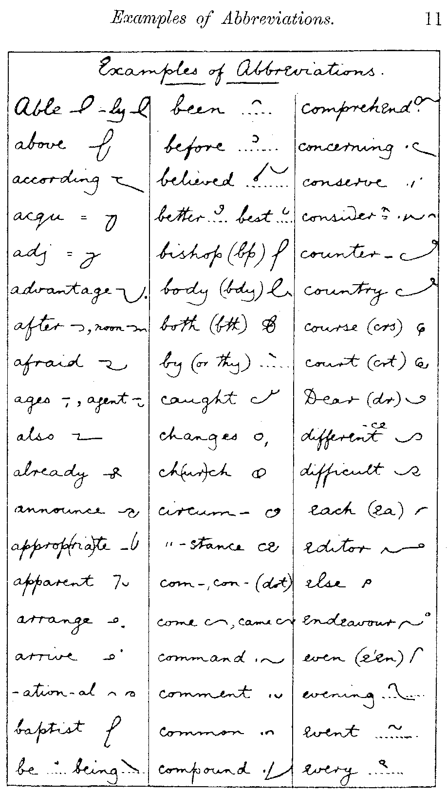
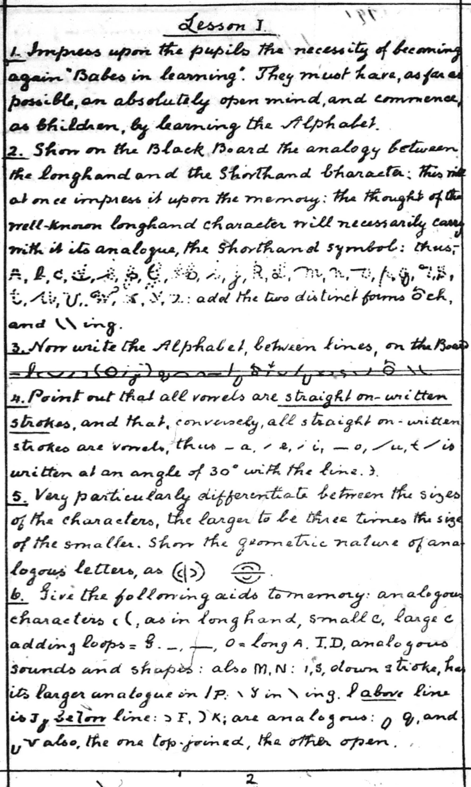
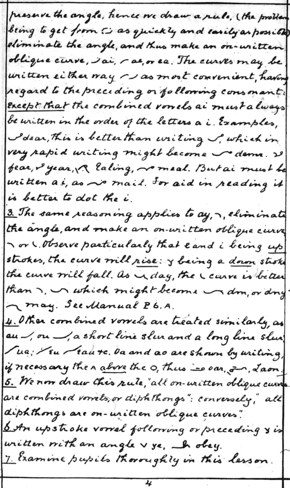

# Orthic Words From Examples

This document will help you find words used as examples in the various books. It is *not* a substitute for reading the books. Often the text around an example will highlight possible conflicts.

Where the original document spells it in a non-standard way, I have included both standard and Orthic spelling, for ease of searching.

It does not include searchable text of the Psalms or New Testament, but does have links to sites that do.

* Table of Contents
{:toc}

## License for Orthic Consolidated

Canonical copy at [Cricket's Shorthand Site](cricketbr.github.io/Crickets-Shorthand-Site) .

Orthic Consolidated is licensed under a [Creative Commons Attribution-ShareAlike 4.0 International License](https://creativecommons.org/licenses/by-sa/4.0/). Links to all sources are included, and licenses noted where available.

Use what you like, give credit where credit is due, and not where it's not due. Respect the work of those whose shoulders I stood on.

## Dictionary
[orthic.shorthand.fun](https://orthic.shorthand.fun/dictionary)\
Clipped, assembled and programmed by Jeremy W. Sherman\
Includes a notation that will encode Orthic text into ASCII. Contains all the example words from the Manual and the Supplement, and several examples from writing specimens in the Manual. 

## The Manual, Written by Callendar

A Manual of Orthographic Shorthand: The Cambridge System,\
Hugh L Callendar, 1891.\
[Typed at orthic.shorthand.fun](https://orthic.shorthand.fun/manual)\
[Scanned at google books](https://books.google.com/books/about/A_Manual_of_Orthographic_Cursive_Shortha.html?id=kQ5SAAAAYAAJ)\
Rendered into Markdown and annotated by Jeremy W Sherman.\
The Manual has aged into Public Domain.\
Jeremy's work is licensed under a [Creative Commons Attribution-ShareAlike 4.0 International License](https://creativecommons.org/licenses/by-sa/4.0/).

{: .def}

{: .def}\
This is an artifact of the pdf-extractor used to get the images.

{: .def}

{: .def}

{: .def}

{: .def}

### Alphabet

ab, act, bad, cabby, adder, fed, left, get, hit, city, jug, luck, like, melt, know, proof, plate, query, roller, sort, trust, upper, wavy, wow, exit, eyes, size

{: .def}

### General Rules for Writing

odd, too, sleep, sup, re-enter, \
Oölite, Deä, create, Leo, fiasco, serious, fuel, poem,

{: .def}

ins, ins, against, epitaph\
lawsuit, Woolwich, virgin\
Jack, Clay, S.E., L.S.W.R.

{: .def}

### How to Write and Join the Characters

A: days, quay; cp.  says, hay, 

B: bd, rob’d, robbed, bj, object, bl, able, br, bray, bs, absurd, bt, subtract, bv, subvent, 

C: chair, Christ, ache, ahead, ck, suckle, cl, close, cr, crutch, ct, act

{: .def}

D: dge, judge, dj, dle, fiddle, dr, dread, dv, dw, dwell

E: thus  seat, seas, eat, real, pearl, years, seat, seas, eat, real, pearl, years

{: .def}

F: if, ft, soft, fd, puff’d, fl, rifle, fr, afraid, fs, skiffs 

G: gh, high, gl, glory, gr, agree, gn, sign

H: hat, chat, what, which

I: social, optician; chief.

J: 

K:

{: .def}

L:  black, bread, 	clay, crow, 	addle, dry, 	flow, fro, 	glad, grade, 	play, pray, 	little, litre, 	slay, Israël, 	held, herd, 	world, already, \
    lf, half, lk, walk, lp, help, lt, wilt, lv, salve,

M: mp, imply, mb, limb, ms 

N: ng, singer, nsp, inspect, nc, since, nch, inches, nd, India, nf, infer, nj, injury, nl, unless, ns, sense, nt, sent, nk, sink, nqu, inquest, nv, invent

{: .def}

O: oar, or, oak, oi, toil, ou, out, oy, boys, 

P: sp, spear, ps, cusps, ph, phrase, phlegm, pl, place, pr, present, pt, depth, phth 

Q: esquire

R: fierce, rd, rt, rf, rk, work, rn, learn, rp, rs, rv 

{: .def}

S: S.E., shed, Tisri, shred, school, sc, scent, sk, sl, slew, sm, sn, sp, sphere, squ, square, st, still, sw, answer

T: with, both, tch, sketch, tle, turtle, tr, truth, tw, two

{: .def}

U: seen, sun, ua, guard, ui, suit, 

V: minster, Minver, stew, view

W: way, woe, wet, write, who, ha, sews, cows, laws, wk, hawk, wl, owls, wn, dawn

X: xh, exhort, xp, expense, xt, extent

Y: yacht, yet, yore, yule

Z: daze, Fitz, puzzle

{: .def}

{: .def}

### Specimen of Fully Written Style

The preceding rules and examples will enable the student to read the (1) specimen of writing given on the opposite page, of which this page is a (2) key. Every word of this specimen is written in full letter for letter (3) just as it is here spelt. Nothing is left out. The small figures in (4) brackets show where each line of the shorthand ends, so that the stu-(5)dent may have no difficulty finding his place in the key, if (6) he happens to be at a loss to make out a word. (7)

The ability to write any word in full just as it is spelt, is (8) of the greatest value, especially for the correct spelling of proper (9) names and foreign words, which is often a serious matter, (10) and is quite impossible in any phonetic system. (11)

Even when thus written in full the system is very brief as contrasted (12) with ordinary writing. For practical purposes a still further increase (13) of brevity may be effected without any sacrifice of clearness, by (14) the use of shorter out-lines for such words as and, the, (15) for, to, etc., which occur so often in every page of English (16), and by the employment of a few other simple methods of (17) abbreviation, which are illustrated in the sections that follow, (18) and which constitute the ordinary style of Cursive.

{: .def}

### Abbreviations

can, con, alone, woman, band, bond\
the, they, this, them, tho', that, a\
applied, tries, easiest, happiest

### Abbreviate Common Endings

{: .def}

ed, used, us'd, kissed, kiss'd, stirred, stirr'd\
ful, useful, beautifully\
hd, manhood\
ing, using, saying, seeming, king, sing, singing\
ight, night, light\
ion, un, action\
ity, ability, abilities, peculiarity\
les, thankless, fearlessness\
ly, nearly, easily, dailies\
ment, mt, comment, arrangement\
ness, ns, happiness, thoughtfulness\
ough, o', ought, brought\
ther, hr, others\
ward, ard, towards

### General Method

{: .def}

Manual: 

different, different, difference, acknowledge, especially, circumstance, extraordinary, representative

 ### Phrases

able to do, as it is, I am not, I have had, I shall be very, to be, ought to have been, with a view to,

 ### Abbreviations for Common Words

{: .def}

Manual: about, always, am, I’m,  amount, an, a, and, any, are, were, be, been, because, between, but, can, can be, child, could, do, does, down, ever,  for,  form, friend, good, great, have, had, made, might, more, most, not, can't, nothing, of, of the, on,  only, one, once, perhaps, right, round,  self, selves, shall, she, should,  themselves, therefore, thing, thing, throughout, to, into, under, week, would, which,  with, you, yours 

{: .def}

### Specimen of Ordinary Style

All text from https://orthic.shorthand.fun/manual , typed or transcribed by Jeremy &nbsp; W &nbsp; Sherman. Jeremy added reference numbers and comments to some passages.

Introductory Remarks

The present system is an adaptation of the alphabet and principles of Cursive Shorthand to the common orthography.

Two and a half years’ experience in teaching Cursive has convinced me that the difficulties which beginners find in learning to spell correctly by sound are much greater than I had previously imagined; and that it is unadvisable to attempt to introduce a phonetic system of shorthand at an early stage in education.

I have every reason to believe that the present adaptation of Cursive to the common spelling will be found much more simple and easy to learn than any of the phonetic systems at present in vogue. There is very little to learn beyond an alphabet of 26 characters, and the method of joining them. In fact many students have succeeded in reading and writing the present system with nothing but the bare alphabet to guide them.

With the exception that the method of spelling adopted is orthographic instead of phonetic, no changes has been made in the fundamental principles of the system. These have been already discussed and explained in the introduction to the Manual of Cursive Shorthand. It is needless therefore to repeat them here.

The characters of the alphabet are for the most part the same as in Phonetic Cursive; but the change of spelling has made it necessary to rearrange some of them.

{: .def}

Advantage has been taken of this rearrangement to introduce several improvements in matters of detail, which have been suggested by the experience of teachers. The general style of the writing has been made even more flowing and lineal than before. The awkward backslope \ has been eliminated from the alphabet, and restricted to use in terminations, where it is comparatively harmless. [Jeremy: It’s used for -ing.]

The writing requires no great niceties of penmanship. No distinction is made, as in other systems, between thin strokes and thick. Only two sizes of character are employed, instead of three or four. The vowel characters are connecting strokes joined in their natural order together with the consonants. The great majority of the signs are written on the ordinary slope of longhand, and the forms and distinctions between the characters are such as are already familiar to every one who has learnt to write in the ordinary style.

The system is strictly alphabetic. A letter is always represented by its alphabetic character. There are no alternative hooks and loops, or halving and doubling principles, to puzzle and distract the student. A word can be written in one way only. The rules are consequently very few, definite, and easy to apply.

In learning the system the student should work straight through the alphabet and following pages, writing and analysing every example as he comes to it. By the time he reaches [the end of the joining rules] he will thus have become thoroughly familiar with the alphabet. He will then be able to read through the specimen [of the fully-written style], every word of which is spelt in full.

{: .def}

### Specimen of Ordinary Style, From Macaulay's History

All text from https://orthic.shorthand.fun/manual , typed or transcribed by Jeremy &nbsp; W &nbsp; Sherman. Jeremy added reference numbers and comments to some passages.

The State of England in the Reign of Charles II.

It is time that this description of the England which Charles the Second governed should draw to a close. Yet one subject of the highest moment still remains untouched. Nothing has yet been said of the great body of the people, of those who held the ploughs, who tended the oxen, who toiled at the looms of Norwich, and squared the Portland stone for St Paul’s. Nor can very much be said. The most numerous class is precisely the class respecting which we have the most meagre information. In those times philanthropists did not yet regard it a sacred duty, not had demagogues yet found it a lucrative trade, to talk and write about the distress of the labourer. History was too much occupied with the Courts and camps to spare a line for the hut of the peasant, or the garret of the mechanic. The press now often sends forth in a day a greater quantity of discussion and declamation about the condition of the working man than was published during the twenty-eight years which elapsed between the Restoration and the Revolution. But it would be a great error to infer from the increase of complaint that there has been any increase of misery.

The great criterion of the state of the common people is the amount of their wages; and as four-fifths of the common people were, in the seventeenth century, employed in agriculture, it is especially important to ascertain what were then the wages of the agricultural 

{: .def}

industry. On this subject we have the means of arriving at conclusions sufficiently exact for our purpose.

It seems clear that the wages of labour, estimated in money, were, in 1685, not more than half of what they now are; and there were few articles important to the working man of which the price was not, in 1685, more than half of what it now is. Beer was undoubtedly much cheaper in that age than at present. Meat was also cheaper, but was still so dear that hundreds of thousands of families scarcely knew the taste of it. In the cost of wheat there has been very little change. The average price of the quarter, during the last 12 years of Charles the Second, was fifty shillings. Bread, therefore, such as is now given to the inmates of a workhouse, was then seldom seen, even on the trencher of a yeoman or of a shopkeeper. The great majority of the nation lived entirely on rye, barley, and oats.

The produce of tropical countries, of mines, and of machinery, was positively dearer than at present. Among the commodities for which the labourer would have had to pay higher in 1685 than his posterity now pay, were sugar, salt, coals, candles, soap, shoes, stockings, and generally all articles of clothing and all articles of bedding. It may be added, that the old coats and blankets would have been, not only more costly, but less serviceable, than the modern fabrics.

{: .def}

{: .def}

### St John II

<https://www.biblegateway.com/passage/?search=John%202&version=KJV>

2:1 And the third day there was a marriage in Cana of Galilee; and the mother of Jesus was there:

2 And both Jesus was called, and his disciples, to the marriage.

3 And when they wanted wine, the mother of Jesus saith unto him, They have no wine.

4 Jesus saith unto her, Woman, what have I to do with thee? mine hour is not yet come.

5 His mother saith unto the servants, Whatsoever he saith unto you, do it.

6 And there were set there six waterpots of stone, after the manner of the purifying of the Jews, containing two or three firkins apiece.

7 Jesus saith unto them, Fill the waterpots with water. And they filled them up to the brim.

8 And he saith unto them, Draw out now, and bear unto the governor of the feast. And they bare it.

9 When the ruler of the feast had tasted the water that was made wine, and knew not whence it was: (but the servants which drew the water knew;) the governor of the feast called the bridegroom,

10 And saith unto him, Every man at the beginning doth set forth good wine; and when men have well drunk, then that which is worse: but thou hast kept the good wine until now.

11 This beginning of miracles did Jesus in Cana of Galilee, and manifested forth his glory; and his disciples believed on him.

12 After this he went down to Capernaum, he, and his mother, and his brethren, and his disciples: and they continued there not many days.

13 And the Jews' passover was at hand, and Jesus went up to Jerusalem.

{: .def}

14 And found in the temple those that sold oxen and sheep and doves, and the changers of money sitting:

15 And when he had made a scourge of small cords, he drove them all out of the temple, and the sheep, and the oxen; and poured out the changers' money, and overthrew the tables;

16 And said unto them that sold doves, Take these things hence; make not my Father's house an house of merchandise.

17 And his disciples remembered that it was written, The zeal of thine house hath eaten me up.

18 Then answered the Jews and said unto him, What sign shewest thou unto us, seeing that thou doest these things?

19 Jesus answered and said unto them, Destroy this temple, and in three days I will raise it up.

20 Then said the Jews, Forty and six years was this temple in building, and wilt thou rear it up in three days?

21 But he spake of the temple of his body.

22 When therefore he was risen from the dead, his disciples remembered that he had said this unto them; and they believed the scripture, and the word which Jesus had said.

23 Now when he was in Jerusalem at the passover, in the feast day, many believed in his name, when they saw the miracles which he did.

24 But Jesus did not commit himself unto them, because he knew all men,

25 And needed not that any should testify of man: for he knew what was in man.

3:1 There was a man of the Pharisees, named Nicodemus, a ruler of the Jews:

2 The same came to Jesus by night, and said unto him, Rabbi, 

{: .def}

{: .def}

Foreign languages not done.

{: .def}

{: .def}

Foreign languages not done.

{: .def}

See <https://orthic.shorthand.fun/manual#hints-for-the-reporting-style>, transcribed by Jeremy &nbsp; W &nbsp; Sherman, for marked-up image and key.

The reporting style differs from the ordinary style only in the more extensive use of (2) abbreviation and phrasing.

Words are abbreviated as in longhand by the application (3) of the general principle given in §10.

This method is so simple that with a little (4) practice any reporter can easily extemporise suitable abbreviations for himself, according to the (5) context of the subject upon which he is engaged. In order however to secure the greatest possible (6) uniformity of style among writers of-the system, it’s intended shortly to publish (7) a standard list of abbreviations for common words in the form of a vocabulary.

(8) It’s impossible to treat the subject of reporting
adequately in the present publication, (9) but we will proceed to give a few hints which will be of use to students. (10)

1. In abbreviating a common word it’s generally sufficient to write the first 2 (11) or 3 letters of the termination, but terminations and inflexions which are evidently required (12) by the context may be omitted.
   Mere initials may be largely used for repeated names (13) and titles.
   Examples

   - s = sir,
   - l = lord,
   - p = page,
   - q = question,
   - pr = principle,
   - rep = (14) represent,
   - imp = important,
   - fou = found,
   - ea = each,
   - mu = much.

   (15) In the case of short words it’s often better to join the last letter;

   - pt = part,
   - (16) sht = short,
   - tn = town,
   - ler = letter,
   - ld = world,
   - ming = morning.

   (17) Letters which are weakly sounded, such as GH in STRAIT = straight, may often be left (18) out in abbreviating; initial H in such words as HIM HAS HAD especially in (19) phrases and compounds;

   - chas = which has,
   - shtnd = shorthand,
   - chil = which will.

    {: .def}

2. (1) SLURRING. This method of abbreviation is largely used in Gurney’s and in the (2) script systems which are universally employed in Germany.
   In hurried writing it is not (3) always possible to preserve the exact forms of-the characters, but it’s important to keep as far as (4) possible THE GENERAL OUTLINE of a word.
   Examples of common slurs are:

   - (5) double-width D = DD or TD,
   - deep double-width D = DV,
   - UUN = USION or UTION. (6)

   The larger and more characteristic signs should be retained, but the smaller signs such as L R (7) may be slurred; examples

   - expeec = experience,
   - beev = believe,
   - aso = also,
   - gt (8) = grt,
   - mter = matter,
   - eduun = education,
   - nstuun = institution. (9)

3. MODES. If the larger signs are omitted in abbreviating, their omission should (10) be indicated by mode, that is by bringing the outline and writing the termination close (11) to the first part of-the word.

   - The omission of B P or V is indicated by (12) mode I, that is by writing the termination above; thus

     - whichr = whichever,
     - gn = given.

   - (13) The omission of G K J or QU is shown by writing the termination below, called (14) mode III; thus

     - sn = sign,
     - st = sight,
     - tn = taken,
     - wa. = wage,
     - was = wages

   - (15) The omission of other characters and syllables may be shown by mode II, that is by (16) writing the termination on the same level; thus

     - dif-ce = difference,
     - a-plish = accomplish.

     (17) Some common words and prefixes, especially _b_ and _con_ or _com,_ may (18) also be expressed by modes, but this method must be applied with caution; --

     - (19) un-n = uncommon,
     - i-c. = i-c(o)nceive,
     - isha. = ishabe (i shall be),
     - chasn = (whi)ch has b(ee)n,
     - (20) yd = bey(on)d,
     - f = before,
     - ter = better,
     - nlnt = benevolent,
     - fry = for every.

{: .def}

### Reporting Style (Moderately Abbreviated)
From <https://orthic.shorthand.fun/manual#key-9>, transcribed by Jeremy &nbsp; W &nbsp; Sherman.

Local Government.

I agree with Sir Charles Dilke in attributing the utmost importance to the question of local government in the future. \
I agree with him in the estimate which he has formed of the high place that question will occupy in the programme of the Liberal \
party. Experience justifies us in the hope that the Reformed Parliament will do much in the direction of completing the work which \
previous Reformed Parliaments have commenced. What was the main and the material advantage which resulted from the Reform Bill of 1832? \
It was the concession of municipal government to our country towns — a concession which has been highly appreciated, \
and which has been wisely used, and which has added most materially to the comfort and the happiness of the populations concerned. \
And what was the greatest result of the Reform of 1867? It was the extension of the functions of local governments by the \
creation of a system of education national in its scope, but locally administered. And it \
remains for the Reformed Parliament which will meet in 1886 to complete this work and to carry it further. I can conceive of no \
nobler and no more congenial task for those who represent the whole people than that of extending to the counties and \
to the metropolis and to the sister kingdom the liberties and the institutions which have conferred so great a benefit upon us the \
provinces. Gentlemen, local government is important altogether beyond its usefulness. It is the best political education, \
and I am convinced that the welfare and the contentment of the whole population can only be secured in proportion as the \
whole population are called in to take a part and a share in the obligations and the responsibilities of government. But, the \
extension of municipal institutions is not all that we have to do in the way of local government. We have in the \
future to elevate our conception of the meaning of the word. It is not merely a parochial and \
municipal, it is not even merely a provincial question, it is a national question also. What are the great problems \
of the future? We have to deal with obstruction in the House of Commons. We have to deal with the system under which \
the greatest legislative assemblage in the world has begun to lose its usefulness, and in consequence lose its influence. \
And that result can never be accomplished as long as the Imperial Parliament is burdened with an ever increasing amount of \
petty detail with which it is incompetent to deal, and which ought to be referred to other bodies.

What are the two greatest and most pressing needs of our time? I think most men would say the \
provision of healthy decent dwellings in our large towns at fair rents, and in the country facilities for the \
labourer to obtain a small plot of land which he may be able to work.

{: .def}

## Supplement, Written by Callendar

Supplement to the Manual of Orthic Shorthand (Orthographic Cursive)\
Hugh L Callendar, 1892.\
[Typed at orthic.shorthand.fun](https://orthic.shorthand.fun/supplement)\
[Scanned at orthic.shorthand.fun](https://orthic.shorthand.fun/assets/supplement/Orthic%20Supplement%201892%20Callendar.pdf)\
[Scanned at archive.org][https://archive.org/details/supplement-to-the-manual-of-orthic-shorthand-orthographic-cursive-by-hugh-l.-callendar]\
The Supplement has aged into Public Domain.\
Rendered into Markdown and annotated by Jeremy W Sherman.\
Jeremy's work is licensed under a [Creative Commons Attribution-ShareAlike 4.0 International License](https://creativecommons.org/licenses/by-sa/4.0/).

{: .def}

### Examples of Abbreviations

Supplement: able, ably, above, according, acqu, adj, advantage, after, afternoon, afraid, ages, agent, also, already, announce, appropriate, apparent, arrange, arrive, -ation, -ational, baptist, be, being, been, before, believed, better, best, bishop, (bp), body, (bdy), both, (bth), by, thy, caught, changes, ch(ur)ch, church, circum-, circumstance, com-, con-, come, came, command, comment, common, compound, comprehend, concerning, conserve, consideration, counter-, country, course, (crs), court, (crt), dear, (dr), different, -ce, difference, difficult, each, (ea), editor, else, endeavour, even, (e’en), evening, event, every, 

{: .def}

Supplement: evident, evil, executor, except, (ex), exercise, (exe), extraordinary, favour, -fection, -fication, foreign, forgive, forth, forward, found, from, -ge, general, gives, given, -gn, -gram, half, hand, head, help, (lp), him, his, important, -ce, importance, inch, ind(ivi)dual, individual, interest, -ism, ive, judge, just, justice, king, kingdom, know, known, knowledge, lady, language, large, largest, letter, little, lord, make, makes, magnify, mb, mp, member, mis-, mistake, much, much-more, much more, month, must, morning, mortgage, nation, nearest, necessary, neighbour, -ness, goodness, nevertheless, next, (nst), 

{: .def}

Supplement: notwithstanding, number, obedient, opportunity, over, (o’er), page, pages, paper, part, party, particular, peculiar, people, perceives, person, philo-, philosophy, plaintiff, point, practice, practical, preconceived, present, private, promise, property, public,  publish, quite, religion, report, respectively, satisfy, satisfactory, saviour, scarcely, school, scribe, script, selves, serves, servant, several, sir, sirs, -ship, worship, short, shorthand, sign, signify, solicitor, some, sometimes, source, special, spirit, state, strength, strong, such, such-as, super, supra, superior, take, taken, transact, trustee, very, verify, -wise, otherwise, wisdom, word, work, world, young 

{: .def}

All text from https://orthic.shorthand.fun/supplement , typed or transcribed by Jeremy W Sherman.

### Specimen: Ordinary Style, Abbreviated, plate 1

Advantages of the Orthographic Basis

An Orthography, that is to say a definite standard of spelling, is the necessary groundwork of any practical system of writing. It is essential, both for the sake of rapid automatic writing and to secure ease and certainty in reading, that each word should always be spelt in the same way. In this way alone can it be written without conscious thought, and read without hesitation.

The author has insisted on this point, and illustrated it at some length in previous publications, particularly in the introduction to the Manual of Cursive Shorthand1 (Phonetic). Every word of that introduction will apply equally to the present system, except that it is orthographic and not phonetic. The student who wishes thoroughly to master the principles of Orthic, and to learn how and why it differs from other systems of shorthand, will find in the introduction to the Phonetic Manual much that is interesting and instructive, and that will be of material assistance to him. The proof and explanation of the above statement, having been already given therein, need not be repeated here. It is only necessary to point out its bearing on the question of an orthographic as opposed to a phonetic basis for shorthand.

Simple, definite, and familiar

Every system of shorthand must in one sense be orthographic. There must be a correct outline for each word. Every departure from this rule entails a certain loss of efficiency, and a systematic violation of it results in hopeless confusion.

It is evidently much simpler, if possible, to adopt the commonly received orthography as the basis of spelling for a shorthand system, than to elaborate a new phonetic standard. The common spelling is already familiar to everyone, and is a practically perfect standard in point of strictness and uniformity. Phonetic spelling, on the other hand, is to many people extremely distasteful and difficult to learn. It is, moreover, even when learnt, an uncertain and unsatisfactory standard2 owing to varieties and changes of pronunciation.

That is the main and decisive point. The simplicity and definiteness obtained by adopting the orthographic basis make it far preferable for general use to the phonetic. There are several minor advantages, however, which should not be overlooked.

Easily represents names and foreign languages

A phonetic system is quite unable to cope with any peculiarities of spelling, or to give any adequate representation of proper names. It is also very difficult to adapt to the pronunciation of a foreign language. Orthic, as shown in the Manual, can be used, almost without change, for writing any foreign language that is spelt with the common alphabet.

Longhand abbreviations directly usable

Another very practical advantage of Orthic is that all the familiar longhand abbreviations can be at once utilised.

{: .def}

### Specimen: Ordinary Style, Abbreviated, plate 2

The majority of the examples given in the list of ‘Examples of Abbreviations’ are simply transliterations of those in common use, and being already familiar require no learning.

Equal to any phonetic system

It is commonly urged in favour of phonetic spelling that so much is gained in point of shortness by the omission of mute and silent letters, and by using simple signs for diphthongs and other compound sounds. This argument as applied to shorthand is somewhat misleading. All phonetic methods of abbreviation, such as tho for though, brot for brought etc., in so far as they are convenient and clear, are naturally utilised in any orthographic system. Common diphthongs and combinations are also naturally represented by simple curves. The characters of the orthographic alphabet can also be grouped on the principle of representing similar sounds by similar signs, thus securing whatever advantages a phonetic system may claim in this respect.

Solves the harder problems

From the inventor’s point of view, the real advantage of a phonetic system lies in the fact that it is much easier to construct. The early inventors could not find sufficient material for their alphabets in the way of characters that would join easily and clearly. They got out of the difficulty by rejecting what they called duplicate or superfluous letters, such as c, j, q, x, and by omitting all the vowels, or expressing them by detached marks. This was really only a method of cutting the Gordian knot, and could not result in the production of a system adequate and suitable for general use. The comparative case of constructing a system on this basis is, however, undoubtedly the true explanation of the extraordinary prevalence of systems of this type.

It is much more difficult to find sufficient stenographic material for a complete phonetic system, providing joined characters for both vowels and consonants. The difficulty of constructing a complete orthographic system is of the same kind, but greater, owing to the great number and variety of different combinations to be provided for.

As early as 1887 the author fully recognised the advantages of an orthographic basis in point of simplicity, and had made many unsuccessful attempts to construct such a system; but at the time of writing the introduction of the Manual he did not fully realise the difficulties that phonetic spelling presents to the majority of students. He was therefore content to abandon his orthographic labours, and to acquiesce in the generally prevailing opinion (as expressed in the Manual, p. 19) that a system of shorthand to be simple, consistent and complete must be phonetic, since it is almost impossible to make a system represent consistently and simply the endless variety of combinations in the common spelling. A correction in the above passage suggested by two 

{: .def}

### Specimen: Ordinary Style, Abbreviated, plate 3

or three eminent shorthand authorities, conducted in striking out the word ‘almost’ before impossible. The author however, having at length succeeded in solving the problem to his own satisfaction, is now of the opinion that he had somewhat over-rated the impossibility.

No need to learn phonetic spelling

Very shortly after the publication of Cursive, it became evident that the difficulties of the majority of learners were almost entirely phonetic, that the system was otherwise extremely simple and very easily acquired. The author therefore set to work again in a more systematic way. A most elaborate analysis was made of the common spelling of English and several foreign languages. The relative frequencies and modes of occurrence of all the possible combinations of letters were tabulated. By means of this table a great variety of different methods and arrangements of characters were tested and rejected, or emended and improved. After about a year of trial and failure an alphabet was at length evolved, capable of satisfying all the conditions previously laid down.

Subsequent experience of Orthic has served only to confirm the author’s expectations. The testimony of learners is unanimous as to its great simplicity in comparison with any phonetic system. Teachers and school-masters in particular declare most strongly in its favour. They find, as might naturally be expected, that besides bring more easily learnt, it has not, like phonetic systems, any tendency to spoil the learner’s spelling.

Phonetic spelling in itself is undoubtedly a useful educational subject and a valuable aid in teaching correct pronunciation. This argument is often advanced in favour of phonetic shorthand. But it has been shown that there is no necessary connection between the two; and it is manifestly unreasonable to saddle shorthand with unnecessary difficulties in order to teach at the same time a subject which many people have no need or desire to learn. In any case the work of both teacher and learner would be much simplified by keeping the two subjects separate.

Ordinary Style

The Ordinary Style of Orthic is intended for general use and for purposes of correspondence and communication between different writers of the system. The rules have been made as simple and definite as possible, so that any word can be correctly written in one way only. It is particularly desirable that writers should keep as far as possible to the ordinary style in correspondence, and that they should not introduce reporting abbreviations of their own devising. In reporting or taking notes for private use much greater latitude may be naturally allowed.

{: .def}

### Specimen: Notes on Reporting, Callendar

From <https://orthic.shorthand.fun/supplement#key>, transcribed by Jeremy W Sherman, brackets to show omitted letters removed by Cricket.

(page 1, line 1) The reporting style of Orthic is in no way essentially different from the ordinary (line 2) style. There is little new to learn and nothing to unlearn. It’s simply an extension of-the same (l. 3) principles and methods of abbreviation, and-the acquirement of speed and facility is merely a (4) question of practice.

Freely yet judiciously abbreviate

(5) The most important and generally useful method of abbreviation is the general method already (6) explained. It may be very freely used in reporting with due regard to the context. (7) Half the art of reporting depends on the *judicious* use of the context. (8) The good reporter acquires an *instinct* which tells him how he may scribble and abbreviate (9) recklessly without fear of subsequent misreading. Common or repeated words (10) may be very generally abbreviated but uncommon or rare words should be carefully written. (11) It’s of no use to burden the memory with special abbreviations for rare words (12) however long and awkward they may be. Beginners often waste a great deal of time (13) and ingenuity in devising special contractions for such words as _bijection,_ _trinitarianism,_ (14) _sesquipedalian,_ and-the like. The absurdity of such-a proceeding is too obvious (15) to need comment.

Modes

(16) The use of modes (1) and (3) (except in the special cases (17) already given) should be almost entirely restricted to the expression of _V_ and _G_ respectively. (18) Many students appear to have misunderstood the principles of their application and some have even (19) gone so far as to write all words beginning with _p, b_ or _v_ above the line omitting 

{: .def}

(page 2, line 1) the initial letter. This is manifestly absurd. The initial letter of a word is (2) usually the most important for its identification and should therefore be retained — except in (3) one special case namely that of a com(mo)n prefix. Such-a prefix being common to a large class (4) of words is a less use for purpose of identification and may therefore be (5) suitably expressed by the method of supra-linear writing.

(6) In-the middle of a short word _G_ or _V_ may be conveniently expressed by the (7) mode
as in _sre_ = severe, _ren_ = regain, _st_ = sight, (8)
but in-the case of longer words
it's generally better to keep the _G_ or _V_ if it forms (9) part of-the first syllable or root of-the word,
and only to express it by mode (10) if it occurs in a subsequent syllable.
For instance it's better to write
_several_ = (11) _sev_ than _sral_,
similarly _regn_ = regulation,
_nev_ = benevolent not _nlent_
(12) but in _abbrte_ = abbreviate,
_elte_ = elevate,
_intelce_ = intelligence,
_reln_ = religion
(13) the _V_ or _G_ would be aptly expressed by mode.

Slurring

(14) In addition to the common slurs given in the Manual the fo(llo)wing (15) will be fou(nd) useful:

* double-wide M = man (compare double-wide D = td)
* double-wide M and y = many
* (16) w and double-wide M = woman
* u and double-wide M = human
* double-wide M and uf = manufacture
* double-wide M and ey = money
* (17) ct-blend = ct
* f hooked up at end = fs
* k hooked up at end like initial w = ks
* cl = chl
* clofm = chloroform [J: I originally thought this was “chloroform”, and expected the L to be inside the CH to stay below the line of exit. In fact, this “chl” together with “fr(anything)” underscores that Callendar considered the direction the circle is traced rather than whether the circle is above or below the exiting line that distinguishes R from L.]

Short Vowels

(18) Short vowels may often be slurred especially in terminations,

* double-wide M and r = manner
* (19) upr = upper
* n-nl = national.

T may generally be slurred in-the terminations ty (20) and th, thus duy = duty, wih = with, ohr = other.

{: .def}

(page 3, line 1) Examples of other slurs are;

* long O and gy = ology
* tmow = tomorrow
* (2) c long-ou r = counter
* ul = until
* i n s long-d = instead
* nst = next.

Repeated Letters

(3) Repeated letters may often be omitted when abbreviating especially if the termination contains (4) the last letter of-the root and can be joined. This principle has always been freely used in long (ha)nd abbreviations. (5) Thus

* este = estate
* ulte = ultimate
* circe = circumstance
* instute = institute.

Other Suggestions

(6) It has been proposed to use the mode of writing below the line (7) for the expression of-the common prefixes de and di, the latter being distinguished by retaining the i. (8) Thus

ifer = differ
fer = defer
isfun = dissatisfaction
ft = defendant [J: I totally expected “defeat”, which amply demonstrates the next point.]

(9) This method however should not be used in correspondence but restricted to private notes.

E and i

(10) E and i may often be distinguished without dotting the i by writing the letter more (11) steeply than e. Compare

* illegib(le) with eligible
* inter with enter
* ill with ell.

Shading

(12) There can be no doubt that the device of shading or thickening a character (13) is not sound for general use. Some writers however are of opinion that it may occasionally be (14) used with advantage in reporting. If used it’s most appropriately applied to express a combined R or L (15) thus [using capitals to represent shaded characters]

* Fme = fr(a)me,
* Coss = cross,
* pP = ppl,
* Pac = prac(tice),
* oD = old;
* (16) aTghr = altghr,
* Am = arm.

The method however is not to be generally recommended.

Lastly

(17) The most important rule of all in reporting practice is never to use a mode or an (18) abbreviation that causes hesitation or waste of time, not to worry about trifles; and to practise (19) writing from dictation and transcribing till your notes become perfectly fluent and cursive and legible. (20) A study of-the examples which follow will probably be more useful than many pages of hints.

{: .def}

### Specimen: Notes of a Speech by Lord Dufferin an St Andrews, Probably Reporting

All text from https://orthic.shorthand.fun/supplement , transcribed by Jeremy W Sherman.

Key to Page 1

The Rector, who was received with cheers, said that he had determined that the best return he could make to those who had shown him so much kindness, but to whom he knew he was incompetent to communicate anything worth their attention, in regard either to science or letters, would be to give them, in as simple and unpretending a manner as he could, such practical hints in regard to some few of the matters which would affect their start in life as his own personal experience might furnish.

The first piece of advice, then, that he would give was to endeavour to reach a practical conception both of the length and of the shortness of life; he urged upon them to get clearly into their heads the fact that life is a definite circumscribed period of time, sufficiently long to get a great deal done in it, and yet not long enough to oppress them with the idea of exhausting and unending effort. He asked them, in the next place, to try and frame for themselves beforehand as clear and correct a conception as circumstances might permit of the natural incidence, and ultimate conditions of whatever careers they were determined to follow, being careful at the same time, before they chose their profession, to get a right knowledge of their individual aptitudes, and of the extent of their powers, for he was convinced that their usefulness, as well as their happiness, depended upon their work being done in a congenial atmosphere; and that it was much better to choose a humbler, less promising, or less remunerative walk in life, in which they were certain of personal satisfaction, than to commit themselves to a more ambitious employment which might, perhaps, prove distressing to their tastes and unsuited to their faculties.

He impressed upon them strongly the necessity of attending to their health, maintaining that the healthiness and robustness of their nerves and mental fibre were as worthy of cultivation as those of their corporeal faculties. In that way they would keep themselves free from those morbid, sentimental, and vicious growths which left a human being neither man nor woman.

Regarding the acquisition of languages, he was inclined to range himself on the side of those who would retain not only Latin but also Greek as an essential part of the education of every gentleman. Nay, if one were to be compulsorily admitted, he would prefer dropping Latin rather than Greek, for the literature of Greece had been the quarry out of which the brightest gems in the writings of their modern authors had been extracted. He adverted to the necessity of their acquiring a knowledge of, at all events, one modern European language, and there could not be any doubt that that language should be French, for not only was its literature the

{: .def}

Key to Page 2

most diverse and admirable possessed by any European community except their own, but it had long been accepted as the common channel of communication between European nations.

But far more important than the acquisition of any foreign tongue was the art of skilfully handling their own. Already Providence had issued its decree that English should be the predominant language of the globe — in other words, the man who wrote a good book, or made a good speech in English, would command for all time what was already the greatest audience known to history, and which eventually would cover the better part of three of the five continents of the world. There was one golden rule which he would venture to insist upon — namely, that in the first place, before putting pen to paper, they should compel their own mind to hammer out an absolutely clear and distinct conception of the thought they wished to express, and that then they should put it into the simplest and least Latinised words that came to hand, without giving a thought to what was called style, and confining their attention to the attainment of only two objects — conciseness and lucidity. There was one other useful rule which he would also recommend to all young writers, no matter what might be the nature of their composition, whether books, speeches, sermons, lectures, or addresses — namely, that after they had written them they should cut them down by about one-third. Probably there were few books, fewer still sermons, and certainly no speeches, that had ever been produced or delivered which would not have been much improved by being considerably curtailed.

With regard to public speaking, the first essential principle was undoubtedly practice. He had often heard experienced members of the House of Commons remark on the extraordinary improvement which practice had produced amongst those whom necessary circumstances or their own courage and ambition had induced to persevere in imposing themselves upon a long-suffering audience. He adverted to their writing an extempore speech beforehand, and said they should not send it to the reporters, before it had been delivered, as once was done by an acquaintance of his, who, after all, never got an opportunity of speaking.

His Lordship concluded by mentioning two further rules of conduct — namely, the cultivation of the spirit of justice, and, of the sentiment of chivalry. The secret of lifelong happiness was not, as was generally said, to keep one’s illusions as long as possible, but to preserve the conviction that one’s “illusions” were the only realities, and that their destruction was tantamount to their becoming the victims of a vain and empty dream. But with knightly purity and white-robed justice for their companions, the magic light would neither waver nor fade from their path.

{: .def}

### Specimen: Verbatim Report of a Speech, Probably Reporting

All text from https://orthic.shorthand.fun/supplement , typed or transcribed by Jeremy W Sherman.

Key: Lord Salisbury at the Mansion House

My Lord Mayor, my noble colleague challenged me to tell you what were the changes of policy of her Majesty’s Government. Well, we are to meet in Cabinet to-morrow, and of course I shall have the opportunity of explaining them to him more distinctly when we meet. But I may tell you that my task will be an easy one, because they are represented by zero. There are no changes in the policy of her Majesty’s Government.

We are quite satisfied with the result of our policy in Ireland. And we think that the statesman who has been principally associated with that policy, Mr Arthur Balfour, may retire from the immediate supervision of it with a consciousness of the best bit of four years’ work that has ever been done by a statesman. And I am bound to say that what we have recently seen in Ireland has not altered our opinion. What we have seen has not made us think that a domestic legislature in Ireland will be distinguished by peace or order, or an abstinence from blackthorn, or a freedom from the curse of ecclesiastical domination. Therefore I have to reply to my noble friend that I see no reason to change our policy with respect to Ireland.

With respect to our foreign affairs, there is always a certain difficulty and responsibility, because the speaker is apt to be suspected of intending to assume the mantle of a prophet. I desire entirely to disclaim that intention. We have had a good deal of prophecy of late — they call it meteorology. We are told of things that are certainly to happen in a year’s time. Well, I am not here to discuss those prophecies, but I think confident predictions when they are to the advantage of the predictor are sometimes a mistake, for fortune is fond of flouting such confidence.

But, at all events, whatever we may think of domestic affairs, with respect to Foreign affairs I will speak only of the present what I know; and with respect to the present I will say that there is not on the horizon a single speck of a cloud which contains within it anything injurious to the prospects of peace. In fact, it seems to me that the warfare of nations, if you are to judge by the interest they take in the subject, is slowly changing its object and its field, and that it is the industrial competition which chiefly occupies in these days the chancellaries and diplomacies. The great subjects of consideration are those Treaties of Commerce which are to expire next year; the great question is what tariffs will the various nations adopt with regard to each other. And though, with respect to material warfare, I think we can hold out to you the most promising anticipations, as far as our present prospects go, with respect to this industrial warfare, which has for its weapons protective legislation, and has for its prize the markets of various countries, I am afraid we must be content to occupy for a time a peculiar and isolated position.

{: .def}

## Teaching Part One, Written by Stevens

The Teaching of Orthic Shorthand: A series of lessons for the use of teachers and students of Orthographic shorthand (Callendar's system)\
W Stevens, 1896\
[Teaching 1, Typed at orthic.shorthand.fun](https://orthic.shorthand.fun/teaching-pt1)\
[Teaching 2, Typed at orthic.shorthand.fun](https://orthic.shorthand.fun/teaching-pt2)\
[Teaching 1&2 in same file, Scanned at google books](https://www.google.ca/books/edition/The_teaching_of_orthic_shorthand/lGJlvMiWQfUC)\
[Teaching 1, Scanned at orthic.shorthand.fun](https://orthic.shorthand.fun/assets/teaching/pt1/Teaching%20of%20Orthic%20Pt%201%201896%20Stevens.pdf)\
[Teaching 2, Scanned at orthic.shorthand.fun](https://orthic.shorthand.fun/assets/teaching/pt2/Teaching%20of%20Orthic%20Pt%202%201896%20Stevens.pdf)\
Teaching Part One is Fully Written, Ordinary and Abbreviated. Part Two is Reporting.  It has many examples of what happens if you don't follow the rules.\
Rendered into Markdown and annotated by Jacob Moena.\
Teaching has aged into Public Domain.

{: .def}
{: .def}

{: .def}
### Preface

{: .def}
### Lesson One

{: .def}

### Lesson Two

foot, reed, reid

{: .def}

demr, fear, year, Ealing, meal, mail\
day, may\
oar, Laon\
ye, obey

{: .def}

### Lesson Three

bl\
pl, br, fl, fr, ml, mr\
pra\
ha\
ks, ks\
ph, ph\
phar, phy\
rh\
rh\
ph, sh

{: .def}

who\
sp, ps, sps\
wo, ow\
owing, owing, wd, wd\
cow, cows\

{: .def}

### Lesson Four

command, son, soon\
it\
the\
although

{: .def}

and\
used, us'd\
useful, beautiful\
-hood, -head\
-ight, right, light\
-ion, action\
-action, termination\
-ity, -ly, pity, city, truly, duly\
-less\

{: .def}

-ness\
-ment\
-ough, ought, thought\
-ther, other\
-ward, for'ard, forward

### Lesson Five

ever

{: .def}

round, sound, count, counter, county, country

aso, also, ea, each, ay, any, because, cause, child, children, from, for, form, great, much, that, already, acing, according, after, bth, both, el, els, e'en, even, except, lp, help, kn, know, lile, little, let, letter, pt, part, s, sir, rk, work, rd, would, world

party

### Lesson Six

{: .def}

although\
eve, given loved, evident, conceived, ever, 

{: .def}

give, love, rove\
be-, be (dot), behold, been, better, best, by, bring, thing\

{: .def}

### Lesson Seven

I commend, different, difference, ultimo, interest, ight, 

{: .def}

foreign, age, magnify, take, taking, sake

### Lesson Eight

member, man

{: .def}

count, county, final, upper

### Lesson Nine

{: .def}

I should have been, with a view to, able to do so, as soon as

## Teaching Part Two, Written by Stevens

See Teaching Part One for Sources and Licenses.

https://orthic.shorthand.fun/teaching-pt2

{: .def}

{: .def}

{: .def}

Bible, but, it is probably that the baby will cry but I am not sure.

{: .def}

baby will cry but I am not sure.\
was, I was, it was, that was, nothing was, if it was\
I have, do have, will have, all that can be said we have said.

{: .def}

not having, not being\
to have been, could have been, he might have had\
narrower, borrow, borrowing, sorrow, sorrowful\
I think they might have been, he might have been\
declare, digress, disciple, descend, indisputable

{: .def}

who, what, who was\
did you say which it was, which might have been, they might have been, might have been, which might have been,\
logical, diate, tiate\
flourishing, polishing, varnishing

{: .def}

immediate, immediate, graduate, initiate, fade, graduated, actuated\
remote, antidote, antidote\
workmanship, worship, fellowship, secretaryship\
catalogue, prologue, zoological, phrenological\
s, herbaceous, extraneous, expeditious

{: .def}

subvent, evidence, expediency, telegraph, criticism, otherwise\
duty, beauty, lusty, canary, ordinary, story, conservatory\
pity, sincerity\
truly, verily, daily\
count, county, profound, astounding\
i, bite, exquisite, confide, deride\
diminution, solution, confusion, collusion

{: .def}

laudanum, sodium

### General Abbreviations

{: .def}

probably, fully, fully\
taught, daughter, fraught, laughter\
able, table, liable, terrible, ignoble, probable\
teach, preach, reaches, preacher\
any, accompany, many\
according, accord, record, recording\
tomorrow, follow, narrow, borrow, sorrow\
under

{: .def}

under, understand, blunder, thunder\
undetermined, undiminishing\
first, best, whilst\
cerning, concerning\
paid, paid, laid

{: .def}

your, are, glad, people

{: .def}

in, in the, in the case of\
anvil, endure, infirm

{: .def}
{: .def}

### The Lord's Prayer, Reporting, Stevens

Our Father who art in Heaven, hallowed be ty name. They kingdom come, they will be done, on Earth as it is in Heaven. Give us this day our daily bread and forgive us our trespasses, as we forgive them who trespass against us and dead us not into temptation but deliver us from evil, for thine is the kingdom, the power and the glory, for ever and ever, Amen.

{: .def}
{: .def}

### Mr Gladstone at Liverpool, Reporting, Stevens

I have listened, My Lord Mayor, with the warmest sympathy to the speeches of those who have gone before me, and I desire to associate myself with them in the closest manner, it is true, Ladies and Gentlemen, that I have lived a long political life, and that I have borne high, and responsible office; but it is not in regard to either of these circumstances that I now come before you, and I make no claim to authority in any shape. I come here as a loyal subject of her Majesty and especially as having been admitted, through the kindness of the Local Authority, to call myself your fellow townsman, as the possessor of the freedom of Liverpool. It has been well said that we stand today upon a higher platform than the platform of party. There is no man here whatever his opinions on ordinary politics may be, who will scruple to own or appear as if he were ashamed of them; but the national platform on which we stand gives a higher claim and greater authority to these sentiments, which, as we believe, are universally entertained from one end of the country to the other. And, my Lord Mayor, I will say for myself that, as on this occasion it is a duty to renounce all Party sympathy and party recollections, so it is a duty most easy to perform. I, for my part, entertain not only a lively hope, but a strong belief, that when in the course of time we are made more largely acquainted with the inter-relations of Governments in the transactions of the last two years, we shall find that the present deplorable situation, to whomsoever it may be due, is not due either to the act of defaults of the Government of the great country. Now my Lord Mayor, I come to the resolution which I have undertaken to move. There are certain subjects which I should wish, if I may, to deal with. There are most important distinctions to be drawn in this matter, especially on the ground that the sufferers under the present misrule, and under the horribly accumulated outrages of the last two years, the sufferers under this misrule and these outrages are our fellow Christians; and permit me to say seconding that which has been said already, we do not prosecute the cause we have in hand upon the ground that they are our fellow Christians. This is no Crusade against Mohammedanism Nay more, I will say it is no declaration of universal condemnation of the Mohammedans and the Turkish Empire. On the contrary, amidst the dismal and heartrending reports one of the rare touches of relief has been that we have seen that, in spite of the perpetration of massacre by the agents of the Government, yet there have been good, and generous Mohammedans who have resisted these misdeeds to the uttermost of their power and who have established for themselves a claim to our sympathy and admiration.

## Revised, Written by Clarey

Orthographic Cursive Shorthand (Orthic); The Cambridge System; Revised, Extended and Improved\
Hugh L Callendar; E Clarey, 1911\
[Scanned at orthic.shorthand.fun under Resources](https://orthic.shorthand.fun/assets/teaching/pt2/Teaching%20of%20Orthic%20Pt%202%201896%20Stevens.pdf)\
[Scanned at National Archives of Australia](https://recordsearch.naa.gov.au/SearchNRetrieve/Interface/ViewImage.aspx?B=3408323)\ 
Some of Clarey's explanations and examples are good. Some of his additions and changes are not. His penmanship style is very different, and worth experimenting with.
Revised has aged into Public Domain.

All the specimens of shorthand have been taken from "The Idle Thoughts of an Idle Fellow," by Jerome K Jerome.

https://www.gutenberg.org/files/849/

{: .def}
{: .def}

### Alphabet

absent, opera, back, bib, centre, mimic, dirty, wind, enter, line, fasten, calf, gentle, cog, help, oh, insert, ani, jest, reject, kept, kick, lender, until, melt, stem, nine, hasten, often, canto, point, step, query, equity, render, fir, simply, tends, time, comet, under, gnu, vine, wave, wow, award, exist, sex, yes, haply, zebra, waltz

### Doubling 

odd, coo, peep, pup

{: .def}

### General Rules

re-enter, boa, chaos, co-operate, Leo, fiasco, fuel, poem, serious\
dirge, faiths, serpent\
law-suit, lawsuit, bagpipes\
Jew, Wales, England, S.E., L.S.W.R.

{: .def}

### Compound Characters

BL: black, sensible, bleak, trebly\
CH: Christ, arch, filch, chat, such, scholar, scheme, chloric, richly, speechless\
DV: advert, avert\
MB: timber, lumber, lamb, temper, lumper, lamp\
NSP: inspirit, inspect, ensphere, conspire\
PH: phrase, philter, sulphur, epitaph, phase, phlegm, physic\
PHTH: phthisis, ophthalmic\
PTH: Apthorpe, depth\
RC: force, tierce, mercy, farcical\
SCR: scrap, shrink, push, wash\
SW: swam, swear, answer\
TH: this, threw, worth, faith\

{: .def}

WH: whose, when, chose, chin\
WR: wring, thing\
WS: pews, rows, frowsy\
XC: excel, exclaim\
XH: exhale, xch\
XP: expel, export\
XT: extent, text

### Diphthongs

ai, aim, nail\
audit, landau\
ay, pay, may\
day, jay, dismay, nay, quay, Tay\
eat, seal\
bear, meal, near, pea, sea\
yea, deaf, team, team, veal, veal\
bead\
sneak, seas, peat, beauty

{: .def}

peel, pull, rein, run\
grief, gruff\
briar, denial\
oedema, toe, woesome\
oil, ointment, foil, coin\
out, count, aloud, stout\
toy, annoy, decoy\
guard, dual, usual

### Other Slurs

ays, pays, ways, says, prays\
fs, waifs, hoofs, offspring\
ks, looks, works, walks\
mbs, kembs, climbs, numbs\
ng, ginger, hang, sting, singer\
nk, wink, rank, sink, tinker\
oys, cloys ,employs\
ps, psalm, psychic, caps, strips\
sp, spire, spear, lisps, wasps

{: .def}

### How to Write and Join the Characters

a, afar

b, bd, bf, bg, bh, abhor, bj, bk, bl, bm, bn, bp, bq, br, brain, bs, bt, bv, by, bz

c, cd, ch, chl, chr, aches, pitch’d, filches, pilchard, ck, cl, cm, cn, cqu, cr, cs, ct, cy

d, t, df, dge, dh, dj, dk, dle, dm, dn, dre, ds, dt, dv, dw, dy, dz

e, ea, ee, ei, eu, ew, few

f, c, if, if(wrong), refer, fc, fd, fg, fl, fm, fn, fr, fs, fs, ft, fy

g, gb, gd, gh, gl, gm, gn, gr, gs, gy

h, ch, hat, chat, hd, hg, hs, hy

i,

{: .def}

j,

k, e, ea, u, like, beak, duke, kd, kg, kh, kl, kn, kr, ks, ky

l, lair, rail, male, mare,\
link, rink, fail, fair,\
flay, fray, whirl, walrus,\
lb, lc, lch, lchr, ld, lf, lg, lh, lk, lm, ln, lp, lr, ls, lt, lv, ly

m, mb, mbs, md, ml, mn, mp, ms, mt, my

n, nb, nc\
nch, nd, nf, ng, nh, inherit,\
inhale, nj, nk, nl, nm, nqu, nr, enrich, enroll, ns, nsp, nt, nv, nw, inward, enwrap, nx, ny

o, oa, coat, cot, oe, oi, ou, oy

p, ph, ph, phl, phr, phth, pl, pr, pt, pth, pw

{: .def}

p, s, speck, trips, cusps

q,

r, rb, rce, rch, rd, rf, rg, barge, serge, rh, rhyme, Rhine, catarrh, rk, rl, rd, rm, rn, rp, rqu, rs, rt, rv, ry, rz

s, sb, sc, sch, sh, shr, sk, sl, sm, sn, sp, sph, squ, st, sw, sy, scream, misread

t, tb, tc, tch, th, with, tl, tr, tw, ty

u, ee, sum, see, ua, ue, ui

v, ste, view, stew

w, wd, wh, wk, wl, wn, wr, th, ws, saws, news, wy, snowy, sinewy, dewy

{: .def}

x, xc, xch, xh, xp, xqu, xt

y,

z,

### On Being Idle

I think myself that I could keep out of bed all right if I once got out. It is the wrenching away of the head from the pillow that I find so hard, and no amount of over-night determination makes it easier. I say to myself, after having wasted the whole evening, "Well, I won't do any more work to-night; I'll get up early to-morrow morning;" and I am thoroughly resolved to do so—then. In the morning, however, I feel less enthusiastic about the idea, and reflect that it would have been much better if I had stopped up last night. And then there is the trouble of dressing, and the more one thinks about that the more one wants to put it off.

It is a strange thing this bed, this mimic grave, where we stretch our tired limbs and sink away so quietly into the silence and rest. "O bed, O bed, delicious bed, that heaven on earth to the weary head," as sang poor Hood, you are a kind old nurse to us fretful boys and girls. Clever and foolish, naughty and good, you take us all in your motherly lap and hush our wayward crying. The strong man

{: .def}

full of care—the sick man full of pain—the little maiden sobbing for her faithless lover—like children we lay our aching heads on your white bosom, and you gently soothe us off to by-by.

Our trouble is sore indeed when you turn away and will not comfort us. How long the dawn seems coming when we cannot sleep! Oh! those hideous nights when we toss and turn in fever and pain, when we lie, like living men among the dead,

### Abbreviations

bank, common, alone, woman\
band, bond, dame, dome, gang, gong\
tame, tome, wander, wonder\
income, close\
is, if, in, it, apply, assist\
cotton, fiddle\
flies, tries, said, drier

### Prefixes

mis, ms, misuse, mislay, misnomer\
trans, trs, transfer, transmit, transcript

{: .def}

### Terminations

asion, abrasion, relation\
ed, tired, faced\
ful, fl, useful, wonderful, beautiful\
hood, hd, manhood, widowhood, fatherhood, bachelorhood, hardihood\
ing, leasing, placing, praying, coming\
king, bring, bringing, sing, singing\
reading, blaming\
sinning, setting, seeing, going, saying\
ion, tion, un, position, passion, deception, action, section\
less, ls, useless, unless, fearless\
ment, mt, payment, raiment, moment\
nes, es, slyness, faithfulness, senselessness\
ough, o', ought, brought, plough\
ther, hr, other, mother, rather, either\
ward, ard, inward outward, forward\
acqu, aqu, acquire, acquaint\
adj, aj, adjure, adjourn\
dge, ge, edge, lodge, budge\
tch, ch, fetch, match, crutch

{: .def}

### Abbreviations for Common Words

a, an, able, about, above, after, already, also, always, am, amount, anger, answer, any, anyone, are, are not, be, beg, big, body, but, both, came, come, can, can’t, child, could, course, court, dear, do, does, down, even, for, form, forthwith, found, friend, from, further, general, gentleman, gentlemen, good, great, had, half, have, having, into, like, made, might, more, most, much, must, never, not, note, nothing, of, on, once, one, out, over, perhaps, right, rightful, round, same, some, self, shall, she, should, something, state, to, under, very, verify, weak, week, were, what, which, whom, with, without, would, young, youngster, you, yours, youth

{: .def}

### On Cats and Dogs

Can you remember, reader, when you and I felt something of the same sort of thing? Can you remember those glorious days of fresh young manhood—how, when coming home along the moonlit road, we felt too full of life for sober walking, and had to spring and skip, and wave our arms, and shout till belated farmers' wives thought—and with good reason, too—that we were mad, and kept close to the hedge, while we stood and laughed aloud to see them scuttle off so fast and made their blood run cold with a wild parting whoop, and the tears came, we knew not why? Oh, that magnificent young LIFE! that crowned us kings of the earth; that rushed through every tingling vein till we seemed to walk on air; that thrilled through our throbbing brains and told us to go forth and conquer the whole world; that welled up in our young hearts till we longed to stretch out our arms and gather all the toiling men and women and the little children to our breast and love them all—all. Ah! they were grand days, those deep, full days, when our coming life, like an unseen organ, pealed strange, yearnful music in our ears, and our young blood cried out like a war-horse for the battle. Ah, our pulse beats slow and steady now, and our old joints are rheumatic, and we love our easy-chair and pipe and sneer at boys' enthusiasm. But oh for one brief moment of that god-like life again!

{: .def}

### Mode 1, Prefixes

th, than, that, the, them, there, this, those, though, thus, thy, thing\
a\
I think they knew him then.\
eve, evi, evening, event, ever, every, evident, evil, even\
be, before, because, befall, beset, be, been, being, than, better, best, by\
per, pre, pro, person, present, proclaim, persecute, prosecute, promise, premise, profane, profess, \
super, supra, hyper, superfine, supralinear\

{: .def}

pri, pur, primary, private, purchase, purvey\
para, peri, parallel, period, perimeter

### Mode 1, Terminations

ive, ev, leave, cove, give, saves, lived, given, loving, grove, novel, movement, prove, solve, shoving, involved\
ety, iety, ity, entirety, society, insanity, piety, pity

### Mode 2

com, con, compose, comparative, comprehend, preconceived, I conceive, incompetent, reconsider, circumvent, camphor, candid, the campaign, to cancel

### Mode 3, Prefixes

magna, mague, magni, magnanimity, magnetic, magnify

{: .def}

### Mode 3, Terminations

age, ake, dge, ge, ke, passage, awake, dredge, wage, strike, urged, taken, change, linger, cake, flake, rake, wake\
gn, sign, impugn\
gram, diagram\
ight, sight, alight\
ly, lowly, finely, fearfully, nearly, only, lovely, hugely\
severe, reign, design, benevolent, benevolent, prerogative, regular, reverend, several, alleviate, elevate, intelligence, religion

### On Being Hard Up

It is a most remarkable thing. I sat down with the full intention of writing something clever and original; but for the life of me I can't think of anything clever and original—at least, not at this moment. The only thing I can think about now is being hard up. I suppose having my hands in my pockets has made me think about this. I always do sit with my hands in 

{: .def}

my pockets except when I am in the company of my sisters, my cousins, or my aunts; and they kick up such a shindy—I should say expostulate so eloquently upon the subject—that I have to give in and take them out—my hands I mean. The chorus to their objections is that it is not gentlemanly. I am hanged if I can see why. I could understand its not being considered gentlemanly to put your hands in other people's pockets (especially by the other people), but how, O ye sticklers for what looks this and what looks that, can putting his hands in his own pockets make a man less gentle? Perhaps you are right, though. Now I come to think of it, I have heard some people grumble most savagely when doing it. But they were mostly old gentlemen. We young fellows, as a rule, are never quite at ease unless we have our hands in our pockets. We are awkward and shifty. We are like what a music-hall Lion Comique would be without his opera-hat, if such a thing can be imagined. But let us put our hands in our trousers pockets, and let there be some small change in the right-hand one and a bunch of keys in the left, and we will face a female post-office clerk.

It is a little difficult to know what to do with your hands, even in your pockets, when there is nothing else there. Years ago, when my whole capital would occasionally come down to "what in town the people call a bob," I would recklessly spend a penny of it, merely for the sake of having the change, all in coppers, to jingle. You don't feel nearly so hard up with eleven pence in your pocket as you do with a shilling. Had I been "La-di-da," that impecunious youth about whom we superior folk are so sarcastic, I would have changed my penny for two ha'pennies.

I can speak with authority on the subject of being hard up. I have been a provincial actor.

{: .def}

### General Method of Abbreviation

acknowledge, especially, reference, regulation, extraordinary, ordinary, representative
delete, erode, indeed, meet, read
most, must, part, point, right
head, hood, would, world, might, -ment

### General Method of Abbreviation, Terminations

able, ble, liable, payable, bibles, table, tab\
acy, asy, curacy, diplomacy, embassy, easy\
acity, capacity, pertinacity, veracity

{: .def}

ary, ory, elementary, contrary, conservatory\
bility, ability, affability, insensibility\
ence, influence, residence, confidence\
ency, clemency, competency, emergency\
ent, opponent, provident, agent\
fection, affection, defection, perfection\
fication, fortification, modification\
graph, lithograph, paragraph, geography\
gue, league, prologue, rogue, tongue\
ignant, ignity, indignant, indignity, dignity\
ism, idealism, conservatism, socialism\
ject, inject, project, reject\
osion, otion, explosion, lotion\
oud, out, ound, ount, cloud, clout, aloud, route, astound, hound, account, recount\
mound, mount, round, rout\
ship, fellowship, friendship, worship\
struct, instruct, obstructing, destructive\
wise, likewise, otherwise, unwise\
ying, conveying, crying, dying, flying

{: .def}

ade, ate, made, date\
decade, deprecate, fade, fate, brigade, gate, hate, obviate, cockade, Kate, glade, late, spade, trade, rate, crusade, wade
collate, calculate, stimulate\
immolate, emulate, insolate, insulate\
ede, ete, concede, impede, effete, obsolete\
ide, ite, confide, reside, smite, write\
ode, ote, explode, strode, promote, wrote\
olute, ude, ute,, absolute, denude, mute\
incide, incite, rede, ride, rite, side, site, mode, mote, rode, rote, delude, dilute, illude, elude\
deprecated, depreciate, fated, faded, forded, hated, headed, hooded, elated, waded\
impeded, sided, eroded, concluded, secreted, indited, voted\
dd, td

{: .def}

### Examples of Abbreviations

exception, except, adjust, as just, remember, member, party, particular, part, county, country, count, each, eat, beach, teach, beat, heat, peach, pea, preach

accord, according, advantage, afraid, afternoon, announce, apparent, appropriate, arrange, back, background, baptise, baptist, beautiful, believe, bishop, boy, breech, breach, bread, caught, command, commence, comment, common, commonwealth, concerning, consideration, consult, consultation, counter, country, county, dark, darkness, difference, different, difficult, each, eat, else, where, endeavor, except, exception, executor, exercise, expect, favor, female, foreign, forgive, glorify, grade, hand, happy, help, high, him, his, horrify, importance, important, individual, insult, interest, joy, just, justice, king, kingdom, know, known, knowledge, lady, ladyship, language, large, largest, laughter, lead, least, letter, little, lord, mad, male, make, meek, member, morning, mortgage, nearest, necessary

{: .def}

neighbor, nevertheless, next, nor, notwithstanding, number, obedient, object, owner, opportunity, paper, parade, particular, party, partly, peculiar, people, pupil, philo-, philosophy, plaintiff, practice, practice, practical, practise, preach, preacher, property, public, publish, quiet, quietness, report, result, satisfy, satisfactory, saviour, scarcely, selves, serves, serve, servant, short, shorthand, signify, signification, sir, sirs, solicitor, sometimes, source, speak, special, spirit, spect, stage, stake, strong, strength, subject, such, such as, suchas, superior, toy, treacherous, trust, trustee, voyage, wisdom, word, work, yeoman

### Phraseology

I say, I am not, we have had, as is, there is, to do, to be so, he does not, it should be, as it was, in the, much more, of the, should not do, I shall be very, this is, out of, it is not, as if, with a, by the, that the, to the, we are, as long as, as much as, it is not so, there is no more.

{: .def}

{: .def}

### On Being In The Blues

By the way, it never does come except in the evening. In the sun-time, when the world is bounding forward full of life, we cannot stay to sigh and sulk. The roar of the working day drowns the voices of the elfin sprites that are ever singing their low-toned miserere in our ears. In the day we are angry, disappointed, or indignant, but never "in the blues" and never melancholy. When things go wrong at ten o'clock in the morning we—or rather you—swear and knock the furniture about; but if the misfortune comes at ten P.M., we read poetry or sit in the dark and think what a hollow world this is.

But, as a rule, it is not trouble that makes us melancholy. The actuality is too stern a thing for sentiment. We linger to weep over a picture, but from the original we should quickly turn our eyes away. There is no pathos in real misery: no luxury in real grief. We do not toy with sharp swords nor hug a gnawing fox to our breast for choice. When a man or woman loves to brood over a sorrow and takes care to keep it green in their memory, you may be sure it is no longer a pain to them. However they may have suffered from it at first, the recollection has become by then a pleasure. Many dear old ladies who daily look at tiny shoes lying in lavender-scented drawers, and weep as they think of the tiny feet whose toddling march is done, and sweet-faced young ones who place each night beneath their pillow some lock that once curled on a boyish head that the salt waves have kissed to death, will call me a nasty cynical brute and say I'm talking nonsense; but I believe, nevertheless, that if they will ask themselves truthfully whether they find it unpleasant to dwell thus on their sorrow, they will be compelled to answer "No." Tears are as sweet as laughter to some natures. The proverbial Englishman, we know from old chronicler Froissart, takes his pleasures sadly, and the Englishwoman goes a step further and takes her pleasures in sadness itself.

I am not sneering. I would not for a moment sneer at anything that helps to keep hearts tender in this hard old world. We men are cold and common-sensed enough for all; we would not have women the same. No, no, ladies dear, be always sentimental and soft-hearted, as you are—be the soothing butter to our coarse dry bread. Besides, sentiment is to women what fun is to us. They do not care for our humor, surely it would be unfair to deny them their grief. And who shall say that their mode of enjoyment is not as sensible as ours? Why assume that a doubled-up body, a contorted, purple face, and a gaping mouth emitting a series of ear-splitting shrieks point to a state of more intelligent happiness than a pensive face reposing upon a little white hand, and a pair of gentle tear-dimmed eyes looking back through Time's dark avenue upon a fading past?

I am glad when I see Regret walked with as a friend—glad because I know the saltness has been washed from out the tears, and that the sting must have been plucked from the beautiful face of Sorrow ere we dare press her pale lips to ours. Time has laid his healing hand upon the wound when we can look back upon the pain we once fainted under and no bitterness or despair rises in our hearts. The burden is no longer heavy when we have for our past troubles only the same sweet mingling of pleasure and pity that we feel when old knight-hearted Colonel Newcome answers "adsum" to the great roll-call, 

{: .def}

### Notes on Reporting

heptahexahedral, sesquipedalian, trinitarianism

bl, bl, block, bullock, blow, below, billow, black, bulk, blast, ballast\
de, di, deformity, deformity, defendant, difficult, delude, dilute\
dev, div, devote, divulge, develop, devil, dive, divide\
e, i, inter, enter, illude, elude\
ing, bring, singing, mingle\
x, axiom, excite, export, extent

{: .def}

h, hasten, hospital, heat, home, adhere, adhesion, addition, had, history\
silent letters, straight, eight, taught, phthisic, rhyme, buy, blackguard\
ect, ict, detect, afflict, adject, adjust, affected, afraid, collect, cool, collected, cold, select, sell, strict, strong

#### Slurring

dead, did, dedicate, deduct, candidate, fitted, raided, detach, detain, determine, detriment, advent, transact, enacts, exacted, action, monomania, money, many, memory, animal, economy\
experience, experiment, great, fellow, pillow, follow, tomorrow, to-morrow, sorrow, swallow, tallow, to allow, fall off, far off, solar, narrow, sparrow, coral, alcohol, chloroform, confusion, deputy, duty, instead, until

{: .def}

t, th, heath, pith, month, wealth, hearth, mirth\
short vowels, earnest, forest, meadow, modesty, remedy, shadow, caper, manner, national, nominal, personal, upper\
en, in, inaccurate, enamel, inbred, include, inertia, infer, enhance, initiate, enmity, inmate, enrich, infect, effect,\
un, une, uni, unfair, unreal, unusual, unequivocal, uniform, un, under,
l, element, illegal, telegraph, illimitable, inimitable\
r, brick, drink, frank, grand, proof, sprinkle, tranquil, strangle,\
kept, insert, said

#### Terminations

arian, ician, librarian, grammarian, patrician, academician, academian\
arity, erity, evity, icity, idity, ivity, hilarity, celerity, brevity, felicity, solidity, activity\
parity, pity, polarity, polity, privity, principality

{: .def}

ector, essor, ictor, itor, utor, collector, assessor, victor, editor, persecutor, coadjutor\
efy, ify, humefy, gratify, defy, defend, glorify, signify, magnify\
ereal, erial, icial, etherial, imperial, official\
estic, etic, istic, itic, majestic, pathetic, artistic, critic, cosmetic, cosmic, phonetic, phonic, phrenetic, phrenic, prophetic, paragraphic, spenetic, splenic\
ish, rubbish, famish, vanish, bearish\
rior, inferior, warrior\
titude, titute, attitude, institute\
tribute, attribute, contributor\
ion, tion, ection, ession, etion, recollection, secession, secretion\
iction, ision, ition, restriction, excision, tradition, collision, collection, concision, concession, elision, election, emiction, emission, exesion, exsection, precession, precision, recession, recision, session, section\
usion, ution\
uction, reduction, construction\
ulsion, emulsion, repulsion\
unction, junction, inunction\
usrion, excursion, incursion\
compulsion, compunction, discursion, discussion, expulsion, expunction, fusion, function, solution, suction

{: .def}

#### Intersection

ceous, cious, herbaceous, audacious\
ctious, ctuous, infectious, unctuous\
dious, duous, tedious, arduous\
geous, gious, outrageous, religious\
ptious, ptous, exceptious, sumptuous\scious, seous, suous, luscious, gaseous, sensuous\
teous, tious, tuous, beauteous, contentious, impetuous\
xious, anxious, influxious\
caseous, capitious, deciduous, deceptious, fatuous, factious, innocuous, innoxious, prescious, precious, tortuous, torious\
easance, escence, icence, isance, ittance, iscence, istance, istence, malfeasance, excrescence, reticence, nuisance, quittance, reminiscence, distance, existence\
defeasance, defiance

{: .def}

but I can't, there isn't, I shall, we should, Irish descent\
coalescent, rapturous, and shall, so we can't

#### Phraseography

it is, it was, it were, it would, 'tis, 'twas, 'twer, 'twill, 'twould\
was, I was wrong, nothing was easier, but so it was, it was better so, he was disliked, I was not hurt, it was full, he was late, the way was long, as was, this was, it was well, he was wasteful\
has, have, he has seen him, it has risen, I have done it\
I had to tell him, he called to see, we had to do it, able to make, able to do, about to do\
I was impressed, it is concluded, I am astounded, could be placed\
which will, he will, we will,  much will\
let us, you will, you are, he is, they will, as soon as, so as, those

{: .def}
who are, in every respect, never more, for evermore\
it is said, if further, they are right, it will last, good-day, goodday, many years' standing\
I took, it took, I tried, it tried, could do, did do, good reasons\
as a matter of course, again and again, more and more, worse and worse, in support of, point of view, for the sake of glory, for the sake of the, sooner or later, in relation to, with regard to, with reference to, face to face, place to place, time to time, in comparison with\
whatsoever things are true, whatsoever things are honest, whatsoever things are just, whatsoever things are pure, whatsoever things are lovely, whatsoever things are of good report

#### Modes

they, if they say so they but tell the truth

{: .def}

have, has, you will have heard, what have we said, he has sent it, why has he done it\
be, when will he be ready, he will be here\
he must have changed, he must have changed, if he have lost, if he be lost\
des, dis, dys, to disappoint, I am desperate, he had dysentery, deserve, dissever, design\
who, which, the man who did so, the outing which we had, that discourse which we heard\
give me, take him, the judge said\
could be seen, would be done, to be put, we have had\
who are they who say this, they have said, if they be put, they disappointed us, if they have disagreed, if they be disallowed, that which they say

{: .def}

### Figures
hundred, hundred thousand, million, hundred million, 100, 100,000, 1,000,000, 100,000,000\
Bible verses, 2 Kings 3rd ch 5th v , II kings 3:5, I John 4:6

### List of Abbreviations

abbreviate, abrupt, abstract, absurd, accomplish, acquaint, acquiesce, acquisition, adequate, advertisement, affair, aggress, agree, agriculture, agricultural, alternative, ambiguity, ambiguous, ambition, animadvert, anniversary, antagonism, antagonist, antagonistic, appear, appearance, appertain, application, appreciate, apprehension, arbitrary, arbitrate, archbishop, assault, assimilate, astonishment, atmosphere, attainment, attention, attentive, attract, audience, auxiliary, average, avoid, balance, bankrupt, bankruptcy

{: .def}

battalion, benefit, between, beyond, bitter, brag, brig, breechloader, british, budget, business, biz, christian, cabinet capable, capital, captain, careful, catechise, catechism, catholic, cavalry, celebrate, celebrity, celibacy, celibate, century, certain, certainty, challenge, character, chemical, chemist, christ, christen, congregate, consecutive, consequence, consequent, contingency, contingent, controversy, controversial, convenient, co-operate, cooperate, corporation, corrupt, council, counsel, convenant, creak, creek, credit, cross-examine, crouch, cultivate, culture, cushion, custody, decent, decree, default, defence, definite, degree, delinquency, delinquent, democrat, democratic, describe, description, diabolical, digress, diminish, distinct, distract, district, domestic, domesticate, doubt, dozen, drag, dress, duct

{: .def}

dwell, dynamite, dynasty, ecclesiastic, ecclesiastical, educate, embrace, enormous, entertain, entertainment, enthusiasm, enthusiastic, episcopal, episcopalian, equal, esquire, essential, establish, exaggerate, example, exhaust, expenditure, extemporaneous, extempore, extemporise, extinct, extinguish, extract, extravagance, extravagant, extreme, facilitate, facility, fact, faculty, familiar, farce, farcical, feminine, finance, financial, free, frequent, frequency, fulfil, funeral, furnish, furniture, future, futurition, generation, genuine, grace, gradual, graduate, grave, gravely, gravy, greek, growth, harass, hazard, health, hedge, hesitate, hold, holy, hope, horizon, ignore, ignorance, ignorant, immediate, imperturbable, impregnable, incidence, incognito, indefatigable, independence, independent, indispensable, inevitable, inexcusable, inexorable, inscription, insistance, insistant, instinct, insurmountable, integrated, integrity, intelligence, intelligent, interrupt, introduction, kill, knight

{: .def}

last, latest, latin, latitude. laudanum, legible, legislate, liberal, liberty, license, licentiate, lieutenant, literal, literary, literature, local, localise, magazine, majesty, major, manufacture, manuscript, market, marksman, mathematics, mathematical, meanwhile, measure, melody, memorandum, meteor, method, metropolis, metropolitan, microscope, microscopical, military, militia, mischief, mischievous, modern, monopoly, monopolise, moreover, municipal, mutilate, mystery, nature, navigate, necessity, necessitate, obscure, obvious, occupy, omit, omnipotence, omnipotent, opposite, organize, original, originate, orthodox, parliament, parochial, parody, paroxysm, passenger, path, pension, perpendicular, perpetual, perpetuate, philanthropy, philanthropic, pysiognomy, please, pleasure, plenipotentiary, policy, political, popular, populate, population, position, possess, possible, post-office, postoffice, post office, poverty, prejudice, preliminary, preserve press, principal, principle, privilege, prize, probable, 

{: .def}

purpose, purport, put, qualify, quality, quarter, question, questionable, reason, reasons, recent, reciprocate, recognise, refer, reference, regard, regular, regulate, relate, relinquish, remain, remark, remunerate, repugnance, repugnant, return, revenue, reverberate, routine, rule, science, separate, shown, seek, sick, significance, significant, similar, simple, singular, situate, skill, small, spasm, speculate, speculation, strange, stranger, strychnine, subordinate, subsequent, success, suffice, sufficient, suppose, supposition, surprise, suspicion, suspicious, sympathy, sympathise, system, systematic, tabernacle, tantamount, teetotal, temper, temperate, temperature, temporary, thanksgiving, town, transmission, treasure, treason, unanimity, unanimous, uninfluential, university, upon, utilise, utility, valuable, vapor, variety, various, vary, vegetable, vegetate, velvet, vengeance, venom, verbatim, vice versa, vice-versa, visible, visit, wait, warfare, welfare, wholesale, worth, yesterday, yield

{: .def}

### Some Phrases

able to put, absolutely necessary, and are, and as if, and by, and in, and is not, and the, and the contrary, as far as, as it is, as many as are, as many as possible, as soon as possible, as to the, as well as, be able to, because it is, by a, by and by, by the by, by means of, by which they are, chancellor of the exchequer, christ jesus, everywhere else, for my own part, for the purpose of, having regard to, her majesty, his majesty, his own, his own sake, house of commons, house of lords, house of parliament, house of representatives, how many, in a , in all, in all respects, inasmuch as, in as much as, in order to do , in other words, in proportion, in the first place, in the next place, in the second place, leader of hte house, local government, may the, may be so, might have the, must see, my own, of a, of our, of course it is not expected, on the contrary, peculiar circumstances, per annum, reform bill, right on baronet, right or wrong, secretary for home affairs

{: .def}

secretary of state, shall give shall go, should be able to, so far as , so much, that is not so, that it was, that it was not, that they, that which, that you can, there was, there were, there would, they are, to be able to say, to give him, to give them, to you, what are, what was, what were, what were the, what were the reasons, what were their reasons, which he, which he did, which he is , which he says, which he could, which he could do, which he would, which he would do, which they, with a view to, with respect to, would have

### On Memory

A friend came to me the other day and urged me very eloquently to learn some wonderful system by which you never forgot anything. I don't know why he was so eager on the subject, unless it be that I occasionally borrow an umbrella and have a knack of coming out, in the middle of a game of whist, with a mild "Lor! I've been thinking all along that clubs were trumps." I declined the suggestion, however, in spite of the advantages he so attractively set forth. I have no wish to remember everything. There are many things in most men's lives that had better be forgotten. There is that time, many years ago, when we did not act quite as honorably, quite as uprightly, as we perhaps should have done—that unfortunate deviation from the path of strict probity we once committed, and in which, more unfortunate still, we were found out—that act of folly, of meanness, of wrong. Ah, well! we paid the penalty, suffered the maddening hours of vain remorse, the hot agony of shame, the scorn, perhaps, of those we loved. Let us forget. Oh, Father Time, lift with your kindly hands those bitter memories from off our overburdened hearts, for griefs are ever coming to us with the coming hours, and our little strength is only as the day.

Not that the past should be buried. The music of life would be mute if the chords of memory were snapped asunder. It is but the poisonous weeds, not the flowers, that we should root out from the garden of Mnemosyne. Do you remember Dickens' "Haunted Man"—how he prayed for forgetfulness, and how, when his prayer was answered, he prayed for memory once more? We do not want all the ghosts laid. It is only the haggard, cruel-eyed specters that we flee from. Let the gentle, kindly phantoms haunt us as they will; we are not afraid of them.

Ah me! the world grows very full of ghosts as we grow older. We need not seek in dismal church-yards nor sleep in moated granges to see the shadowy faces and hear the rustling of their garments in the night. Every house, every room, every creaking chair has its own particular ghost. They haunt the empty chambers of our lives, they throng around us like dead leaves whirled in the autumn wind. Some are living, some are dead. We know not. We clasped their hands once, loved them, quarreled with them, laughed with them, told them our thoughts and hopes and aims, as they told us theirs, till it seemed our very hearts had joined in a grip that would defy the puny power of Death. They are gone now; lost to us forever. Their eyes will never look into ours again and their voices we shall never hear. Only their ghosts come to us and talk with us. We see them, dim and shadowy, through our tears. We stretch our yearning hands to them, but they are air.

Ghosts! They are with us night and day. They walk beside us in the busy street under the glare of the sun. They sit by us in the twilight at home. We see their little faces looking from the windows of the old school-house. We meet them in the woods and lanes where we shouted and played as boys. Hark! cannot you hear their low laughter from behind the blackberry-bushes and their distant whoops along the grassy glades? Down here, through the quiet fields and by the wood, where the evening shadows are lurking, winds the path where we used to watch for her at sunset. Look, she is there now, in the dainty white frock we knew so well, with the big bonnet dangling from her little hands and the sunny brown hair all tangled. Five thousand miles away! Dead for all we know! What of that? She is beside us now, and we can look into her laughing eyes and hear her voice. She will vanish at the stile by the wood and we shall be alone; and the shadows will creep out across the fields and the night wind will sweep past moaning. Ghosts! they are always with us and always will be while the sad old world keeps echoing to the sob of long good-bys, while the cruel ships sail away across the great seas, and the cold green earth lies heavy on the hearts of those we loved.

But, oh, ghosts, the world would be sadder still without you. Come to us and speak to us, oh you ghosts of our old loves! Ghosts of playmates, and of sweethearts, and old friends, of all you laughing boys and girls, oh, come to us and be with us, for the world is very lonely, and new friends and faces are not like the old, and we cannot love them, nay, nor laugh with them as we have loved and laughed with you. And when we walked together, oh, ghosts of our youth, the world was very gay and bright; but now it has grown old and we are growing weary, and only you can bring the brightness and the freshness back to us.

Memory is a rare ghost-raiser. Like a haunted house, its walls are ever echoing to unseen feet. Through the broken casements we watch the flitting shadows of the dead, and the saddest shadows of them all are the shadows of our own dead selves.

Oh, those young bright faces, so full of truth and honor, of pure, good thoughts, of noble longings, how reproachfully they look upon us with their deep, clear eyes!

I fear they have good cause for their sorrow, poor lads. Lies and cunning and disbelief have crept into our hearts since those preshaving days—and we meant to be so great and good.

It is well we cannot see into the future. There are few boys of fourteen who would not feel ashamed of themselves at forty.

I like to sit and have a talk sometimes with that odd little chap that was myself long ago. I think he likes it too, for he comes so often of an evening when I am alone with my pipe, listening to the whispering of the flames. I see his solemn little face looking at me through the scented smoke as it floats upward, and I smile at him; and he smiles back at me, but his is such a grave, old-fashioned smile. We chat about old times; and now and then he takes me by the hand, and then we slip through the black bars of the grate and down the dusky glowing caves to the land that lies behind the firelight. There we find the days that used to be, and we wander along them together. He tells me as we walk all he thinks and feels. I laugh at him now and then, but the next moment I wish I had not, for he looks so grave I am ashamed of being frivolous. Besides, it is not showing proper respect to one so much older than myself—to one who was myself so very long before I became myself.

We don't talk much at first, but look at one another; I down at his curly hair and little blue bow, he up sideways at me as he trots. And some-how I fancy the shy, round eyes do not altogether approve of me, and he heaves a little sigh, as though he were disappointed. But after awhile his bashfulness wears off and he begins to chat. He tells me his favorite fairy-tales, he can do up to six times, and he has a guinea-pig, and pa says fairy-tales ain't true; and isn't it a pity? 'cos he would so like to be a knight and fight a dragon and marry a beautiful princess. But he takes a more practical view of life when he reaches seven, and would prefer to grow up be a bargee, and earn a lot of money. Maybe this is the consequence of falling in love, which he does about this time with the young lady at the milk shop aet. six. (God bless her little ever-dancing feet, whatever size they may be now!) He must be very fond of her, for he gives her one day his chiefest treasure, to wit, a huge pocket-knife with four rusty blades and a corkscrew, which latter has a knack of working itself out in some mysterious manner and sticking into its owner's leg. She is an affectionate little thing, and she throws her arms round his neck and kisses him for it, then and there, outside the shop. But the stupid world (in the person of the boy at the cigar emporium next door) jeers at such tokens of love. Whereupon my young friend very properly prepares to punch the head of the boy at the cigar emporium next door; but fails in the attempt, the boy at the cigar emporium next door punching his instead.

And then comes school life, with its bitter little sorrows and its joyous shoutings, its jolly larks, and its hot tears falling on beastly Latin grammars and silly old copy-books. It is at school that he injures himself for life—as I firmly believe—trying to pronounce German; and it is there, too, that he learns of the importance attached by the French nation to pens, ink, and paper. "Have you pens, ink, and paper?" is the first question asked by one Frenchman of another on their meeting. The other fellow has not any of them, as a rule, but says that the uncle of his brother has got them all three. The first fellow doesn't appear to care a hang about the uncle of the other fellow's brother; what he wants to know now is, has the neighbor of the other fellow's mother got 'em? "The neighbor of my mother has no pens, no ink, and no paper," replies the other man, beginning to get wild. "Has the child of thy female gardener some pens, some ink, or some paper?" He has him there. After worrying enough about these wretched inks, pens, and paper to make everybody miserable, it turns out that the child of his own female gardener hasn't any. 

{: .def}
{: .def}
{: .def}
{: .def}

## Psalms, KJV, Supplement to Teaching 1 and 2, Stevens

https://orthic.shorthand.fun/reading

Too much to include here. If you're desperate for an example or dictation material, [you can find all the Psalms in one place here].(https://quod.lib.umich.edu/cgi/k/kjv/kjv-idx?type=DIV1&byte=2190116)

[biblegateway.com](biblegateway.com) is a useful site for searching for text within the Bible and comparing different translations, but it does one chapter or Psalm per page.

[Psalms 1–20 in full style PDF](https://orthic.shorthand.fun/assets/reading/Orthic%20Psalms%201-20%20(Full%20Style)%201896%20Stevens.pdf) serves as both exercise book and exam for the completion of Lessons 1 through 3. (1896; 16 pages of shorthand)\

[Psalms 21–39 in ordinary style PDF](https://orthic.shorthand.fun/assets/reading/Orthic%20Psalms%2021-39%20(Ordinary%20Style)%201896%20Stevens.pdf) serves as both exercise book and exam for Lessons 4 through 5. (1896; 16 pages of shorthand)

[Psalms 40–65 in abbreviated style PDF](https://orthic.shorthand.fun/assets/reading/Orthic%20Psalms%2040-65%20(Abbreviated%20Style)%201896%20Stevens.pdf) serves as both exercise book and exam for Lessons 6 through 8, at which point you’re expected to be writing 60 WPM and reading fluently.

[Psalms 66–83 in reporting style PDF](https://orthic.shorthand.fun/assets/reading/Orthic%20Psalms%2066-83%20(Reporting%20Style)%201897%20Stevens.pdf) serves as both exercise book and exam for the second volume of The Teaching of Orthic Shorthand. (1897; 16 pages of shorthand).

xxx get link to another copy

## Aesop's Fables (Abbreviated) and a Speech in Reporting Style: 'Orthic' Shorthand, Reading Book, Part II, Stevens

* [Link to Orthic.shorthand.fun Reading page](https://orthic.shorthand.fun/reading)

* [Link to pdf on Orthic.shorthand.fun](https://orthic.shorthand.fun/assets/reading/Aesop's%20Fables%20in%20Orthic.pdf)

* [Link to archive.org](https://archive.org/details/orthic-shorthand-reading-book.-part-ii.-aesops-fables-abbreviated-and-a-speech-i)

### Aesop's Fables

Key to fables: The fables and their morals and applications appear to be drawn from the 1866 publication of [_The Fables of Æsop, translated into English by Samuel Croxall, D.D., with new applications, morals, etc. by the Rev. Geo. Fyler Townsend_](https://archive.org/details/fablesosaesoptr00towngoog/page/n28/mode/2up) Croxall's translations were re-edited and republished for decades, but this version seems to be a word for word match. [Jeremy W Sherman]

### The Wolf and the Lamb, Abbreviated, Stevens

One hot, sultry day, a Wolf and a Lamb happened to come, just at the same time, to quench their thirst in the stream of a clear silver brook that ran tumbling down the side of a rocky mountain. The Wolf stood upon the higher ground, and the Lamb at some distance from him down the current. However, the Wolf, having a mind to pick a quarrel with him, asked him what he meant by disturbing the water, and making it so muddy that he could not drink, and, at the same time, demanded satisfaction. 

The Lamb, frightened at this threatenmg charge, told him, in a tone as mild as possible, that, with humble submission, he could not conceive how that could be, since the water which he drank ran down from the Wolf to him, and therefore it could not be disturbed so far up the stream. " Be that as it will," replies the Wolf, "you are a rascal, and I have been told that you treated me with ill language behind my back, about half a year ago." — " Upon my word," says the Lamb, " the time you mention was before I was born." 

The Wolf, finding it to no purpose to argue any longer against truth, fell into a great passion, snarling and foaming at the mouth, as if he had been mad ; and drawing nearer to the Lamb, " Sirrah," says he, " if it was not you, it was your father, and that is all one." So he seized the poor, innocent, helpless thing, tore it to pieces, and made a meal of it.

Moral. The wicked man will always find an excuse for evil-doing.

Application. A tyrant, whether he be a sovereign on his throne, or a boy at school, or the elected ruler of a republic, will never want a plea for his misconduct. The ill-disposed will easily invent a cause for dispute when he intends to do an injury. Beware of quarrelsome or tyrannical companions; with such, you play with edge-tools.

Forgiveness to the injured doth belong ; \
They never pardon who have done the wrong.

### The Lark and her Young Ones, Abbreviated, Stevens

See above for link to shorthand.

A Lark, who had Young Ones in a field of corn which was almost ripe, was under some fear lest the reapers should come to reap it before her young brood were fledged, and able to remove from their nest: wherefore, upon flying abroad to look for food, she left this charge with them — that they should take notice what they heard talked of in her absence, and tell her of it when she came back again. When she was gone, they heard the owner of the corn call to his son — " Well," says he, " I think this corn is ripe enough ; I would have you go early tomorrow, and desire our friends and neighbours to come and help us to reap it" 

When the Old Lark came home, the Young Ones fell a-quivering and chirping round her, and told her what had happened, begging her to remove them as fast as she could. The mother bade them be easy ; " for," says she, "if the owner depends upon friends and neighbours, I am pretty sure the corn will not be reaped tomorrow." Next day she went out again, upon the same occasion, and left the same orders with them as before. The owner came, and stayed, expecting those he had sent to : but the sun grew hot, and nothing was done, for not a soul came to help him. "Then," says he to his son, "I perceive these friends of ours are not to be depended upon ; so that you must even go to your uncles and cousins, and tell them, I desire they would be here betimes tomorrow morning to help us to reap." Well, this the Young Ones, in a great fright, reported also to their mother. "If that be all," says she, "do not be frightened, children, for kindred and relations do not use to be so very forward to serve one another : but take particular notice what you hear said the next time, and be sure you let me know it." She went abroad the next day, as usual ; and the owner, finding his relations as slack as the rest of his neighbours, said to his son, "Hark ye, George, do you get a couple of good sickles ready against tomorrow morning, and we will even reap the corn ourselves." When the Young Ones told their mother this, "Then," says she, "we must be gone indeed ; for when a man undertakes to do his work himself, he will not be disappointed." So she removed her Young Ones immediately, and the corn was reaped the next day by the good man and his son.

Moral. He who would have things well done, must do them himself.

Application. Never depend upon the assistance of friends and relations in any thing which you are able to do yourself. He alone will prosper in life who looks to his own exertions and perseverance as the sources of his success. To stand by ourselves as much as possible, and to employ our own strength and industry, is god-like, being the result of a most noble and highly exalted reason. But they who procrastinate and defer the business of life by an idle dependence upon others, in things which it is in their own power to effect, sink down in the world, and show themselves unworthy of the talents with which they are entrusted. This fable inculcates the duty of self-reliance. The proverb says, "The soil on a farmer's shoe is the most fertile soil on his farm."

Neighbours and friends are backwards. Who intends T'effect things well, must make his hands his friends.

### The Wolf in Sheep's Clothing, Abbreviated, Stevens

See above for link to shorthand.

A Wolf, clothing himself in the skin of a Sheep, and by this means getting in among the flock, took the opportunity to devour many of them. At last the shepherd discovered him, and, fastening a rope about his neck, tied him up to a tree which stood hard by. Some other shepherds happening to pass that way, and observing what he was about, drew near, and expressed their surprise at it "What," says one of them, "brother, do you hang Sheep ?" — "No," replies the other, "but I hang a Wolf whenever I catch him, though he be in Sheep's clothing." Then he showed them their mistake, and they applauded the justice of the execution.

Moral. The credit got by a lie only lasts till the truth comes out.

Application. He adds to his fault who would conceal it by hypocrisy, Evil, which is bad enough in itself, assumes a darker dye when it appears in the garb of virtue. The exposure of the hypocrite meets with a universal approbation. "It is better," says a Spanish proverb, "to eat grass and thistles, than to have a hood over the face." Better any condition, however humble, than riches or prosperity gained at the sacrifice of truth.

Truth has such a face and such a mien,\
As to be loved needs only to be seen.

### A Speech In Reporting Style, Reporting, Stevens 

See above for link to shorthand.

Key to speech: See the third column from the right, headed "ENGLAND AND THE WORLD", in the [23 May 1898 edition of the New York Sun](https://chroniclingamerica.loc.gov/lccn/sn83030272/1898-05-23/ed-1/seq-6/). Evidently the speech was given on or just before 14 May 1898, printed in the London Times that day, then part excerpted in the New York Sun a couple weeks later.  (Jeremy W Sherman)

The reported section is fairly far down the page. (Cricket)

Mr Chamberlain at Birmingham

Now I am going to speak to you upon foreign politics, and I begin by \
saying that the situation is too serious and too critical for me \
to treat it in anything like a controversial spirit. I am not going \
to raise in reference to it anything of a party issue. It is a \
national question that we have to consider. The time may come before long \
when the Government - any Government - may have to appeal to the patriotism of the \
people as a whole, and if that time should come I hope \
it will not find us, as it has found other nations in \
less happy circumstances than we are, divided among ourselves and wasting \
in party recrimination energies that we shall want for the defence of the \
national interests. I must say this, at any rate. I do not think it is \
wise or patriotic for certain party leaders, who have been playing to the \
fiery zeal of some of our own supporters, to \
represent the Foreign Minister of this country, with the vast responsibilities \
which are in his hands, with the anxiety which is cast upon him to represent \
the interests of this country in the presence of foreign nations -- I \
do not think it is wise or patriotic at such a juncture to \
assert that he is discredited and defeated, to gloat over \
the alleged humiliation of the country, and to say on every occasion \
that the Government as a whole is weak and vacillating. If those \
statements were believed in foreign countries, if they were acted \
upon by foreign Governments, they would make a great mistake. \
They would find that courteous diplomacy, and moderate language, and \
even graceful concessions, are not incompatible with a firm maintenance \
of the honor and the essential interests of the country. And if \
they were to presume upon this false interpretation of the mind \
of the Foreign Minister and the mind of the Government, the difficulty \
of preserving peace would be very much increased. Now I \
want, according ot my manner, to submit to you a plain \
statement of the situation as it appears to me. Ours is a \
democratic Government. We gain all our strength from the confidence \
of the people, and we cannot gain strength or confidence unless \
we show confidence in return, and therefore, to my mind, \
there is no longer any room for the mysteries and the reticencies of the \
diplomacy of 50 years ago. You must tell the people what you \
mean and where you are going if you want them to \
follow you. I do not mean to say that I can \
tell you all the details of secret negotiations. That, of course, \
would be absolutely absurd, and would make negotiations \
impossible. But the plain issue and the main principles \
and the particulars of the problems with which we have to deal -- those might \
be stated in language to be understanded of the people, \
and I would take the judgement of the people just as soon upon them as \
I would take that of the wisest diplomatist in the world. Now the \
first point I want to impress upon you is this. It is the \
crux of the situation: Since the Crimean war, nearly \
50 years ago, the policy of this country has \
been a policy of strict isolation. We have had no \
allies; I am afraid we have had no friends That is not \
due altogether to the envy which is undoubtedly felt at \
our success; it is due in part to the suspicion \
that we are acting in our own selfish interests, and were \
willing that other people should draw the chestnuts out of \
the fire for us; that we would take no responsibilities, while we \
were glad enough to profit by the work of others. \
In this way we have avoided entangling alliances; we have \
escaped many dangers; but we must accept the disadvantages that \
go with such a policy. As long as the other great powers \
of Europe were also working for their own hand, \
and were separately engaged, I think the policy we have pursued \
-- consistently pursued -- was undoubtedly the right policy \
for this country. It was better we should preserve our \
liberty of action than become mixed up with \
quarrels with which possibly we had no concern. But \
now in recent years a different complexion has been \
placed upon the matter. A new situation has arisen, \
and it is right the people of this country should have it \
under their consideration. All the powerful States of \
Europe have made alliances, and as long as we keep outside the \
alliances, as long as we are envied by all, and \
suspected by all, and as long as we have interests which at one time or \
another conflict with the interests of all, we are liable to be confronted \
at any moment with a combination of great powers so \
powerful that not even the most extreme, the most \
hot-headed politician would be able to contemplate it without \
a certain sense of uneasiness. That is the situation which I want \
you to have in view, which you must always have in view, when you are \
considering the results of the foreign policy of any Government \
in this country. We stand alone, and we may be \
confronted with such a combination as that I have indicated to you. \
What is the first duty of a Government under these circumstances? \
I say, without hesitation, that the first duty is to draw all \
parts of the empire closer together, to infuse into them a \
spirit of united and of imperial patriotism. We have not \
neglected our primary duty. We have  it steadfastly \
and with results that are patent to all the world. Never before \
in the history of the British Empire have the ties which connected us with \
our great colonies and dependencies been stronger, never before has \
the sense of common interests in trade and in defence and in \
peace and war -- never before has the sense of these interests been \
more strongly felt or more cordially expressed. \
What is our next duty? It is to establish and maintain \
bonds of permanent amity with our kinsmen across \
the Atlantic. They are a powerful and a generous nation. They speak \
our language, they are bred of our race. Their laws, their \
literature, their standpoint upon every question are the same as ours; their \
feeling, their interest in the cause of humanity and the peaceful development \
of the world are identical with ours. I do not know what \
arrangements may be possible with ours, but this I know and feel -- that the \
closer, the more cordial, the fuller, and the more definite these \
arrangements are with the consent of both peoples, the better it will be for \
both and for the world. And I even go so far as to say \
that, terrible as war may be, even war itself would be cheaply purchased \
if in a great and noble cause the Stars and Stripes and the Union Jack \
should wave together over an Anglo-Saxon alliance. Now, \
it is one of the most satisfactory results of Lord Salisbury's policy \
that at the present time these two great nations understand each other \
better than they have ever done since more than a century ago. \
They were separated by the blunder of the British Government.

## The New Testament: Authorised Version: written in Orthic Shorthand, Reporting, Stevens

* [Link to archive.org](https://archive.org/details/the-new-testament-authorized-version-written-in-orthic-shorthand-by-w.-stevens)

Key: Any authorized version of the KJV will do.

[biblegateway.com](biblegateway.com) is a useful site for searching for text within the Bible and comparing different translations, but it does one chapter or Psalm per page. Let me know if you find a site that's easier to use.

