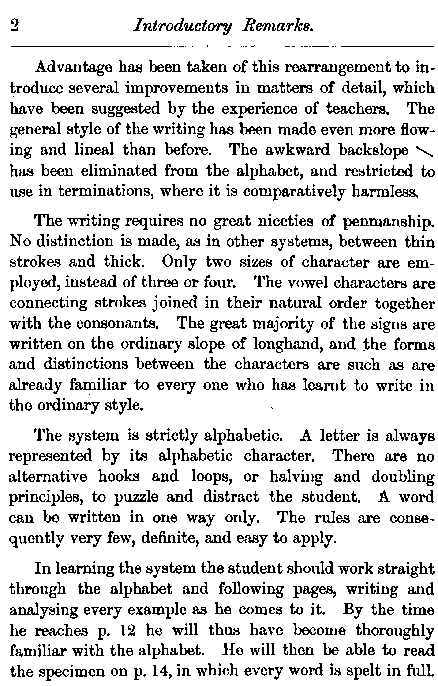
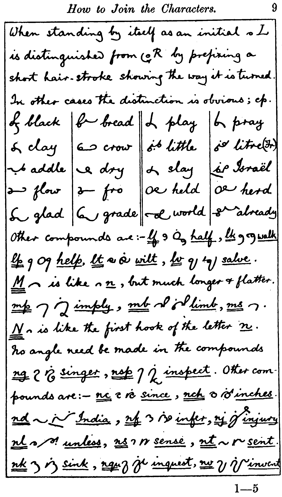
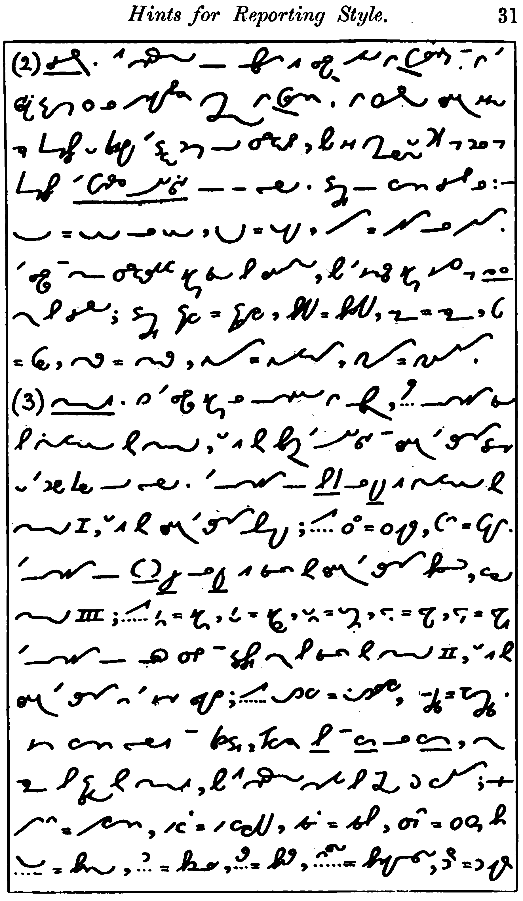

# Orthic Words From Examples

This document will help you find words used as examples in the various books.

Where the original document spells it in a non-standard way, I have included both standard and Orthic spelling, for ease of searching.

I have indicated the writer of each document. Callendar wrote the Manual and Supplement. Stevens wrote Teaching and most of the extra material. Clarey wrote Revised. Callendar and Stevens mostly follow the same rules. Stevens has slightly different rules for S-blends. Clarey? Very different rules for S-blends, many of what he calls "compound characters," and very many more abbreviating rules.

Reporting Level is only included for some books.

xxx sources and license

* Table of Contents
{:toc}

## The Manual

**The Manual**\
A Manual of Orthographic Shorthand: The Cambridge System,\
Hugh L Callendar, 1891.\
[Typed at orthic.shorthand.fun](https://orthic.shorthand.fun/manual)\
[Scanned at google books](https://books.google.com/books/about/A_Manual_of_Orthographic_Cursive_Shortha.html?id=kQ5SAAAAYAAJ)\
Rendered into Markdown and annotated by Jeremy W Sherman.

xxx license

{: .def}

{: .def}\
This is an artifact of the pdf-extractor used to get the images.

{: .def}

{: .def}

{: .def}

{: .def}

### Alphabet

ab, act, bad, cabby, adder, fed, left, get, hit, city, jug, luck, like, melt, know, proof, plate, query, roller, sort, trust, upper, wavy, wow, exit, eyes, size

{: .def}

### General Rules for Writing

odd, too, sleep, sup, re-enter, \
Oölite, Deä, create, Leo, fiasco, serious, fuel, poem,

{: .def}

ins, ins, against, epitaph\
lawsuit, Woolwich, virgin\
Jack, Clay, S.E., L.S.W.R.

{: .def}

### How to Write and Join the Characters

A: days, quay; cp.  says, hay, 

B: bd, rob’d, robbed, bj, object, bl, able, br, bray, bs, absurd, bt, subtract, bv, subvent, 

C: chair, Christ, ache, ahead, ck, suckle, cl, close, cr, crutch, ct, act

{: .def}

D: dge, judge, dj, dle, fiddle, dr, dread, dv, dw, dwell

E: thus  seat, seas, eat, real, pearl, years, seat, seas, eat, real, pearl, years

{: .def}

F: if, ft, soft, fd, puff’d, fl, rifle, fr, afraid, fs, skiffs 

G: gh, high, gl, glory, gr, agree, gn, sign

H: hat, chat, what, which

I: social, optician; chief.

J: 

K:

{: .def}

L:  black, bread, 	clay, crow, 	addle, dry, 	flow, fro, 	glad, grade, 	play, pray, 	little, litre, 	slay, Israël, 	held, herd, 	world, already, \
    lf, half, lk, walk, lp, help, lt, wilt, lv, salve,

M: mp, imply, mb, limb, ms 

N: ng, singer, nsp, inspect, nc, since, nch, inches, nd, India, nf, infer, nj, injury, nl, unless, ns, sense, nt, sent, nk, sink, nqu, inquest, nv, invent

{: .def}

O: oar, or, oak, oi, toil, ou, out, oy, boys, 

P: sp, spear, ps, cusps, ph, phrase, phlegm, pl, place, pr, present, pt, depth, phth 

Q: esquire

R: fierce, rd, rt, rf, rk, work, rn, learn, rp, rs, rv 

{: .def}

S: S.E., shed, Tisri, shred, school, sc, scent, sk, sl, slew, sm, sn, sp, sphere, squ, square, st, still, sw, answer

T: with, both, tch, sketch, tle, turtle, tr, truth, tw, two

{: .def}

U: seen, sun, ua, guard, ui, suit, 

V: minster, Minver, stew, view

W: way, woe, wet, write, who, ha, sews, cows, laws, wk, hawk, wl, owls, wn, dawn

X: xh, exhort, xp, expense, xt, extent

Y: yacht, yet, yore, yule

Z: daze, Fitz, puzzle

{: .def}

{: .def}

### Specimen of Fully Written Style

The preceding rules and examples will enable the student to read the (1) specimen of writing given on the opposite page, of which this page is a (2) key. Every word of this specimen is written in full letter for letter (3) just as it is here spelt. Nothing is left out. The small figures in (4) brackets show where each line of the shorthand ends, so that the stu-(5)dent may have no difficulty finding his place in the key, if (6) he happens to be at a loss to make out a word. (7)

The ability to write any word in full just as it is spelt, is (8) of the greatest value, especially for the correct spelling of proper (9) names and foreign words, which is often a serious matter, (10) and is quite impossible in any phonetic system. (11)

Even when thus written in full the system is very brief as contrasted (12) with ordinary writing. For practical purposes a still further increase (13) of brevity may be effected without any sacrifice of clearness, by (14) the use of shorter out-lines for such words as and, the, (15) for, to, etc., which occur so often in every page of English (16), and by the employment of a few other simple methods of (17) abbreviation, which are illustrated in the sections that follow, (18) and which constitute the ordinary style of Cursive.

{: .def}

### Abbreviations

can, con, alone, woman, band, bond\
the, they, this, them, tho', that, a\
applied, tries, easiest, happiest

### Abbreviate Common Endings

{: .def}

ed, used, us'd, kissed, kiss'd, stirred, stirr'd\
ful, useful, beautifully, beautyfully\
hd, manhood\
ing, using, saying, seeming, king, sing, singing\
ight, night, light\
ion, un, action\
ity, ability, abilities, peculiarity\
les, thankless, fearlessness\
ly, nearly, easily, dailies\
ment, mt, comment, arrangement\
ness, ns, happyness, happiness, thoughtfulness\
ough, o', ought, brought\
ther, hr, others\
ward, ard, towards

### General Method

{: .def}

Manual: 

dif(feren)t, different, dif(feren)ce, difference, ack(nowledge), acknowledge, esp(eciall)y, especially, cir(cumstan)ce, circumstance, extr(aordinar)y, extraordinary, rep(resentati)ve, representative

 ### Phrases

able to do, as it is, I am not, I have had, I shall be very, to be, ought to have been, with a view to,

 ### Abbreviations for Common Words

{: .def}

Manual: ab(ou)t, about, al(way)s, always, (a)m, am, I’m, am(oun)t, amount, an, a, and, a(n)y, any, ar(e), are, wer(e), were, b(e), be, b(ee)n, been, bec(ause), because, betw(een), between, b(u)t, but, ca(n), can, ca(n)-b(e), can be, ch(il)d, child, c(oul)d, could, d(o), do, d(oe)s, does, d(ow)n, down, ever, f(or), for, f(or)m, form, f(rien)d, friend, g(oo)d, good, gr(ea)t, great, ha(ve), have, h(a)d, had, m(a)de, made, m(igh)t, might, mo(re), more, m(o)st, most, n(o)t, not, c(a)n’t, can't n(oth)ing, nothing, o(f), of, o(f-th)e, of the, (o)n, on, (o)nly, only, (o)ne, one, (o)nce, once, pe(r)h(aps), perhaps, r(igh)t, right, rou(nd), round, se(l)f, self, s(el)v(e)s, selves, sha(ll), shall, she, sh(oul)d, should, thems(el)ves, themselves, theref(ore), therefore, thing, thing, thro’out, throughout, t(o), to, int(o), into, u(nder), under, w(ee)k, week, w(oul)d, would, wh(ich), which, (wi)th, with, y(ou), you, y(ou)rs, yours 

{: .def}

### Specimen of Ordinary Style

All text from https://orthic.shorthand.fun/manual , typed or transcribed by Jeremy W Sherman. Jeremy added reference numbers and comments to some passages.

Introductory Remarks

The present system is an adaptation of the alphabet and principles of Cursive Shorthand to the common orthography.

Two and a half years’ experience in teaching Cursive has convinced me that the difficulties which beginners find in learning to spell correctly by sound are much greater than I had previously imagined; and that it is unadvisable to attempt to introduce a phonetic system of shorthand at an early stage in education.

I have every reason to believe that the present adaptation of Cursive to the common spelling will be found much more simple and easy to learn than any of the phonetic systems at present in vogue. There is very little to learn beyond an alphabet of 26 characters, and the method of joining them. In fact many students have succeeded in reading and writing the present system with nothing but the bare alphabet to guide them.

With the exception that the method of spelling adopted is orthographic instead of phonetic, no changes has been made in the fundamental principles of the system. These have been already discussed and explained in the introduction to the Manual of Cursive Shorthand. It is needless therefore to repeat them here.

The characters of the alphabet are for the most part the same as in Phonetic Cursive; but the change of spelling has made it necessary to rearrange some of them.

{: .def}

Advantage has been taken of this rearrangement to introduce several improvements in matters of detail, which have been suggested by the experience of teachers. The general style of the writing has been made even more flowing and lineal than before. The awkward backslope \ has been eliminated from the alphabet, and restricted to use in terminations, where it is comparatively harmless. [Jeremy: It’s used for -ing.]

The writing requires no great niceties of penmanship. No distinction is made, as in other systems, between thin strokes and thick. Only two sizes of character are employed, instead of three or four. The vowel characters are connecting strokes joined in their natural order together with the consonants. The great majority of the signs are written on the ordinary slope of longhand, and the forms and distinctions between the characters are such as are already familiar to every one who has learnt to write in the ordinary style.

The system is strictly alphabetic. A letter is always represented by its alphabetic character. There are no alternative hooks and loops, or halving and doubling principles, to puzzle and distract the student. A word can be written in one way only. The rules are consequently very few, definite, and easy to apply.

In learning the system the student should work straight through the alphabet and following pages, writing and analysing every example as he comes to it. By the time he reaches [the end of the joining rules] he will thus have become thoroughly familiar with the alphabet. He will then be able to read through the specimen [of the fully-written style], every word of which is spelt in full.

{: .def}

### Specimen of Ordinary Style, From Macaulay's History

All text from https://orthic.shorthand.fun/manual , typed or transcribed by Jeremy W Sherman. Jeremy added reference numbers and comments to some passages.

The State of England in the Reign of Charles II.

It is time that this description of the England which Charles the Second governed should draw to a close. Yet one subject of the highest moment still remains untouched. Nothing has yet been said of the great body of the people, of those who held the ploughs, who tended the oxen, who toiled at the looms of Norwich, and squared the Portland stone for St Paul’s. Nor can very much be said. The most numerous class is precisely the class respecting which we have the most meagre information. In those times philanthropists did not yet regard it a sacred duty, not had demagogues yet found it a lucrative trade, to talk and write about the distress of the labourer. History was too much occupied with the Courts and camps to spare a line for the hut of the peasant, or the garret of the mechanic. The press now often sends forth in a day a greater quantity of discussion and declamation about the condition of the working man than was published during the twenty-eight years which elapsed between the Restoration and the Revolution. But it would be a great error to infer from the increase of complaint that there has been any increase of misery.

The great criterion of the state of the common people is the amount of their wages; and as four-fifths of the common people were, in the seventeenth century, employed in agriculture, it is especially important to ascertain what were then the wages of the agricultural 

{: .def}

industry. On this subject we have the means of arriving at conclusions sufficiently exact for our purpose.

It seems clear that the wages of labour, estimated in money, were, in 1685, not more than half of what they now are; and there were few articles important to the working man of which the price was not, in 1685, more than half of what it now is. Beer was undoubtedly much cheaper in that age than at present. Meat was also cheaper, but was still so dear that hundreds of thousands of families scarcely knew the taste of it. In the cost of wheat there has been very little change. The average price of the quarter, during the last 12 years of Charles the Second, was fifty shillings. Bread, therefore, such as is now given to the inmates of a workhouse, was then seldom seen, even on the trencher of a yeoman or of a shopkeeper. The great majority of the nation lived entirely on rye, barley, and oats.

The produce of tropical countries, of mines, and of machinery, was positively dearer than at present. Among the commodities for which the labourer would have had to pay higher in 1685 than his posterity now pay, were sugar, salt, coals, candles, soap, shoes, stockings, and generally all articles of clothing and all articles of bedding. It may be added, that the old coats and blankets would have been, not only more costly, but less serviceable, than the modern fabrics.

{: .def}

{: .def}

### St John II

<https://www.biblegateway.com/passage/?search=John%202&version=KJV>

2:1 And the third day there was a marriage in Cana of Galilee; and the mother of Jesus was there:

2 And both Jesus was called, and his disciples, to the marriage.

3 And when they wanted wine, the mother of Jesus saith unto him, They have no wine.

4 Jesus saith unto her, Woman, what have I to do with thee? mine hour is not yet come.

5 His mother saith unto the servants, Whatsoever he saith unto you, do it.

6 And there were set there six waterpots of stone, after the manner of the purifying of the Jews, containing two or three firkins apiece.

7 Jesus saith unto them, Fill the waterpots with water. And they filled them up to the brim.

8 And he saith unto them, Draw out now, and bear unto the governor of the feast. And they bare it.

9 When the ruler of the feast had tasted the water that was made wine, and knew not whence it was: (but the servants which drew the water knew;) the governor of the feast called the bridegroom,

10 And saith unto him, Every man at the beginning doth set forth good wine; and when men have well drunk, then that which is worse: but thou hast kept the good wine until now.

11 This beginning of miracles did Jesus in Cana of Galilee, and manifested forth his glory; and his disciples believed on him.

12 After this he went down to Capernaum, he, and his mother, and his brethren, and his disciples: and they continued there not many days.

13 And the Jews' passover was at hand, and Jesus went up to Jerusalem.

{: .def}

14 And found in the temple those that sold oxen and sheep and doves, and the changers of money sitting:

15 And when he had made a scourge of small cords, he drove them all out of the temple, and the sheep, and the oxen; and poured out the changers' money, and overthrew the tables;

16 And said unto them that sold doves, Take these things hence; make not my Father's house an house of merchandise.

17 And his disciples remembered that it was written, The zeal of thine house hath eaten me up.

18 Then answered the Jews and said unto him, What sign shewest thou unto us, seeing that thou doest these things?

19 Jesus answered and said unto them, Destroy this temple, and in three days I will raise it up.

20 Then said the Jews, Forty and six years was this temple in building, and wilt thou rear it up in three days?

21 But he spake of the temple of his body.

22 When therefore he was risen from the dead, his disciples remembered that he had said this unto them; and they believed the scripture, and the word which Jesus had said.

23 Now when he was in Jerusalem at the passover, in the feast day, many believed in his name, when they saw the miracles which he did.

24 But Jesus did not commit himself unto them, because he knew all men,

25 And needed not that any should testify of man: for he knew what was in man.

3:1 There was a man of the Pharisees, named Nicodemus, a ruler of the Jews:

2 The same came to Jesus by night, and said unto him, Rabbi, 

{: .def}

{: .def}

Foreign languages not done.

{: .def}

{: .def}

Foreign languages not done.

{: .def}

See <https://orthic.shorthand.fun/manual#hints-for-the-reporting-style>, transcribed by Jeremy W Sherman, for marked-up image and key.

The reporting style differs from the ordinary style only in the more extensive use of (2) abbreviation and phrasing.

Words are abbreviated as in longhand by the application (3) of the general principle given in §10.

This method is so simple that with a little (4) practice any reporter can easily extemporise suitable abbreviations for himself, according to the (5) context of the subject upon which he is engaged. In order however to secure the greatest possible (6) uniformity of style among writers of-the system, it’s intended shortly to publish (7) a standard list of abbreviations for common words in the form of a vocabulary.

(8) It’s impossible to treat the subject of reporting
adequately in the present publication, (9) but we will proceed to give a few hints which will be of use to students. (10)

1. In abbreviating a common word it’s generally sufficient to write the first 2 (11) or 3 letters of the termination, but terminations and inflexions which are evidently required (12) by the context may be omitted.
   Mere initials may be largely used for repeated names (13) and titles.
   Examples

   - s = sir,
   - l = lord,
   - p = page,
   - q = question,
   - pr = principle,
   - rep = (14) represent,
   - imp = important,
   - fou = found,
   - ea = each,
   - mu = much.

   (15) In the case of short words it’s often better to join the last letter;

   - pt = part,
   - (16) sht = short,
   - tn = town,
   - ler = letter,
   - ld = world,
   - ming = morning.

   (17) Letters which are weakly sounded, such as GH in STRAIT = straight, may often be left (18) out in abbreviating; initial H in such words as HIM HAS HAD especially in (19) phrases and compounds;

   - chas = which has,
   - shtnd = shorthand,
   - chil = which will.

{: .def}

2. (1) SLURRING. This method of abbreviation is largely used in Gurney’s and in the (2) script systems which are universally employed in Germany.
   In hurried writing it is not (3) always possible to preserve the exact forms of-the characters, but it’s important to keep as far as (4) possible THE GENERAL OUTLINE of a word.
   Examples of common slurs are:

   - (5) double-width D = DD or TD,
   - deep double-width D = DV,
   - UUN = USION or UTION. (6)

   The larger and more characteristic signs should be retained, but the smaller signs such as L R (7) may be slurred; examples

   - expeec = experience,
   - beev = believe,
   - aso = also,
   - gt (8) = grt,
   - mter = matter,
   - eduun = education,
   - nstuun = institution. (9)

3. MODES. If the larger signs are omitted in abbreviating, their omission should (10) be indicated by mode, that is by bringing the outline and writing the termination close (11) to the first part of-the word.

   - The omission of B P or V is indicated by (12) mode I, that is by writing the termination above; thus

     - whichr = whichever,
     - gn = given.

   - (13) The omission of G K J or QU is shown by writing the termination below, called (14) mode III; thus

     - sn = sign,
     - st = sight,
     - tn = taken,
     - wa. = wage,
     - was = wages

   - (15) The omission of other characters and syllables may be shown by mode II, that is by (16) writing the termination on the same level; thus

     - dif-ce = difference,
     - a-plish = accomplish.

     (17) Some common words and prefixes, especially _b_ and _con_ or _com,_ may (18) also be expressed by modes, but this method must be applied with caution; --

     - (19) un-n = uncommon,
     - i-c. = i-c(o)nceive,
     - isha. = ishabe (i shall be),
     - chasn = (whi)ch has b(ee)n,
     - (20) yd = bey(on)d,
     - f = before,
     - ter = better,
     - nlnt = benevolent,
     - fry = for every.

{: .def}

From <https://orthic.shorthand.fun/manual#key-9>, transcribed by Jeremy W Sherman.

Local Government.

I agree with Sir Charles Dilke in attributing the utmost importance to the question of local government in the future. \
I agree with him in the estimate which he has formed of the high place that question will occupy in the programme of the Liberal \
party. Experience justifies us in the hope that the Reformed Parliament will do much in the direction of completing the work which \
previous Reformed Parliaments have commenced. What was the main and the material advantage which resulted from the Reform Bill of 1832? \
It was the concession of municipal government to our country towns — a concession which has been highly appreciated, \
and which has been wisely used, and which has added most materially to the comfort and the happiness of the populations concerned. \
And what was the greatest result of the Reform of 1867? It was the extension of the functions of local governments by the \
creation of a system of education national in its scope, but locally administered. And it \
remains for the Reformed Parliament which will meet in 1886 to complete this work and to carry it further. I can conceive of no \
nobler and no more congenial task for those who represent the whole people than that of extending to the counties and \
to the metropolis and to the sister kingdom the liberties and the institutions which have conferred so great a benefit upon us the \
provinces. Gentlemen, local government is important altogether beyond its usefulness. It is the best political education, \
and I am convinced that the welfare and the contentment of the whole population can only be secured in proportion as the \
whole population are called in to take a part and a share in the obligations and the responsibilities of government. But, the \
extension of municipal institutions is not all that we have to do in the way of local government. We have in the \
future to elevate our conception of the meaning of the word. It is not merely a parochial and \
municipal, it is not even merely a provincial question, it is a national question also. What are the great problems \
of the future? We have to deal with obstruction in the House of Commons. We have to deal with the system under which \
the greatest legislative assemblage in the world has begun to lose its usefulness, and in consequence lose its influence. \
And that result can never be accomplished as long as the Imperial Parliament is burdened with an ever increasing amount of \
petty detail with which it is incompetent to deal, and which ought to be referred to other bodies.

What are the two greatest and most pressing needs of our time? I think most men would say the \
provision of healthy decent dwellings in our large towns at fair rents, and in the country facilities for the \
labourer to obtain a small plot of land which he may be able to work.

{: .def}

## Supplement

{: .sup}

Supplement: able, ably, above, according, acqu, adj, advantage, after, afternoon, afraid, ages, agent, also, already, announce, approp(ria)te, appropriate, apparent, arrange, arrive, -ation, -ational, baptist, be, being, been, before, believed, better, best, bishop, (bp), body, (bdy), both, (bth), by, thy, caught, changes, ch(ur)ch, church, circum-, circumstance, com-, con-, come, came, command, comment, common, compound, comprehend, concerning, conserve, consideration, counter-, country, course, (crs), court, (crt), dear, (dr), different, -ce, difference, difficult, each, (ea), editor, else, endeavour, even, (e’en), evening, event, every, 

{: .sup}

Supplement: evident, evil, executor, except, (ex), exercise, (exe), extraordinary, favour, -fection, -fication, foreign, forgive, forth, forward, found, from, -ge, general, gives, given, -gn, -gram, half, hand, head, help, (lp), him, his, important, -ce, importance, inch, ind(ivi)dual, individual, interest, -ism, ive, judge, just, justice, king, kingdom, know, known, knowledge, lady, language, large, largest, letter, little, lord, make, makes, magnify, mb, mp, member, mis-, mistake, much, much-more, much more, month, must, morning, mortgage, nation, nearest, necessary, neighbour, -ness, goodness, nevertheless, next, (nst), 

{: .sup}

Supplement: notwithstanding, number, obedient, opportunity, over, (o’er), page, pages, paper, part, party, particular, peculiar, people, perceives, person, philo-, philosophy, plaintiff, point, (pnt), practice, practical, preconceived, present, private, promise, property, public,  publish, quite, religion, report, resp(ective)ly, respectively, satisfy, satisfactory, saviour, scarcely, school, scribe, script, selves, serves, servant, sev(eral), several, sir, sirs, -ship, worship, short, shorthand, sign, signify, solicitor, some, sometimes, s(ou)rce, source, special, spirit, state, strength, strong, such, such-as, super, supra, superior, take, taken, transact, tr(ust)ee, trustee, very, verify, -wise, otherwise, wis(d)om, wisdom, word, work, world, (wd), young 

## Teaching Part One

{: .teach1}

Teaching 1:

### Lesson One

{: .teach1}

Teaching 1:

### Lesson Two

{: .teach1}

Teaching 1: foot, reed, reid

{: .teach1}

Teaching 1: demr, fear, year, Ealing, meal, mail\
day, may\
oar, Laon\
ye, obey

### Lesson Three

{: .teach1}

Teaching 1: \
bl\
pl, br, fl, fr, ml, mr\
pra\
ha\
ks, ks\
ph, ph\
phar, phy\
rh\
rh\
ph, sh

{: .teach1}

Teaching 1: \
who\
sp, ps, sps\
wo, ow\
owing, owing, wd, wd\
cow, cows\

### Lesson Four

{: .teach1}

Teaching 1: \
command, son, soon\
it\
the\
although

{: .teach1}

Teaching 1: \
and\
used, us'd\
useful, beautiful\
-hood, -head\
-ight, right, light\
-ion, action\
-action, termination\
-ity, -ly, pity, city, truly, duly\
-less\

{: .teach1}

Teaching 1: \
-ness\
-ment\
-ough, ought, thought\
-ther, other\
-ward, for'ard, forward

### Lesson Five

ever

{: .teach1}

Teaching 1: \
round, sound, count, counter, county, country

aso, also, ea, each, ay, any, because, cause, child, children, from, for, form, great, much, that, already, acing, according, after, bth, both, el, els, e'en, even, except, lp, help, kn, know, lile, little, let, letter, pt, part, s, sir, rk, work, rd, would, world

party

### Lesson Six

{: .teach1}

Teaching 1: \
although

{: .teach1}

Teaching 1: \
eve, given loved, evident, conceived, ever, give, love, rove\
be-, be (dot), behold, been, better, best, by, bring, thing\
per-, pre-, pri-, pro-, peri-, para-

### Lesson Seven

{: .teach1}

Teaching 1: \
I commend, different, differnce, ultimo, interest

{: .teach1}

Teaching 1: \
ight, foreign, age, magnify, take, taking, sake

### Lesson Eight

member\
man\

{: .teach1}

Teaching 1: \
count, county\
final, upper

### Lesson Nine

{: .teach1}

Teaching 1: \
I should have been, with a view to, able to do so, as soon as

## Revised

### Alphabet

{: .rev}

Revised: absent, opera, back, bib, centre, mimic, dirty, wind, enter, line, fasten, calf, gentle, cog, help, oh, insert, ani, jest, reject, kept, kick, lender, until, melt, stem, nine, hasten, often, canto, point, step, query, equity, render, fir, simply, tends, time, comet, under, gnu, vine, wave, wow, award, exist, sex, yes, haply, zebra, waltz

### Doubling and General Rules

Revised: \
odd, coo, peep, pup\

{: .rev}

re-enter, boa, chaos, co-operate, Leo, fiasco, fuel, poem, serious\
dirge, faiths, serpent\
law-suit, lawsuit, bagpipes\
Jew, Wales, England, S.E., L.S.W.R.

### Compound Characters, p 4

{: .rev}

Revised: \
BL: black, sensible, bleak, trebly\
CH: Christ, arch, filch, chat, such, scholar, scheme, chloric, richly, speechless\
DV: advert, avert\
MB: timber, lumber, lamb, temper, lumper, lamp\
NSP: inspirit, inspect, ensphere, conspire\
PH: phrase, philter, sulphur, epitaph, phase, phlegm, physic\
PHTH: phthisis, ophthalmic\
PTH: Apthorpe, depth\
RC: force, tierce, mercy, farcical\
SCR: scrap, shrink, push, wash\
SW: swam, swear, answer\
TH: this, threw, worth, faith\

{: .rev}

Revised: \
WH: whose, when, chose, chin\
WR: wring, thing\
WS: poews, rows, frowsy\
XC: excel, exclaim\
XH: exhale, xch\
XP: expel, export\
XT: extent, text

### Diphthongs, p 5

ai, aim, nail\
audit, landau\
ay, pay, may\
day, jay, dismay, nay, quay, Tay\
eat, seal\
bear, meal, near, pea, sea\
yea, deaf, team, team, veal, veal\
bead\
sneak, seas, peat, beauty

{: .rev}

Revised: \
peel, pull, rein, run\
grief, gruff\
briar, denial\
oedema, toe, woesome\
oil, ointment, foil, coin\
out, count, aloud, stout\
toy, annoy, decoy\
guard, dual, usual

### Other Slurs, p 6

ays, pays, ways, says, prays\
fs, waifs, hoofs, offspring\
ks, looks, works, walks\
mbs, kembs, climbs, numbs\
ng, ginger, hang, sting, singer\
nk, wink, rank, sink, tinker\
oys, cloys ,employs\
ps, psalm, psychic, caps, strips\
sp, spire, spear, lisps, wasps

### How to Write and Join the Characters, p7

{: .rev}

Revised: 

a, afar

b, bd, bf, bg, bh, abhor, bj, bk, bl, bm, bn, bp, bq, br, brain, bs, bt, bv, by, bz

c, cd, ch, chl, chr, aches, pitch’d, filches, pilchard, ck, cl, cm, cn, cqu, cr, cs, ct, cy

d, t, df, dge, dh, dj, dk, dle, dm, dn, dre, ds, dt, dv, dw, dy, dz

e, ea, ee, ei, eu, ew, few

f, c, if, if(wrong), refer, fc, fd, fg, fl, fm, fn, fr, fs, fs, ft, fy

g, gb, gd, gh, gl, gm, gn, gr, gs, gy

h, ch, hat, chat, hd, hg, hs, hy

i,

{: .rev}

Revised: 

j,

k, e, ea, u, like, beak, duke, kd, kg, kh, kl, kn, kr, ks, ky

l, lair, rail, male, mare,\
link, rink, fail, fair,\
flay, fray, whirl, walrus,\
lb, lc, lch, lchr, ld, lf, lg, lh, lk, lm, ln, lp, lr, ls, lt, lv, ly

m, mb, mbs, md, ml, mn, mp, ms, mt, my

n, nb, nc\
nch, nd, nf, ng, nh, inherit,\
inhale, nj, nk, nl, nm, nqu, nr, enrich, enroll, ns, nsp, nt, nv, nw, inward, enwrap, nx, ny

o, oa, coat, cot, oe, oi, ou, oy

p, ph, ph, phl, phr, phth, pl, pr, pt, pth, pw

{: .rev}

Revised: 

p, s, speck, trips, cusps

q,

r, rb, rce, rch, rd, rf, rg, barge, serge, rh, rhyme, Rhine, catarrh, rk, rl, rd, rm, rn, rp, rqu, rs, rt, rv, ry, rz

s, sb, sc, sch, sh, shr, sk, sl, sm, sn, sp, sph, squ, st, sw, sy, scream, misread

t, tb, tc, tch, th, with, tl, tr, tw, ty

u, ee, sum, see, ua, ue, ui

v, ste, view, stew

w, wd, wh, wk, wl, wn, wr, th, ws, saws, news, wy, snowy, sinewy, dewy

{: .rev}

x, xc, xch, xh, xp, xqu, xt

y,

z,

### Abbreviations, p11

{: .rev}

Revised: \
bank, common, alone, woman\
band, bond, dame, dome, gang, gong\
tame, tome, wander, wonder\
income, close\
is, if, in, it, apply, assist\
cotton, fiddle\
flys, trys, sayd, dryr, flies, tries, said, drier

### Prefixes, p11

mis, ms, misuse, mislay, misnomer\
trans, trs, transfer, transmit, transcript

### Terminations, p12

{: .rev}

Revised: \
asion, abrasion, relation\
ed, tired, faced\
ful, fl, useful, wonderful, geautiful\
hood, hd, manhood, widowhood, fatherhood, bachelorhood, hardihood\
ing, leasing, placing, praying, coming\
king, bring, bringing, sing, singing\
reading, blaming\
sinning, setting, seeing, going, saying\
ion, tion, un, position, passion, deception, action, section\
less, ls, useless, unless, fearless\
ment, mt, payment, raiment, moment\
nes, es, slyness, faithfulness, senselessness\
ough, o', ought, brought, plough\
ther, hr, other, mother, rather, either\
ward, ard, inward outward, forward\
acqu, aqu, acquire, acquaint\
adj, aj, adjure, adjourn\
dge, ge, edge, lodge, budge\
tch, ch, fetch, match, crutch

### Abbreviations for Common Words, p13

{: .rev}

Revised: \
a, an, able, about, above, after, already, also, always, am, amount, anger, answer, any, anyone, are, are not, be, beg, big, body, but, both, came, come, can, can’t, child, could, course, court, dear, do, does, down, even, for, form, forthwithy, found, friend, from, further, general, gentleman, gentlemen, good, great, had, half, have, having, into, like, made, might, more, most, much, must, never, not, note, nothing, of, on, once, one, out, over, perhaps, right, rightful, round, same, some, self, shall, she, sould, something, state, to, under, very, verify, weak, week, were, what, which, whom, with, without, would, young, youngster, you, yours, youth

{: .rev}

Revised: 

### Mode 1, Prefixes, p15

{: .rev}

Revised: \
than, that, the, them, there, this, those, though, thus, thy, thing\
a\
I think they knew him then.\
evening, event, ever, every, evident, evil, even\
before, because, befall, beset, be, been, being, better, best, by\
person, present, proclaim, persecute, prosecute, promise, premise, profane, profess, superfine, supralinear\

{: .rev}

primary, private, purchase, purvey\
parallel, period, perimeter

### Mode 1, Terminations, p16

leave, cove, give, saves, lived, given, loving, grove, novel, movement, prove, solve, shoving, involved\
entirety, society, insanity, piety, pity

### Mode 2, p16

compose, comparative, comprehend, preconceived, I conceive, incompetent, reconsider, circumvent, camphor, candid, the campaign, to cancel

### Mode 3, Prefixes, p16

magnanimity, magnetic, magnify

### Mode 3, Terminations, p17

{: .rev}

Revised: \
passage, awake, dredge, wage, strike, urged, taken, change, linger, cake, flake, rake, wake\
sign, impugn\
diagram\
sight, alight\
lowly, finely, fearfully, nearly, only, lovely, hugely\
severe, reign, design, benevolent, benevolent, perogative, regular, reverend, several, alleviate, elevate, intelligence, religion

{: .rev}

Revised: 

### General Method of Abbreviation, p19

{: .rev}

Revised: \
acknowledge, especially, reference, regulation, extraordinary, ordinary, representative
delete, erode, indeed, meet, read
most, must, part, point, right
head, hood, would, world, might, -ment

### Terminations, p19

liable, payable, bibles, table, tab\
curacy, diplomacy, embassy, easy\
capacity, pertinacity, veracity

{: .rev}

Revised: \
elementary, contrary, conservatory\
ability, affability, insensibility\
influence, residence, confidence\
clemency, competency, emergency\
opponent, provident, agent\
affection, defection, perfection\
fortification, modificaiton\
lithograph, paragraph, geography\
league, prologue, rogue, tongue\
indignant, indignity, dignity\
idealism, conservatism, socialism\
inject, project, reject\
explosion, lotion\
cloud, clout, aloud, route, astound, hound, account, recount\
mound, mount, round, rout\
fellowship, friendship, worship\
instruct, obstructing, destructive\
likewise, otherwise, unwise\
conveying, crying, dying, flying

{: .rev}

Revised: \
made, date\
decade, deprecate, fade, fate, brigade, gate, hate, obviate, cockade, Kate, glade, late, spade, trade, rate, crusade, wade
collate, calculate, stimulate\
immolate, emulate, insolate, insulate\
concede, impede, effete, obsolete\
confide, reside, smite, write\
explode, strode, promote, wrote\
absolute, denude, mute\
incide, incite, rede, ride, rite, side, site, mode, mote, rode, rote, delude, dilute, illude, elude\
deprecated, depreciate, fated, faded, forded, hated, headed, hooded, elated, waded\
impeded, sided, eroded, concluded, secreted, indited, voted

### Examples of Abbreviations, p22

{: .rev}

Revised: \
accord, according, advantage, afraid, afternoon, announce, apparent, appropriate, arrange, back, background, baptise, baptist, beautiful, believe, bishop, boy, breech, breach, bread, caught, command, commence, comment, common, commonwealth, concerning, consideration, consult, consultation, counter, country, county, dark, darkness, difference, different, difficult, each, eat, else, where, endeaor, except, exception, executor, exercise, expect, favor, female, foreign, forgive, glorify, grade, hand, happy, help, high, him, his, horrify, importance, important, individual, insult, interest, joy, just, justice, king, kingdom, know, known, knowledge, lady, ladyship, language, large, largest, laughter, lead, least, letter, little, lord, mad, male, make, meek, member, morning, mortgage, nearest, necessary

{: .rev}

neighbor, nevertheless, next, nor, notwithstanding, number, obedient, object, owner, opportunity, paper, parade, particular, party, partly, peculiar, people, pupil, philo-, philosophy, plaintiff, pracice, practice-ical-ise, preach-er, property, public-ish, quiet-ness, report, result, satisfy, satisfactory, saviour, scaredly, selves, serves, serve, servant, short, shorthand, signify, signification, sir, sirs, soliciter, sometimes, source, speak, special, spirit, spect, stage, stake, strong, strength, subject, such, suchas, superior, toy, treacherous, trust, trustee, voyage, wisdom, word, work, yeoman

### Phraseology, p23

I say, I am not, we have had, as is, there is, to do, to be so, he does not, it should be, as it was, in the, much more, of the, should not do, I shall be very, this is, out of, it is not, as if, with a, by the, that the, to the, we are, as long as, as much as, it is not so, there is no more.

