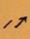
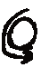
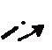
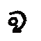
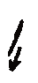
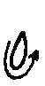
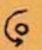
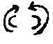
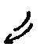
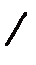

```
blindly copied the above and did a bit of editing
```

# Orthographic Cursive Shorthand, Orthic, The Cambridge System
by Hugh L. Callendar, LL.D., F.R.S., &c.
# Revised, Extended and Improved
by E. Clarey ("The Age" staff).
1911

Rendered into Markdown by CricketB based on the version made available by the National Archives of Australia.
https://recordsearch.naa.gov.au/SearchNRetrieve/Interface/ViewImage.aspx?B=3408323

<a rel="license" href="http://creativecommons.org/licenses/by-sa/4.0/">

</a><br />This version of 
<span xmlns:dct="http://purl.org/dc/terms/" property="dct:title">E Clarey's <em>Orthographic Cursive Shorthand, Revised, Extended and Improved</em></span> <br />
by <a xmlns:cc="http://creativecommons.org/ns#" property="cc:attributionName" rel="cc:attributionURL">CricketB</a> <br />
is licensed under a <a rel="license" href="http://creativecommons.org/licenses/by-sa/4.0/">Creative Commons Attribution-ShareAlike 4.0 International License</a>.<br />
Based on a work at <a xmlns:dct="http://purl.org/dc/terms/" 
href="https://recordsearch.naa.gov.au/SearchNRetrieve/Interface/ViewImage.aspx?B=3408323" rel="dct:source">https://recordsearch.naa.gov.au/SearchNRetrieve/Interface/ViewImage.aspx?B=3408323</a>.<br />
Permissions beyond the scope of this license may be available by emailing cricketbeautiful@gmail.com

```
the above needs work
```

# Editor's Notes

The images are all to the same scale. The blue lines are aligned to the typing, not to the shorthand. This was the easiest dimension to keep consistent throughout the book.

&nbsp;


```
that's my plan
```


```
code samples
```


&nbsp;**hasten**

&nbsp;**hasten**  &nbsp;**hasten**  &nbsp;**hasten**  &nbsp;**hasten**  &nbsp;**hasten**  &nbsp;**hasten**  &nbsp;**hasten**  &nbsp;**hasten**  &nbsp;**hasten**  &nbsp;**hasten**  

nbsp not working

```
end of code samples
```


# Advantages of the Orthographic Basis

An Orthography, that is to say a definite standard of spelling, is the necessary groundwork of any practical system of writing. It is essential, both for the sake of rapid automatic writing and to secure ease and certainty in reading, that each word should always be spelt in the same way. In this way alone can it be written without conscious thought, and read without hesitation.

Every system of Shorthand must in one sense be orthographic. There must be a correct outline for each word. Every departure from this rule entails a certain loss of efficiency, and a systematic violation of it results in hopeless confusion.

The simplicity and definiteness attained by adoptiong the commonly accepted orthography as the basis for a system of Shorthand make it far preferable to the phonetic. The common spelling is already familiar to everyone, and is a practically perfect standard in point of strictness and uniformity. Phonetic spelling, on the other hand, is to many people extremely distasteful and difficult to learn. It is, moreover, even when learnt, an uncertain and unsatisfactory standard owing to varieties and changes of pronunciation.

One very practical advantage of Orthic is that all the familiar longhand abbrevations can be at once utilised. Most of the examples given in the lists, it will be seen, are simple transliterations of those in common use, and being already famililar require no learning.

It is commonly urged in favour of phonetic spelling that so much is gained in point of shortness by the omission of mute and silent letters, and by using simple signs for diphthongs and other compound sounds. This argument as applied to shorthand is somewhat misleading. All phonetic methods of abbreviation, such as tho for though, brot for brought &c., in so far as they are convenient and clear, are naturally utilised in any orthographic system. Common diphthongs and combinations are also naturally represented by simple curves. The characters of the orthographic alphabet can also be grouped on the principle of representing similar sounds by similar signs, thus securing whatever advantages a phonetic system may claim in this respect.

From the inventor’s point of view, the real advantage of a phonetic system lies in the fact that it is much easier to construct. The early inventors could not find sufficient material for their alphabets in the way of characters that would join easily and clearly. They got out of the difficulty by rejecting what they called duplicate or superfluous letters, such as c, j, q, x, and by omitting all the vowels, or expressing them by detached marks. This was really only a method of cutting the Gordian knot, and could not result in the production of a system adequate and suitable for general use. The comparative case of constructing a system on this basis is, however, undoubtedly the true explanation of the extraordinary prevalence of systems of this type.

It is much more difficult to find sufficient stenographic material for a complete phonetic system, providing joined characters for both vowels and consonants. The difficulty of constructing a complete orthographic system is of the same kind, but greater, owing to the great number and variety of different combinations to be provided for.

Phonetic spelling in itself is undoubtedly a useful educational subject and a valuable aid in teaching correct pronunciation. This argument is often advanced in favour of phonetic shorthand. But it has been shown that there is no necessary connection between the two; and it is manifestly unreasonable to saddle shorthand with unnecessary difficulties in order to teach at the same time a subject which many people have no need or desire to learn. In any case the work of both teacher and learner would be much simplified by keeping the two subjects separate.

# Introduction

Orthographic Cursive Shorthand is an adaptation of shorthand to the common spelling.

The writing requires no great niceties of penmanship.

No distinction is made, as in other systems, between thin strokes and thick.

Only two sizes of character are employed, instead of three or four.

The vowel characters are connecting strokes joined in their natural order together with the consonants.

The great majority of the signs are written on the ordinary slope of longhand.

The forms and distinctions between the characters are such as are already familiar to every one who has learnt to write in the ordinary style.

There are no alternative hooks and loops, or halving and doubling principles, to puzzle and distract the student.

A letter is always represented by its alphabetical character, consequently a word can be written in full in one way only.

Do not attempt to write fast before the hand is familiar with the forms of the characters. At first they should be drawn carefully, so that correctness and neatness may be secured. Speed will come with practice, but if attempted too soon will probably lead to bad and slovenly writing.

NOTE -- All the specimens of shorthand have been taken from [The Idle thoughts of an Idle Fellow](https://www.gutenberg.org/files/849/849-h/849-h.htm) by Jerome K. Jerome.

# The Alphabet

**A** &nbsp;:
&nbsp;**absent**,
&nbsp;**opera** \
**B** &nbsp;:
&nbsp;**back**,
&nbsp;**bib**\
**C** &nbsp;:
&nbsp;**centre**,
&nbsp;**mimic**\
**D**&nbsp;:
&nbsp;**dirty**,
&nbsp;**wind**\
**E**: &nbsp;:
&nbsp;**enter**,
&nbsp;**line**\
**F** &nbsp;:
&nbsp;**fasten**,
&nbsp;**calf**\
**G**&nbsp;:
&nbsp;**gentle**,
&nbsp;**cog**\
**H**&nbsp;:
&nbsp;**help**,
&nbsp;**oh**\
**I**&nbsp;:
&nbsp;**insert**,
&nbsp;**anti**\
**J**&nbsp;:
&nbsp;**jest**,
&nbsp;**reject**\
**K**&nbsp;:
&nbsp;**kept**,
&nbsp;**kick**\
**L**&nbsp;:
&nbsp;**lender**,
&nbsp;**until**\
**M**&nbsp;:
&nbsp;**melt**,
&nbsp;**stem**\
**N**&nbsp;:
&nbsp;**nine**,
&nbsp;**hasten**\
**O**,&nbsp;:
&nbsp;**often**,
&nbsp;**canto**\
**P**,&nbsp;:
&nbsp;**point**,
&nbsp;**step**\
**Qu**,&nbsp;:
&nbsp;**query**,
&nbsp;**equity**\
**R**,&nbsp;:
&nbsp;**render**,
&nbsp;**fir**\
**S**,&nbsp;:
&nbsp;**simply**,
&nbsp;**tends**\
**T**,&nbsp;:
&nbsp;**time**,
&nbsp;**comet**\
**U**,&nbsp;:
&nbsp;**under**,
&nbsp;**gnu**\
**W**,&nbsp;:
&nbsp;**wow**,
&nbsp;**award**\
**X**,&nbsp;:
&nbsp;**exist**,
&nbsp;**sex**\
**Y**,&nbsp;:
&nbsp;**yes**,
&nbsp;**haply**\
**Z**,&nbsp;:
&nbsp;**zebra**,
&nbsp;**waltz**

The arrows show the directions in which the characters are written.

**Doubled letters** are shown, not by repeating the character, but by putting a dot below. Thus:
&nbsp;**odd**;
&nbsp;**coo**. \
*Exception*, 
&nbsp;**ee** , thus
&nbsp;**peep** compare
&nbsp;**pup**

**P** and **S**, when standing alone, are written straight down to distinguish them from **Ee** and **E**.
**J**, **Qu** and **V** are written through the line.

# General Rules

**Orthographic Spelling.** -- All words, when written in full, are spelt according to the common orthography. The characters are to be joined together smoothly, without lifting the pen, or making any unnecessary angles or breaks.

**The Two Sizes of Character** must be carefully distinguished, just as 
&nbsp;**C** (uppercase print) and
&nbsp;**c** (lowercase print),
&nbsp;**l** (lowercase cursive) and
&nbsp;**e** (lowercase cursive)
are in longhand. The actual size of the characters may be varied according to circumstances, such as the goodness of the light and the writing materials. The minuteness of any kind of writing is limited by the size of the smallest characters. In Orthic the small size may be made as small as desired, and the small circle amy be reudced to a dot. But it is best to make the small characters about one-twelfth of an inch (Ed: 2.1mm) long, and the large ones at least twice as big.

**Diphthongs.** -- When two vowels come together forming  "diphthong" the angle between them is *slurred*, or rounded off, *into a continuous curve.*
Thus:
&nbsp; **ai** = ;
&nbsp;**oy** = ;
&nbsp;**ou** = ;
&nbsp;**eau** = .

But when the vowels are separately sounded either the characters are separated or the angle between them is marked, as in the words
&nbsp;**re-enter**,
&nbsp;**boa**,
&nbsp;**chaos**,
&nbsp;**co-opoerate**,
&nbsp;**Leo**,
&nbsp;**fiasco**,
&nbsp;**fuel**,
&nbsp;**poem**,
&nbsp;**serious**.

**The first letter of a word** generally begins or ends on the line, but *a*, *e*, and *o* may be *raised* when *preceeding downstrokes*.

**A short connecting tick** be used *after* 
&nbsp;**er**,
&nbsp;**th**,
&c., *when* they are *followed* by
&nbsp;**G**,
&nbsp;**P**,
&nbsp;**S**.
Thus:
&nbsp;**dirge**,
&nbsp;**faiths**,
&nbsp;**serpent**.

**Dividing a Word.** A word may always be divided when the joining happens to be awkward or the outline descends too far below the ine. Thus:
&nbsp;**law-suit**,
&nbsp;**bagpipes**.
The necessity for this, however, seldom arises.

**Punctuation** is effected *in the usual way*, except the *hyphen* 
&nbsp;**hyphen** and the
&nbsp;**dash**.

The *full stop* may be *indicated by a space*.

**Initial Capitals** are indicated thus
&nbsp;**capital-mark**.
Examples:
&nbsp;**Jew**,
&nbsp;**Wales**,
&nbsp;**England**,
&nbsp;**S.E**,
&nbsp;**L.S.W.R**.

# Compound Characters

The following compounds, which are not strictly alphabetic, require noting:\

**Bl**
&nbsp;,
&nbsp;:
&nbsp;**black**,
&nbsp;**sensible**,
&nbsp;**bleak**,
&nbsp;**trebly**,\

**Ch**
&nbsp;,
&nbsp;,
&nbsp;:\
The *first* is used in the *compounds* **Chr** and **Rch**,
&nbsp;**Christ**,
&nbsp;**arch**.\
The *second* in the *compound* **Lch**,
&nbsp;**filch**;\
the *third* in *other cases*,
&nbsp;**chat**,
&nbsp;**such**,
&nbsp;**scholar**,
&nbsp;**scheme**.

**Chl** maybe be written 
&nbsp;**Chl** or
&nbsp;**Chl**,
&nbsp;**chloric**,
&nbsp;**richly**,
&nbsp;**speechless**.

**Dv** 
&nbsp;:
&nbsp;**advert**, compare
&nbsp;**avert**.

**Mb**
&nbsp;**Mb**:
&nbsp;**timber**;
&nbsp;**lumber**,
&nbsp;**lamb**,\
compare
&nbsp;**temper**,
&nbsp;**lumper**,
&nbsp;**lamp**.

**Nsp**
&nbsp;:
&nbsp;**inspirit**,
&nbsp;**inspect**,
&nbsp;**ensphere**,
&nbsp;**conspire**.

**Ph**
&nbsp;,
&nbsp; :
The *first* is used in the *compound* **Phr**, *before*
&nbsp;**S** and
&nbsp;**EE**, and *final*. Thus:
&nbsp;**phrase**,
&nbsp;**philter**,
&nbsp;**sulphur**,
&nbsp;**epitaph**.
The *second* in *other cases*, thus:
&nbsp;**phase**,
&nbsp;**phlegm**,
&nbsp;**physic**.

**Phth**
&nbsp;:
&nbsp;**phthisis**,
&nbsp;**ophthalmic**.

**Pth**
&nbsp;:
&nbsp;**Apthorpe**,
&nbsp;**depth**.

**Rc**
&nbsp;**Rc**:
&nbsp;**force**,
&nbsp;**tierce**,
&nbsp;**mercy**,
&nbsp;**farcical**.

**Scr**
&nbsp;**Scr** (*joined above*:
&nbsp;**scrap**;
compare

**Sr**
&nbsp; *joined below*:
&nbsp;**disrank**,

**Sh**
&nbsp;:
&nbsp;**shop**,
&nbsp;**shrink**,
&nbsp;**push**,
&nbsp;**wash**.

**Sw**
&nbsp;:
&nbsp;**swam**,
&nbsp;**swear**,
&nbsp;**answer**.

**Th**
&nbsp;:
&nbsp;**this**,
&nbsp;**threw**;
*final*
&nbsp:
&nbsp;**worth**,
&nbsp;**faith**.

```
end page 4
```


